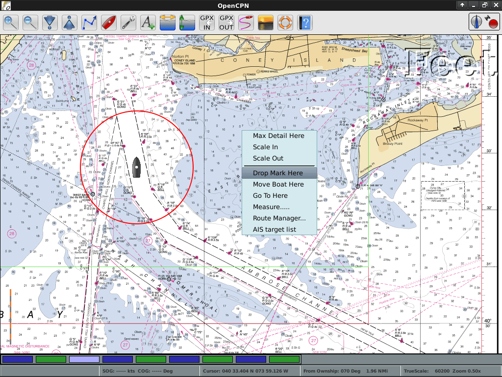

:Author: Dave Register
:Author: Hamish Bowman
:Reviewer: Cameron Shorter, LISAsoft
:Translator: Anna Muñoz Bollas
:Version: osgeo-live5.5
:License: Creative Commons Attribution-ShareAlike 3.0 Unported  (CC BY-SA 3.0)

.. image:: ../../images/project_logos/logo-opencpn.png
  :scale: 70 %
  :alt: project logo
  :align: right
  :target: http://www.opencpn.org

OpenCPN
================================================================================

Programari de navegació GPS Marí
~~~~~~~~~~~~~~~~~~~~~~~~~~~~~~~~~~~~~~~~~~~~~~~~~~~~~~~~~~~~~~~~~~~~~~~~~~~~~~~~
OpenCPN és un programa de navegació lliure per al seu ús en el timó de vaixells de tot tipus i mida, també es pot usar en forma off-line per a la planificació de rutes. Ha estat desenvolupat per un equip de mariners en actiu que l'han utilitzat en condicions reals per a la seva prova i refinament.

OpenCPN mostra la posició actual de l'embarcació, velocitat i rumb superposats a la carta de navegació, prediccions de marees i corrents. També pot mostrar la informació rebuda per ràdio estàndard descrivint la posició i la intenció d'altres vaixells.

A mesura que el vaixell es mou, es seleccionen noves cartes i es mostren amb la resolució i el detall especificats per l'usuari. A més, l'usuari pot introduir rutes i punts de referència que permeten a un pilot automàtic extern fer un seguiment precís del rumb marcat.

Característiques Principals
--------------------------------------------------------------------------------

OpenCPN suporta:

* BSB raster, C-MAP (CM93/2) i cartes nàutiques vectorials S-57 ENC
* De-codificació d'entrada AIS
* NMEA GPS o `Gpsd <http://gpsd.berlios.de>`_ daemon input
* Waypoint / navegació amb pilot automàtic
* Creació d'un nombre il·limitat de rutes i marques
* Solapament de cartes nàutiques
* Suport d'idiomes internacional
* Suport multi-plataforma
* Superposició de dades climatològiques GRIB

Detalls
--------------------------------------------------------------------------------

**Lloc Web:** http://www.opencpn.org

**Llicència:** GNU General Public License (GPL) version 2

**Versió de Programari:** 2.5.0

**Plataformes suportades:** GNU/Linux, Mac OSX, MS Windows

**Suport:** http://www.cruisersforum.com/forums/f134

Guia ràpida d'inici
--------------------------------------------------------------------------------

* :doc:`Documentació de la guia ràpida d'inici <../quickstart/opencpn_quickstart>`

