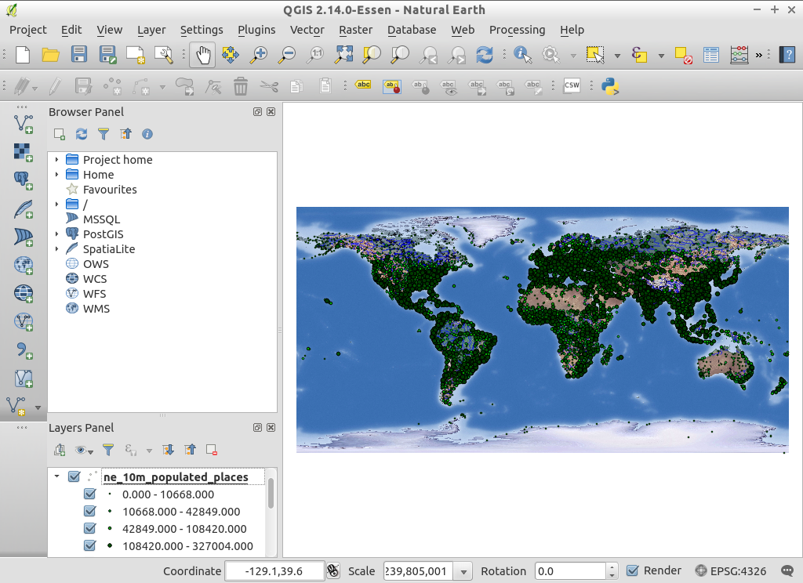

:Author: OSGeo-Live
:Reviewer: Cameron Shorter, LISAsoft
:Version: osgeo-live5.5
:License: Creative Commons Attribution 3.0 Unported (CC BY 3.0)

.. image:: ../../images/project_logos/logo-QGIS.png
  :scale: 100 %
  :alt: project logo
  :align: right
  :target: http://www.qgis.org

.. image:: ../../images/logos/OSGeo_project.png
  :scale: 100 %
  :alt: OSGeo Project
  :align: right
  :target: http://www.osgeo.org

Quantum GIS (QGIS)
================================================================================

SIG d'escriptori
~~~~~~~~~~~~~~~~~~~~~~~~~~~~~~~~~~~~~~~~~~~~~~~~~~~~~~~~~~~~~~~~~~~~~~~~~~~~~~~~

Quantum GIS (QGIS) és un client SIG amigable i de codi obert amb el qual es pot visualitzar, gestionar, editar i analitzar dades, i generar mapes per imprimir. Inclou funcions analítiques potents a través de la integració amb GRASS. Es pot emprar a Linux, Unix, Mac OSX, i Windows i suporta nombrosos formats i funcions tant per vector com per ràster com per bases de dades.

Característiques principals
--------------------------------------------------------------------------------

* Interfície d'usuari gràfica i amigable
    * funcions d'identificació i selecció,
    * edició/visualització/cerca d'atributs,
    * projecció al vol,
    * compositor d'impressió,
    * etiquetatge de característiques,
    * canvi de simbologies ràster i vector,
    * afegir una capa amb la quadrícula,
    * i més ...

* Visualització senzilla de molts formats ràster i vector

    * taules de bases de dades PostgreSQL
    * la majoria de formats vector: incloent shapefiles d'ESRI, MapInfo, SDTS i GML.
    * formats ràster com els dels models digitals del terreny, les imatges aèries o les de satèl·lit,
    * llocs i conjunts de mapes de GRASS
    * dades espacials en línia servides per WMS i WFS segons OGC

* Crear, editar i exportar dades espacials usant:

    * eines de digitalització per GRASS i per shapefiles,
    * el plugin de georeferenciació,
    * eines GPS per importar i exportar format GPX, convertir altres formats GPS a GPX o carregar i descarregar dades directament des del GPS

* Anàlisi espacial emprant plugins per fTools o GRASS

    * àlgebra de mapes,
    * anàlisi de terrenys,
    * modelatge hidrogeològic,
    * anàlisi de xarxes,
    * i molts altres

* Publicar a internet
* Arquitectura de plugins extensible.

Estàndars implementats
--------------------------------------------------------------------------------

* compleix els estàndards OGC (WMS,WFS(Plugin))

Detalls
--------------------------------------------------------------------------------

**Lloc web:** http://www.qgis.org

**Llicència:** GPL

**Versió de programari:** 1.7.4

**Sistemes operatius:** Windows, Linux, Mac, Unix

**Suport a la comunitat:** http://qgis.org/en/community.html

**Suport comercial:** http://qgis.org/en/commercial-support.html

Guia ràpida
--------------------------------------------------------------------------------

* :doc:`Documentació de la guia ràpida <../quickstart/qgis_quickstart>`

