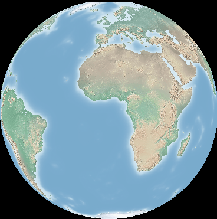

:Author: Astrid Emde, material from Frank Warmedam's RasterTutorial
:Version: osgeo-live5.0
:License: Creative Commons Attribution-ShareAlike 3.0 Unported  (CC BY-SA 3.0)

.. image:: ../../images/project_logos/logo-GDAL.png
  :scale: 60 %
  :alt: logo del projecte
  :align: right
  :target: http://gdal.org/

********************************************************************************
GDAL/OGR Inici ràpid
********************************************************************************

Per poder seguir aquesta guia, només necessitareu una terminal. Si voleu visualitzar els resultats, podeu fer servir una de les aplicacions SIG d'escriptori incloses en el OSGeo-Live com ara :doc:`../overview/qgis_overview`.

Aquesta guia d'inici ràpid està divisida en dues parts: GDAL (dades ràster) i OGR (dades vectorials). La guia comença per GDAL.

Aquesta guia d'inici ràpid explica com:

GDAL
  * Explorar les dades de la vostra imatge amb gdalinfo
  * Canvis de format amb gdal_translate
  * Re-projeccions amb gdalwarp
  * Fer mosaics de les vostres imatges amb gdal_warp o gdal_merge.py
  * Construir un shapefile com a índex de tesel·les d'un ràster amb gdaltindex

OGR
  * Aconseguir informació de les vostres dades amb ogrinfo
  * Fer servir ogr2ogr per a transformar les vostres dades diferents formats
 

Aprengueu GDAL
================================================================================

Tobareu les dades de la demostració a :file:`/usr/local/share/data`. En aquesta guia d'inici ràpid mirarem dades de :doc:`Natural Earth <../overview/naturalearth_overview>`. Cal fer servir una còpia de les dades, de manera que el primer pas serà copiar-les al directori arrel.

:: 
  
  cd /home/user
  cp -R /usr/local/share/data/natural_earth/ ./gdal_natural_earth 

Trobareu un arxiu ràster de  NaturalEarth i un tfw-file a:
:: 

 cd /home/user/gdal_natural_earth/HYP_50M_SR_W

.. tip:: Obriu l'arxiu amb un SIG d'escriptori com ara QGIS i mireu-lo.

Obteniu informació sobre les dades ràster amb gdalinfo
================================================================================
:: 
  
      gdalinfo HYP_50M_SR_W.tif 
	Driver: GTiff/GeoTIFF
	Files: HYP_50M_SR_W.tif
	       HYP_50M_SR_W.tfw
	Size is 10800, 5400
	Coordinate System is `'
	Origin = (-179.999999999999972,90.000000000000000)
	Pixel Size = (0.033333333333330,-0.033333333333330)
	Metadata:
	  TIFFTAG_SOFTWARE=Adobe Photoshop CS3 Macintosh
	  TIFFTAG_DATETIME=2009:09:19 10:13:17
	  TIFFTAG_XRESOLUTION=342.85699
	  TIFFTAG_YRESOLUTION=342.85699
	  TIFFTAG_RESOLUTIONUNIT=2 (pixels/inch)
	Image Structure Metadata:
	  INTERLEAVE=PIXEL
	Corner Coordinates:
	Upper Left  (-180.0000000,  90.0000000) 
	Lower Left  (-180.0000000, -90.0000000) 
	Upper Right ( 180.0000000,  90.0000000) 
	Lower Right ( 180.0000000, -90.0000000) 
	Center      (  -0.0000000,   0.0000000) 
	Band 1 Block=10800x1 Type=Byte, ColorInterp=Red
	Band 2 Block=10800x1 Type=Byte, ColorInterp=Green
	Band 3 Block=10800x1 Type=Byte, ColorInterp=Blue

Fixeu-vos que: 
  * El Driver és "GTiff/GeoTIFF"
  * La mida és 10800x5400
  * Les tres bandes són de tipus Byte. 
  * No hi ha sistema de coordenades definit.
  

Canvi de format simple
================================================================================

Primer, cal que conegueu els drivers disponibles. L'opció `--formats` del programa per línia de comandes gdal_translate es pot fer servir per a veure una llista de drivers de formats disponibles.

La informació sobre cara format, si està disponible, és:
  * Només lectura (ro), 
  * Lectura/escriptura (rw) or 
  * Lectura/escriptura/re-escriptura (rw+).

::

 gdal_translate --formats

L'opció `--format` dels programes per línia de comanda es pot fer servir per a veure els detalls sobre un driver en particular, incloent-hi les opcions de creació i tipus de dada permesos.

::

 gdalinfo --format jpeg
 gdal_translate --format png 

Canvi de format
================================================================================

Els canvis de format es poden fer amb la comanda gdal_translate. El valor per defecte de format de sortida és GeoTIFF: 

::

 gdal_translate HYP_50M_SR_W.tif HYP_50M_SR_W.png 

L'opció `-of` es fa servir per a seleccionat el format de sortira, i l'opció `-co` per a especificar una opció de creació de l'arxiu:

::

  gdal_translate -of JPEG -co QUALITY=40 HYP_50M_SR_W.tif HYP_50M_SR_W.jpg

L'opció `-ot` es pot fer servir per a alterar el tipus de dada a l'arxiu de sortida.

::
 
   gdal_translate -ot Int16 HYP_50M_SR_W.tif HYP_50M_SR_W_Int16.tif

Feu servir gdalinfo per a verificar el tipus de dada.

Re-escalat
================================================================================

L'opció `-outsize` es pot fer servir per a canviar la mida del fitxer de sortida.

::

    gdal_translate -outsize 50% 50% HYP_50M_SR_W.tif  HYP_50M_SR_W_small.tif

Feu servir gdalinfo per a verificar la mida.

L'opció `-scale` es pot fer servir per re-escalar les dades. També es poden fixar explícitament els rangs d'entrada i sortida. L'opció de gdalinfo `-mm` es pot fer servir per a veure els valors màxims i mínims de píxel.

Podeu dividir la imatge en dos amb `-srcwin`, que fa una còpia a partir de la posició píxel/línia  (xoff yoff xsize ysize). També podríeu usar `-projwin` i definir les cantonades en coordenades georeferenciades (ulx uly lrx lry).

::

    gdalinfo -mm HYP_50M_SR_W.tif 
    gdal_translate -srcwin 0 0 5400 5400 HYP_50M_SR_W.tif  west.tif
    gdal_translate -srcwin 0 2700 5400 5400 HYP_50M_SR_W.tif  east.tif

Índex de tesel·les d'un ràster amb gdaltindex
================================================================================

Podeu construir un shapefile com a índex de tesel·la d'un ràster. Per a cada imatge, es crea un polígon amb els els límits de l'extensió del ràster i la ruta al fitxer.

::

 gdaltindex index_natural_earth.shp *st.tif

Mireu el fitxer de sortida amb QGIS i ogrinfo (aprendreu més coses sobre ogrinfo més tard en aquesta mateixa guia)

  .. image:: ../../images/screenshots/800x600/gdal_gdaltindex.png
     :scale: 80

::

  ogrinfo ../HYP_50M_SR_W/ index
  INFO: Open of `../HYP_50M_SR_W/'
      using driver `ESRI Shapefile' successful.

  Layer name: index
  Geometry: Polygon
  Feature Count: 2
  Extent: (-180.000000, -90.000000) - (180.000000, 90.000000)
  Layer SRS WKT: (unknown)
  location: String (255.0)
  OGRFeature(index):0
    location (String) = east.tif
    POLYGON ((-0.00000000001796 90.0,179.999999999964047 90.0,179.999999999964047 -89.999999999982009,-0.00000000001796 -89.999999999982009,-0.00000000001796 90.0))

  OGRFeature(index):1
    location (String) = west.tif
    POLYGON ((-179.999999999999972 90.0,-0.00000000001796 90.0,-0.00000000001796 -89.999999999982009,-179.999999999999972 -89.999999999982009,-179.999999999999972 90.0))
  

Re-projectant
================================================================================

Per a aquest procediment, assumirem que HYP_50M_SR_W.tif s'ha creat correctament amb els límits que li pertoquen. Com hem vist anteriorment amb gdalinfo, no hi havia cap sistema de coordenades definit. Per tant, assignarem WGS84 com a sistema de coordenades al primer pas.

::

     gdal_translate -a_srs WGS84 HYP_50M_SR_W.tif HYP_50M_SR_W_4326.tif

La comanda gdalwarp es pot fer servir per a re-projectar imatges. Aquí, re-projectem la imatge en coordenades geogràfiques WGS84 a la projecció Mercator:

::

   gdalwarp -t_srs '+proj=merc +datum=WGS84' HYP_50M_SR_W_4326.tif mercator.tif

Feu servir gdalinfo per a verificat el canvi i mireu la imatge.

  .. image:: ../../images/screenshots/800x600/gdal_mercator.png
     :scale: 80

Aquí, re-projectem la imatge a projecció ortogràfica.

::

   gdalwarp -t_srs '+proj=ortho +datum=WGS84' HYP_50M_SR_W_4326.tif ortho.tif

Heu vist com els pols queden tallats? Això és degut a que les vores al pols no es poden re-projectar i gdalwarp, en conseqüència, no llegeix les dades. Es pot forçar gdalwarp perquè llegeixi més dades al voltant dels trossos sobrants com a forma de resoldre-ho. Podeu llegir més sobra això al tutorial sobre ràster http://trac.osgeo.org/gdal/wiki/UserDocs/RasterProcTutorial.

Fent mosaics
================================================================================

gdal_merge.py és un script de python que es pot fer servir per a tasques simples de creació de mosaics. Aquí es fa un mosaic entre east.tif i west.tif, ajuntant-les en una sola imatge:

::

   gdal_merge.py  east.tif west.tif -o merged.tif

La mateixa tasca pot fer-se amb gdalwarp. gdalwarp té un seguit d'avantatges respecte gdal_merge, però és més lent si es volen ajuntar molts fitxers:

::

   gdalwarp east.tif west.tif warpmerged.tif

Aprenent OGR
================================================================================

:: 
  
  cd /home/usr/gdal_natural_earth/

.. tip:: Obriu el fitxer shape amb un SIG d'escriptori com QGIS i mireu-ne el resultat.

Obtingueu informació sobre dades vectorials amb ogrinfo
================================================================================

:: 

  ogrinfo ./natural_earth
  INFO: Open of `../natural_earth/'
      using driver `ESRI Shapefile' successful.
  1: 10m_lakes (Polygon)
  2: 10m_land (Polygon)
  3: 10m_rivers_lake_centerlines (Line String)
  4: 10m-admin-0-countries (Polygon)
  5: 10m_ocean (Polygon)
  6: 10m-urban-area (Polygon)
  7: 10m_populated_places_simple (Point)

Obtingueu un resum sobre les dades fent servir ogrinfo amb l'opció `-so`.

::

	ogrinfo -so ../natural_earth/ 10m-admin-0-countries
	INFO: Open of `../natural_earth/'
	      using driver `ESRI Shapefile' successful.

	Layer name: 10m-admin-0-countries
	Geometry: Polygon
	Feature Count: 251
	Extent: (-179.999783, -89.999828) - (180.000258, 83.633811)
	Layer SRS WKT:
	GEOGCS["GCS_WGS_1984",
	    DATUM["WGS_1984",
		SPHEROID["WGS_1984",6378137.0,298.257223563]],
	    PRIMEM["Greenwich",0.0],
	    UNIT["Degree",0.0174532925199433]]
	OBJECTID: Integer (9.0)
	COUNTRY: String (100.0)
	FEATURECLA: String (32.0)
	SOV: String (100.0)
	SHAPE_LENG: Real (19.11)
	SHAPE_AREA: Real (19.11)

Si executeu ogrinfo sense cap paràmetre, obtindreu un resum sobre les dades i, després, una secció per a cada conjunt de dades.

::

	ogrinfo ../natural_earth/ 10m-admin-0-countries

Podeu enviar el resultat d'ogrinfo a la comanda grep per a filtrar i obtenir només els resultats amb l'atribut COUNTRY:

::

	ogrinfo ../natural_earth/ 10m-admin-0-countries | grep COUNTRY
	
	COUNTRY: String (100.0)
	COUNTRY (String) = Afghanistan
	COUNTRY (String) = Akrotiri Sovereign Base Area
	COUNTRY (String) = Aland
	COUNTRY (String) = Albania
	COUNTRY (String) = Algeria
	COUNTRY (String) = American Samoa
	COUNTRY (String) = Andorra
	etc.

Podeu convertir les dades a altres formats. Obtingueu la llista de formats suportats amb `--formats`

Feu servir ogr2ogr per a convertir dades entre diferents formats
================================================================================

Podeu fer servir ogr2ogr per a convertir dades simples entre diferents formats d'arxiu. Podeu fer servir `--formats` per a obtenir la llista de formats suportats, amb informació sobre la capacitat de lectura/escriptura.

Convertiu els països a GML.

::

  ogr2ogr --formats
  ogr2ogr -f GML countries.xml 10m-admin-0-countries.shp	  

Coses a provar
================================================================================

Aquí hi ha alguns reptes addicionals que podeu mirar de fer:

#. Prover gdalwarp o bé gdal_merge.py per a fer mosaics amb les dades

#. Proveu gdaladdo per a construir imatges generals internes

#. QGIS fa servir GDAL/OGR per donar suport a molts formats. També inclou el GdalTools Plugin per processar dades ràster. Aquest complement integra les eines de gdal a QGIS.

#. Proveu ogr2ogr per a importar o exportar dades vectorials a altres formats com ara PostGIS. Mireu les opcions que té ogr2ogr.

#. Proveu el complement de QGIS OGR-Layer-Konverter.

Què ve ara?
================================================================================

Aquest és només el primer pas en el camí per a fer servir GDAL i OGR. Hi ha moltes més funcionalitats que es poden provar.

Lloc web del projecte GDAL

  http://www.gdal.org

Tot sobre OGR

  http://gdal.org/ogr/index.html

Tutorial GDAL

  http://trac.osgeo.org/gdal/wiki/UserDocs/RasterProcTutorial
