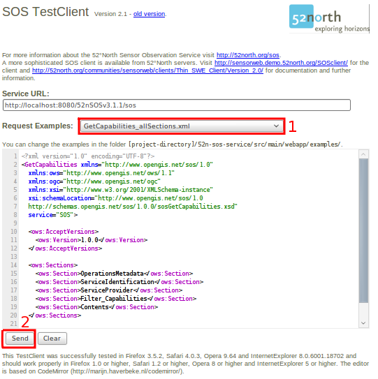

:Author: Eike Hinderk Jürrens (e.h.juerrens@52north.org), Simon Jirka (s.jirka@52north.org)
:Version: osgeo-live4.0
:License: Creative Commons

.. _52nSOS-overview:

.. image:: ../../images/project_logos/logo_52North_160.png
  :scale: 100 %
  :alt: project logo
  :align: right
  :target: http://52north.org/sos

52°North SOS
=============

Web Service
~~~~~~~~~~~

Der 52°North `Sensor Observation Service (SOS) <../standards/sos_overview.html>`_ 
erlaubt den Zugriff auf Echtzeit-Sensordaten sowie auf Sensordatenarchive. Ein Sensor kann dabei z.B. ein Satellit, eine Wetterstation oder ein Pegel an einem Fluss sein.

Features
--------

Der aktuelle 52°North SOS (Version 3.2.0) implementiert das sogenannte “Core Profile” sowie das “Transactional Profile” der OGC SOS-Spezifikation 1.0.0. Weiterhin werden Teile des „Enhanced Profile“ unterstützt. Folgende Operationen sind verfügbar

**Operationen des “SOS Core Profile”**:

* GetCapabilities, zum Abrufen einer Selbstbeschreibung des Dienstes.
* GetObservation, zum Abfragen von Messdaten, kodiert entsprechend der OGC Observations & Measurements (O&M) Spezifikation.
* DescribeSensor, zum Abfragen von Sensorbeschreibungen, kodiert entsprechend der OGC Sensor Model Language (SensorML) Spezifikation.

** Operationen des “SOS Transactional Profile”**:

* RegisterSensor, zum Registrieren neuer Sensoren in einer SOS-Instanz.
* InsertObservation, zum Einfügen neuer Messdaten, welche durch zuvor registrierte Sensoren geliefert wurden.

** Operationen des “SOS Enhanced Profile”**:

* GetResult, zum vereinfachten Abfragen vordefinierter Mengen von Sensordaten.
* GetObservationById, zum gezielten Abfragen bestimmter, einzelner Messungen.
* GetFeatureOfInterest, zum Abfragen der Geometrien von Sensorstandorten, kodiert ensprechend der OGC Geography Markup Language (GML) Spezifikation.
* GetFeatureOfInterestTime, zur Abfrage der zeitlichen Verfügbarkeit von Messdaten.

**Client**:

* Der SOS wird zusammen mit einem Browser-basierten Test-Client ausgeliefert, welcher Beispiel-Anfragen für alle SOS-Operationen enthält.

Implementierte Standards
---------------------

* `OGC Sensor Observation Service (SOS) <http://www.ogcnetwork.net/SOS>`_

Details
-------

* **Website:** http://52north.org/communities/sensorweb/sos

* **Lizenz:** GNU GPL v2.0

* **Software Version:** SOS 3.2.0

* **Unterstützte Betriebssysteme:** Windows, Linux, Mac

* **API:** Java

* **Community Support:** http://sensorweb.forum.52north.org/

* **Community Website:** http://52north.org/communities/sensorweb/

Quick-Start
----------

* `Quick-Start Dokumentation <../quickstart/52nSOS_quickstart.html>`_

