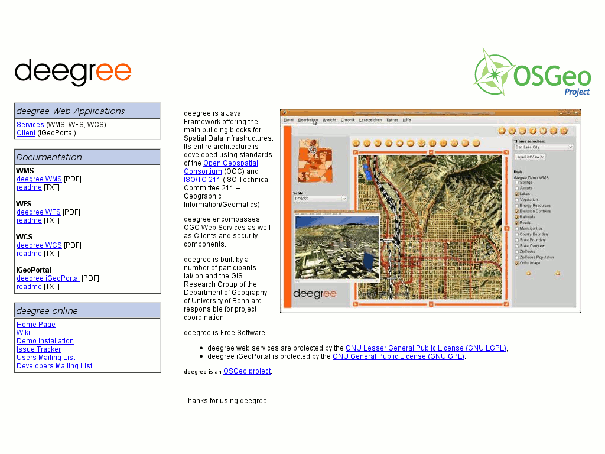

:Author: Johannes Wilden
:Version: osgeo-live5.0
:License: Creative Commons Attribution 3.0 Unported (CC BY 3.0)

.. _deegree-overview:

.. image:: ../../images/project_logos/logo-deegree.png
  :scale: 80 %
  :alt: project logo
  :align: right
  :target: http://deegree.org

.. image:: ../../images/logos/OSGeo_project.png
  :scale: 100
  :alt: OSGeo Project
  :align: right
  :target: http://www.osgeo.org

deegree
=======

Web Services
~~~~~~~~~~~~

deegree ist frei, stabil, mächtig und einfach zu nutzen. deegree stellt
derzeit die umfassendste Implementierung von Standards des 'Open Geospatial
Consortium' (OGC) in freier und opensource Software dar. Dabei wird ein
breites Spektrum an Diensten angeboten, wie z.B. ein transaktionaler 'Web
Feature Service' (WFS-T) oder ein Dienst, der die Möglichkeit bietet dreidimensionale Daten über
den 'Web  Terrain Service' zu visualisieren. 

deegree ist sowohl eine Lösung für web- und desktop-basierte Geographische
Informationssysteme (GIS) als auch für Geodateninfrastrukturen (GDI). Das
Framework umfasst eine umfangreiche  Java-API sowie ein mächtiges
objekt-relationales Mapping für simple und komplexe räumliche Schemata.   
Die Software umfasst weiterhin standard-konforme Webdienste
für Kartenanwendungen, Feature-Verarbeitung, Geokataloge, Sensoren und
Prozessierung. 

deegree ermöglicht den Aufbau ihrer GDI, mit ihren Daten und ihren
spezifischen Anforderungen. 

Ausgewählte Features
--------------------

* Web Map Service

  * sehr flexibel hinsichtlich der Layer-Eigenschaften
  * unterstützt und nutzt Style-Definitionen 
  * Erzeugung thematischer Karten mit Diagrammen als 'point symbolizers'
  * Datenquellen: alle verbreiteten OGC Web Services (WMS, WFS, WCS), PostgreSQL/PostGIS, Oracle Spatial, frei wählbare SQL-Statements können zur WMS-Layer Erstellung genutzt werden
  * sehr stabil, gut skalierbar 
  * unterstützt HTTP GET, HTTP POST und 'feature info' Requests
  * zertifiziert als  OGC-compliant

* Web Feature Service

  * unterstützt  simple und komplexe Features
  * on-the-fly Koordinatentransformation für über  3000 Koordinaten-Referenzsysteme
  * unterstützt flexible Ausgabeformate
  * einfach an INSPIRE-Vorgaben anpassbar

* Web Coverage Service

  * unterstützt HTTP GET und HTTP POST Requests
  * Datenquellen: Rasterbilder (tif, png, jpeg, gif, bmp); GeoTIFF; ECW-Dateien; Oracle GeoRaster
  * schneller Zugriff auf große Coverages

* Catalogue Service

  * Datenquellen: PostgreSQL-Datenbank; Oracle-Datenbank
  * unterstützte Requests: GetCapabilities; DescribeRecord; GetRecordById; GetRecords; Transaction - Insert, Update, Delete; Harvesting

* Web Map Print Service

  * Unterstützung für diverse Druck-Fromate (HTML, PDF, PNG)
  * Unterstützt lange Laufzeiten für Druckaufträge
  * Unterstützung für asynchrone Requests zur Erstellung großformatiger Plots
  * Requests werden in der Datenbank gehalten und sind verfügbar, selbst wenn der WMPS vom Administrator angehalten wird oder die Maschine ausfällt

* Web Perspective View Service

   * Datenquellen: remote/lokaler-WMS, remote/lokaler-WFS, lokaler-WCS, Postgres/PostGIS, Oracle Spatial
   * Höhenmodelle können  als Vektor- oder Rasterdaten vorliegen  
   * Requests: Get3DFeatureInfo, GetView

Implementierte Standards
------------------------

* OGC Web Map Service (WMS) 1.1.0*, 1.1.1, 1.3.0*
* OGC Web Feature Service (WFS) 1.0.0, 1.1.0 (2.0 in progress)
* OGC Web Coverage Service (WCS) 1.0.0* (1.1.0 in progress)
* OGC Catalogue Service-Web (CSW) 2.0.0, 2.0.1, 2.0.2; including OGC ISOAP 1.0 and INSPIRE profile
* OGC Web Perspective View Service (WPVS) Draft 6
* OGC Web Coordinate Transformation Service (WCTS) 0.4.0
* OGC Web Processing Service (WPS) 0.4.0, 1.0.0
* OGC Sensor Observation Service (SOS) 1.0.0

Details
-------

**Website:** http://deegree.org

**Licence:** LGPL

**Software Version:** 3.0

**Supported Platforms:** Windows, Linux

**API Interfaces:** Java

**Support:** http://wiki.deegree.org/deegreeWiki/GettingSupport

Quickstart
----------

* `Quickstart documentation <../quickstart/deegree_quickstart.html>`_
