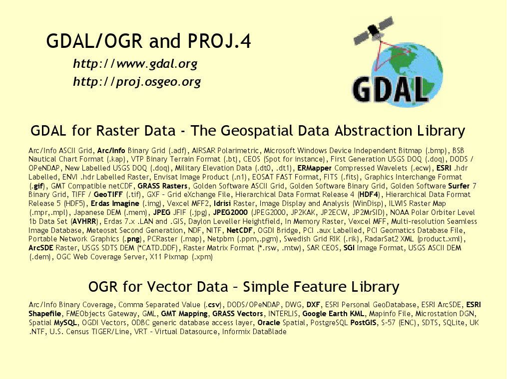

:Author: OSGeo-Live
:Version: osgeo-live4.5
:License: Creative Commons Attribution 3.0 Unported (CC BY 3.0)

.. _gdal-overview:

.. image:: ../../images/project_logos/logo-GDAL.png
  :scale: 60 %
  :alt: project logo
  :align: right
  :target: http://gdal.org/

.. image:: ../../images/logos/OSGeo_project.png
  :scale: 100 %
  :alt: OSGeo Project
  :align: right
  :target: http://www.osgeo.org/incubator/process/principles.html

GDAL/OGR
========

GeoSpatial Data Translation Tools
~~~~~~~~~~~~~~~~~~~~~~~~~~~~~~~~~

Die Geospatial Data Abstraction Library (GDAL/OGR) stellt komandozeilenbasierte Hilfsprogramme zur Verfügung. Über diese können eine Vielzahl von Raster- und Vektorgeodatenformate umgewandelt und prozessiert werden.

Die Hilfsprogramme basieren auf einer plattformübergreifenden C++ Bibliothek, die über zahlreiche Programmiersprachen angesprochen werden kann. Die Bibliothek GDAL/OGR bietet für die aufrufende Anwendung ein einfaches abstraktes Datenmodell für alle unterstützten Formate.

GDAL/OGR ist die am weitesten verbreitete Bibliothek für den Zugriff auf räumliche Daten. Viele Anwendungen einschließlich MapServer, GRASS, QGIS und OpenEV nutzen überwiegend GDAL/OGR für den Datenzugriff. GDAL/OGR wird auch von OSSIM, Cadcorp SIS, FME, Google Earth, VTP, Thuban, ILWIS, MapGuide und ArcGIS genutzt.

Kernfunktionen
--------------

* kommandozeilen-basierte Hilfsprogramme zur Datenumwandlung, Bildanpassung, Generierung von Bildausschnitten und für zahlreiche andere gängige Bildbearbeitungsaufgaben
* Hocheffizienter Zugriff auf Rasterdaten unter Nutzung der Vorteile von Kachelung und Übersichten
* Unterstützung großer Dateien - größer 4GB
* Zugriff auf die Bibliothek über Python, Java, C#, Ruby, VB6 und Perl
* Die Umrechung in andere Koordinatenreferenzsysteme baut auf die PROJ.4 und OGC Well Known Text Beschreibung auf

Gängige unterstützte Formate
----------------------------

GDAL unterstützt über 50 Rasterdatenformate, OGR unterstützt über 20 Vektordatenformate.

Diese beinhalten:

* **Raster:** GeoTIFF, Erdas Imagine, SDTS, ESRI Grids, ECW, MrSID, JPEG2000, DTED und weitere  ...
* **Vector:** MapInfo (tab and mid/mif), ESRI Shapefile, ESRI Coverages, ESRI Personal Geodatabase, DGN, GML, PostGIS, Oracle Spatial und weitere ...

Implementierte Standards
------------------------

Das OGR Vektor Datenmodell folgt der OGC Simple Features Spezifikation.

Details
-------

**Webseite:**  http://www.gdal.org

**Lizenz:** `X/MIT style Open Source license <http://trac.osgeo.org/gdal/wiki/FAQGeneral#WhatlicensedoesGDALOGRuse>`_

**Software Version:** 1.7.3

**Unterstützte Plattformen:** Windows, Linux, Mac

**API Schnittstellen:** Python, Java, C#, Ruby, VB6 and Perl

**Support:** http://www.osgeo.org/search_profile

Quickstart
----------

* :doc:`Quickstart Dokumentation <../quickstart/gdal_quickstart>`
