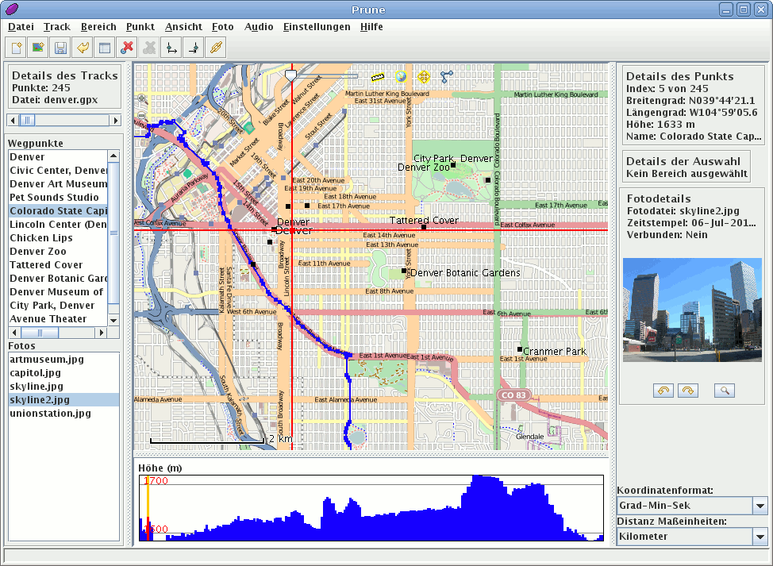

:Author: activityworkshop
:Version: osgeo-live4.5
:License: Creative Commons Attribution 3.0 Unported (CC BY 3.0)

.. image:: ../../images/project_logos/logo-prune.png
  :alt: project logo
  :align: right
  :target: http://gpsprune.activityworkshop.net/

GpsPrune
================================================================================

GPS Datenverarbeitungssoftware 
~~~~~~~~~~~~~~~~~~~~~~~~~~~~~~~~~~~~~~~~~~~~~~~~~~~~~~~~~~~~~~~~~~~~~~~~~~~~~~~~

`GpsPrune <http://gpsprune.activityworkshop.net/>`_ ist ein Tool für die Visualisierung,
das Editieren und das Konvertieren von Koordinatendaten aus GPS Systemen.  GpsPrune verwendet OpenStreetMap
Karten um aufgenommenen Tracks und Wegpunkte zu zeigen, und stellt eine Reihe von Funktionen zur Verfügung
um die Punkte zu editieren, löschen und kombinieren.  GpsPrune kann auch Fotos und Audiodateien mit den
Koordinaten verbinden anhand von den Zeitstempeln.

Falls GPSBabel auch verfügbar ist, kann GpsPrune Daten direkt aus dem GPS-Empfänger herauslesen,
und kann auch Daten zurück zur Empfänger schicken.

GpsPrune läuft sowohl auf Linux als auch auf Mac OSX und Windows, and ist in über zehn
verschiedenen Sprachen verfügbar.

Kernfunktionen
--------------------------------------------------------------------------------

* Daten aus Textdateien, Gpx-, Kml- oder Kmzdateien laden, oder aus einem GPS-Gerät
* Zeigt die Daten mit zoombaren Karten von OpenStreetMap oder anderen Servern (z.B. OpenCycleMap, CloudMade)
* Höhenprofil oder Geschwindigkeitsprofil Ansicht
* Funktionen wie Punkt löschen, Bereich umkehren und Track komprimieren
* Drehbare 3D Ansicht der Daten, oder nach POV-Datei exportieren für 3D-Rendering
* Daten nach Text-, Gpx-, Kml oder Kmzdateien speichern, oder zum GPS-Gerät schicken
* Automatisches Korrelieren von Fotos und Audiodateien anhand von Zeitstempeln
* Erzeugen von Diagrammen wie zum Beispiel Höhe gegen Distanz, oder Geschwindigkeit gegen Zeit

Details
--------------------------------------------------------------------------------

**Webseite:** http://gpsprune.activityworkshop.net/

**Lizenz:** GNU General Public License (GPL) version 2

**Software Version:** 13.1

**Unterstützte Plattformen:** GNU/Linux, Mac OSX, Windows

Quickstart
--------------------------------------------------------------------------------

* :doc:`Quickstart Dokumentation <../quickstart/gpsprune_quickstart>`
