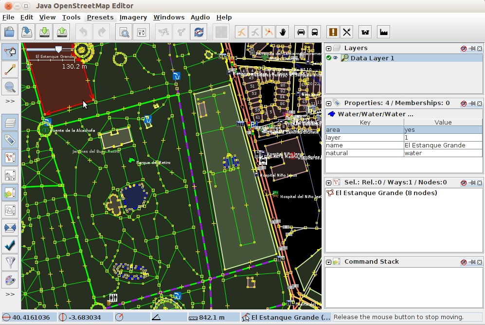

:Author: OSGeo-Live
:Author: Javier Sanchez, GeoNaTec
:Reviewer: Cameron Shorter, LISAsoft
: Translator: Astrid Emde
:Version: osgeo-live6.5
:License: Creative Commons Attribution 3.0 Unported (CC BY 3.0)

.. image:: ../../images/project_logos/logo-josm.png
  :alt: project logo
  :align: right
  :target: http://josm.openstreetmap.de

JOSM
================================================================================

Desktop Editor für OpenStreetMap Daten
~~~~~~~~~~~~~~~~~~~~~~~~~~~~~~~~~~~~~~~~~~~~~~~~~~~~~~~~~~~~~~~~~~~~~~~~~~~~~~~~

JOSM ist ein funktionsreicher, erweiterbarer, offline Desktop Editor für OpenStreetMap (OSM) Daten, der in Java geschrieben wurde.

Er unterstützt sowohl das Laden von unabhängigen GPX Tracks und GPX Track Daten als auch das Editieren von existierenden Knoten (Punkten), Wegen (Linien), Meta-Tags (Name/Wert Information) und Relationen (Anordnung von Punkten und Linien) aus der OSM Datenbank.

GPX Tracks werden in der Regel im Vorfeld über einen GPS Empfänger oder anderen Quellen heruntergeladen.

Es wurde einige spezialisierte Plugins für JOSM geschreiben. Diese stehen zum Download.

Kernfunktionen
--------------------------------------------------------------------------------

* Gängige GIS Desktop Werkzeuge:

  * Anpassbare Werkzeugleiste, Navigationselemente (Zoomen, Verschieben usw.), Stilanpassung, Symbole und Ebenenmanagement.

* Download und Upload von OSM Vektordaten.

* Offene lokale Daten:

  * NMEA-0183 Dateien: .nmea, .nme, .nma, .log, .txt
  * OSM Dateien: .osm, .xlm, .osmbz2, .osmbz
  * OSM Änderungsdateien: .osc, .osc.bz2, .osc.bz, .osc.gz
  * Bilddateien (.jpg)

* Hintergrundansicht:
  
  * Darstellung von Grundkarten von OSM, Bingsat, Lansat, MapBox Satellit, MapQuest Open Aerial oder jeder anderen WMS Quelle.

* Bearbeitungswerkzeuge:

  * Knoten: Mergen, Vereinigen, Lösen, Verbreiten, an Kreis oder Linie ausrichten, Knoten einem Weg hinzufügen und mehr.
  * Wege: Teilen, Kombinieren, Umkehren, Vereinfachen, Wege lösen und mehr.
  * Fläche: Vereinigung überlappender Flächen, Erzeugung von Multi-Polygonen und mehr.

* Audio Mapping: Aufnahme-Management für Untersuchungen.

* Foto Mapping: Bild-Management für Untersuchungen.
 
* Plugins: Eine Liste spezialisierter Plugins sind zum Download verfügbar.

Unterstützte Standards
--------------------------------------------------------------------------------

* JOSM zeigt WMS Ebenen an, nutzt aber die  `OSM API <http://wiki.openstreetmap.org/wiki/API_v0.6>`_ zur Kommunikation mit der OSM Datenbank.

Details
--------------------------------------------------------------------------------

**Webseite:** http://josm.openstreetmap.de/

**Lizenz:** GNU General Public License (GPL) Version 2. Hinweis: JOSM Plugins könnten andere Lizenzen verwenden.

**Software Version:** r11427

**Unterstützte Plattformen:** Windows, Linux, Mac

**API Schnittstellen:** Java

.. Quickstart
.. --------------------------------------------------------------------------------
.. 
.. * :doc:`Quickstart Dokumentation <../quickstart/josm_quickstart>`

