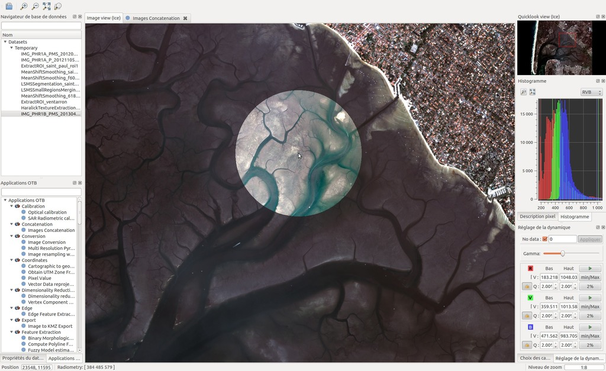

:Author: OSGeo-Live
:Reviewer: Cameron Shorter, LISAsoft
:Version: osgeo-live8.5
:License: Creative Commons Attribution 3.0 Unported (CC BY 3.0)

.. image:: ../../images/project_logos/logo-otb.png
  :alt: project logo
  :align: right
  :target: http://www.orfeo-toolbox.org/

OTB
================================================================================

Bild Prozessierung
~~~~~~~~~~~~~~~~~~~~~~~~~~~~~~~~~~~~~~~~~~~~~~~~~~~~~~~~~~~~~~~~~~~~~~~~~~~~~~~~
ORFEO Toolbox Library (OTB) ist eine hochperformante Bildprozessierungsbibliothek. OTB wurde anfangs
zur Prozessierung von Fernerkundungsdaten (Remote Sensing) wie Radaraufnahmen, Satellitenaufnahmen und Luftbildern. 
OTB stellt Werkzeuge für Optic und Radarbilder
(3D Aspekte, Erkennung von Änderungen, Texturanalysen, Musterabgleich, optische/radar Komplementaritäten) zur Verfügung.
Viele der Prozesse können auf weniger leistungsstarken Notebooks laufen.

OTB wird mit erweiterbaren direkt einsatzfähigen Werkzeugen für klassische Remote Sensing Fragestellungen sowie mit einer vollständig integrierten Benutzeroberfläche mit dem Namen Monteverdi2 
ausgeliefert. Monteverdi2 ermöglicht es dem Anwender OTB Prozessketten über das Menü auszuwählen.

OTB wurde von der French Space Agency (CNES) im Rahmen des
methodischen Bereichs des ORFEO/Pleiades Accompaniement Programms gegründet und 
wurde aktiv seit 2006 entwickelt. Es basiert auf der bewährten Bildprozesierungsbibliothek
ITK(v4) und ist Open Source.

Kernfunktionen
--------------------------------------------------------------------------------

* Bildzugriff: optimierter Lese-/Schreibzugriff für die meisten Fernerkundungsdatenformate (inklusive Jpeg2000 über OpenJPEG), Metadatenzugriff und Visualisierung
* Orthorectification unter Verwendung von DEM und Kartenumprojektion
* Kalibrierung
* Bildfusion
* Filtern: Blurring, Denoising, Verbesserungen
* Erzeugen von Objekten: Einfügen von Punkten, Anpassungen, Linien
* Objekterkennung
* Bildsegmentierung: Region Growing, Watershed, Niveaumengenmethoden (Level Sets)
* Klassifizierung: K-Means, SVM, MRF (Markov Random Fields)
* objektbasierte Bildanalyse
* räumliche Analyse
* Stereoskopische Rekonstruktion von optischen Bildern
* SAR Datenanalyse
* Änderungsverfolgung

Details
--------------------------------------------------------------------------------

**Webseite:** http://www.orfeo-toolbox.org/

**Lizenz:** CeCILL (CeCILL kompatibel mit GPL und erweitert
  für französisches Recht)

**Software Version:** 5.0.0

**Unterstützte Plattformen:** Linux, Mac, Windows

**API Schnittstellen:** C++

**Support:** http://www.osgeo.org/search_profile

Quickstart
--------------------------------------------------------------------------------

* :doc:`Quickstart Dokumentation <../quickstart/otb_quickstart>`

