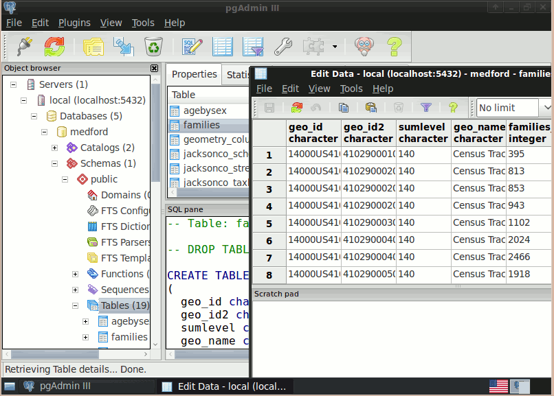

:Author: OSGeo-Live
:Author: Barry Rowlingson
:Reviewer: Cameron Shorter, LISAsoft
:Version: osgeo-live7.9
:License: Creative Commons Attribution 3.0 Unported (CC BY 3.0)

.. image:: ../../images/project_logos/logo-PostGIS.png
  :alt: Projekt Logo
  :align: right
  :target: http://postgis.net/

.. image:: ../../images/logos/OSGeo_project.png
  :scale: 100 %
  :alt: OSGeo Project
  :align: right
  :target: http://www.osgeo.org/incubator/process/principles.html

PostGIS
================================================================================

Räumliche Datenbank
~~~~~~~~~~~~~~~~~~~~~~~~~~~~~~~~~~~~~~~~~~~~~~~~~~~~~~~~~~~~~~~~~~~~~~~~~~~~~~~~

PostGIS erweitert PostgreSQL um geografische Objekte und Funktionen. Es eignet sich für als Back-End-Datenbank für geografische Informationssysteme (GIS) und Web-Mapping Anwendungen. 

PostGIS ist stabil, schnell, standard-konform, mit Hunderten von räumlichen Funktionen und ist derzeit die am weitesten verbreitete Open Source Datenbank mit Unterstützung geografischer Objekte und Funktionen. PostGIS ist die am weitest verbreitete räumliche Datenbank. Es ist stabil, schnell, standard-konform und stellt eine Vielezahl räumlicher Funktionen bereit. 

PostGIS wird weltweit von vielen großen Organisationen und Firmen eingestetzt um große Datenmengen zu verwalten und online zu Verfügung zu stellen. 
Die Datenbank-Administration ist unter anderem mit pgAdmin und phpPgAdmin möglich. Der Im- und Export von Daten wird von verschiedenen Konverter-Tools (shp2pgsql, pgsql2shp, ogr2ogr, dxf2postgis) unterstützt. Es gibt zahlreiche Desktop-GIS- und Browser-Anwendungen zur Anzeige von PostGIS-Daten.

Kernfunktionen
--------------------------------------------------------------------------------

* Räumlichen Funktionen
  
  * Berechnung von Flächen und Distanzen
  * Verschneidung
  * Berechnung von Pufferzonen 
  * Transformation von Koordinatensystemen
  * ... 

* ACID transaktionale Integrität
* R-Tree räumlicher Index
* Mehrbenutzerunterstützung
* Row-level locking
* Replikation
* Partitionierung
* Rollenbasiertes Sicherheitskonzept 
* Table-spaces, Schemas

Implementierte Standards
--------------------------------------------------------------------------------

* OGC standardkonform (SFSQL)

Details
--------------------------------------------------------------------------------

**Website:** http://postgis.net

**Lizenz:** GNU General Public License (GPL) version 2

**Software Version:** |version-postgis|

**Unterstützte Plattformen:** Windows, Linux, Mac

**API Schnittstellen:** SQL

**Support:** http://www.osgeo.org/search_profile

Quickstart
--------------------------------------------------------------------------------

* :doc:`Quickstart Dokumentation <../quickstart/postgis_quickstart>`
