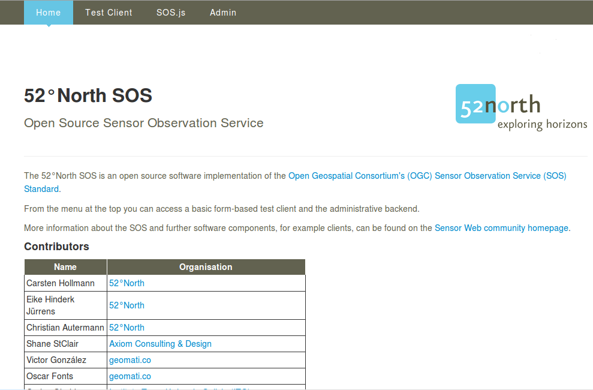
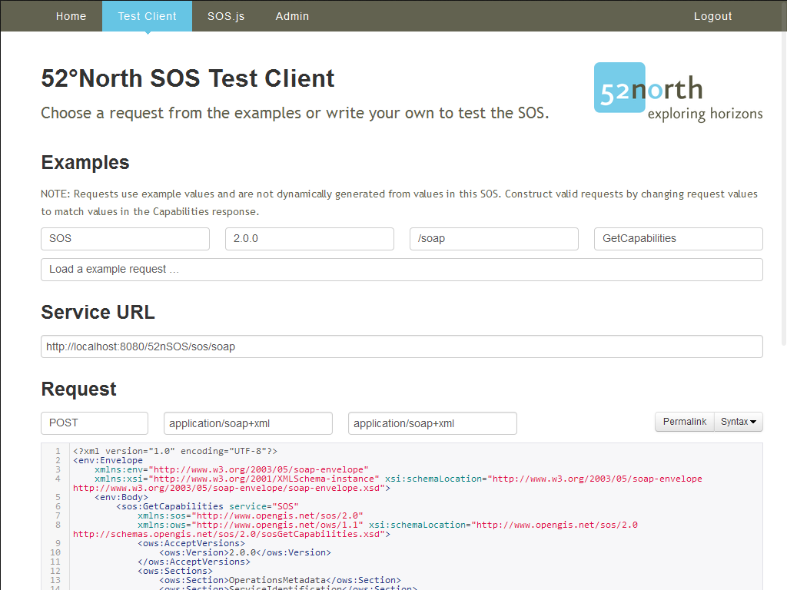
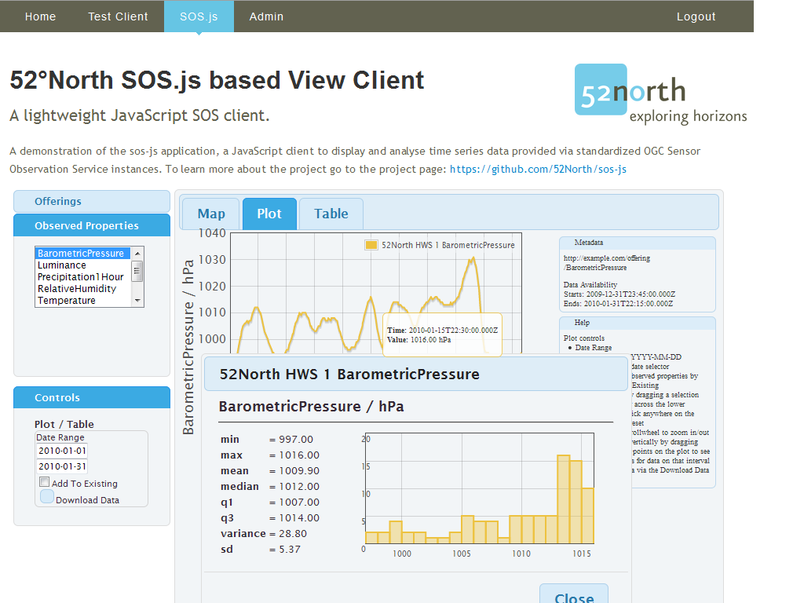

:Author: Eike Hinderk Jürrens (e.h.juerrens@52north.org), Simon Jirka (s.jirka@52north.org)
:Reviewer: 
:Version: osgeo-live9.0
:License: Creative Commons Attribution-ShareAlike 3.0 Unported  (CC BY-SA 3.0)

.. image:: ../../images/project_logos/logo_52North_160.png
  :scale: 100 %
  :alt: 52°North - exploring horizons - logo
  :target: http://52north.org/sos
  :align: right

*******************************************************************************
52°North SOS Quickstart 
*******************************************************************************

Der 52°North SOS ermöglicht den Zugriff und die Bereitstellung von raumbezogenen
Sensordaten. Dies umfasst sowohl Messwerte als auch zugehörige Metadaten.

Dieses Quickstart-Dokument umfasst:

  * Beispiel eines Capabilities-Dokumentes des 52°North SOS, um festzustellen, 
    welche Operationen/Abfrageparameter unterstützt werden.
  * Beispiel-Anfrage um Messdaten des SOS abzurufen.
  * Informationen zur Datenvisualisierung in einem einfachen, mit dem SOS 
    mitgelieferten Viewer.

.. contents:: Inhalt

Erste Schritte
===============================================================================

1. Rufen Sie :menuselection:`Geospatial --> Web Services --> 52North --> Start 52North SOS` auf.

2. Es öffnet sich ein Browser-Fenster, welches die Willkommens-Seite der
   52°North SOS-Anwendung anzeigt (siehe Abb. 1).

**Abb. 1**: 52°North SOS Anwendung - Willkommens-Seite

3. Um eigene Anfragen an den SOS zu stellen, wird das `Capabilities-Dokument des
   52°North SOS benötigt <http://localhost:8080/52nSOS/sos?REQUEST=GetCapabilities&SERVICE=SOS&ACCEPTVERSIONS=2.0.0>`_.
   Mit Hilfe der Inhalte des Capabilities-Dokuments (siehe Abb. 2) können die 
   Beispielanfragen aus der Beispielliste individuell angepasst werden.

  
**Abb. 2**: 52°North SOS Anwendung - Test Client mit GetCapabilities-Anfrage

4. Um z.B. für jede Zeitreihe im SOS die verfügbaren Daten in dem Zeitraum von 
   1.5.2015 00:30 bis 23:00 in der Zeitzone +0 abzufragen, muss im `Test Client 
   <http://localhost:8080/52nSOS/client>`_ nach Auswahl von Service "SOS" --> 
   Version "2.0.0" --> Binding "/soap" --> Operation "GetObservation" folgende 
   Abfrage im Feld "Request" stehen:
   
::

  <?xml version="1.0" encoding="UTF-8"?>
  <env:Envelope
      xmlns:env="http://www.w3.org/2003/05/soap-envelope"
      xmlns:xsi="http://www.w3.org/2001/XMLSchema-instance" xsi:schemaLocation="http://www.w3.org/2003/05/soap-envelope http://www.w3.org/2003/05/soap-envelope/soap-envelope.xsd">
      <env:Body>
          <sos:GetObservation service="SOS" version="2.0.0"
              xmlns:sos="http://www.opengis.net/sos/2.0"
              xmlns:fes="http://www.opengis.net/fes/2.0"
              xmlns:gml="http://www.opengis.net/gml/3.2"
              xmlns:swe="http://www.opengis.net/swe/2.0"
              xmlns:xlink="http://www.w3.org/1999/xlink"
              xmlns:swes="http://www.opengis.net/swes/2.0" xsi:schemaLocation="http://www.opengis.net/sos/2.0 http://schemas.opengis.net/sos/2.0/sos.xsd">
              <sos:temporalFilter>
                  <fes:During>
                      <fes:ValueReference>phenomenonTime</fes:ValueReference>
                      <gml:TimePeriod gml:id="tp_1">
                          <gml:beginPosition>2015-05-01T00:30:00.000+00:00</gml:beginPosition>
                          <gml:endPosition>2015-05-31T23:00:00.000+00:00</gml:endPosition>
                      </gml:TimePeriod>
                  </fes:During>
              </sos:temporalFilter>
          </sos:GetObservation>
      </env:Body>
  </env:Envelope>
  
**Listing 1:** Abfrage für Messdaten

Ausprobieren
===============================================================================

* Versuchen Sie weitere Abfragen der Test-Anwendung.
* Passen Sie die Beispielanfragen an, um andere Daten zu erhalten
* Lernen Sie den `SOS-Administrator <http://localhost:8080/52nSOS/admin/index>`_ kennen.
   Die Zugangsdaten lauten: "user" mit Passwort "user".
* Nutzen Sie den `View Client <http://localhost:8080/52nSOS/viewclient>`_ (siehe Abb. 3).

  
**Abb. 3**: 52°North SOS Anwendung - View-Client mit Zeitreihendaten

Weitere Informationen
===============================================================================

Weitere Informationen über den 52°North SOS und/oder 52°North erhalten Sie über
 folgende Wege:

* 52°North `SOS-Überblick <../overview/52nSOS_overview.html>`_,
* 52°North Sensor-Web-E-Mail-Liste: swe@52north.org, 
* Forum der 52°North `Sensor-Web-Community <http://sensorweb.forum.52north.org/>`_, 
* 52°North `SOS-Website <http://52north.org/communities/sensorweb/sos/>`_, oder 
* Website der `52°North Sensor-Web-Community <http://52north.org/communities/sensorweb/>`_.

Die Entwicklung dieser Version des 52°North SOS wurde durch verschiedene 
Projekte, Organisationen und Personen unterstützt. Mehr Informationen 
finden Sie in der `52°North SOS Anwendung <http://localhost:8080/52nSOS/index>`_.

Sollte der SOS nicht erreichbar sein, so prüfen Sie bitte mit folgendem Befehl,
 ob der Tomcat Web Service-Container läuft:

::

  user@osgeolive:~$ sudo service tomcat6 status
  * Tomcat servlet engine is running with pid 1234          <-- Tomcat läuft
  [...]
  * Tomcat servlet engine is not running.                   <-- Tomcat läuft nicht, starten Sie Tomcat über folgenden befehl:
  user@osgeolive:~$ sudo service tomcat6 start
  * Starting Tomcat servlet engine tomcat6           [ OK ] <-- Tomcat läuft nun
  
**Listing 2:** Befehle zum Abfragen des Status und zum Starten des Tomcat-Dienstes (Passwort für sudo: user)
