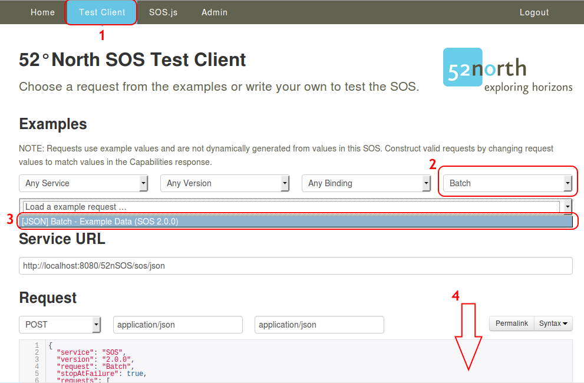

:Author: Eike Hinderk Jürrens (e.h.juerrens@52north.org), Simon Jirka (s.jirka@52north.org)
:Reviewer: 
:Version: osgeo-live8.0
:License: Creative Commons Attribution-ShareAlike 3.0 Unported  (CC BY-SA 3.0)

.. image:: ../../images/project_logos/logo_52North_160.png
  :scale: 100 %
  :alt: 52°North - exploring horizons - logo
  :target: http://52north.org/sos
  :align: right

********************************************************************************
52°North SOS Quickstart 
********************************************************************************

Der 52°North SOS ermöglicht den Zugriff und die Bereitstellung von raumbezogenen
Sensordaten. Dies umfasst sowohl Messwerte als auch zugehörige Metadaten.

Dieses Quickstart-Dokument umfasst:

  * Abschluss der Installation und Konfiguration der SOS-Instanz.
  * Einfügen von Testdaten mit Hilfe der Test-Anwendung.
  * Eine Anfrage eines 52°North SOS Capabilities-Dokumentes, um festzustellen, welche Anfragen unterstützt werden.
  * Eine Detail-Anfrage zu Messdaten des SOS.

.. contents:: Inhalt

Erste Schritte
================================================================================

1. Rufen Sie :menuselection:`Geospatial --> Web Services --> 52North --> Start 52North SOS`.

2. Es öffnet sich ein Browser-Fenster, welches die Willkommens-Seite der
   52°North SOS-Anwendung anzeigt (siehe Abb. 1). Bitte klicken sie auf den 
   Linktext “here” zur Vervollständigung der Installation (in der rot hinterlegten Meldung):

.. image:: ../../images/screenshots/1024x768/52n_sos_install_start.png
  :scale: 100 %
  :alt: Bildschirmfoto der 52°North SOS-Anwendung-Willkommens-Seite
  :align: center

**Abb. 1**: 52°North SOS Anwendung - Willkommens-Seite

3. Folgen Sie den Schritten zur Vervollständigung der Installation und Konfiguration. Als Datasource sollten sie entsprechend
   ihren Bedürfnissen wählen. Für einen kurzen Test bietet sich die Wahl von "H2/GeoDB (in memory)" an. Workshops oder
   Installationen sollten einen Datenbankserver wie z.B. PostgreSQL nutzen. Dazu wählen Sie "PostgreSQL/PostGIS" aus.
   Es wird eine existierende Datenbank mit PostGIS 2.0 erwartet. Weitere Änderungen an den Standardeinstellungen müssen nicht 
   gemacht werden. Als letztes muss ein Admininstrations-Nutzer mit Nutzername und Passwort eingerichtet werden.

4. Nach der Installation werden als nächstes die Testdaten eingefügt. Dazu wählen Sie die Operation Batch
   im Test Client aus und klicken anschließend auf Send (siehe Abb. 2).

  
**Abb. 2**: 52°North SOS Anwendung - Test Client mit Batch-Operation 

5. Um eigene Anfragen an den SOS zu stellen, wird das `Capabilities-Dokument des
   52°North SOS benötigt <http://localhost:8080/52nSOS/sos?REQUEST=GetCapabilities&SERVICE=SOS&ACCEPTVERSIONS=1.0.0>`_.
   Mit Hilfe der Inhalte des Capabilities-Dokuments (siehe Abb. 3) können die Beispielanfragen
   aus der Beispielliste individuell angepasst werden.

.. image:: ../../images/screenshots/1024x768/52n_sos_get_capabilities.png
  :scale: 100 %
  :alt: Bildschirmfoto der 52°North SOS Anwendung - Test Client mit GetCapabilities-Antwort
  :align: center
  
**Abb. 3**: 52°North SOS Anwendung - Test Client mit GetCapabilities-Antwort

Ausprobieren
================================================================================

* Versuchen Sie weitere Abfragen der Test-Anwendung.
* Nutzen Sie den `View Client <http://localhost:8080/52nSOS/viewclient>`_ (siehe Abb. 4).
* Passen Sie die Beispielanfragen an um andere Daten zu bekommen.

.. image:: ../../images/screenshots/1024x768/52n_sos_viewclient.png
  :scale: 100 %
  :alt: Bildschirmfoto der 52°North SOS Anwendung - View-Client mit Zeitreihendaten
  :align: center
  
**Abb. 4**: 52°North SOS Anwendung - View-Client mit Zeitreihendaten

Weitere Informationen
================================================================================

* Weitere Informationen über den 52°North SOS und/oder 52°North erhalten Sie 
  über folgende Wege:

* 52°North `SOS-Überblick <../overview/52nSOS_overview.html>`_,
* 52°North Sensor-Web-E-Mail-Liste: swe@52north.org, 
* Forum der 52°North `Sensor-Web-Community <http://sensorweb.forum.52north.org/>`_, 
* 52°North `SOS-Website <http://52north.org/communities/sensorweb/sos/>`_, oder 
* Website der `52°North Sensor-Web-Community <http://52north.org/communities/sensorweb/>`_.
* Die Entwicklung dieser Version des 52°North SOS wurde durch verschiedene Projekte, Organisationen und Personen unterstützt. 
  Mehr Informationen in der `52°North SOS Anwendung <http://localhost:8080/52nSOS/index`_.
* Sollte der SOS nicht erreichbar sein, so prüfen Sie bitte mit folgendem Befehl, ob der Tomcat Web Service-Container läuft:

::

  user@osgeolive:~$ sudo /etc/init.d/tomcat6 status
  * Tomcat servlet engine is running with pid 1234          <-- Tomcat läuft  [...]
  * Tomcat servlet engine is not running.                   <-- Tomcat läuft nicht, starten Sie Tomcat über folgenden befehl:
  user@osgeolive:~$ sudo /etc/init.d/tomcat6 start
  * Starting Tomcat servlet engine tomcat6           [ OK ] <-- Tomcat läuft nun
  
**Listing 1:** Befehle zum Abfragen des Status und zum Starten des Tomcat-Dienstes (Passwort für sudo: user)
