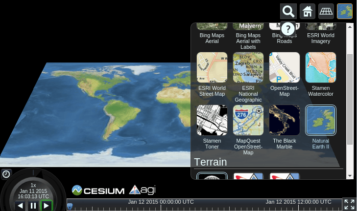

:Author: Balasubramaniam Natarajan
:Reviewer: Cameron Shorter, Jirotech
:Translator: Astrid Emde
:Version: osgeo-live8.5
:License: Creative Commons Attribution-ShareAlike 3.0 Unported  (CC BY-SA 3.0)

********************************************************************************
Cesium Quickstart 
********************************************************************************
Dieses Dokument zeigt, wie Cesium mit dem 3D (Globus), 2.5D (Columbus View) und 2D (Karte) verwendet wird.

Cesium starten
===============
Öffnen Sie den Browser und geben Sie die folgende Adresse ein http://localhost/cesium/Apps/HelloWorld.html

Ortssuche
=======================
Über die Lupe kann ein Ort eingegeben werden. Auf dem folgenden Bild wird nach Indien gesucht.

.. image:: ../../images/screenshots/1024x768/cesium_1_SearchingLocation.png
  :scale: 70 %
  :alt: Cesium Searching Location

Wechsel zwischen 3D, 2.5D und 2D
=================================
Sie können auf den Button mit dem Globus klicken, um in eine andere Ansicht zu wechseln. Auf dem folgenden Bild wurde die 2.5D Columbus Ansicht ausgewählt.

.. image:: ../../images/screenshots/1024x768/cesium_2_2253d.png
  :scale: 70 %
  :alt: Cesium switching between 3D, 2.5D and 2D

Nun wurde die 2D Karte ausgewählt.

.. image:: ../../images/screenshots/1024x768/cesium_3_2D.png
  :scale: 70 %
  :alt: Cesium 2D map

Auswahl der Kartenebene
=========================
Über den Button ganz rechts kann der Kartendienst ausgewählt werden, der angezeigt werden soll. Im Beispiel wurde Natural Earth II ausgewählt und Sie können sehen, wie sich das Kartenbild verändert.

.. TBD: There is room here for a couple more examples.

Was kommt als Nächstes?
==============================
* Es gibt Video Tutorials `unter <https://www.youtube.com/playlist?list=PLBk_Dtk-_Tlm4STvXKFEdfUWylPemo-9V>`_.

* Webbasierte Tutorials `unter <http://cesiumjs.org/tutorials.html>`_.

* Sie können einige schnelle Anwendungen  über die Sandburg Webseite unter der folgenden Adresse entwickeln `Link <http://cesiumjs.org/Cesium/Apps/Sandcastle/index.html?src=Custom%20DataSource.html&label=Tutorials>`_.

* Eine ausführliche Dokumentation finden Sie lokal `unter <http://localhost/cesium/>`_.
