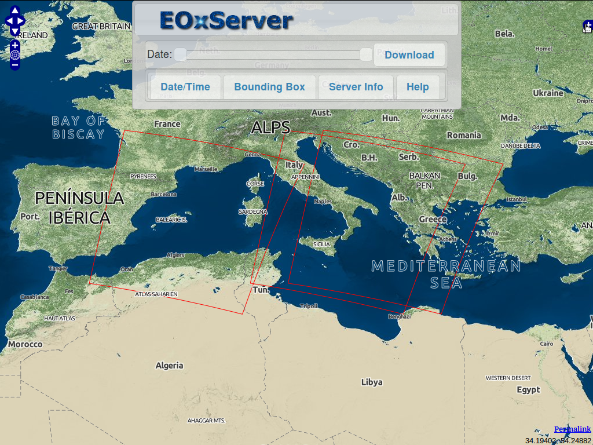
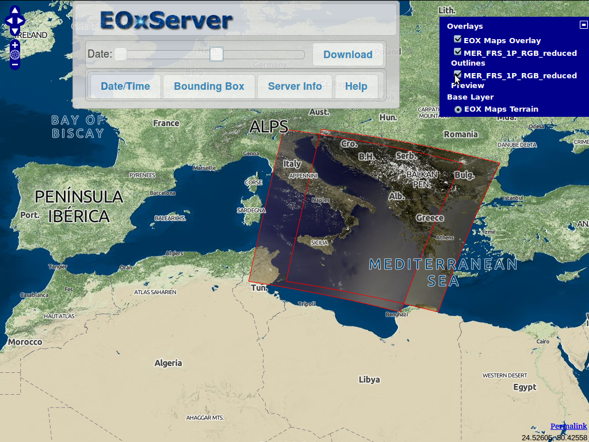
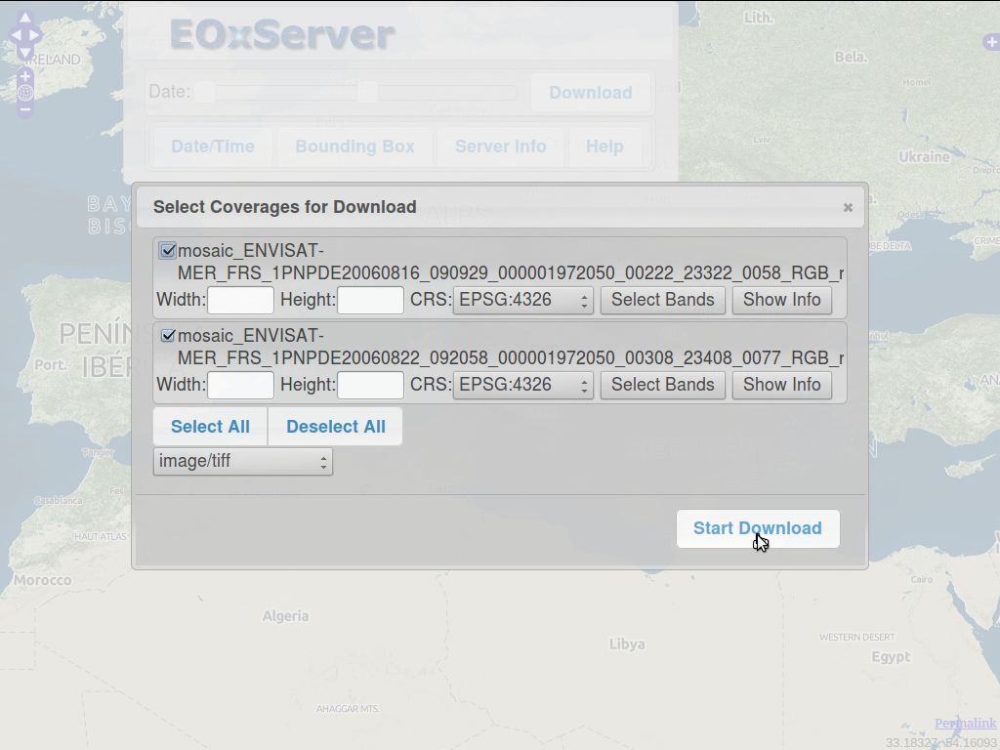
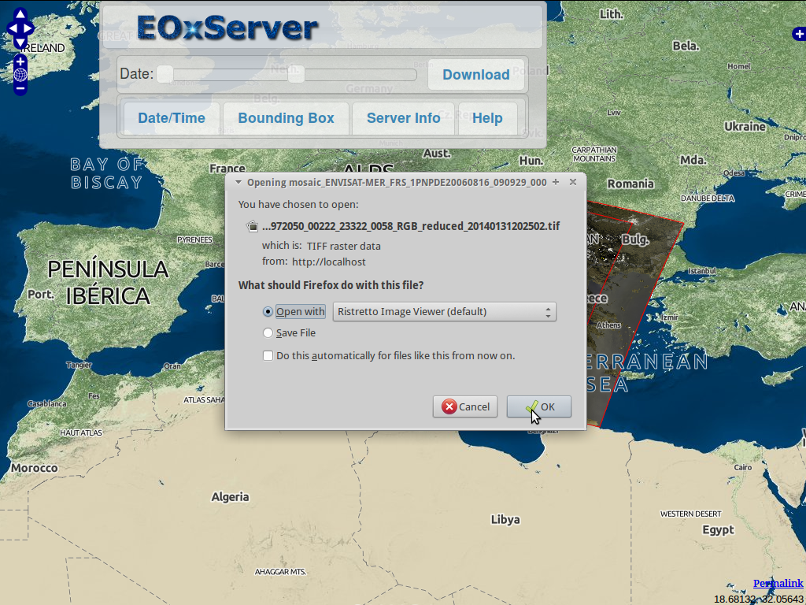
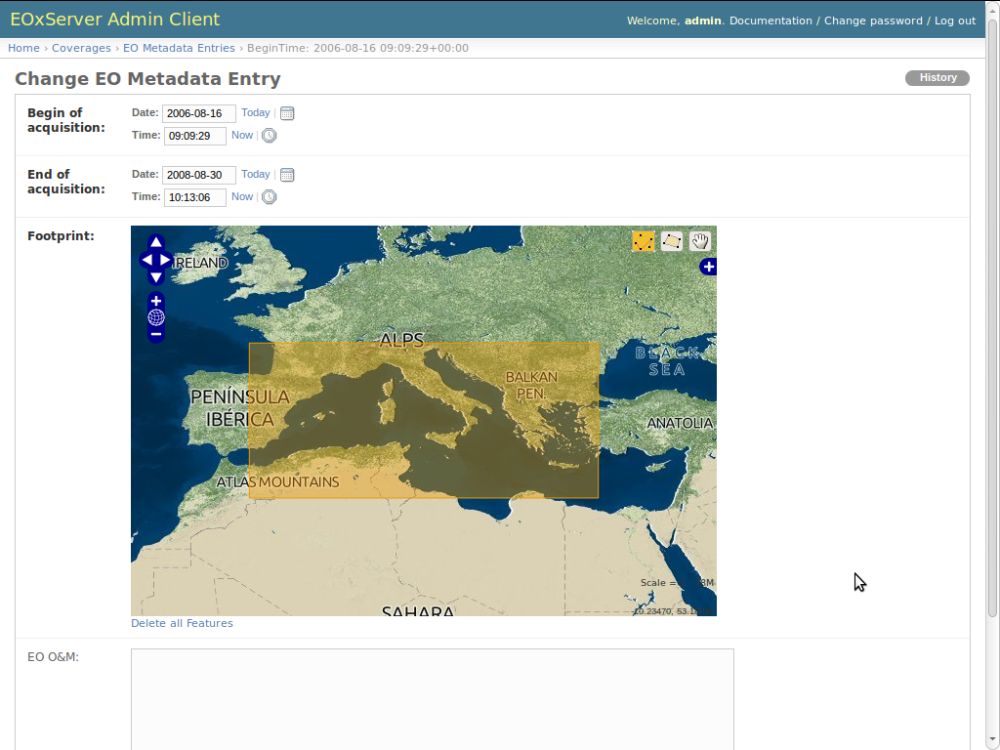

:Author: OSGeo-Live 
:Author: Stephan Meissl, Stephan Krause
:Reviewer: Angelos Tzotsos
:Version: osgeo-live7.0
:License: Creative Commons Attribution-ShareAlike 3.0 Unported (CC BY-SA 3.0)
:Translator: Stephan Meissl

.. image:: ../../images/project_logos/logo-eoxserver-2.png
  :scale: 65 %
  :alt: project logo
  :align: right
  :target: http://eoxserver.org/

================================================================================
 EOxServer Quickstart
================================================================================

Übersicht
---------

EOxServer ist ein Server um große Archive von Erdbeobachtungsdaten (Earth 
Observation - EO) und Metadaten über offenen Standards zur Verfügung zu 
stellen. EOxServer basiert komplett auf Open Source Software wie Python, 
:doc:`MapServer <../overview/mapserver_overview>`, Django / GeoDjango, 
:doc:`GDAL <../overview/gdal_overview>`, PROJ.4 und einer :doc:`SpatiaLite 
<../overview/spatialite_overview>` oder :doc:`PostGIS 
<../overview/postgis_overview>` Datenbank.

Dieses Quickstart beschreibt das:

* Ansehen, Filtern, Auswählen und Herunterladen von Erdbeobachtungsdaten unter 
  Verwendung des in EOxServer eingebauten Klienten
* Registrieren von Archiven von Erdbeobachtungsdaten unter Verwendung des in 
  EOxServer eingebauten Administrationsklienten

.. contents:: Contents

Weiterführende Informationen finden Sie im :doc:`EOxServer Overview 
<../overview/eoxserver_overview>`, in der `lokalen EOxServer Dokumentation 
<../../eoxserver-docs/EOxServer_documentation.pdf>`_ oder der `online 
verfügbaren EOxServer Dokumentation <http://eoxserver.org/doc/>`_.

.. image:: ../../images/screenshots/1024x768/eoxserver_documentation.png
  :scale: 50 %
  :alt: EOxServer Dokumentation

Demonstrationsinstanz
---------------------

.. Commented since Tomcat isn't started automatically anymore (#1032).
    Für den Fall, dass Sie OSGeoLive mit 1GB RAM oder weniger laufen lassen, ist es ratsam den default Tomcat Service vor dem Aufruf von EOxServer zu stoppen.
    :: 

      sudo service tomcat6 stop

Unter `Web Services` finden Sie ein mit `EOxServer` beschriftetes Symbol 
welches einen Browser startet der die Demonstrationsinstanz anzeigt. Diese 
ist unter http://localhost/eoxserver/ verfügbar und stellt dieselben Daten 
zur Verfügung wie die `online Demo <https://eoxserver.org/demo_stable/>`_

.. image:: ../../images/screenshots/1024x768/eoxserver_start.png
  :scale: 50 %
  :alt: Start der EOxServer Demonstration

Web Klient
~~~~~~~~~~

Der **Web Client** Link listet alle verfügbaren `Dataset Series` 
(Daten-Serien) und `Stitched Mosaics` (Zusammengefügte Mosaike) auf. In der 
Demonstration ist eine `Dataset Series` mit dem Namen "MER FRS 1P RGB 
reduced" konfiguriert. Diese enthält drei ENVISAT MERIS Szenen. 
Weiterführende Informationen zu diesen Daten finden Sie in der  `online 
Dokumentation zur Demonstration 
<http://eoxserver.org/doc/en/users/demonstration.html>`_.

.. image:: ../../images/screenshots/1024x768/eoxserver_webclient1.png
  :scale: 50 %
  :alt: EOxServer Demonstration des eingebauten Klienten Dataset Series Auswahl

Durch Auswählen eines Eintrages gelangen Sie zu einer Karte auf der die 
Fußabdrücke der verfügbaren `Datasets` angezeigt werden.

Die verfügbaren Daten selbst können unter Verwendung der Standard-OpenLayers 
Bedienelemente zur Anzeige gebracht werden. Klicken Sie auf das **(+** oben rechts im Fenster, um später eine Auflistung der 
Selektion zu erhalten. Zum Zoomen können Sie entweder das Mausrad verwenden oder
oder bei gedrückter Shift Taste mit der linken Maustaste ein Rechteck auf der Karte aufziehen.

.. image:: ../../images/screenshots/1024x768/eoxserver_screenshot.png
  :scale: 50 %
  :alt: EOxServer Demonstration des eingebauten Klienten Fußabdrücke und Daten

Mit dem **Datumsschieber** (Date slider) können Sie die angezeigten 
`Datasets` auf ein Intervall limitieren.

Der Button mit der Beschriftung **Download** bringt eine Liste der 
herunterladbaren `Datasets` zur Anzeige. Herunterladbar bedeutet, dass das 
Dataset innerhalb des gesetzten oder, falls keines gesetzt ist, momentan 
angezeigten Gebietes und innerhalb des gesetzten Intervalls liegt. Die 
herunterzuladenden `Datasets` sowie Größe, Projektion, Format und Bänder 
können ausgewählt werden.

**Start Download** initiiert das eigentliche Herunterladen unter Umständen 
von mehreren Dateien falls mehrere `Datasets` ausgewählt wurden.

Administrationsklient
~~~~~~~~~~~~~~~~~~~~~

Der **Admin Client** Link führt zur Anmeldeseite des 
Administrationsklienten. Das Passwort für den Benutzer `admin` ist `admin`.

.. image:: ../../images/screenshots/1024x768/eoxserver_adminclient1.png
  :scale: 50 %
  :alt: EOxServer Demonstration des Administrationsklienten Anmeldeseite

Der Administrationsklient ist der Standard Admin von Django und erlaubt die 
Konfiguration der verfügbaren Daten. Gerne können Sie die Funktionen des 
Administrationsklienten erkunden. Weiterführende Informationen liefert der 
`Operators' Guide <http://eoxserver.org/doc/en/users/operators.html>`_.

.. image:: ../../images/screenshots/1024x768/eoxserver_adminclient2.png
  :scale: 50 %
  :alt: EOxServer Demonstration des Administrationsklienten Beginn

Zum Beispiel ist es möglich die `EO Metadaten Einträge` der konfigurierten `Dataset 
Series` anzuzeigen und zu ändern.

Log Betrachter
~~~~~~~~~~~~~~

Der **Log Viewer** Link bietet eine einfache Möglichkeit die letzten Log 
Einträge zu betrachten.

.. image:: ../../images/screenshots/1024x768/eoxserver_logviewer.png
  :scale: 50 %
  :alt: EOxServer Demonstration Log Betrachter

Weiterführende Links
--------------------

Diese einfache Demonstration zeigt bei weitem nicht alle Funktionen von 
EOxServer. Die folgende Liste bietet einen Auszug interessanter 
Informationen um sich mit EOxServer vertraut zu machen:

* Lesen Sie den `EOxServer Operators' Guide 
  <http://eoxserver.org/doc/en/users/operators.html>`_.
* Lesen Sie die komplette `EOxServer Users' Dokumentation 
  <http://eoxserver.org/doc/en/users/index.html>`_ beginnend bei den `EOxServer 
  Basics <http://eoxserver.org/doc/en/users/basics.html>`_.
* Sind sie bereit EOxServer zu verwenden? Dann werden Sie Teil der 
  Gemeinschaft, indem Sie der `Mailing Liste 
  <http://eoxserver.org/doc/en/users/mailing_lists.html>`_ beitreten um Ideen 
  auszutauschen, potentielle Verbesserungen der Software zu diskutieren und 
  einfach Fragen zu stellen.
