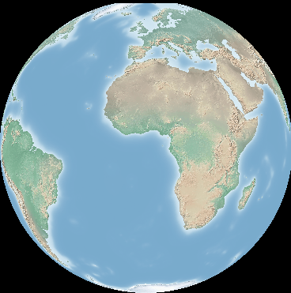

:Author: Astrid Emde, material from Frank Warmedams RasterTutorial
:Version: osgeo-live5.0
:License: Creative Commons Attribution-ShareAlike 3.0 Unported  (CC BY-SA 3.0)

.. image:: ../../images/project_logos/logo-GDAL.png
  :scale: 60 %
  :alt: project logo
  :align: right
  :target: http://gdal.org/

********************************************************************************
GDAL/OGR Quickstart
********************************************************************************

Sie brauchen lediglich ein Terminal für die Übungen. Zur Visualisierung der Ergebnisse 
können Sie ein Desktop GIS von OSGeo-Live wie beispielsweise :doc:`../overview/qgis_overview` verwenden.

Dieses Quickstart besteht aus zwei Teilen - GDAL (Rasterdaten) und OGR (Vektordaten). 
Wir werden mit der Betrachtung von GDAL beginnen.

Das Quickstart beschreibt Folgendes:

GDAL
  * Untersuchen von Rasterdaten mit gdalinfo
  * Formatumwandlung mit gdal_translate 
  * Transformieren von Daten mit gdalwarp
  * Zusammenfassen von Daten mit gdal_warp oder gdal_merge.py
  * Erzeugen eines Bildkatalogs in Form einer Shapedatei mit gdaltindex

OGR
  * Untersuchen von Vektordaten mit ogrinfo 
  * Verwendung von ogr2ogr zur Umwandlung von Vektordaten in andere Formate

Lernen Sie GDAL kennen
================================================================================

Sie finden die Demodaten unter :file:`/usr/local/share/data`. Für die folgenden Übungen werden 
die :doc:`Natural Earth Daten <../overview/naturalearth_overview>` verwendet. Wir werden mit einer Kopie der Daten arbeiten. 
Daher ist der erste Schritte, die Daten in Ihr home-Verzeichnis zu kopieren.

:: 
  
  cd /home/user
  cp -R /usr/local/share/data/natural_earth/ ./gdal_natural_earth 

 
Unter dem folgenden Pfad finden Sie eine Natural Earth Rasterdatei und die dazugehörige tfw-Datei:
:: 

 cd /home/user/gdal_natural_earth/HYP_50M_SR_W

.. tip:: Schauen Sie sich die Datei mit einem Desktop GIS beispielsweise QGIS an.

gdalinfo - zum Untersuchen von Rasterdaten
================================================================================
:: 
  
      gdalinfo HYP_50M_SR_W.tif 
	Driver: GTiff/GeoTIFF
	Files: HYP_50M_SR_W.tif
	       HYP_50M_SR_W.tfw
	Size is 10800, 5400
	Coordinate System is `'
	Origin = (-179.999999999999972,90.000000000000000)
	Pixel Size = (0.033333333333330,-0.033333333333330)
	Metadata:
	  TIFFTAG_SOFTWARE=Adobe Photoshop CS3 Macintosh
	  TIFFTAG_DATETIME=2009:09:19 10:13:17
	  TIFFTAG_XRESOLUTION=342.85699
	  TIFFTAG_YRESOLUTION=342.85699
	  TIFFTAG_RESOLUTIONUNIT=2 (pixels/inch)
	Image Structure Metadata:
	  INTERLEAVE=PIXEL
	Corner Coordinates:
	Upper Left  (-180.0000000,  90.0000000) 
	Lower Left  (-180.0000000, -90.0000000) 
	Upper Right ( 180.0000000,  90.0000000) 
	Lower Right ( 180.0000000, -90.0000000) 
	Center      (  -0.0000000,   0.0000000) 
	Band 1 Block=10800x1 Type=Byte, ColorInterp=Red
	Band 2 Block=10800x1 Type=Byte, ColorInterp=Green
	Band 3 Block=10800x1 Type=Byte, ColorInterp=Blue

Hinweis: 
  * Treiber (Driver) : "GTiff/GeoTIFF"
  * Größe (Size) ist 10800x5400
  * 3 Bands (1-3) vom Typ Byte. 
  * Ausgabe der Koordinaten
  * es liegt keine Angabe zum Koordinatenreferenzsystem vor

gdal_translate zur einfachen Formatumwandlung
================================================================================

Als Erstes lassen wir uns die verfügbaren Treiber ausgeben. Über die Angabe des zusätzlichen Parameters `--formats` gibt gdal_translate die Liste der verfügbaren Formate aus.

Zu jedem Format wird ausgegeben, welche Operationen verfügbar sind:
  * read only (ro) - nur lesend,
  * read/write (rw) - lesend/schreibend oder 
  * read/write/update (rw+) - lesend/schreibend/Aktualisierung.

::
 
 gdal_translate --formats

Die Angabe `--format` kann auch verwendet werden, um Details zu einem bestimmten Treiber
auszugeben, diese Details beinhalten Angaben zur Erzeugung und zu erlaubten Datentypen.

::

 gdalinfo --format jpeg
 gdal_translate --format png 

Formatumwandlung
================================================================================

Formatumwandlungen erfolgen mit gdal_translate. Das Standardausgabeformat ist
GeoTIFF:

::

 gdal_translate HYP_50M_SR_W.tif HYP_50M_SR_W.png 

Der Parameter `-of` wird zur Angabe des Ausgabeformats verwendet. Zur Angabe von Erzeugungsoptionen 
wird der `-co` Parameter verwendet.

::

  gdal_translate -of JPEG -co QUALITY=40 HYP_50M_SR_W.tif HYP_50M_SR_W.jpg

Der Parameter `-ot` kann zur Veränderung des Ausgabedatentyps verwendet werden.
::
 
   gdal_translate -ot Int16 HYP_50M_SR_W.tif HYP_50M_SR_W_Int16.tif

Verwenden Sie gdalinfo zur Prüfung des Datentyps.

Größenanpassung
================================================================================

Der `-outsize` Parameter wird zur Steuerung der Größe der Ausgabedatei verwendet.

::

    gdal_translate -outsize 50% 50% HYP_50M_SR_W.tif  HYP_50M_SR_W_small.tif

Verwenden Sie gdalinfo zur Prüfung der Bildgröße.

Der Parameter `-scale` wird zur Skalierung verwendet. Eine explizite Kontrolle der 
Eingabe- und Ausgabegröße ist ebenfalls möglich. Über gdalinfo mit der Parameterübergabe `-mm`
können die Pixel min/max-Werte ausgegeben werden.

Lassen Sie unser Bild in zwei Bilder über `-srcwin` aufsplitten, das eine Kopie 
auf Grundlage Pixel/line location (xoff yoff xsize ysize) erzeugt. Sie können auch `-projwin` verwenden 
und die Eckkoordinaten in Georeferenzierten Koordinaten (ulx uly lrx lry) angeben.

::

    gdalinfo -mm HYP_50M_SR_W.tif 
    gdal_translate -srcwin 0 0 5400 5400 HYP_50M_SR_W.tif  west.tif
    gdal_translate -srcwin 0 2700 5400 5400 HYP_50M_SR_W.tif  east.tif

Bildkatalog (tileindex) mit gdaltindex erzeugen
================================================================================

Sie können eine Shapedatei als Rasterbildkatalog erzeugen. Für jedes Bild
wird ein Polygon mit dem Umring der Rasterdatei und dem Pfad zur Rasterdatei erzeugt.

::

 gdaltindex index_natural_earth.shp *st.tif

Schauen Sie sich Ihre Ausgabe-Shapedatei mit QGIS und ogrinfo an (später werden Sie
noch mehr über ogrinfo erfahren).

  .. image:: ../../images/screenshots/800x600/gdal_gdaltindex.png
     :scale: 80

::

  ogrinfo ../HYP_50M_SR_W/ index
  INFO: Open of `../HYP_50M_SR_W/'
      using driver `ESRI Shapefile' successful.

  Layer name: index
  Geometry: Polygon
  Feature Count: 2
  Extent: (-180.000000, -90.000000) - (180.000000, 90.000000)
  Layer SRS WKT: (unknown)
  location: String (255.0)
  OGRFeature(index):0
    location (String) = east.tif
    POLYGON ((-0.00000000001796 90.0,179.999999999964047 90.0,179.999999999964047 -89.999999999982009,-0.00000000001796 -89.999999999982009,-0.00000000001796 90.0))

  OGRFeature(index):1
    location (String) = west.tif
    POLYGON ((-179.999999999999972 90.0,-0.00000000001796 90.0,-0.00000000001796 -89.999999999982009,-179.999999999999972 -89.999999999982009,-179.999999999999972 90.0))
  

Umprojektion
================================================================================

Für diese Operation gehen wir davon aus, dass HYP_50M_SR_W.tif mit korrekten 
Grenzen angelegt wurde.
Wir haben zu Beginn gesehen, dass die Datei über keine Angaben zum Koordinatenreferenzsystem verfügt.
Der erste Schritt ist nun, dem Bild WGS84 als Koordinatenreferenzsystem zu zu weisen.

::

     gdal_translate -a_srs WGS84 HYP_50M_SR_W.tif HYP_50M_SR_W_4326.tif

gdalwarp kann zur Umprojektion von Daten verwendet werden. Wir werden unser Bild nun von der
Geographischen Projektion WGS84 in die Mercator Projektion umwandeln:

::

   gdalwarp -t_srs '+proj=merc +datum=WGS84' HYP_50M_SR_W_4326.tif mercator.tif

Verwenden Sie gdalinfo, um sich die Veränderung anzuschauen. Schauen Sie sich das Bild auch mit QGIS an.

  .. image:: ../../images/screenshots/800x600/gdal_mercator.png
     :scale: 80

Nun projizieren wir in die Orthoprojektion.  

::

   gdalwarp -t_srs '+proj=ortho +datum=WGS84' HYP_50M_SR_W_4326.tif ortho.tif

Beachten Sie, wie die Pole abgeschnitten werden. Weil die Ecken an den Polen nicht umprojiziert werden können, kann gdalwarp nicht alle Daten lesen. Als Lösung können wir gdalwarp zwingen, ein wenig zusätzliche Daten zu lesen. Zu diesem Thema erfahren Sie mehr im Raster-Tutorial http://trac.osgeo.org/gdal/wiki/UserDocs/RasterProcTutorial.

Zusammenfassen von Daten
================================================================================

gdal_merge.py ist ein Python Skript, das für einfache Zusammenfassungen verwendet werden kann.
Fassen Sie die Dateien east.tif und west.tif in eine Datei zusammen.

::

   gdal_merge.py  east.tif west.tif -o merged.tif

Diese Aufgabe kann auch mit gdalwarp gelöst werden. gdalwarp hat einige 
Vorteile gegenüber gdal_merge, kann aber langsam sein, wenn es darum geht, viele Dateien zusammen zu fassen:

::

   gdalwarp east.tif west.tif warpmerged.tif

Lernen Sie OGR kennen
================================================================================

:: 
  
  cd /home/usr/gdal_natural_earth/

.. tip:: Schauen Sie sich die Shapedatei mit einem Desktop GIS wie QGIS an.

Nutzen Sie ogrinfo zur Ausgabe von Informationen über Vektordaten
================================================================================

:: 

  ogrinfo ./natural_earth
  INFO: Open of `../natural_earth/'
      using driver `ESRI Shapefile' successful.
  1: 10m_lakes (Polygon)
  2: 10m_land (Polygon)
  3: 10m_rivers_lake_centerlines (Line String)
  4: 10m-admin-0-countries (Polygon)
  5: 10m_ocean (Polygon)
  6: 10m-urban-area (Polygon)
  7: 10m_populated_places_simple (Point)

Lassen Sie sich eine Zusammenfassung zu Ihren Daten mit ogrinfo und `-so` ausgeben.

::

	ogrinfo -so ../natural_earth/ 10m-admin-0-countries
	INFO: Open of `../natural_earth/'
	      using driver `ESRI Shapefile' successful.

	Layer name: 10m-admin-0-countries
	Geometry: Polygon
	Feature Count: 251
	Extent: (-179.999783, -89.999828) - (180.000258, 83.633811)
	Layer SRS WKT:
	GEOGCS["GCS_WGS_1984",
	    DATUM["WGS_1984",
		SPHEROID["WGS_1984",6378137.0,298.257223563]],
	    PRIMEM["Greenwich",0.0],
	    UNIT["Degree",0.0174532925199433]]
	OBJECTID: Integer (9.0)
	COUNTRY: String (100.0)
	FEATURECLA: String (32.0)
	SOV: String (100.0)
	SHAPE_LENG: Real (19.11)
	SHAPE_AREA: Real (19.11)

Wenn Sie ogrinfo ohne einen zusätzlichen Parameter aufrufen, erhalten Sie zuerst die Zusammenfassung 
der Daten gefolgt von einer Sektion für jeden einzelnen Datensatzes.

::

	ogrinfo ../natural_earth/ 10m-admin-0-countries

Sie können die Ergebnisse von ogrinfo an grep weitergeben, um die Daten zu filtern 
und so beispielsweise nur das Attribut COUNTRY auszugeben.

::

	ogrinfo ../natural_earth/ 10m-admin-0-countries | grep COUNTRY

	COUNTRY: String (100.0)
	COUNTRY (String) = Afghanistan
	COUNTRY (String) = Akrotiri Sovereign Base Area
	COUNTRY (String) = Aland
	COUNTRY (String) = Albania
	COUNTRY (String) = Algeria
	COUNTRY (String) = American Samoa
	COUNTRY (String) = Andorra
	etc.

Sie können Ihre Daten in andere Formate konvertieren. Über `--formats` erhalten Sie die Liste der
unterstützten Formate.

Nutzen Sie ogr2ogr um Vektordaten in verschiedene Formate zu konvertieren
================================================================================

Sie können ogr2ogr nutzen, um Daten aus einem Format in ein anderes Format zu konvertieren. 
Eine Liste der unterstützen Formate mit der Information, ob auf diese nur lesend bzw. auch schreibend 
zugegriffen werden kann, wenn die Option `--formats` ohne weitere Paramater verwendet wird.

Konvertieren Sie die Länder in das GML-Format.

::

  ogr2ogr --formats
  ogr2ogr -f GML countries.xml 10m-admin-0-countries.shp	  

Weitere Aufgaben
================================================================================

Hier sind ein paar weitere Aufgaben, die Sie lösen können.

#. Verwenden Sie gdalwarp oder gdal_merge.py, um Ihr Daten zu kacheln

#. Verwenden Sie gdaladdo, um interne Übersichten aufzubauen

#. QGIS verwendet GDAL/OGR als Datenschnittstelle für die unterstützten Formate. Es steht auch ein GdalTools Plugin für die Verarbeitung von Rasterdaten zur Verfügung. Dieses ist auch in QGIS integriert.

#. Verwenden Sie ogr2ogr für den Import/Export von Vektordaten in andere Formate, wie z.B. :doc:`PostGIS <../overview/postgis_overview>`. Schauen Sie sich auch die anderen Optionen von ogr2ogr an.

#. Testen Sie das QGIS Plugin **OGR-Layer-Konverter**.

Der nächste Schritt
================================================================================

Dies war lediglich der erste Einstieg in GDAL und OGR. Es gibt sehr viele weitere Funktionalitäten zu entdecken.

GDAL Projektseite

  http://www.gdal.org

Alles über OGR

  http://gdal.org/ogr/index.html

GDAL Tutorial

  http://trac.osgeo.org/gdal/wiki/UserDocs/RasterProcTutorial
