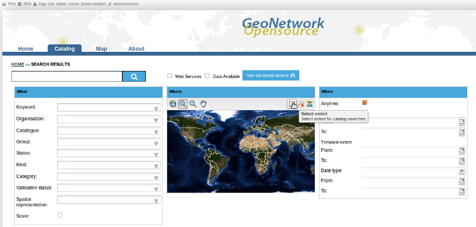
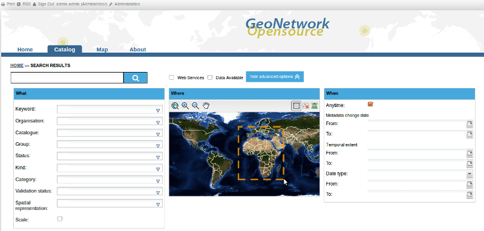

:Author: GeoNetwork Community
:Version: osgeo-live4.5draft
:License: Creative Commons Attribution-ShareAlike 3.0 Unported  (CC BY-SA 3.0)
:Thanks: GeoNetwork Community 

.. |GN| replace:: GeoNetwork

.. _geonetwork-quickstart:
 
.. figure:: ../../images/project_logos/logo-GeoNetwork.png
  :alt: project logo
  :align: right

*********************
GeoNetwork Quickstart 
*********************

|GN| opensource ist ein aus Standards basierendes, verteiltes räumliches Informationsmanagementsystem. Es wurde entwickeltet um Zugriff aus Geodaten von verschiedenen Quellen durch Metadaten zu ermöglichen.

Diese Anleitung beschreibt die Einrichtung von |GN|, und zusätzlich:

- Möglichkeiten nach Metadaten zu suchen
- Wie Daten heruntergeladen und angeschaut werden können
- Das Rechtemanagementsystem, Rollen und Nutzergruppen.

Eine ausführliche Anleitung kann unter http://localhost:8880/geonetwork/docs/eng/users/index.html gefunden werden. Sie können auch den 'Hilfe' Link auf der |GN| Webseite anklicken.

Start |GN|
----------

- Wählen Sie "Start GeoNetwork" Icon.
- Die Anwendung braucht ein paar Minuten zum starten
- Gehen Sie zur |GN| Webseite http://localhost:8080/geonetwork. Ihr erster Besuch |GN| sollte wie der Screenshot unten aussehen.

.. figure:: ../../images/screenshots/800x600/geonetwork-firstviews.png

- Um |GN| kennenzulernen laden wir die Beispielmetadaten. Melden Sie sich mit dem Nutzer *admin* und Passwort *admin* oben rechts an.

.. figure:: ../../images/screenshots/800x600/geonetwork-login.png

- Sie sollten nun einen *Administration* Menüpunkt im Banner vorfinden. Klicken Sie auf diesen.

.. figure:: ../../images/screenshots/800x600/geonetwork-administration-banner.png

- Gehen Sie zum Ende der Seite und klicken Sie auf den 'Add sample metadata' button.

.. figure:: ../../images/screenshots/800x600/geonetwork-addsampledatabutton.png

- Gehen Sie zurück auf die Startseite, um mit der Quickstartanleitung fortzufahren. sie sollten nun folgende Ansicht erhalten.

.. figure:: ../../images/screenshots/800x600/geonetwork-returntohomepage.png

Suchen
------

Es gibt viele verschiedene den Katalog nach Karten und anderen Geodaten zu durchsuchen. Diese Anleitung gibt Ihnen eine Einleitung in die einfache, erweiterte Suche und in die Suche an Hand von Kategorien. Welche Suchmöglichkeit Sie auch wählen, die Suchergebnisse basieren immer auf den Rechten, die Ihnen zugewiesen sind (dazu später mehr).

.. note:: 
	Der Begriff *Daten* bezieht sich auf Datensets, Karten, Tabellen, Dokumente, etc, also alles was mit dem Metadatensatz verbunden ist und durch diesen beschrieben wird.

Einfache Suche
--------------

Die einfache Suche erlaubt Ihnen einen Begriff im gesamten Metadatendokument zu suchen, wie Schlüsselwörter von Metadaten..

**Freitext Suche.** Geben Sie einen Suchbegriff in dcas Feld *Was?* ein. Sie können hier alles eingeben
(Freitext). Sie können Anführungszeichen um Text setzen, um exakte Kombinationen zu finden.

Text und Operatoren (and, or, not) sind nicht case sensitive. 

.. figure:: ../../images/screenshots/800x600/geonetwork-what.png

  *Das Freitext Feld.*
	
**Geographische Suche.** Für die geographische Suche sind zwei Optionen verfügbar, um eine Region zu wählen und die Suche auf diese Region zu beschränken:

Sie können eine **Region** von einer vordefinierten Liste wählen;

  
  *Das Regionsfeld*

Sie können eine Auswahl über drag and drop über die Karte wählen. Klicken Sie dazu den Button in der rechten oberen Ecke des Kartenviewers.

  
  *Interaktive Karte zum wählen einer Region*

**Suche starten.** Beide Optionen der Suche, Freitext Suche und Geographische Suche können kombiniert werden.

Klicken Sie den *Suche* Button um die Suche zu starten und sich die Ergebnisse anzeigen zu lassen.

.. figure:: ../../images/screenshots/800x600/geonetwork-search_button.png

  *Der Suchbutton*

Suchen an Hand von Kategorien
-----------------------------

Ein anderer Weg um Daten zu suchen ist die Suche an Hand von **Kategorien**. Eine Liste von Kategorien wird dem Nutzer präsentiert: **Applikationen**, **Audio/Video**, **Fallstudien**, **Konferenz Ergebnisse**, **Datensets**, **Verzeichnisse**, **Interaktive Resourcen**, **Karten und Grafiken**, **Andere Resourcen**, **Photo**.

Wenn Sie nur nach Karten suchen, klicken Sie auf **Maps and Graphics**. Eine Liste aller Karten wird Ihnen angezeigt, von denen Sie sich auch die Details ansehen können: Klicken Sie nur auf den **Metadaten**-Button der Karte, die Sie sehen wollen.

.. figure:: ../../images/screenshots/800x600/geonetwork-Categories.png

  *Suche an Hand von Kategorien*
  
Erweiterte Suche
----------------

Die Optionen der erweiterten Suche funktionieren ähnlich der einfachen Suche. Sie können hier nur spezifischere Einschränkunen in den Suchparametern definieren. Dies folgt dem Muster: *Was?, Wo?, Wann?*

.. figure:: ../../images/screenshots/800x600/geonetwork-advanced_search1.png

  *Optionen der erweiterten Suche*

Um die **erweiterte Suche** zu starten, klicken Sie auf der Startseite auf **erweitert** direkt unter dem Suche-Button.

.. figure:: ../../images/screenshots/800x600/geonetwork-advanced_search_button.png

  *Zeige erweiterte Suchoptionen*

In der **WAS?** Sektion sind alle Elemente mit den Daten verbunden. In Erweiterung zur einfachen Suche können Sie hier nicht nur nach Schlüsselwörten im kompletten Metadatensatz suchen, sondern auch direkt nach Titel, Kurzzusammenfassung und Schlüsselwörtern. Sie können zusätzlich die Suchgenauigkeit definieren.

- Um nach **Titel, Kurzzusammenfassung, Freitext, oder Schlüsselwörtern** zu suchen, geben Sie in dem entsprechenden Feld(ern) den/die Suchbegriff(e) ein. Sie können in beliebigen Feldern Text eintragen. Sie können Felder auch leer lassen;

.. figure:: ../../images/screenshots/800x600/geonetwork-advanced_search_what.png

  *"Was" Sektion in der erweiterten Suche*

Die **WO?** Parameter, beziehen sich auf den räumlichen Extent, und erlauben Ihnen, wie in der einfachen Suche, die Auswahl einer Region über drag&drop oder über eine vordefinierten Region über eine Auswahlbox.

.. figure:: ../../images/screenshots/800x600/geonetwork-advanced_search_where.png

  *"Wo" Sektion in der erweiterten Suche*

Was für Typen von Metadaten Sie auch suchen, in dem Feld **räumliche Auswahltyp** können Sie aus folgenden Optionen wählen: **ist genau**, **anfügen**, **ist enthalten**, **ist komplett außerhalb von**.

Die **WANN?** Sektion gibt Ihnen die Möglichkeit die Suche um die zeitliche Dimension einzuschränken, Sie können zwischen Erstellungsdatum und Publikationsdatum wählen.

.. figure:: ../../images/screenshots/800x600/geonetwork-advanced_search_when.png

  *"Wann" Sektion in der erweiterten Suche*

Als letztes erlaubt die erweiterte Suche die Einschränkung durch weitere Parameter, wie Datenquelle, Datenkategorie und Datenformat.

sie können auch die Anzahl der Ergebnisse pro Seite spezifizieren.

- Klicken Sie zum Schluss den **Suche** Button.

.. figure:: ../../images/screenshots/800x600/geonetwork-advanced_search_morerest.png

  *Weitere Optionen in der erweiterten Suche*

Suchergebnisse
--------------

Sie erhalten nach Abschicken der Suche eine Liste der Metadatensätze, die auf Ihre Suchanfrage passt. Für jeden Datensatz sehen Sie den Titel, die Kurzzusammenfassung und die Schlüsselwörter. Je nach Privilegien werden maximal 4 Sektionen angezeigt (siehe unten).

.. figure:: ../../images/screenshots/800x600/geonetwork-search_output2.png

    *Suchergebnisse*

#. **Metadaten**: Die Metadatensektion beschreibt den Datesatz.

#. **Download**: Je nach Zugriffsrecht und Datensatz erlaubt Ihn dieser Button die Daten herunterzuladen.

.. figure:: ../../images/screenshots/800x600/geonetwork-search_output1.png
    
        *Ein einzelnes Suchergebniss*
    
.. figure:: ../../images/screenshots/800x600/geonetwork-download.png
    
        *Verfügbare Services zu diesem Datensatz*

#. **Interaktive Karte**: Der Kartenservice ist opional. Mit Klick auf diesen Button, wird der Datensatz dem Kartenviewer hizugefügt. UM den Datensatz besser sehen zu können, klicken Sie auf **Zeige Karte** oben auf der Seite.

.. figure:: ../../images/screenshots/800x600/geonetwork-interactive_map.png
    
        *Der interaktive Kartenviewer*

#. **Graphik Überblick**: Es gibt kleine und große Übersichten. Klicken Sie auf die kleine Übersicht, um eine große Übersicht zu erhalten.

.. figure:: ../../images/screenshots/800x600/geonetwork-thumbnail.png
    
        *großes Übersichtsbild*

Privilegien, Rollen und Nutzergruppen
-------------------------------------

|GN| nutzt ein System von *Privilegien*, *Rollen* und *Nutzergruppen*.

Es gibt keine Restriktionen für Nutzer beim Zugriff auf **öffenltiche Information** in |GN| opensource. Um auf **zugriffsbeschränkte Informationen** und erweitertet Funktionalitäten zugreifen zu können, wir ein Account benötigt. Dieser wird Ihnen durch den Administrator bereitgestellt.

.. figure:: ../../images/screenshots/800x600/geonetwork-login.png

    *Login*

Weitere Informationen
---------------------

Klicken Sie auf den 'Hilfe' Link im Banner von GeoNetwork oder direkt über diesen Link: http://localhost:8880/geonetwork/docs/deu/users/index.html

