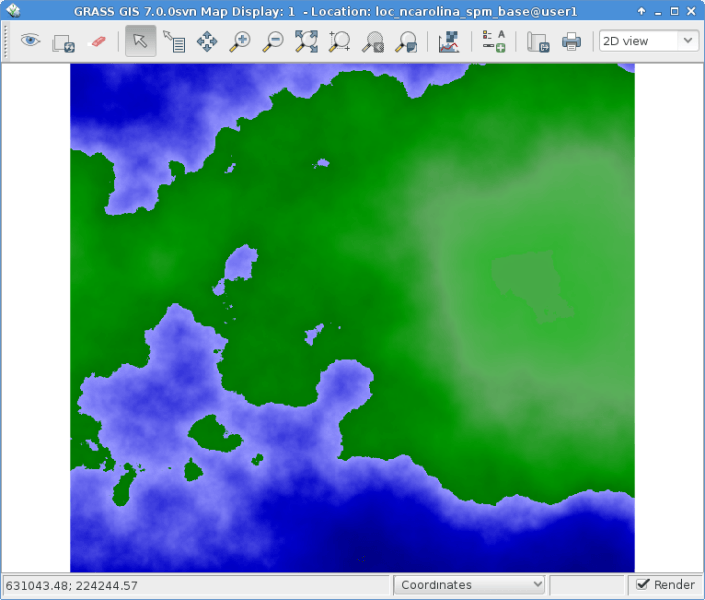

:Author: Hamish Bowman
:Version: osgeo-live4.0
:License: Creative Commons Attribution-ShareAlike 3.0 Unported  (CC BY-SA 3.0)
Copyright: (c) 2011 by The OSGeo Foundation

.. image:: ../../images/project_logos/logo-GRASS.png
  :scale: 100 %
  :alt: project logo
  :align: right
  :target: http://grass.osgeo.org

********************************************************************************
GRASS GIS Quickstart 
********************************************************************************

Ablauf
================================================================================

Um GRASS auf der Live DVD zu starten, klicken Sie auf den GRASS Link auf
dem Desktop. Im "Welcome to GRASS" Fenster wählen Sie entweder den Spearfish 
oder North Carolina (nc_spm_08) Datensatz als Location, und "user1" als Mapset,
dann klicken Sie auf [Start Grass].

.. image:: ../../images/screenshots/800x600/grass-startup.png
  :scale: 40 %
  :alt: screenshot
  :align: right

Dies started GRASS mit der neuen wxPython Benutzeroberfläche (GUI). Zum 
aktuellen Zeitpunkt können wir zum ersten Mal sagen, dass die GUI in der 
Version GRASS 6.4.0 komplett und nutzbar ist. Die alte Tcl/Tk GUI ist 
noch vorhanden und wenn Sie diese lieber benutzen, können Sie das in dem 
Sie das Kommando ``g.gui --ui`` in die Kommandozeile tippen.

Wenn Sie auf einem Netbook mit kleinem Display (800x600 Auflösung) arbeiten, 
kann der Startbildschirm zu groß und der [Start GRASS] Knopf eventuell 
versteckt sein. In diesem Fall sollten Sie das Fenster an einer Ecke etwas 
größer ziehen. Oder Sie können das gesamte Fenster weiter nach oben schieben, 
in dem Sie die Alt-Taste gedrückt halten und dann das Fenster mit der 
linken Maustaste verschieben. 

Karten anzeigen
~~~~~~~~~~~~~~~~~~~~~~~~~~~~~~~~~~~~~~~~~~~~~~~~~~~~~~~~~~~~~~~~~~~~~~~~~~~~~~~~

.. image:: ../../images/screenshots/800x600/grass-layerman.png
  :scale: 50 %
  :alt: screenshot
  :align: left

Einmal drinnen, laden Sie eine Rasterkarte, z.B.: "`elevation`" aus der 
PERMANENT Mapset. Dazu klicken Sie in der Werkzeugleite auf das erste 
Icon mit einem "+", um eine Rasterkarte zu öffnen. Dann wählen Sie eine 
Karte in dem "*Name der Rasterkarte, die angezeigt werden soll*" Pulldown 
Menü aus und klicken auf [Ok].

Auf ähnliche Weise laden Sie die Vektorkarte "`roads`" aus der PERMANENT 
Mapset, indem Sie in der Werkzeugleite auf das zweite Icon mit einem "+" 
klicken, um eine Vektorkarte zu öffnen.

Im Map Display Fenster klicken Sie nun auf das Augen Icon, um die Karten 
anzuzeigen.

Sie sollten nun die beiden Karten im Kartenfenster sehen.

Ein Höhenprofil erstellen
~~~~~~~~~~~~~~~~~~~~~~~~~~~~~~~~~~~~~~~~~~~~~~~~~~~~~~~~~~~~~~~~~~~~~~~~~~~~~~~~

.. image:: ../../images/screenshots/800x600/grass-profile.png
  :scale: 50 %
  :alt: screenshot
  :align: right

Zurück im GIS Ebenen-Manager klicken Sie auf den Namen `elevation` der 
Rasterkarte, um sie auszuwählen. Im Map Display Fenster klicken Sie dann 
rechts neben den Zoom Icons auf das Symbol mit der roten Profillinie und 
wählen die Funktion ** Zu profilierende Oberflächenkarte ** aus. Falls 
die Karte `elevation` nicht direkt in dem Fenster Profilanalyse angezeigt 
wird, wählen Sie sie bitte aus und klicken auf [Ok]. Das zweite Icon von 
Links ermöglicht das Erstellen eines Profils. Wählen Sie es aus, und 
klicken Sie ein paar mal auf die Karte im Map Display. Danach gehen Sie 
zurück in das Fenster der Profilanalyse und klicken dort auf das Augen 
Icon, um das Profil anzuzeigen. Um die Analyse zu beenden, klicken Sie 
den `Beenden` Knopf ganz rechts.

Erstellen einer zufälligen Oberfläche
~~~~~~~~~~~~~~~~~~~~~~~~~~~~~~~~~~~~~~~~~~~~~~~~~~~~~~~~~~~~~~~~~~~~~~~~~~~~~~~~

Nun erstellen wir eine neue Karte. Wählen Sie :menuselection:`Raster --> 
Erzeuge Oberflächen --> Fraktale Oberfläche` aus dem Menü (fast ganz unten);
geben Sie der neuen Karte einen Namen; passen Sie Parameter im Optionen 
Reiter an, wenn Sie wollen (die Standards sind aber bereits ok), und klicken 
Sie dann auf [Los]. Sie können nun das Fenster des *r.surf.fractal* Moduls 
schließen mit dem Knopf [Schließen].

Farben anpassen
~~~~~~~~~~~~~~~~~~~~~~~~~~~~~~~~~~~~~~~~~~~~~~~~~~~~~~~~~~~~~~~~~~~~~~~~~~~~~~~~

Nun fügen Sie die neue Rasterkarte zur Kartenliste hinzu, wie Sie es 
bereits mit der Karte elevation gemacht haben. Die Karte liegt nun aber 
in der Mapset "user1". Sie können nun auch die Anzeige der Karte elevation 
über das Kontrollkästchen deaktivieren. Klicken Sie wieder auf das Augen 
Icon, um die neue Rasterkarte anzuzeigen.
Die Farben sind vielleicht nicht so, wie sie wollen, also ändern wir sie. 
Wählen Sie die neu erstellte Rasterkarte wieder aus und öffnen dann im 
Menü `Raster` :menuselection:`Farben verwalten --> Farbtabellen` aus. 
Im Reiter Farben wählen Sie als "Farbtabellentyp" z.B.: die Tabelle 
"srtm" aus. Klicken Sie auf den [Los] Knopf und schließen Sie den 
*r.colors* Dialog.

Da Sie die Metadaten der Karte verändert haben, müssen Sie dieses Mal 
auf den Knopf "Karte neu anzeigen" rechts neben dem Augen Icon. Dadurch 
wird der Display Cache komplett neu aufgebaut. Sie sollten die Karte nun 
in der neuen Farbdarstellung sehen.
  
Erstellen einer Reliefschattierung
~~~~~~~~~~~~~~~~~~~~~~~~~~~~~~~~~~~~~~~~~~~~~~~~~~~~~~~~~~~~~~~~~~~~~~~~~~~~~~~~

.. image:: ../../images/screenshots/800x600/grass-shadedrelief.png
  :scale: 50 %
  :alt: screenshot
  :align: right

Als nächstes wollen wir aus der Karte elevation eine Karte mit 
Reliefschattierung erstellen. Als erstes stellen wir sicher, dass 
die "region" auf die Rasterkarte "`elevation`" in der PERMANENT 
Mapset gesetzt ist. Dazu wählen wir die Karte in der Layerliste aus,
drücken mit der rechten Maustaste auf den Namen und wählen dann 
"Arbeitsbereich auf Grundlage selektierter Karte setzen". Im Menü 
`Raster` wählen wir nun :menuselection:`Reliefanalyse --> 
Reliefschattierung` und starten den Dialog. Mit der Karte elevation 
als Eingabe klicken Sie bitte auf [Los]. Nun laden Sie die neue Karte 
elevation.shade aus der Mapset user1 in die Layerliste, deaktivieren 
die Kontrollkästchen der anderen Karten und klicken auf das Augen 
Icon im Map Display Fenster. (Wenn Sie nicht ständig auf das Augen 
Icon klicken wollen, können Sie auch das "Render" Kontrollkästchen 
unten rechts im Fenster auswählen, damit es automatisch geschieht).

Wassereinzugsgebiete und Flüsse
~~~~~~~~~~~~~~~~~~~~~~~~~~~~~~~~~~~~~~~~~~~~~~~~~~~~~~~~~~~~~~~~~~~~~~~~~~~~~~~~

Wieder selektieren wir die Karte `elevation` @PERMANENT und wählen 
im Menü Raster :menuselection:`Hydrologische Modellierung --> 
Wassereinzugsgebiet Analyse`. Der ``r.watershed`` Dialog öffnet sich. 
Wählen Sie die `elevation` Karte als Eingabe, im Reiter 'Eingabe 
Optionen' setzen sie *threshold* Wert auf 10000 Zellen, dann im 
Reiter 'Ausgabe Optionen' geben Sie "elev.basins" als basin Option 
und "elev.streams" für die stream Option direkt darunter an. 
Dann klicken Sie auf [Los].

Zurück im Ebenen-Manager fügen Sie die neuen Karten wieder in die 
Layerliste ein, und stellen sicher, dass nur sie für die Anzeige 
ausgewählt sind. Mit der rechten Maustaste klicken Sie auf 
"Deckkraft ändern". Setzen Sie den Wert auf 50% und rendern Sie 
die Karte nochmal.

.. image:: ../../images/screenshots/800x600/grass-watersheds.png
  :scale: 50 %
  :alt: screenshot
  :align: left

Im Ebenen-Manager klicken Sie auf den fünften Knopf von rechts, um 
eine Ebene mit Gitternetz hinzuzufügen. Als size Wert geben Sie 0:03 
für 0 Grad und 3 Minuten an. Das Format ist D:M:S. Im Reiter 
"Optional" aktivieren Sie "Zeichnen Sie geographisches Gitter 
basierend auf dem aktuellen Ellipsoid", klicken Sie auf [Los] und 
rendern Sie die Karten nochmal.

Um eine Maßstabsleiste anzuzeigen, klicken Sie im Map Display Fenster 
auf das Icon "Kartenelemente hinzufügen" und klicken auf Nordpfeil und 
Maßstab hinzufügen. Lesen Sie die Instruktionen und klicken dann auf 
[Ok]. Eine Maßstabsleiste erscheint oben links, ziehen Sie sie in die 
linke untere Ecke. Aus demselben Menü wählen Sie nun "Legende 
hinzufügen", wählen die Rasterkarte aus, für die eine Legende erstellt 
werden soll. Danach klicken Sie [Ok] und dann nochmal [Ok]. Ziehen Sie 
nun die Legende auf die rechte Seite des Map Displays.

Wenn Ihnen die Schriftarten nicht gefallen, können Sie im GIS 
Ebenen-Manager das Menü :menuselection:`Einstellungen  --> 
Einstellungen` öffnen und im Reiter Fenster Schriftarten auswählen 
und auf den Knopf [Anwenden] klicken. Sie müssen wieder auf den Knopf 
"Karte neu anzeigen" rechts neben dem Augen Icon klicken, damit die 
Veränderung sichtbar wird.

Vektor Module
~~~~~~~~~~~~~~~~~~~~~~~~~~~~~~~~~~~~~~~~~~~~~~~~~~~~~~~~~~~~~~~~~~~~~~~~~~~~~~~~

Die Aufgaben haben nur einige Rasteranalysen vorgestellt. GRASS bietet 
aber auch eine Vielzahl von Vektor Modulen, die genauso umfangreich 
sind wie für die Rasteranalyse. GRASS bietet eine topologische 
Vektorumgebung.

3D Visualisierung
~~~~~~~~~~~~~~~~~~~~~~~~~~~~~~~~~~~~~~~~~~~~~~~~~~~~~~~~~~~~~~~~~~~~~~~~~~~~~~~~

.. image:: ../../images/screenshots/1024x768/grass-nviz.png
  :scale: 30 %
  :alt: screenshot
  :align: right

Starten Sie die 3D Visualisierung über das Menü :menuselection:`Datei 
--> NVIZ (erfordert TclTk)`. Wählen Sie die Karte `elevation` als 
Raster Höhenkarte. Sobald die 3D Ansicht gestartet wird, vergrößern Sie 
das Fenster. Nun wählen Sie im Menü `Visualize --> Raster Oberflächen`, 
setzen die fein Auflösung auf "1" und spielen Sie ein wenig mit den 
Schiebereglern und dem Positionspfeil, um unterschiedliche Ansichten 
zu erzeugen.

Um Satelliten- oder Luftbilder über das Höhenmodell zu legen, klicken 
Sie auf den Knopf **Oberflächenattribute** und wählen dort color aus. 
Klicken Sie in dem neuen Dialog auf "Neue Karte" und wählen dann eine 
Karte aus, die für die Farbdarstellung verwendet werden soll. Im 
Spearfish Datensatz ist "`spot.image`" und im North Carolina Datensatz 
"`lsat7_2002_50`" eine gute Wahl. Klicken Sie nun auf "Annehmen" und 
zurück im Hauptfenster auf den Knopf "Zeichne" in der oberen linken 
Ecke.

Beenden und die Kommandozeile
~~~~~~~~~~~~~~~~~~~~~~~~~~~~~~~~~~~~~~~~~~~~~~~~~~~~~~~~~~~~~~~~~~~~~~~~~~~~~~~~

Wenn Sie GRASS beenden möchten, wählen Sie im GRASS GUI 
:menuselection:`Datei --> GUI Schließen`. Bevor Sie auch das GRASS 
Kommandofenster schliessen, versuchen Sie mal ein Modul über die 
Kommandozeile zu starten, in dem Sie eingeben "``g.manual --help``". 
Sie bekommen nun eine Liste von Optionen angezeigt. In der Kommandozeile 
hat GRASS seine wahren Stärken. All Kommandos können in Skripten zu 
umfangreichen Prozessketten zusammengefasst werden. Populäre Sprachen 
sind Bourne Shell and Python, die einige nette Tricks parat haben, um 
das Skripten zu vereinfachen. Damit können Sie in weniger als 5 Minuten 
ein neues GRASS Modul schreiben, inklusive Parser, GUI und Hilfeseiten 
Template.

"``g.manual -i``" startet einen Webbrowser mit den Modul Hilfeseiten. 
Am Ende schliessen Sie den Browser und tippen "exit" in das GRASS 
Terminal, um die GRASS GIS Umgebung zu verlassen.

Weiterführende Links
================================================================================

* Besuchen Sie die GRASS Webseite unter `http://grass.osgeo.org <http://grass.osgeo.org>`_
* Besuchen Sie die GRASS Wiki Hilfeseiten unter `http://grass.osgeo.org/wiki <http://grass.osgeo.org/wiki>`_
* Mehr Tutorials und Übersichten finden Sie unter <http://grass.osgeo.org/wiki/GRASS_Help#Getting_Started>`_.
* Eine `Synopsis der GRASS Module' <http://grass.osgeo.org/gdp/grassmanuals/grass64_module_list.pdf>`_, inklusive
  GUI Menü Position. (`HTML version <http://grass.osgeo.org/gdp/grassmanuals/grass64_module_list.html>`_)
* Wenn die 400 GIS Module in GRASS nicht ausreichen, werfen Sie mal einen Blick auf die vielen add-ons 
  unter `http://grass.osgeo.org/wiki/AddOns <http://grass.osgeo.org/wiki/AddOns>`_
