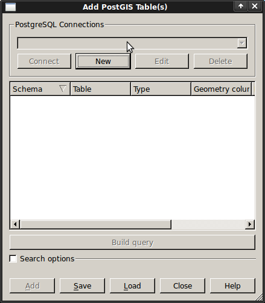
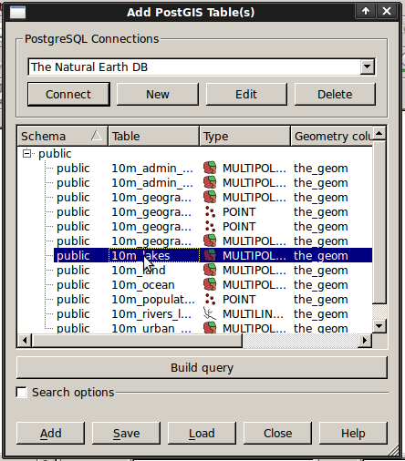
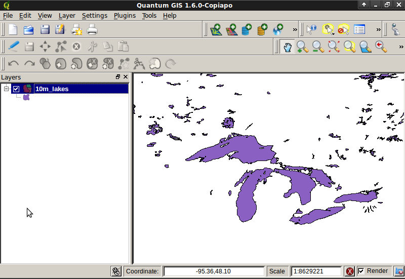
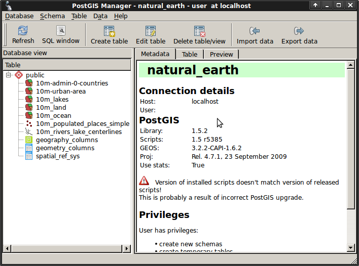
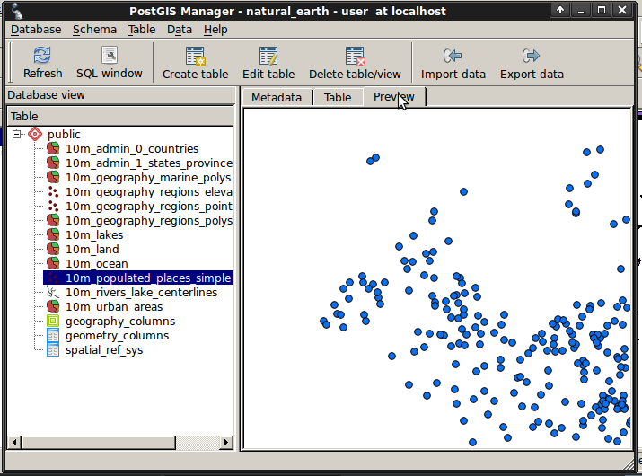
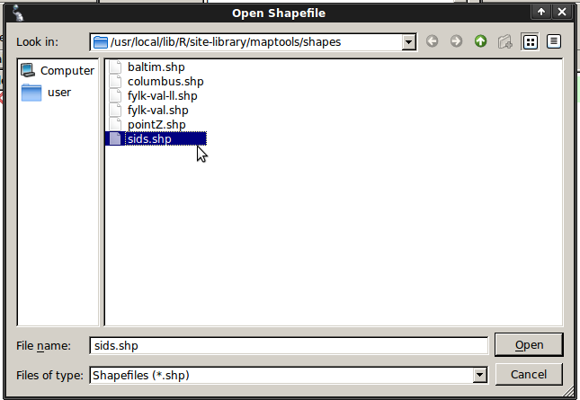
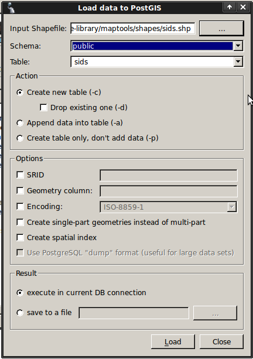
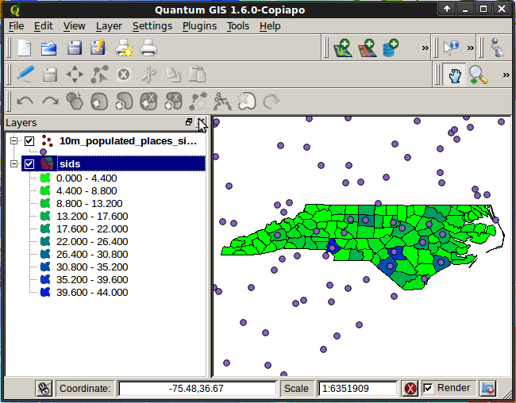

:Author: Barry Rowlingson
:Author: Astrid Emde
:Author: Cameron Shorter
:Version: osgeo-live5.0
:License: Creative Commons

.. _postgis_quickstart-de:
 
.. image:: ../../images/project_logos/logo-PostGIS.png
  :scale: 30 %
  :alt: project logo
  :align: right
  :target: http://postgis.org/

********************************************************************************
PostGIS Quickstart
********************************************************************************

PostGIS ist die räumliche Erweiterung der relationalen Datenbank PostgreSQL. PostGIS ermöglicht die Speicherung, Abfrage und Bearbeitung von räumlichen Daten. In diesem Zusammenhang werden wir 'PostgreSQL' verwenden, wenn wir über generelle Datenbankfunktionen sprechen und 'PostGIS', wenn wir über die zusätzlichen Funktionalitäten, die die Erweiterung bereitstellt,  reden. 

Client-Server Architektur
================================================================================

PostgreSQL arbeitet wie viele Datenbanksysteme als Server in einem Client-Server-System.
Dabei stellt der Client die Anfragen an den Server und bekommt vom Server eine Antwort zurück.
Auf die selbe Art kommuniziert auch das Internet - der Browser ist der Client, der die Anfrage stellt, und ein WebServer sendet die angefragte Webseite zurück.
PostgreSQL sendet die Anfragen in der Sprache SQL und die Antwort ist in der Regel eine Tabelle mit Daten aus der Datenbank.

Es spricht nichts dagegen, den Server auf dem selben Computer wie den Client zu nutzen. 
Dies ermöglicht es Ihnen, PostgreSQL auf einer einzigen Maschine laufen zu lassen.
Ihr Client verbindet sich mit dem Server über die interne 'loopback' Network Verbindung und ist für andere Rechner nicht sichtbar
außer Sie konfigurieren dies.

Erzeugen einer Räumlichen Datenbank
================================================================================

.. review comment: Suggest providing a screen grab (or 2) which shows how to select
   and open an xterm. Cameron

Ein einziger PostgreSQL Server ermöglicht es Ihnen, Ihre Arbeit in unterschiedlichen Datenbanken zu organisieren.
Jede Datenbank ist dabei ein unabhängiges System, mit eigenen Tabellen, Sichten, Benutzern und so weiter.
Wenn Sie sich mit einem PostgreSQL Server verbinden wollen, müssen Sie die gewünschte Datenbank angeben.

Sie können eine Liste der Datenbanken des Datenbankservers über den Aufruf ``psql -l`` ausgeben lassen.
Über den Aufruf sollten in unserem Fall diverse Datenbanken aufgelistet werden, die von den OSGeo-Live Projekten auf dem System verwendet werden. 
Wir werden in dieser Übung eine neue Datenbank anlegen.

.. tip:: Die Liste verwendet den Standard UNIX Pager - über die Leertaste gelangen Sie zur nächsten Seite, über b gehen Sie zurück, über q verlassen Sie die Liste, über h gelangen Sie zur Hilfe.

PostgreSQL verfügt über das Hilfprogramm ``createdb`` zum Erstellen von Datenbanken. 
Wir wollen eine Datenbank mit PostGIS Erweiterung erzeugen. Die PostGIS Erweiterung können wir aus der Vorlage  ``template_postgis`` laden. Beim Erzeugen der Datenbank geben wir die Vorlage über die Option ``-T`` an. 
Unsere Datenbank soll ``demo`` heißen. Der Aufruf zum Erstellen der Datenbank lautet:

::

   createdb -T template_postgis demo

.. tip:: Eine Hilfe zu kommandozeilen basierten Programmen erhalten Sie in der Regel über die Option ``--help``.

Wenn Sie nun wieder die Liste der Datenbanken über ``psql -l`` ausgeben, sollten Sie Ihre Datenbank ``demo`` in der Liste finden.

Sie können PostGIS Datenbanken auch direkt über einen SQL Befehl erzeugen. Zuerst wollen wir die gerade angelegte Datenbank
über das Hilfsprogramm ``dropdb`` löschen. Anschließend soll ``psql`` zur Ausführung von SQL-Befehlen verwendet werden:

:: 

  dropdb demo
  psql -d postgres
 
Der Aufruf stellt eine Verbindung zur Datenbank mit dem Namen ``postgres`` her. ``postgres`` ist eine Systemdatenbank, die auf jedem Datenbankserver vorliegen sollte. Setzen Sie nun das SQL ab, um eine Datenbank anzulegen:

:: 

 postgres=# CREATE DATABASE demo TEMPLATE=template_postgis;

Die Datenbank wurde angelegt und Sie können sich nun mit der Datenbank ``demo`` verbinden.
Zukünftig können Sie sich direkt über ``psql -d demo`` mit Ihrer Datenbank verbinden, an dieser Stelle
können Sie aber auch direkt innerhalb von ``psql`` eine Verbindung zu einer anderen Datenbank aufbauen:

::

 postgres=# \c demo

.. tip:: Wenn die psql Eingabe auch nach dem Drücken der Return Taste erscheint, können Sie über Ctrl-C Ihre Eingabe löschen und von Neuem beginnen. Es kann sein, dass psql auf ein schließendes Anführungszeichen, ein Semikolon oder ein anderes Zeichen wartet.

Sie sollten eine Meldung sehen, die Eingabe wechselt und zeigt an, dass Sie mit der Datenbank ``demo`` verbunden sind. 
Über ``\dt`` können Sie dies prüfen und die Liste der Tabellen in der Datenbank ausgeben lassen.
Es sollte diese Ausgabe erfolgen:

::

  demo=# \dt
               List of relations
   Schema |       Name       | Type  | Owner 
  --------+------------------+-------+-------
   public | geometry_columns | table | user
   public | spatial_ref_sys  | table | user
  (2 rows)

Diese zwei Tabellen werden von PostGIS angelegt und verwendet. Die Tabelle ``spatial_ref_sys`` speichert Informationen zu den Koordinatenreferenzsystemen. Mit Hilfe von SQL können wir einen Blick in die Tabelle werfen:

::

  demo=# SELECT srid, auth_name, proj4text FROM spatial_ref_sys LIMIT 10;

   srid | auth_name |          proj4text                                            
  ------+-----------+--------------------------------------
   3819 | EPSG      | +proj=longlat +ellps=bessel +towgs...
   3821 | EPSG      | +proj=longlat +ellps=aust_SA +no_d...
   3824 | EPSG      | +proj=longlat +ellps=GRS80 +towgs8...
   3889 | EPSG      | +proj=longlat +ellps=GRS80 +towgs8...
   3906 | EPSG      | +proj=longlat +ellps=bessel +no_de...
   4001 | EPSG      | +proj=longlat +ellps=airy +no_defs...
   4002 | EPSG      | +proj=longlat +a=6377340.189 +b=63...
   4003 | EPSG      | +proj=longlat +ellps=aust_SA +no_d...
   4004 | EPSG      | +proj=longlat +ellps=bessel +no_de...
   4005 | EPSG      | +proj=longlat +a=6377492.018 +b=63...
  (10 rows)

Die Ausgabe bestätigt, dass wir eine Datenbank mit räumlicher Erweiterung vorliegen haben. Die Tabelle ``geometry_columns`` ist eine Metadatentabelle und beinhaltet Informationen zu den Tabellen mit räumlicher Erweiterung. Hierzu erfahren Sie mehr im nächsten Abschnitt.

Erzeugen einer Tabelle mit räumlicher Erweiterung - die harte Tour
================================================================================

Wir haben nun eine Datenbank mit räumlicher Erweiterung vorliegen und können daher eine Tabelle mit räumlichen Daten erzeugen.

Zuerst erzeugen wir eine gewöhnliche Tabelle, in der wir einige Daten über Städte speichern wollen.
Diese Tabelle hat zwei Spalten - ein numerisches Feld id für die laufende Nummer und ein Feld für den Namen der Stadt:

::

  demo=# CREATE TABLE cities ( id int4, name varchar(50) );

Als Nächstes fügen wir eine Geometriespalte hinzu, um in dieser Spalte die Lage der Stadt zu speichern.
In der Regel wird diese Spalte ``the_geom`` genannt. 
Der folgende Aufruf gibt an, welcher Geometrietyp angelegt werden soll (Punkte, Linien. Polygone etc), wie viele Dimensionen unterstützt werden sollen (in unserem Falls zwei) und welches Koordinatenreferenzsystem genutzt werden soll.
Wir werden EPSG:4326 für unsere Städte verwenden.

::

  demo=# SELECT AddGeometryColumn ( 'cities', 'the_geom', 4326, 'POINT', 2);

Wenn Sie sich nun die Tabelle cities anschauen, sollten Sie die neue Spalte sehen. Sie sehen ebenfalls, dass die Tabelle derzeit leer ist.

::

  demo=# SELECT * from cities;
   id | name | the_geom 
  ----+------+----------
  (0 rows)

Um die Tabelle zu füllen, nutzen wir einige SQL Aufrufe. Um die Geometrie in die Geometriespalte zu überführen, nutzen
wir die PostGIS Funktion ``ST_GeomFromText``. Diese Funktion benötigt zwei Paramter - die Geometrie als Text und als zweiten Parameter den EPSG-Code:

::

  demo=# INSERT INTO cities (id, the_geom, name) VALUES (1,ST_GeomFromText('POINT(-0.1257 51.508)',4326),'London, England');
  demo=# INSERT INTO cities (id, the_geom, name) VALUES (2,ST_GeomFromText('POINT(-81.233 42.983)',4326),'London, Ontario');
  demo=# INSERT INTO cities (id, the_geom, name) VALUES (3,ST_GeomFromText('POINT(27.91162491 -33.01529)',4326),'East London,SA');

.. tip:: Verwenden Sie die Pfeiltaste, um den Befehl erneut aufzurufen und anzupassen.

Sie werden sehen, dass dieses Vorgehen der Dateneingabe schnell ermüdet. Zum Glück gibt es andere einfachere Wege, um Daten in PostGIS Tabellen zu bekommen. Aber nun haben wir erst einmal drei Städte in unserer Tabelle und können mit diesen arbeiten.

Einfache Abfragen
================================================================================

Alle üblichen SQL Operationen können angewendet werden, um Daten aus einer PostGIS Tabelle abzufragen.

::

 demo=# SELECT * FROM cities;
  id |      name       |                      the_geom                      
 ----+-----------------+----------------------------------------------------
   1 | London, England | 0101000020E6100000BBB88D06F016C0BF1B2FDD2406C14940
   2 | London, Ontario | 0101000020E6100000F4FDD478E94E54C0E7FBA9F1D27D4540
   3 | East London,SA  | 0101000020E610000040AB064060E93B4059FAD005F58140C0
 (3 rows)

Diese Ausgabe gibt uns die hexadezimale Version der Koordinaten aus, die für uns schwer lesbar ist.

Wenn Sie Ihre Geoemetrien wieder im WKT Format ausgeben möchten, können Sie die Funktionen
ST_AsText(the_geom) oder ST_AsEwkt(the_geom) verwenden. Sie können außerdem die Funktionen ST_X(the_geom) und ST_Y(the_geom) 
verwenden, um die Koordinaten auszugeben:

::

 demo=# SELECT id, ST_AsText(the_geom), ST_AsEwkt(the_geom), ST_X(the_geom), ST_Y(the_geom) FROM cities;
  id |          st_astext           |               st_asewkt                |    st_x     |   st_y    
 ----+------------------------------+----------------------------------------+-------------+-----------
   1 | POINT(-0.1257 51.508)        | SRID=4326;POINT(-0.1257 51.508)        |     -0.1257 |    51.508
   2 | POINT(-81.233 42.983)        | SRID=4326;POINT(-81.233 42.983)        |     -81.233 |    42.983
   3 | POINT(27.91162491 -33.01529) | SRID=4326;POINT(27.91162491 -33.01529) | 27.91162491 | -33.01529
 (3 rows)

Räumliche Abfragen
================================================================================

PostGIS erweitert PostgreSQL um zahlreiche räumliche Funktionen.
Die Funktion ST_GeomFromText zur Konvertierung von WKT in eine Geometrie haben wir schon kennen gelernt.
Die meisten Funktionen starten mit ST (Abkürzung für spatial type) und werden 
in der PostGIS Dokumentation sehr gut beschrieben.
Wir werden nun eine PostGIS Funktion zur Beantwortung einer praktischen Frage verwenden. 
Wie weit sind diese 3 Londons voneinander entfernt? Die Ausgabe soll in Metern erfolgen und wir 
gehen von einer sphärischen Erde aus.

::

 demo=# SELECT p1.name,p2.name,ST_Distance_Sphere(p1.the_geom,p2.the_geom) FROM cities AS p1, cities AS p2 WHERE p1.id > p2.id;
       name       |      name       | st_distance_sphere 
 -----------------+-----------------+--------------------
  London, Ontario | London, England |   5875766.85191657
  East London,SA  | London, England |   9789646.96784908
  East London,SA  | London, Ontario |   13892160.9525778
  (3 rows)

Die Abfrage gibt uns die Entfernung in Metern zwischen jedem Städtepaar aus.
Schauen Sie sich die 'WHERE'-Bedingung an. Diese verhindert, dass Städte die Entfernung zu sich selbst ausgeben (diese Entfernung würde 0 sein) oder dass die umgekehrte Distanzberechung ausgegeben wird (London, England nach London, Ontario ist die selbe Entfernung wie London, Ontario nach London, England). Lassen Sie die 'WHERE'-Bedingung weg und schauen Sie sich die Ausgabe an.

Wir können die Distanz unter Verwendung eines Sphäroids auch über eine andere Funktion berechnen und den 
Namen des Sphäroids, die große Halbachse und die inverse Abplattung angeben:

::

  demo=# SELECT p1.name,p2.name,ST_Distance_Spheroid(
          p1.the_geom,p2.the_geom, 'SPHEROID["GRS_1980",6378137,298.257222]'
          ) 
         FROM cities AS p1, cities AS p2 WHERE p1.id > p2.id;
        name       |      name       | st_distance_spheroid 
  -----------------+-----------------+----------------------
   London, Ontario | London, England |     5892413.63776489
   East London,SA  | London, England |     9756842.65711931
   East London,SA  | London, Ontario |     13884149.4140698
  (3 rows)

Mapping
================================================================================

Um eine Karte aus Ihren PostGIS Daten zu erzeugen, brauchen Sie einen Client, der auf die Daten zugreifen kann.
Die meisten der Open Source Desktop GIS Programme unterstützen PostGIS - wie z. B. Quantum GIS, gvSIG, uDig. 
Wir werden unsere Karte mit Quantum GIS erzeugen.

Starten Sie Quantum GIS und wählen Sie ``PostGIS-Layer hinzufügen`` aus dem Layer-Menü. 
Da Sie bisher noch keine Verbindung zu PostGIS aufgebaut haben, werden Sie eine leere Verbindungsliste vorliegen haben.

Über 'Neu' öffnen Sie den Dialog zur Eingabe der Verbindungsinformationen. Wir werden uns mit der Natural Earth Datenbank
der DVD verbinden. Es muss kein Benutzername oder Passwort angegeben werden, da die Sicherheitseinstellungen dieser 
Installation jedem den Zugriff erlauben.
Entfernen Sie den Haken unter 'Auch geometrielose Tabellen anzeigen', sofern dieser gesetzt ist.

.. image:: ../../images/screenshots/1024x768/postgis_naturalearth.png
  :scale: 100 %
  :alt: Verbindungsinformationen zu Natural Earth Datenbank
  :align: center

Klicken Sie den Button ``Verbindung testen``. Wenn der Datenbankzugriff erfolgreich war, wird eine Erfolgsmeldung angezeigt.
Klicken Sie ``OK``, um Ihre Verbindungsinformationen zu speichern. Nun können Sie sich über den Button ``Verbinden`` mit der Datenbank verbinden und bekommen eine Liste der Tabellen mit Geometriespalten der Datenbank angezeigt:

Wählen Sie das Thema lakes (Seen) und klicken Sie ``Hinzufügen`` (nicht ``Abfrage erstellen``). 
Die Daten sollten nun in QGIS geladen werden:

Sie sollten eine Karte der Seen sehen. QGIS weiß nicht, dass es sich um Seen handelt und zeigt die Flächen 
möglicherweise nicht blau an. Nutzen Sie die QGIS Dokumentation, um herauszufinden, wie die Farbe angepasst werden kann.
Navigieren Sie in die bekannte Seengruppe von Kanada.

Erzeugen einer Tabelle mit räumlicher Erweiterung - der einfache Weg
================================================================================

Die meisten OSGeo Desktop GIS Tools bieten Schnittstellen zum Import von räumlichen Daten nach PostGIS, beispielsweise Shape Dateien. Wir wollen wieder Quantum GIS zur Demonstration nutzen.

Der Import kann über das komfortable PostGIS Manager Plugin erfolgen. Das Plugin muss aktiviert werden. Dies erfolgt
über ``Erweiterungen - Erweiterungen verwalten``. Suchen Sie nach ``PostGIS Manager``, wählen Sie das Plugin aus und klicken Sie ok. Sie sollten den PostGIS Manager nun im Menü finden und können ihn starten.

Das Plugin verwendet die vorher eingegebenen Daten zur Verbindung mit der Natural Earth Datenbank. Lassen Sie das Passwort-Feld 
leer, falls Sie danach gefragt werden. Sie werden das Hauptfenster sehen.

Sie können die anderen Reiter im rechten Bereich nutzen, um die Attribute des Thema auszuwählen und erhalten eine
einfache Karte mit Navigationsmöglichkeiten. Hier habe ich das Thema populated places ausgewählt und 
bin zu einer kleinen Insel, die ich kenne gezoomt:

Nun wollen wir den PostGIS Manager zum Import von Shape in die Datenbank nutzen. Wir werden 
die Daten `North Carolina sudden infant death syndrome (SIDS)` nutzen, die in einem der R Statistikpakete enthalten sind.

Wählen Sie über das Menü ``Data`` die Option ``Load data from shapefile``.
Klicken Sie den Button ``...`` und wählen Sie die Shapedatei ``sids.shp`` in dem R ``Maptools`` Paket aus:

Belassen Sie die übrigen Angaben und klicken Sie ``Load``

Die Shapedatei sollte ohne Fehler nach PostGIS importiert worden sein. Schließen Sie den PostGIS Manager und 
gehen Sie zurück in das QGIS Hauptfenster.

Laden Sie nun die SIDS Daten über 'PostGIS-Layer hinzufügen' in Ihre Karte.
Über ein paar Anpassungen der Ebenenreihenfolge und der Farbgebung sollten Sie eine thematische Karte zu SIDS in North Carolina erzeugen können;

Der grafische Datenbankclient pgAdmin III
================================================================================
Sie können den grafischen Datenbankclient ``pgAdmin III`` nutzen, um SQLs abzusetzen und um Ihre Daten zu verwalten.
pgAdmin III verfügt außerdem über einen Plugin zum Shapeimport. pgAdmin III bietet ein komfortables Datenmanagement.

.. image:: ../../images/screenshots/800x600/pgadmin.gif
  :scale: 50 %
  :alt: pgAdmin III
  :align: center

Weitere Aufgaben
================================================================================

Hier sind ein paar weitere Aufgaben, die Sie lösen können.

#. Testen Sie weitere räumliche Funktionen beispielsweise ``st_buffer(the_geom)``, ``st_transform(the_geom,25831)``, ``x(the_geom)``. Eine ausführliche Dokumentation finden Sie unter http://postgis.org/documentation/

#. Exportieren Sie Ihre Tabellen mit ``pgsql2shp`` in das Shape-Format

#. Nutzen Sie ``ogr2ogr``, um Daten in Ihre Datenbank zu importieren/exportieren

Der nächste Schritt
================================================================================

Dies war lediglich der erste Einstieg in PostGIS. Es gibt sehr viele weitere Funktionalitäten zu entdecken.

PostGIS Projektseite

 http://postgis.org

PostGIS Dokumentation

http://postgis.org/documentation/

