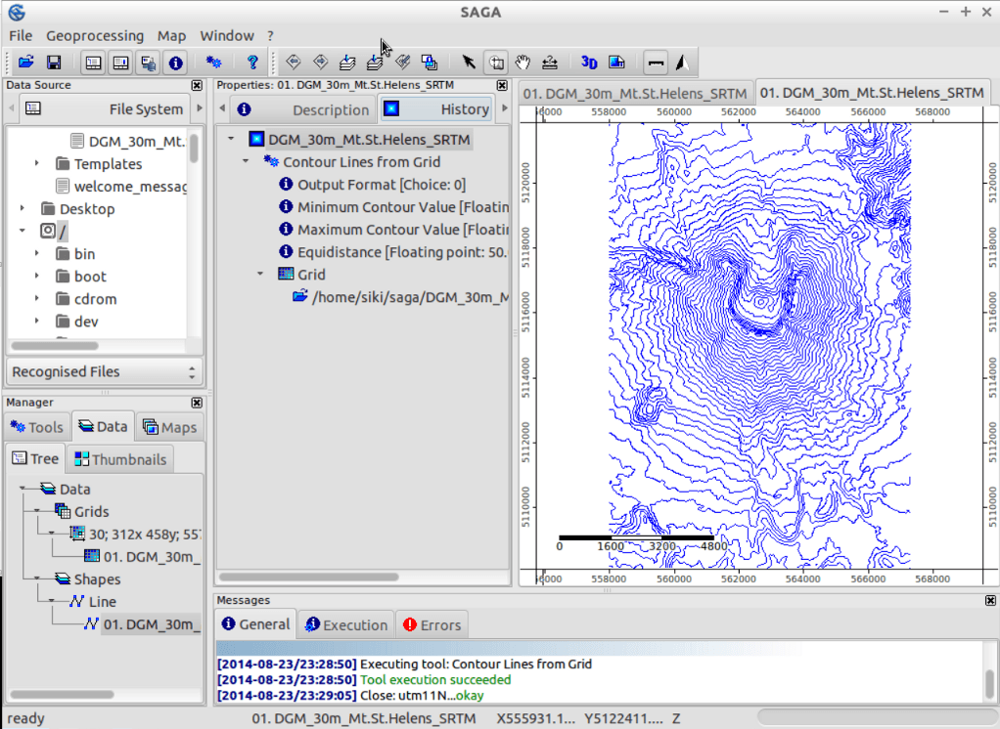

:Author: Johan Van de Wauw
:Version: osgeo-live4.0
:License: Creative Commons Attribution-ShareAlike 3.0 Unported  (CC BY-SA 3.0)

.. image:: ../../images/project_logos/logo-saga.png
  :scale: 100 %
  :alt: project logo
  :align: right
  :target: http://www.saga-gis.org

********************************************************************************
SAGA GIS Quickstart
********************************************************************************

Ablauf
================================================================================

Um SAGA GIS auf der Live DVD zu starten, klicken Sie den SAGA Link auf dem Desktop.

Wenn Sie SAGA das erste Mal öffnen, sehen Sie drei Unterfenster: Den Workspace, die Objekteigenschaften und das Message-Fenster. Die Informationen im Fenster Objekteigenschaften wechseln in Abhängigkeit von der Selektion im Workspace-Fenster.

  .. image:: ../../images/screenshots/1024x768/saga_guioverview.png
     :scale: 80

Daten laden
================================================================================

Öffnen Sie die SAGA GUI und laden Sie das Raster `/home/user/saga/DGM_30m_Mt.St.Helens_SRTM.grd über das 
** File|Grid|Load Grid** Menü. Sie bekommen eine Meldung über den Erfolg oder das Scheitern dieser Aufgabe. 
Sie sollten etwas wie `Laden Raster: DGM_30m_Mt.St.Helens_SRTM.grd ... okay` sehen. Sobald Sie die Datei 
geladen haben, wird sie im Reiter Daten des Workspace-Fenster angezeigt. Sie wird unter Raster in dem 
entsprechenden Koordinatensystem aufgeführt, wo sie hingehört.

In diesem Fall sieht die Koordinatensystem Informationen so aus **30;312x 458y; 557970x 5108130y**. 
Die erste Zahl zeigt die Größe der Zellen (30 Meter), die nächsten beiden Zahlen zeigen die Anzahl 
der Zellen in x- und y-Richtung und die letzten beiden Zahlen zeigen den Ursprung des Rasters. 
Das SAGA Koordinatensysteme wird durch die linke untere Ecke referenziert. Diese und einige weitere 
nützliche Informationen werden angezeigt, wenn Sie den Reiter Beschreibung im Fenster Objekteigenschaften 
auswählen. Ausserdem sehen Sie nicht nur detaillierte Informationen über das Raster, sondern auch den 
Datentyp (hier FLOAT), die Datenspannweite, einige statistische Informationen und die Speichergröße.

Daten anzeigen
================================================================================

Um die Karte anzuzeigen, genügt ein Doppelklick auf den Datensatz im Reiter Daten des Workspace-Fenster. Ein neues Kartenfenster öffnet sich mit dem Datensatz. Das Datenfenster ist eingerahmt: Oben und links sind die x- und y-Werte als Weltkoordinaten angezeigt. Unten und rechts sind Liniale in Karteneinheiten abgebildet. Bewegen Sie den Mauszeiger über die Karte, sehen Sie, dass die x-, y- und z-Koordinaten in der unteren Leiste des SAGA-GUI-Fensters angezeigt werden. Die z-Koordinaten entsprechen den Höhenwerten des Datensatzes (beachten Sie, dass die angezeigten Werte immer die des Datensatzes sind, den Sie im Reiter Daten ausgewählt haben).

Nun zoomen und schwenken Sie mit Hilfe der Navigations-Tools. Das Zoom-Werkzeug ist standardmäßig ausgewählt. Ein Linksklick auf die Karte zoomt hinein, mit der rechten Maustaste zoomt man heraus. Indem Sie die linke Maustaste gedrückt halten, in die gegenüberliegende Ecke ziehen und die Maustaste wieder loslassen, können Sie einen Area of Interest vergrößern. Wenn Sie weit hinein zoomen, werden Sie sehen, dass die einzelnen Zellenwerte angezeigt werden. Zum Verschieben, markieren Sie das Pan-Werkzeug und klicken und ziehen mit der Maus, um die Karte zu verschieben. Werfen Sie einen Blick auf die anderen Knöpfe in der Werkzeugleiste: Diese ermöglichen es Ihnen z.B. auf die volle Ausdehnung zu zoomen.

.. image:: ../../images/screenshots/800x600/saga_fullextent.png

.. tip:: SAGA zoomt sehr schnell, wenn sie sich dabei verlieren, klicken Sie auf den 'Zoom to Full Extent' Knopf in der Werkzeugleiste

Erstellen einer Schummerungskarte
~~~~~~~~~~~~~~~~~~~~~~~~~~~~~~~~~~~~~~~~~~~~~~~~~~~~~~~~~~~~~~~~~~~~~~~~~~~~~~~~

Nun verbessern wir die Kartendarstellung durch die Berechnung einer Reliefschattierung. Wechseln Sie in den Reiter Module des Workspace-Fensters und klicken Sie auf das Pluszeichen links neben der ** Terrain-Analyse - Lightning, Visibility ** Modulbibliothek: Eine Liste mit den Modulen dieser Bibliothek wird angezeigt. Wählen Sie nun das analytische Schummerungsmodul und wählen Sie dann den Reiter Einstellungen im Fenster Objekteigenschaften. Dies zeigt die Modul-Parameter (werfen Sie auch einen Blick auf den Reiter Beschreibung, in dem weitere Informationen über das Modul und seine Parameter angezeigt wird). Klicken Sie in die rechte Spalte der Raster-System-Parameter (wobei [nicht gesetzt] angezeigt wird) und wählen Sie das Koordinatensystem für die Mount St. Helens Datensatz. Klicken Sie nun in die rechte Spalte der Höhenparameter und wählen Sie den Datensatz. Klicken Sie in der rechten Spalte der Shading-Method Option und wählen Sie Standard. Jetzt drücken Sie Apply und dann auf die Schaltfläche Ausführen. Ein neuer Datensatz mit der Reliefschattierung wird berechnet.

Werfen Sie einen Blick auf den Reiter Daten des Workspace-Fensters. Sie werden den neu erstellten Datensatz finden. Doppelklicken Sie auf den 'Analytical Hillshading' Datensatz und wählen Sie 'Neu' im Dialog. Dadurch wird der Datensatz in einem neuen Kartenfenster angezeigt. Nach der Besichtigung des Datensatzes schliessen Sie das Kartenfenster wieder, indem Sie Schließen im Fenster-Menü auswählen.

Jetzt erneut doppelt auf den Schummerungs Datensatz klicken, aber die Karte mit dem Höhendatensatz aus dem Dialog auswählen (Add layer to selected map). Dadurch wird die Schummerungskarte über die Höhenkarte gelegt.

Wechseln Sie in den Reiter Karten des Workspace-Fensters. Sie sehen den Eintrag Ihrer Karte und die Datensätze, aus denen die Karte besteht. Die Reihenfolge der Darstellung ist von oben nach unten. Jetzt machen Sie einen Rechtsklick auf den 'Analytical Hillshading' Datensatz und wählen 'Move To Bottom' aus dem Kontextmenü. Dies ändert die Reihenfolge der Darstellung, die Schummerung ist nun unterhalb des Höhendatensatzes (der nun wieder in der Kartenansicht angezeigt wird). Wählen Sie nun den Höhendatensatz (mit der linken Maustaste) und werfen Sie einen Blick auf den Reiter Einstellungen des Fensters Objekteigenschaften. Finden Sie den Display-Bereich der Parameter und klicken Sie in die rechte Spalte der Transparenz-Optionen. Geben Sie einen Wert 30 ein und drücken Sie auf Übernehmen. Jetzt sehen Sie Ihre Höhenwerte als eine geschummerte Karte.

Wählen Sie bei Bedarf eine andere Transparenz-Einstellung oder versuchen sie, eine andere Shading-Methode im Analytischen Hillshading Modul (falls Sie den Namen für den Ausgabeparameter nicht ändern, wird das Raster direkt überschrieben, d.h. Sie sehen die Änderungen in der Karte sofort).

.. image:: ../../images/screenshots/1024x768/saga_withhillshade.png
    :scale: 80

3D Visualisierung
~~~~~~~~~~~~~~~~~~~~~~~~~~~~~~~~~~~~~~~~~~~~~~~~~~~~~~~~~~~~~~~~~~~~~~~~~~~~~~~~

In einem nächsten Schritt können Sie Ihre Karte in 3D visualisieren. Gehen Sie sicher, dass Ihre Karte markiert ist und drücken Sie die 'Show 3D-View' Taste in der Werkzeugleiste. Im Dialog wählen Sie das Koordinatensystem und den Höhendatensatz und stellen Sie den Mount St. Helens Datensatz als Höhenparameter ein. Sobald Sie die Taste OK drücken, wird die 3D-Ansicht Ihrer Karte angezeigt. Halten Sie die linke Maustaste gedrückt und bewegen Sie die Maus, um die Karte zu drehen und zu kippen. Verwenden Sie die rechte Maustaste zum zoomen und verschieben. Werfen Sie auch einen Blick auf die Werkzeugleiste der 3D-Ansicht: die Tasten replizieren die Maus Operationen und bieten weitere Funktionalität. Um die 3D-Ansicht zu schliessen, wählen Sie die Option Schließen im Menü-Fenster.

.. image:: ../../images/screenshots/1024x768/saga_3d.png
    :scale: 80

Konturlinien erstellen
================================================================================

Als kurze Einführung in die SAGA-Vektor-Funktionen werden wir nun Höhenlinien aus dem digitalen Höhenmodell generieren. Dies kann im Menü **Shapes - Grid | Contour Lines From Grid** durchgeführt werden, wenn Sie den Reiter Module im Workspace-Fenster öffnen. Sie können ebenso gut das Modul über das Menü: **Modules|Shapes|Shapes from Grid** öffnen. Wählen Sie Ihr Koordinatensystem und Raster (Höhendatei). Lassen Sie die Optionen wie sie sind, aber vielleicht ist es besser, eine Äquidistanz von 50m statt der üblichen 10 m zu wählen.
Ein paar Sekunden später sind die Höhenlinien erzeugt worden, und Sie sollten sie im Reiter Daten im Workspace-Fenster finden. Versuchen Sie die Konturkarte als neue Karte zu öffnen. Alle Höhenlinien haben jetzt die gleiche Farbe. Wenn Sie Ihre Karte selektieren (unter Arbeitsbereich, Reiter Daten) können Sie die Farbeinstellungen im Objekteigenschaften-Fenster im Bereich Display: Farb-Klassifikation ändern. Sie können die Klassifizierung von "Unique Symbol" nach "Farbverlauf" ändern. Dann sollten Sie auch einstellen, dass das Attribut Höhe für den Farbverlauf verwendet wird. Drücken Sie Apply und die farbigen Höhenlinien werden dargestellt.

History überprüfen
~~~~~~~~~~~~~~~~~~~~~~~~~~~~~~~~~~~~~~~~~~~~~~~~~~~~~~~~~~~~~~~~~~~~~~~~~~~~~~~~

Wenn Sie einen Datensatz (z.B. die Höhenlinien) im Reiter Workspace auswählen, können Sie im Bereich Objekteigenschaften zur "History" wechseln, um zu sehen, welche Optionen verwendet wurden, um den Datensatz zu erstellen. Diese Informationen werden auch mitgespeichert, wenn Sie Ihre Dateien speichern (als .hshp und .hgrd).

Daten speichern
================================================================================

Um die Arbeit, die Sie erstellt haben zu speichern, sollten Sie in den Reiter Daten im Workspace wechseln, und rechts auf die Datei klicken, die Sie speichern wollen. SAGA speichert Rasterdateien in seinem eigenen nativen Format (\*.sgrd) und Shapefiles im Standard ESRI Shapefile Format (\*.shp). Es ist auch möglich, das Projekt zu speichern, indem Sie **File|Project|Save Project** auswählen. Das speichert alle Kartenansichten und -einstellungen, sowie die Möglichkeit, die Daten zu speichern.

Daten Import und Export
================================================================================

Für den Import und Export von Daten stehen mehrere Module zur Verfügung. Am meisten bietet das Modul: Import/Export GDAL/OGR, das Sie im Menü **modules|file|GDAL/OGR menu** finden. Mit diesem Modul können zahlreiche Datenformate inklusive Geotiff importiert werden. Dasselbe Modul kann auch verwendet werden, um Daten in unterschiedlichste Formate zu exportieren.

.. tip:: Das SAGA GIS Rasterformat wird von GDAL seit der Version 1.7.0 unterstützt. Rasterdaten von SAGA können von vielen Programmen mit GDAL geöffnet werden. Sie müssen dazu aber die '\*.sdat' und nicht die '\*.sgrd' Datei öffnen.

In diesem Beispiel verwenden wir SRTM Höhendaten aus der Region Barcelona, wie man es aus dem Internet herunterladen würde.

Die Datei, die wir verwenden wollen, heisst `SRTM_u03_n041e002.tif` und befindet sich im Verzeichnis `/home/user/data/raster`. Sie können sie mit dem Modul Import/Export GDAL/OGR importieren aus dem Menü **modules|file|GDAL/OGR**. 

Nach dem Import des Datensatzes und dem Öffnen in einem neuen Fenster werden Sie wahrscheinlich enttäuscht sein: Es sieht alles grau aus! Lassen Sie uns prüfen, was der Grund sein könnte: Einige Pixel in der Nähe der Küste haben einen sehr kleinen Wert (-32768) (Sie können den Wert eines Pixels herausfinden, indem Sie den Z-Wert in der Statusleiste anschauen, während Sie den Mauszeiger über das Raster bewegen).

Diese Pixel haben in Wirklichkeit keinen Wert, so dass wir dafür eine NoData Einstellungen vornehmen müssen: im Objekteigenschaften-Fenster (nach Auswahl des Datensatzes im Arbeitsbereich-Fenster) stellen Sie den maximalen NoData Wert auf -32768.
Danach können wir die Farbskala zurücksetzen auf den Bereich, der für die Daten passt. Eine einfache Methode, den Bereich zu finden, ist, mit der rechten Maustaste auf das Gitter in den Arbeitsbereich zu klicken und auf "Classification | Set Range to minimum maximum" zu klicken.

Sie sind nun bereit, eine Schummerungskarte zu erstellen und weitere SAGA Module auszuprobieren!

Weitere Informationen
================================================================================
Diese Live-DVD enthält das SAGA Handbuch:
 * `SAGA userguide <../../saga/SAGA2_UserGuide_Cimmery_20070401.pdf/>`_
Weitere Dokumentation finden Sie auf der SAGA Webseite:
 * http://www.saga-gis.org
und spezifisches im Dokumentationsarchiv:
 * http://www.saga-gis.org/en/about/references.html 
 * http://sourceforge.net/projects/saga-gis/files/SAGA%20-%20Documentation/ 
