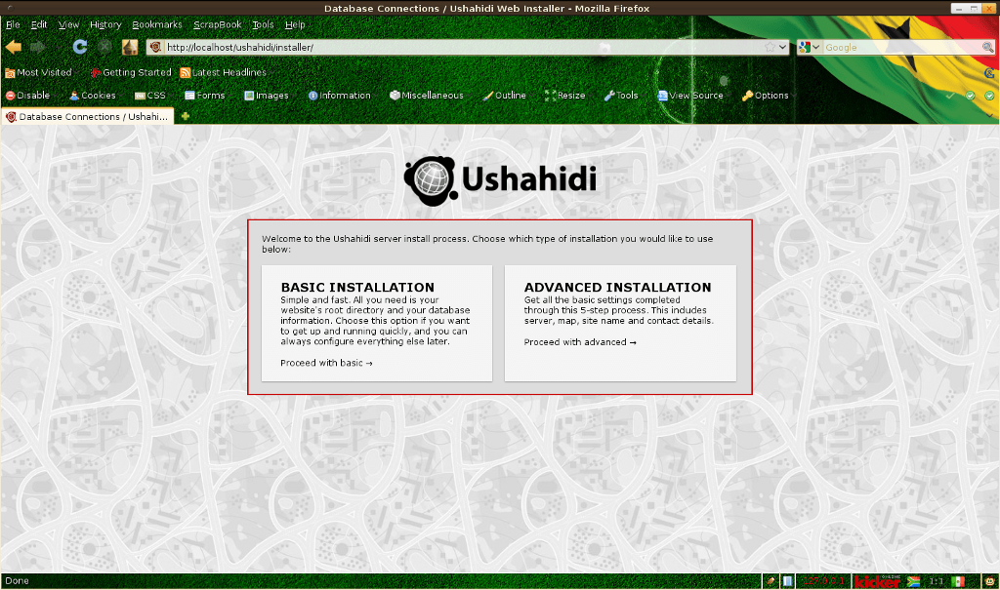
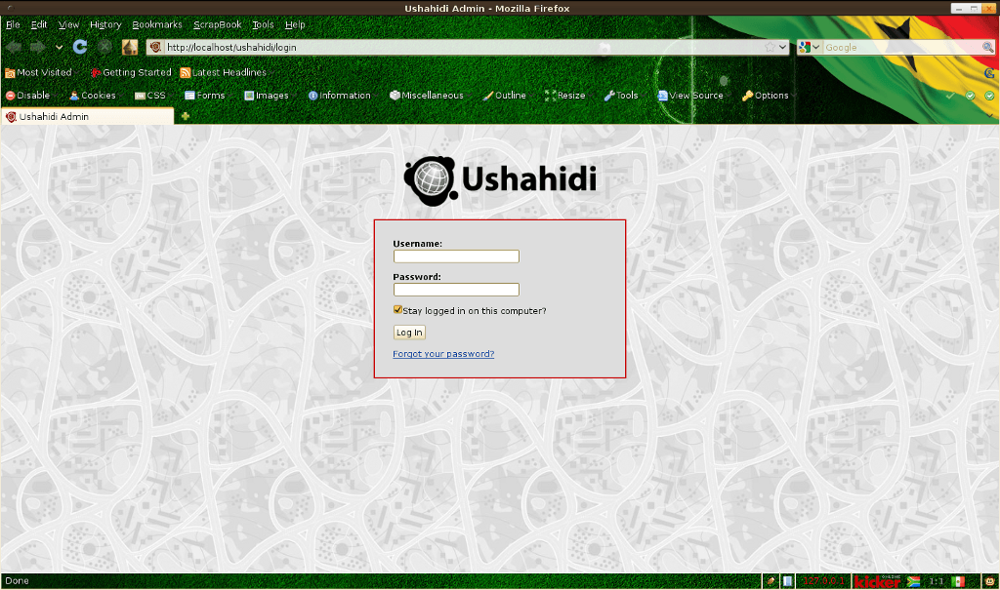

:Author: Henry Addo
:Version: osgeo-live4.0
:License: Creative Commons

.. _ushahidi-quickstart:

.. image:: ../../images/project_logos/logo-ushahidi.png
  :scale: 100 %
  :alt: project logo
  :align: right 

Ushahidi Quickstart 
===================

Diese Anleitung beschreibt, wie Sie:

* Ushahidi zum Laufen bekommen

Ushahidi zum Laufen bekommen
----------------------------

1. Das Starten von Ushahidi über das Desktop-Symbol oder Menüpunkt öffnet den 
   Web-Browser und bringt Sie auf die Seite für die Installation. Eine Ushahidi 
   Seite ist ziemlich einfach einzurichten

.. image:: ../../images/screenshots/1024x768/ushahidi-drc-screenshot.png
  :scale: 50 %
  :alt: ushahidi desktop icons
  :align: center 

2. Wählen Sie **"Basic Installation"**, **"Let's get started"**, und Sie 
   werden gebeten, ein paar Details einzugeben. Der Name der Datenbank ist 
   **"ushahidi"**, der Datenbank-Benutzername ist **"user"**, ebenso lautet 
   das Passwort **"user"**. Der Datenbank-Host lautet **"localhost"**. Dann 
   weiter. Auf der *General* Setup-Seite wählen Sie einen Seitennamen (Titel) 
   für Ihre Webseite wie z.B. **OSGeo Demo**, und - wenn Sie möchten - *tag-line 
   subheading*. Die Emailaddresse, nach der Sie gefragt werden, wird zum 
   automatischen Empfang von Beiträgen, die verarbeitet und zur Datenbank und 
   Karte hinzugefügt werden, und als Absender von automatischen Berichten 
   verwendet. Fürs Erste setzen Sie diese auf **"ushahidi@localhost.localdomain"** 
   oder **"ushahidi@example.org"** oder so ähnlich und wählen Sie **"Continue"**.
   

3. Danach ist alles erledigt ist, und es wird Ihnen mitgeteilt, dass die Installation 
   erfolgreich war, sowie unter welchem Link Ihre Webseite aufrufbar ist.

.. image:: ../../images/screenshots/1024x768/ushahidi_installer_finished_screenshot.png
  :scale: 50%
  :alt: ushahidi installer finishes
  :align: center
 
4. Um Änderungen im `Administrationsbereich <http://localhost/ushahidi/admin>`_ 
   vorzunehmen, lautet der Benutzername **"admin"** und das Passwort ebenfalls 
   **"admin"**. Zum Beispiel finden Sie auf der Setup-Seite den Link **"Settings"** 
   (oben rechts) und können dort unter der **"Map"** Registerkarte den 
   **"Map provider"** zu OpenStreetMaps ändern (keine API Schlüssel erforderlich 
   für OSM :-) ).

Die Setup README-Seite ist auch lokal verfügbar unter `/var/www/ushahidi/readme.html <../../ushahidi/readme.html>`_.
