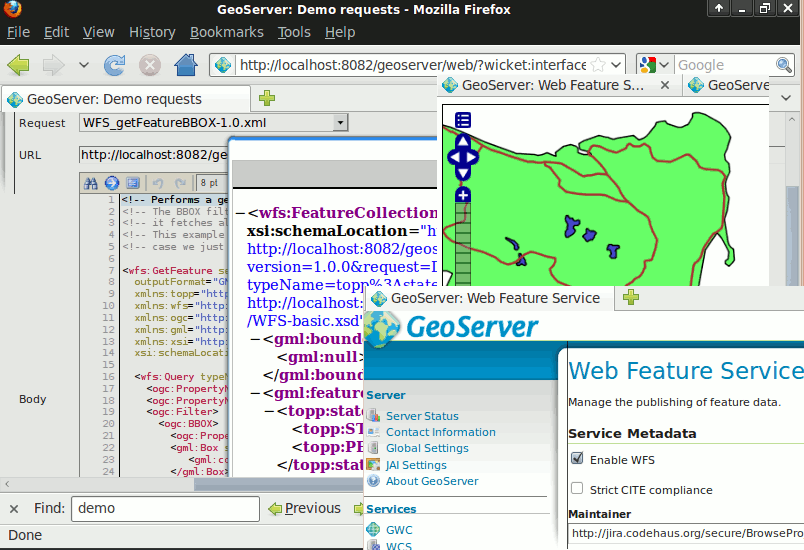

:Author: Ian Turton
:Author: Frank Gasdorf
:Translator: Margherita Di Leo
:Reviewer: Cameron Shorter, Jirotech
:Version: osgeo-live5.5
:License: Creative Commons Attribution 3.0 Unported (CC BY 3.0)

.. image:: ../../images/project_logos/logo-GeoServer.png
  :alt: project logo
  :align: right
  :target: http://geoserver.org/

.. image:: ../../images/logos/OSGeo_project.png
  :scale: 100 %
  :alt: OSGeo Project
  :align: right
  :target: http://www.osgeo.org

GeoServer
================================================================================

Web Service
~~~~~~~~~~~~~~~~~~~~~~~~~~~~~~~~~~~~~~~~~~~~~~~~~~~~~~~~~~~~~~~~~~~~~~~~~~~~~~~~

GeoServer è un web server che permette di fornire mappe e dati da
una varietà di formati a client standard, come i browser web e GIS desktop.
Ciò significa che è possibile memorizzare i dati spaziali in quasi
qualsiasi formato si preferisce, ma gli utenti non hanno bisogno di sapere
nulla dei dati GIS. Al livello più semplice tutto ciò che serve è un browser web
per visualizzare le mappe esattamente come si desidera.

GeoServer e` l'implementazione di riferimento degli standard
`Open Geospatial Consortium <http://www.opengeospatial.org>`_ (OGC)
:doc:`../standards/wfs_overview` e
:doc:`../standards/wcs_overview`, nonche` conforme
:doc:`../standards/wms_overview` certificato con alte prestazioni.
GeoServer costituisce una componente di base del Geospatial Web.

Caratteristiche di base
--------------------------------------------------------------------------------

**Fornisce dati da una varieta` di depositi di dati:**
    * Vettoriali
        - Shapefiles, WFS esterni
        - PostGIS, ArcSDE, DB2, Oracle Spatial, MySql, SQL Server
    * Raster
        - GeoTiff, JPG e PNG (con world file), piramidi, formati GDAL, Image Mosaic, Oracle GeoRaster

**I dati sono mostrati come immagini veloci e sicure utilizzando il protocollo WMS e WMST:**
    Poiche` il dato e` mostrato come un'immagine il dato e` completamente salvo e sicuro. A meno di non digitalizzare il dato, non c'e` nessuna possibilita` che il dato venga sottratto.
    L'apparenza di ciascun layer puo` essere controllata usando lo standard SLD che consente di colorare ed etichettare gli oggetti. Combinando queste regole con Filtri OGC e` possibile implementare uno stile dipendente dalla scala, che permette di visualizzare maggiori dettagli aumentando lo zoom. Inoltre sono implementati la gestione delle collisioni delle etichette, il raggruppamento e le priorita`.

**Interi dati vettoriali possono essere inviati al client usando il protocollo WFS:**
     Un client WFS puo` scaricare i dati vettoriali e usarli per mapping, analisi spaziale ed altre operazioni. Inoltre, se autorizzato, l'utente puo` modificare il dato e mandarlo indietro al server per aggiornare il dato conservato utilizzando il protocollo WFS-T.
     Il dato puo` essere trasmesso usando GML (compresso) nonche` altri formati standard come shapefile e json.

**I valori dei dati raster possono essere inviati al client usando il protocollo WCS:**
     Un client GIS puo` richiedere il dato raster reale per l'uso nell'analisi spaziale. Questo permette all'utente di creare applicazioni che possono modellare i processi descritti dai vostri dati.

**Riproiezione al volo:**
     GeoServer supporta la gran parte delle proiezioni del database EPSG e puo` riproiettare qualsiasi dato a richiesta per consentire ai client con limitate capacita` di riproiezione di passare il caricamento del server. 

**Tiling Cache**
    `GeoWebCache <http://geowebcache.org/>`_, che è integrato in GeoServer, crea tiles e caches di immagini di mappe da diverse sorgenti come un WMS. Implementa varie interfacce ai servizi (come WMS-C, WMTS, TMS, Google Maps KML, Virtual Earth) al fine di accellerare e ottimizzare la fornitura di immagini. Può anche ricombinare tiles per lavorare con client WMS standard
    
**Web Processing Service (WPS)** 
    Algoritmi geospaziali, inclusi quelli di :doc:`JTS <jts_overview>`, possono essere richiamati tramite l'interfaccia :doc:`WPS <../standards/wps_overview>` di GeoServer. Questo include il concatenamento di processi, e utilizza le trasformazioni di rappresentazioni di mappe per creare potetenti visualizzazioni attraverso l'interfaccia WMS

Standard implementati
--------------------------------------------------------------------------------

Supporto di numerosi standard Open Geospatial Consortium  (OGC):

  * :doc:`../standards/wms_overview`
  * Web Map Tile Service (WMTS)
  * :doc:`../standards/wfs_overview`, WFS-T (transactional)
  * :doc:`../standards/wcs_overview`
  * :doc:`../standards/wps_overview`
  * :doc:`../standards/fe_overview`
  * :doc:`../standards/sld_overview` 
  * :doc:`../standards/gml_overview`
  * :doc:`../standards/kml_overview`

Dettagli
--------------------------------------------------------------------------------

**Sito web:** http://geoserver.org/

**Licenza:** GNU General Public License (GPL) version 2

**Versione software:** |version-geoserver|

**Piattaforme supportate:** Tutte le piattaforme Java 6 - Windows, Linux, Mac

**Interfacce API:** WMS, WFS, WCS, REST

**Supporto:** http://geoserver.org/support/

Guida rapida
--------------------------------------------------------------------------------

* :doc:`Documentazione introduttiva <../quickstart/geoserver_quickstart>`
