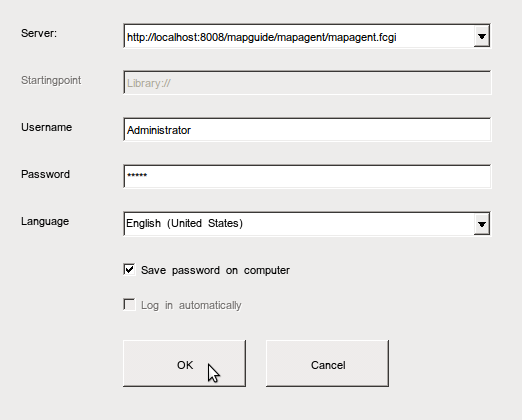

:Author: Trevor Wekel
:Version: osgeo-live5.0draft
:License: Creative Commons Attribution-ShareAlike 3.0 Unported  (CC BY-SA 3.0)

.. image:: ../../images/project_logos/logo-MapGuideOS.png
  :scale: 100 %
  :alt: project logo
  :align: right 

Начало работы с MapGuide 
================================================================================

В данном руководстве описывается:

* Установка и запуск MapGuide
* Настройка символики с использованием Maestro

.. comment: ? * Extra note on 64-bit Ubuntu  

Установка и запуск MapGuide
--------------------------------------------------------------------------------

.. comment: 1. Go to Desktop->Server, click icon Start MapGuide. This will start both MapGuide server and MapGuide Web server

.. comment: .. image:: ../../images/screenshots/1024x768/mapguide_desktopIcons.png
.. comment:   :scale: 50 %
.. comment:   :alt: mapguide desktop icons
.. comment:   :align: center 

1. Установка MapGuide вручную

.. note:: На представленном DVD MapGuide не установлен ввиду ограниченного объёма диска.

.. Закомментировано, поскольку установка вручную не работает: Для установки MapGuide откройте терминал и наберите ``cd gisvm/bin; sudo ./install_mapguide.sh``

2. В браузере перейдите по адресу http://localhost:8008/mapguide/phpviewersample/ajaxtiledviewersample.php для просмотра примера приложения. 

.. image:: ../../images/screenshots/1024x768/mapguide_viewer.png
  :scale: 50 %
  :alt: mapguide desktop icons
  :align: center

MapGuide Maestro
--------------------------------------------------------------------------------

1. Для запуска Maestro перейдите в *Desktop->Server* и нажмите кнопку
   MapGuide Maestro. Появится окно авторизации, как показано на скриншоте ниже.
   Подключитесь к серверу http://localhost:8008/mapguide/mapagent/mapagent.fcgi,
   используя имя пользователя "Administrator" и пароль "admin".

 
2. Нажмите *Ok* для перехода в главное окно Maestro:

.. image:: ../../images/screenshots/1024x768/mapguide_maestroMain.png
   :scale: 50%
   :alt: mapguide maestro main GUI
   :align: center

3. Разверните список, расположенный в левой части окна, и перейдите в
   *Samples->Sheboygan->Layers*, дважды нажмите на пункт *Buildings*, после
   чего в правой части появится редактор выбранного слоя:

.. image:: ../../images/screenshots/1024x768/mapguide_maestroLayerFeatures.png
   :scale: 50%
   :alt: mapguide maestro layer features
   :align: center

4. Прокрутите вниз окно редактора, чтобы увидеть панель *Layer style*.
   Для вызова редактора стиля нажмите на ячейке ... поля *Featurestyle*:

.. image:: ../../images/screenshots/1024x768/mapguide_maestroLayerStyle.png
   :scale: 50%
   :alt: mapguide maestro layer stype panel
   :align: center

.. image:: ../../images/screenshots/1024x768/mapguide_maestroStyleEditor.png
   :scale: 50%
   :alt: mapguide maestro color chooser
   :align: center

5. В выпадающем списке *Foreground Color* выберите *Green* и нажмите *Ok*.
   После чего в главном окне Maestro нажмите указанную кнопку для сохранения
   изменений: 

.. image:: ../../images/screenshots/1024x768/mapguide_maestroSaveIcon.png
   :scale: 50%
   :alt: mapguide maestro Save icon 
   :align: center

6. Для просмотра внесённых изменений в браузере перейдите по адресу
   http://localhost:8008/mapguide/phpviewersample/ajaxtiledviewersample.php
   или нажмите кнопку *Preview* на панели инструментов главного окна Maestro,
   после чего откроется браузер и автоматически перейдёт по указанному адресу.
   В появившейся карте измените масштаб, чтобы был виден слой *Buildings*. Как
   можно заметить, здания отрисованы зелёным цветом в соответствии с настройками,
   выполненными в Maestro.

.. image:: ../../images/screenshots/1024x768/mapguide_buildingColorBeforeChanging.png
   :scale: 50%
   :alt: Building color is grey 
   :align: center

.. image:: ../../images/screenshots/1024x768/mapguide_buildingColorAfterChanging.png
   :scale: 50%
   :alt: Building color is green 
   :align: center

