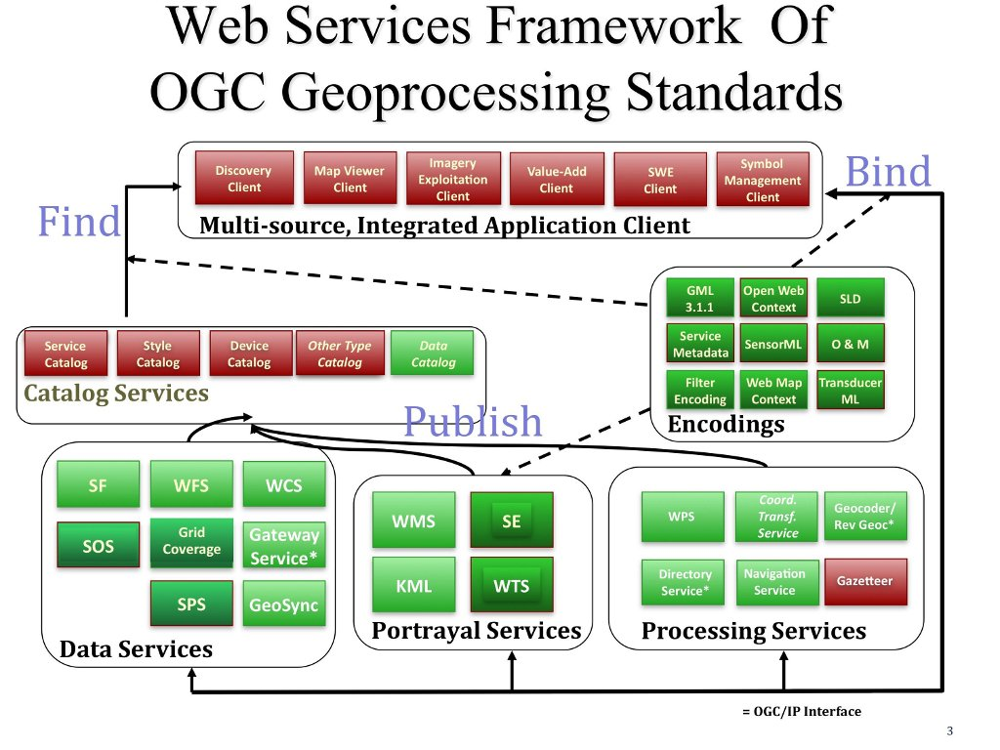

.. Geospatial Standards documentation master file, created by
   sphinx-quickstart on Mon Jul 19 08:52:52 2010.
   You can adapt this file completely to your liking, but it should at least
   contain the root `toctree` directive.

Стандарты Open Geospatial Consortium
================================================================================

Введение
--------------------------------------------------------------------------------
Open Geospatial Consortium (OGC) был основан в 1994 с целью сделать географическую 
составной частью мировой информационной инфраструктуры. Члены OGC — поставщики 
технологий и их пользователи — совместно разрабатывают открытые стандарты 
интерфейсов и соответствующие стандарты кодирования. OGC также способствует развитию 
передового опыта, позволяющего разработчикам создавать информационные системы,
которые могут легко обмениваться пространственной информацией и инструкциями с 
другими информационными системами.
Требования варьируются от сложного планирования и контроля спутников исследования 
Земли до отображения простых веб-карт и кодировании местоположения с помощью 
нескольких байтов для геотаггинга и обмена сообщениями. Если посмотреть на домен рабочих
групп OGC (http://www.opengeospatial.org/projects/groups/wg), можно увидеть весь 
широкий спектр текущей активности OGC.

 
Основа стандартов OGC и референсная модель
--------------------------------------------------------------------------------

Основа стандартов OGC состоит из стандартов (http://www.opengeospatial.org/standards) для 
интерфейсов, кодирования, профилей, схем приложений и документов с примерами лучшей практики.
Референсная модель OGC (`ORM <http://www.opengeospatial.org/standards/orm>`_) описывает данные 
стандарты и связи между ними и соответствующими стандартами ISO. ORM даёт обзор стандартов 
OGC и служит в качестве полезного ресурса для определения архитектуры для конкретных приложений. 

Разработка веб-сервисов с использованием стандартов OGC (и изучение взаимосвязей между стандартами)
позволяет считать публикацию, поиск и связи важнейшими функциями в среде веб-сервисов.

* Публикация: поставщики ресурсов рекламируют свои ресурсы.
* Поиск: конечные пользователи и их приложения могут находить ресурсы, которые нужны им во время выполнения.
* Связи: конечные пользователи и их приложения могут получать доступ и пользоваться ресурсами во время выполнения.

Большинство стандартов OGC, разработанных в последние годы, являются стандартами для 
среды веб-сервисов — это стандарты, совместно именуемые "OGC Web Services" (OWS). На рисунке
ниже представлена общая архитектурная схема для OGC Web Services. Эта схема определяет
общие классы сервисов, которые принимают участие в различной деятельности по геообработке и 
определению местоположения.

Сокращения, упомянутые на рисунке, расшифрованы ниже. Некоторые из них представляют
собой названия стандартов OGC, другие — общедоступными "Документами для обсуждения", 
"Запросами" и "Рекомендательными письмами" (заметьте, что некоторые кандидаты в стандарты, 
находящиеся в работе, ещё не представлены общественности и доступны только членам OGC).  

.. add all standard overview documents to the toc and add all others right behind

.. toctree::
   :maxdepth: 1
   :glob:
   
   *_overview

* Sensor Planning Service (SPS)
* Web Terrain Service (WTS)
* Grid Coverage Service
* Coordinate Transformation Service
* Web Coverage Processing Service (WCPS)
* Web Map Tile Service (WMTS)
* Simple Features (SF)
* Sensor Web Enablement (SWE)
* XML for Image and Map Annotation (XIMA)
* CityGML
* GeosciML
* GML in JPEG 2000
* Observations and Measurements (O&M)
* Symbology Encoding
* Transducer Markup Language (TML)

.. links to standards
  * :doc:`wms_overview` (http://www.opengeospatial.org/standards/wms)
  * :doc:`wfs_overview` (http://www.opengeospatial.org/standards/wfs)
  * :doc:`wcs_overview` (http://www.opengeospatial.org/standards/wcs)
  * :doc:`wps_overview` (http://www.opengeospatial.org/standards/wps)
  * :doc:`csw_overview` (http://www.opengeospatial.org/standards/specifications/catalog)
  * :doc:`sos_overview` (http://www.opengeospatial.org/standards/sos)
  * Sensor Model Language (SensorML) (http://www.opengeospatial.org/standards/sensorml) 
  * Sensor Planning Service (SPS) (http://www.opengeospatial.org/standards/sps)
  * Web Terrain Service (WTS) (http://portal.opengeospatial.org/files/?artifact_id=1072)
  * Grid Coverage Service (http://www.opengeospatial.org/standards/gc)
  * Coordinate Transformation Service (http://www.opengeospatial.org/standards/ct)
  * Web Coverage Processing Service (WCPS) (http://www.opengeospatial.org/standards/wcps)
  * Web Map Tile Service (WMTS) (http://www.opengeospatial.org/standards/wmts)
  * :doc:`gml_overview` (http://www.opengeospatial.org/standards/gml) 
  * :doc:`kml_overview` (http://www.opengeospatial.org/standards/kml)
  * :doc:`sensorml_overview` (http://www.opengeospatial.org/standards/sensorml)
  * Styled Layer Descriptor (SLD) (http://www.opengeospatial.org/standards/sfc) 
  * Filter Encoding (http://www.opengeospatial.org/standards/filter)
  * Simple Features (SF) (http://www.opengeospatial.org/standards/sfa) 
  * Sensor Web Enablement (SWE) (http://www.opengeospatial.org/ogc/markets-technologies/swe)
  * XML for Image and Map Annotation (XIMA) (http://portal.opengeospatial.org/files/?artifact_id=1020) 
  * CityGML (http://www.opengeospatial.org/standards/citygml)
  * GeosciML (http://www.geosciml.org/)
  * GML in JPEG 2000 (http://www.opengeospatial.org/standards/gmljp2)
  * Observations and Measurements (O&M) (http://www.opengeospatial.org/standards/om)
  * Symbology Encoding (http://www.opengeospatial.org/standards/symbol)
  * Transducer Markup Language (TML) (http://www.opengeospatial.org/standards/tml)

Смотрите также:
--------------------------------------------------------------------------------

* Полный список стандартов OGC: http://www.opengeospatial.org/standards/
* Пособия OGC, представленные на IGARSS 2010: http://www.ogcnetwork.net/node/1481 
* Страницы OGC Network Learn (http://www.ogcnetwork.net/learn).
