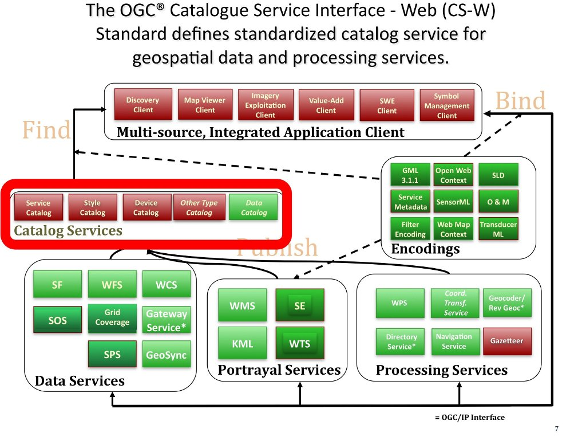

.. Writing Tip:
  Writing tips describe what content should be in the following section.

.. Writing Tip:
  Metadata about this document

:Author: OGC
:License: Creative Commons

.. Writing Tip: 
  Project logos are stored here:
    https://github.com/OSGeo/OSGeoLive-doc/tree/master/images/project_logos
  and accessed here:
    ../../images/project_logos/<filename>
  A symbolic link to the images directory is created during the build process.

.. image:: ../../images/project_logos/logo-OGC-left.png
  :scale: 100 %
  :alt: OGC logo
  :align: right

.. image:: ../../images/project_logos/logo-OGC-right.png
  :scale: 100 %
  :alt: OGC logo
  :align: right

.. Writing Tip: Name of application

Catalogue Service for the Web (CSW) 网络地理数据编录服务
================================================================================

.. Writing Tip:
  1 paragraph or 2 defining what the standard is.

　　OGC Catalogue Service 接口标准规定了一套用于发布和发现地理信息数据集元数据和服务的服务开发规范。数据提供者使用空间位置和主题区分不同的数据集，使得客户端可以有效地获取所需数据。

　　OGC CSW 模型的描述包括：

* ISO 19115/19139 元数据描述 (http://www.iso.org/iso/catalogue_detail.htm?csnumber=32557)。它针对 ISO 标准的元数据信息，使用 XML 编码 ISO 19139 (http://www.iso.org/iso/catalogue_detail.htm?csnumber=32557) 和 HTTP 协议。该模型在应用较广，例如 Spatial Data Infrastructure for North Rhine Westphalia 联邦德国使用的系统。

* CSW-ebRIM Registry Service 登记服务 (http://portal.opengeospatial.org/files/?artifact_id=31137)。它适用于使用 OASIS ebXML 登记服务模型 (ebRIM 3.0) 的 CSW 系统，使得人类和软件用户能够在开放的分布式系统中定位和获取利用信息。它为获取、存储和管理多种资源描述信息提供了方案。其扩展机制允许内容根据专门业务需求调整。
* CSW 39.50 协议规范了一套基于消息机制的客户端-服务器系统，基于 ANSI/NISO Z39.50 Application Service Definition 应用服务定义信息标准协议第三版实现。每个服务操作的模型都与 ANSI/NISO/ISO 标准的服务对应。(http://lcweb.loc.gov/z3950/agency/document.html)

　　这个标准目前主要的工作是重新构建编录的核心内容，使得一套统一且定义完善的核心数据能够被广泛使用，同时又支持多种不同的应用的专门扩展。

其它信息
--------------------------------------------------------------------------------

.. Writing Tip:
  Describe Similar standard

* Cat: ebRIM App Profile: Earth Observation Products 地球观测数据产品
* ISO 23950 (2003). "Information Retrieval (Z39.50): Application Service Definition and Protocol Specification" 信息获取服务定义与协议标准
