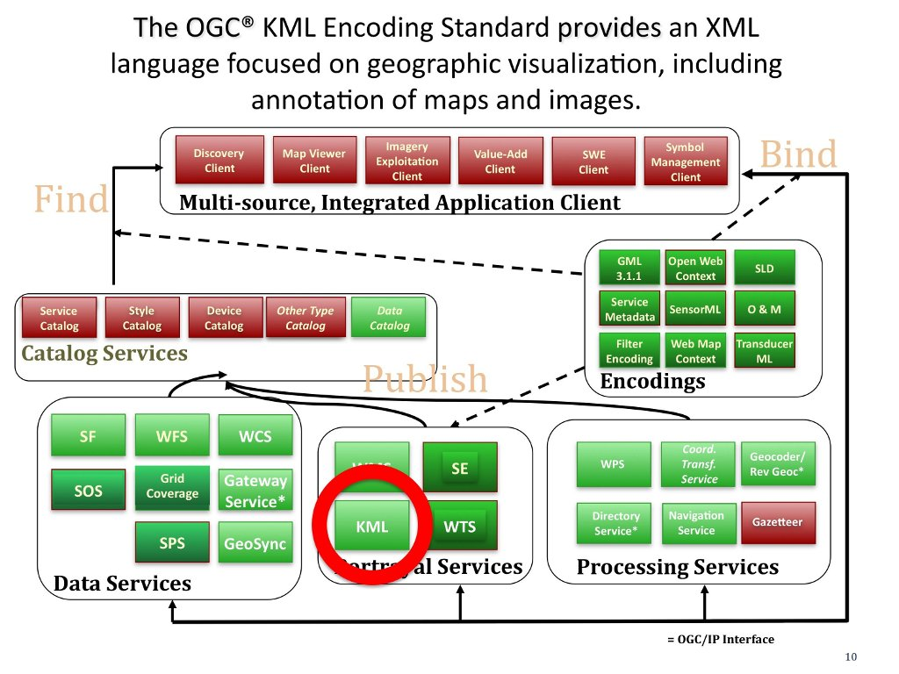

.. Writing Tip:
  Writing tips describe what content should be in the following section.

.. Writing Tip:
  Metadata about this document

:Author: OGC
:License: Creative Commons

.. Writing Tip: 
  Project logos are stored here:
    https://github.com/OSGeo/OSGeoLive-doc/tree/master/images/project_logos
  and accessed here:
    ../../images/project_logos/<filename>
  A symbolic link to the images directory is created during the build process.

.. image:: ../../images/project_logos/logo-OGC-left.png
  :scale: 100 %
  :alt: OGC logo
  :align: right

.. image:: ../../images/project_logos/logo-OGC-right.png
  :scale: 100 %
  :alt: OGC logo
  :align: right

.. Writing Tip: Name of application

KML Encoding Standard (KML) 地理注记
================================================================================

.. Writing Tip:
  1 paragraph or 2 defining what the standard is.

　　OGC KML Encoding Standard 是一种用于地理信息可视化的 XML 语法。它用于注记地图和影像。这一格式可用于标注地理要素并指导用于的导航操作。(http://www.opengeospatial.org/standards/KML)

　　在 2006 年，Google 向 OGC 提交了 KML（原意为 Keyhole Markup Language）作为备选标准。KML 是 OGC 接受的第一个事实标准。它有四项目标：

　　实现一种全球统一的地理注记语言用于二位地图和三维地理场景的应用。

　　确立全球通用的标准与最佳实现，保证良好的兼容性。

　　OGC 和 KML 社区紧密合作，保证 XML 实现的开发者随时了解该语言的发展及可能的问题。

　　以单一的 OGC 流程管理 KML 备选标准并保证向下兼容能力。

　　KML 于 2008 年成为 OGC 标准。它与其他 OGC 标准，如 GML、WFS 和 WMS 互补。目前，KML v2.1 使用了从 GML v2.1.2 引入的一些内容。

相关信息
--------------------------------------------------------------------------------

.. Writing Tip:
  Describe Similar standard

* :doc:`gml_overview`
* :doc:`wfs_overview`
