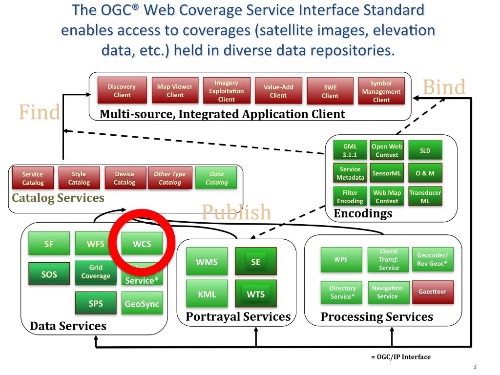

.. Writing Tip:
  Writing tips describe what content should be in the following section.

.. Writing Tip:
  Metadata about this document

:Author: OGC
:License: Creative Commons

.. Writing Tip: 
  Project logos are stored here:
    https://github.com/OSGeo/OSGeoLive-doc/tree/master/images/project_logos
  and accessed here:
    ../../images/project_logos/<filename>
  A symbolic link to the images directory is created during the build process.

.. image:: ../../images/project_logos/logo-OGC-left.png
  :scale: 100 %
  :alt: OGC logo
  :align: right

.. image:: ../../images/project_logos/logo-OGC-right.png
  :scale: 100 %
  :alt: OGC logo
  :align: right

.. Writing Tip: Name of application

Web Coverage Service (WCS) 网络地理场数据服务
================================================================================

.. Writing Tip:
  1 paragraph or 2 defining what the standard is.

　　OGC® Web Coverage Service (WCS) 接口标准定义了一套标准接口和操作用于提供和获取可共用的网络地理场数据服务。“Grid coverages”栅格数据通常指卫星图片、数字航摄图片、数字高程模型及其它使用各个点的数值模型表达的信息(http://www.opengeospatial.org/standards/wcs)。

　　WCS 为数据服务标准。该服务使得数字高程等栅格数据能够以 HTTP 接口上的标准请求检索，并以元数据和 GeoTIFF、NetCDF 等二进制图形数据返回。 

　　WCS 一个杰出应用实例是美国大气与海洋局 (NOAA) 的 NDBC High Frequency (HF) Radar Web Coverage Service (WCS) 服务 (http://hfradar.ndbc.noaa.gov/) 。HF 高频雷达被用于遥感海洋表面的水流。另一个是美国国家航空航天局 (NASA) 的 WCS for accessing Atmospheric Infrared Sounder (AIRS) 服务 (http://idn.ceos.org/KeywordSearch/Metadata.do?Portal=webservices&KeywordPath=[Project%3A+Short_Name%3D%27EOS%27]&EntryId=NASA_GES_DISC_AIRS_Atmosphere_Data_Web_Coverage_Service&MetadataView=Full&MetadataType=1&lbnode=mdlb1) 。该数据为产自 Aqua 航天飞机的第三级大气数据产品。

相关信息
--------------------------------------------------------------------------------

.. Writing Tip:
  Describe Similar standard

* :doc:`wms_overview`
* :doc:`wfs_overview`
*  Grid Coverage Service
* :doc:`sos_overview`
* :doc:`fe_overview`
