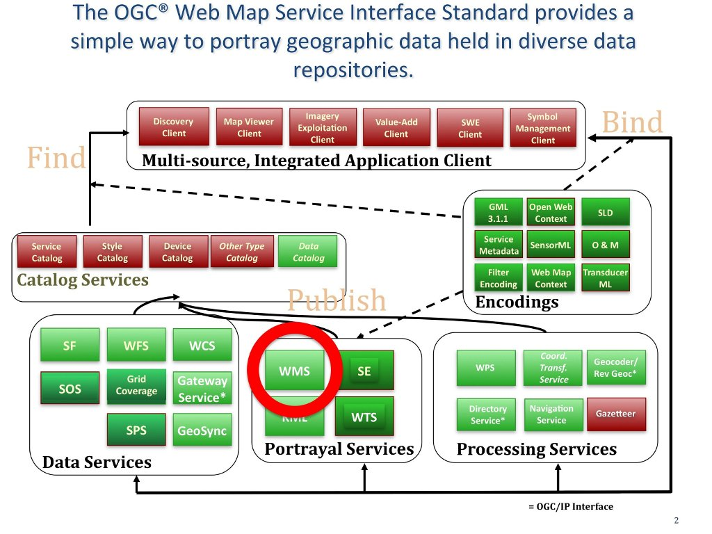

.. Writing Tip:
  Writing tips describe what content should be in the following section.

.. Writing Tip:
  Metadata about this document

:Author: OGC
:License: Creative Commons

.. Writing Tip: 
  Project logos are stored here:
    https://github.com/OSGeo/OSGeoLive-doc/tree/master/images/project_logos
  and accessed here:
    ../../images/project_logos/<filename>
  A symbolic link to the images directory is created during the build process.

.. image:: ../../images/project_logos/logo-OGC-left.png
  :scale: 100 %
  :alt: OGC logo
  :align: right

.. image:: ../../images/project_logos/logo-OGC-right.png
  :scale: 100 %
  :alt: OGC logo
  :align: right

.. Writing Tip: Name of application

Web Map Service (WMS) 网络地图服务
================================================================================

.. Writing Tip:
  1 paragraph or 2 defining what the standard is.

　　OGC® Web Map Service (WMS) 接口标准是一套简单的 HTTP 接口，用于从一个或多个地理信息数据库传输有地理定位的地图图像数据。其返回为 JPEG、PNG、等地图数据，可用于网页或桌面客户端显示。(http://www.opengeospatial.org/standards/wms)

　　WMS 标准包含三个操作：

* GetCapabilities（必须）：获取 WMS 服务的内容与接受的请求。

* GetMap（必须）：获取指定地图数据

* GetFeatureInfo（可选）：查询特定要素

　　该标准已被上百种产品使用。请参考此处的列表：http://www.opengeospatial.org/resource/products/compliant 。

　　一个优秀的实例是 NC OneMap (http://www.nconemap.com/) 。它依赖 WMS 从多个服务器获取数据，并以同样的方式发布。这样的数据可以被所有人使用，但也能进入 ESRI、MapInfo、Intergraph 等私有软件环境中。

相关信息
--------------------------------------------------------------------------------

.. Writing Tip:
  Describe Similar standard

　　OGC WMS 教程 http://www.opengeospatial.org/resource/cookbooks

　　相关标准： 

* :doc:`wfs_overview`
* :doc:`wcs_overview`
* Web Map Tile Service
* :doc:`gml_overview`
* :doc:`kml_overview`
* :doc:`sld_overview`
* Symbology Encoding
* :doc:`fe_overview`

