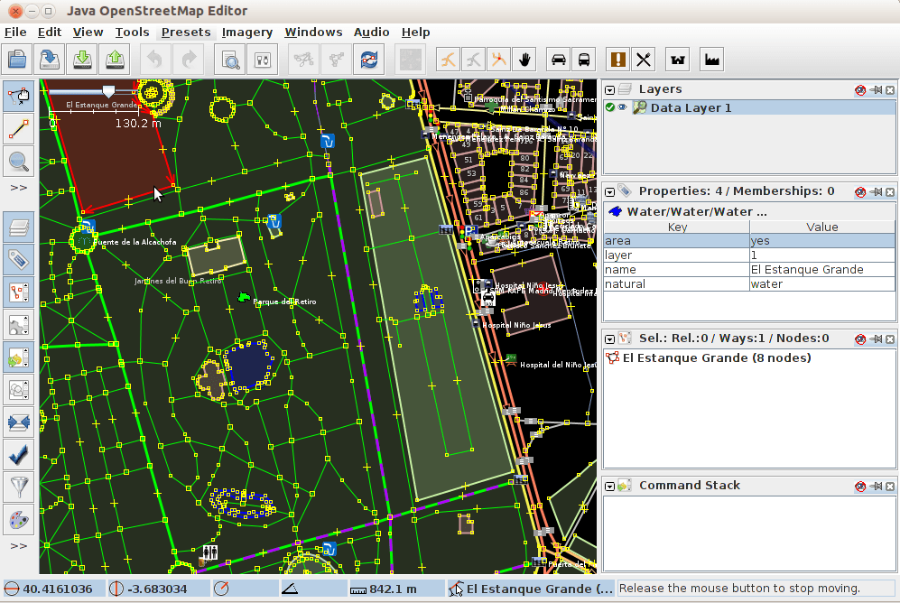

:Author: OSGeo-Live
:Author: Javier Sanchez, GeoNaTec
:Reviewer: 
:Version: osgeo-live6.5
:License: Creative Commons Attribution 3.0 Unported (CC BY 3.0)

.. image:: ../../images/project_logos/logo-josm.png
  :alt: project logo
  :align: right
  :target: http://josm.openstreetmap.de

JOSM
================================================================================

.. Writing Tip:
  Application Category Description:

Επεξεργαστής δεδομένων OpenStreetMap
~~~~~~~~~~~~~~~~~~~~~~~~~~~~~~~~~~~~~~~~~~~~~~~~~~~~~~~~~~~~~~~~~~~~~~~~~~~~~~~~

.. Writing Tip:
  Address user questions of "What does the application do?",
  "When would I use it?", "Why would I use it over other applications?",
  "How mature is the application and how widely deployed is it?".
  Don't mention licence or open source in this section.
  Target audience is a GIS practitioner or student who is new to Open Source.
  * First sentence should explain the application.
  * Usually the application domain will not be familiar to readers. So the
    next line or two should explain the domain. Eg: For GeoKettle, the next
    line or two should explain what GoeSpatial Business Intelligence is.
  * Remaining paragraph or 2 in this overview section should provide a
    wider description and advantages from a user perspective.

Το JOSM είναι ένας επεκτάσιμος επεξεργαστής δεδομένων OpenStreetMap (OSM) γραμμενος σε γλώσσα Java 1.6. 

Υποστηρίζει αυτόνομες καταγραφές GPX από την βάση δεδομένων OSM καθώς και υπαρχόντων κόμβων, διαδρομών,μεταδεδομένων, εττικετών και σχέσεών τους στην βάση OSM. Αυτά τα αρχεία GPX μεταφορτώνονται συνήθως από δέκτες GPS ή από άλλες πηγές.

Ένας κόμβος "node" είναι ένα σημείο, μία διαδρομή "way" είναι μια γραμμή η οποία συνδέει πολλούς κόμβους,
μία σχέση "Relation" είναι μία ακολουθία από διαδρομές και κόμβους (ως λογική ομαδοποίηση αντικειμένων)
και οι ετικέτες "Tags" περιγράφουν τι αναπαριστά κάθε αντικείμενο κόμβος ή διαδρομή (οι ετικέτες είναι χωρισμένες στα κλειδιά "keys" και τις τιμές "values" τους).

Είναι μία από τις πιο ισχυρές εφαρμογές γραφείου για την ψηφιοποίηση και ενημέρωση δεδομένων OpenStreetMap.

Ο JOSM είναι ένας επεξεργαστής ο οποίος λειτουργεί και εκτός διαδικτύου και έτσι ότι κάνετε δεν είναι διαθέσιμο ή ορατό σε άλλους χρήστες μέχρι να το μεταφορτώσετε στον εξυπηρετητή.
Απ' την στιγμή που θα έχετε ολοκληρώσει τις αλλαγές ή τις προσθήκες σας αν επιθυμήσετε να τις αποθηκεύσετε, ο JOSM θα ελέγξει αν έρχονται σε σύγκρουση με άλλες εκδόσεις άλλων χρηστών στα ίδια στοιχεία.
Αν δεν υπάρχει πρόβλημα τα δεδομένα σας θα αποθηκευτούν και αναρτηθούν άμεσα ώστε να είναι διαθέσιμα σε όλους.

Κύρια χαρακτηριστικά
--------------------------------------------------------------------------------

* Τυπική διεπαφή ΓΣΠ (GIS) με μπαρα εργαλείων, έλεγχο απεικόνισης (zoom, pan. etc), είδη γραμμών, εικονίδια και διαχείρηση επιθεμάτων.

* Μεταφόρτωση διανυσματικών δεδομένων OSM.

* Φόρτωση τοπικών δεδομένων γνωστών τύπων:
	* NMEA-0183: .nmea, .nme, .nma, .log, .txt
	* OSM αρχεία: .osm, .xlm, .osmbz2, .osmbz
	* OSM αρχεία μεταβολών: .osc, .osc.bz2, .osc.bz, .osc.gz
	* εικόνες (.jpg) 

* Εικόνες: Απεικόνιση χαρτών από OSM, Bingsat, Lansat, MapBox, MapQuest Open Aerial ή οποιαδήποτε άλλη πηγή τύπου WMS.

* Εργαλεία διόρθωσης: με εξελιγμένο γραφικό περιβάλλον σχεδίασης.
	* Κόμβοι: ένωση, σύνδεση, αποκόληση, διάκριση, στοίχιση σε κύκλο, στοίχιση σε γραμμή, προσθήκη σε διαδρομή και πολλά άλλα.
	* Διαδρομές: κόψιμο, συνδυασμός, αναστροφή, απλοποίηση, αποκόληση διαδρομών και άλλα.
	* Επιφάνειες: σύνδεση επικαλυπτόμενων περιοχών, δημιουργία πολυ-πολυγώνων και άλλα..

* Ηχητική χαρτογράφηση με διαχείριση ήχου.

* Φωτογραφική χαρτογράφηση με διαχείριση φωτογραφιών.
 
* Εξειδικευμένα πρόσθετα: μέσω της διεπαφής είναι διαθέσιμη μια λίστα με πρόσθετες λειτουργίες έτοιμες για εγκατάσταση και χρήση. 

Υλοποιημένα πρότυπα
--------------------------------------------------------------------------------

* Το JOSM υποστηρίζει το πρότυπο WMS OGC από την μεριά του χρήστη, αλλά χρησιμοποιεί το `OSM API <http://wiki.openstreetmap.org/wiki/API_v0.6>`_ για την επικοινωνία με την βάση δεδομένων.

Λεπτομέρειες
--------------------------------------------------------------------------------

**Κεντρική Ιστοσελίδα:** http://http://josm.openstreetmap.de/

**Άδεια:** JOSM, and all its integral parts, are released under the GNU General Public License v2 or later. Note: This is not valid for JOSM plugins. These are not considered an integral part of JOSM and may be under any license.

**Έκδοση Λογισμικού:** r11427

**Υποστηριζόμενες Πλατφόρμες:** Windows, Linux, Mac

**Διεπαφές API:** `OSM API <http://wiki.openstreetmap.org/wiki/API_v0.6>`_

**Υποστήριξη:** http://www.osgeo.org/search_profile

.. Εγχειρίδιο Γρήγορης Εκκίνησης
.. --------------------------------------------------------------------------------
.. 
.. * :doc:`Quickstart documentation <../quickstart/josm_quickstart>`
