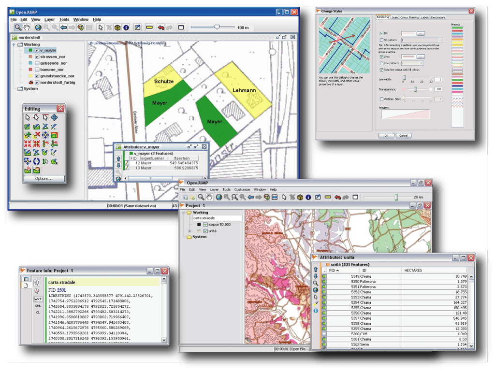

:Author: OSGeo-Live
:Reviewer: Cameron Shorter, LISAsoft
:Version: osgeo-live4.0
:License: Creative Commons Attribution 3.0 Unported (CC BY 3.0)

.. _openjump-overview:

.. image:: ../../images/project_logos/logo-openjump.png
  :scale: 100 %
  :alt: project logo
  :align: right
  :target: http://www.openjump.org

OpenJUMP GIS
================================================================================

Λογισμικό GIS
~~~~~~~~~~~~~~~~~~~~~~~~~~~~~~~~~~~~~~~~~~~~~~~~~~~~~~~~~~~~~~~~~~~~~~~~~~~~~~~~
 
Το OpenJUMP είναι ένα λογισμικό GIS, ευκολο στη χρήση που επιτρέπει στους χρήστες του την επεξεργασία, ανάλυση, αποθήκευση και οπτικοποίηση γεωγραφικών δεδομένων.
Είναι επιπλέον ένα εξαιρετικό περιβάλλον για την ανάπτυξη νέων αλγορίθμων σε περιβάλλον GIS.

Βασικά Χαρακτηριστικά
--------------------------------------------------------------------------------

* Πρότυπα δεδομένων

    * Ανάγνωση αρχείων: GML, SHP, DXF*, JML, MIF* & TIFF, JPG, MrSID, ECW
    * Ανάγνωση βάσεων δεδομένων: PostGIS, ArcSDE*, Oracle* και MySQL*
    * Εγγραφή: GML, SHP, DXF*, PostGIS*, JML & JPG
    * Υποστήριξη: OGC WMS & WFS (-T), GML 2, SLD
    * Τα πρότυπα που σημειώνονται με (*) παρέχονται με κάποιο πρόσθετο

* Επεξεργασία και Συγκερασμός δεδομένων

    * Σχεδιασμός σημείων, γραμμών, πολυγώνων και κύκλων
    * Προσθήκη, μετακίνηση και διαγραφή κόμβων
    * Περιστροφή, κλίμακα, και αυτόματη συμπλήρωση πολυγώνων
    * Αποκοπή, συνένωση, γενίκευση πολυγώνων και γραμμών
    * Μετασχηματισμός και εργαλεία ελέγχου ποιότητας*

* Ανάλυση και Ερωτήματα

    * Συναρτήσεις περιγραφικών και χωρικών ερωτημάτων
    * Υπολογισμός μηκών, εμβαδών, κεντροειδούς, ζώνης επιροής...
    * Εργαλεία τοπολογίας: line noder, polygonizer, planar graph,...
    * Εργαλεία μεταφοράς περιγραφικών χαρακτηριστικών (μεταφορά 1:1, ή n:1)
    * Ανάλυση εικονιστικών δεδομένων μέσω της σύνδεσης με SEXTANTE

* Ανάπτυξη

    * Παρέχει προγραμματιστική διεπαφή, δυνατότητα scripting μέσω BeanShell και Java Python
    * Σύστημα προσθέτων Java
   

Υλοποιημένα Πρότυπα
--------------------------------------------------------------------------------

.. Συμβουλή: Δημιουργία λίστας σχετικά με τα υποστηριζόμενα πρότυπα.

* Υποστήριξη προτύπων OGC: GML 2, SFS, WMS, WFS, WFS-T, SLD

Λεπτομέρειες
--------------------------------------------------------------------------------

**Κεντρική Ιστοσελίδα:** http://www.openjump.org

**Άδεια:** GPL

**Έκδοση Λογισμικού:** 1.4.0.1

**Υποστηριζόμενες πλατφόρμες:** Windows, Linux, Mac, Unix

**Υποστήριξη από την κοινότητα:** http://www.openjump.org/support.html

**Εμπορική Υποστήριξη:** http://sourceforge.net/apps/mediawiki/jump-pilot/index.php?title=Professional_Support_Page

Γρήγορη εκκίνηση
--------------------------------------------------------------------------------
    
* :doc:`Εγχειρίδιο γρήγορης εκκίνησης <../quickstart/openjump_quickstart>`

