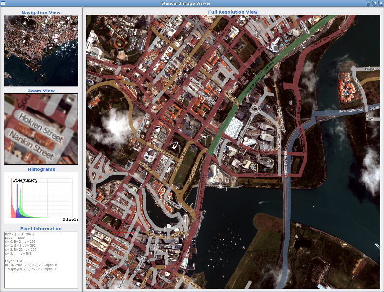

:Author: OSGeo Live
:Version: osgeo-live4.0
:License: Creative Commons

.. _otb-overview:

.. image:: ../../images/project_logos/logo-otb.png
  :scale: 100 %
  :alt: project logo
  :align: right
  :target: http://www.orfeo-toolbox.org/

.. image:: ../../images/logos/OSGeo_project.png
  :scale: 100 %
  :alt: OSGeo Project
  :align: right
  :target: http://www.osgeo.org

OTB
===

Ανάλυση Εικόνας - Τηλεπισκόπηση
~~~~~~~~~~~~~~~~~~~~~~~~~~~~~~~

Το ORFEO Toolbox (OTB) είναι ένα σύνολο εργαλείων (βιβλιοθήκη) λογισμικού ανάλυσης εικόνας υψηλών επιδόσεων. Η βασική του χρήση είναι για την επεξεργασία τηλεπισκοπικών απεικονίσεων όπως αυτές που συλλέγονται από ραντάρ, δορυφορικούς τηλεπισκοπικούς δέκτες και αερομεταφερόμενους δέκτες (αεροφωτογραφίες). Το OTB παρέχει εργαλεία για οπτικές εικόνες και εικόνες ραντάρ (τρισδιάστατες προοπτικές, ανίχνευση μεταβολών, ανάλυση υφής, συνταύτιση προτύπων, συγχώνευση οπτικών δεδομένων και εικόνων ραντάρ).

Το OTB ιδρύθηκε από τη Γαλλική Υπηρεσία Διαστήματος (CNES) στα πλαίσια του Μεθοδολογικού Μέρους του 
προγράμματος ORFEO. Είναι υπό ενεργή ανάπτυξη από το 2006.
Το OTB βασίζεται στην καθιερωμένη βιβλιοθήκη ιατρικής ανάλυσης εικόνας ITK και είναι ελεύθερο λογισμικό. 

Βασικά Χαρακτηριστικά
---------------------

* Πρόσβαση εικόνων: Βελτιστοποιημένη είσοδος/έξοδος εικόνας για τα πιο καθιερωμένα ψηφιακά πρότυπα εικόνων τηλεπισκόπησης, πρόσβαση σε μεταδεδομένα και οπτικοποίηση
* Ορθοαναγωγή και χαρτογραφικός μετασχηματισμός εικόνων 
* Βαθμονόμηση
* Συγχώνευση εικόνων
* Φιλτράρισμα εικόνων: χαμηλοπερατά φίλτρα, μείωση θορύβου, ενίσχυση εικόνας
* Εξαγωγή χαρακτηριστικών: σημεία ενδιαφέροντος, γραμμώσεις, γραμμές
* Ανίχνευση αντικειμένων
* Κατάτμηση εικόνας: Αλγόριθμοι αύξησης περιοχών (region growing), μετασχηματισμού υδροκρίτη (watershed), επιπεδοσύνολα (level sets)
* Ταξινόμηση: Αλγόριθμοι Κ-κέντρων (K-means), Μηχανές Διανυσμάτων Στήριξης (SVM), Τυχαία Πεδία Markov (Markov random fields)
* Αντικειμενοστρεφής Ανάλυση Εικόνας (OBIA)
* Χωρική ανάλυση
* Ανάλυση δεδομένων SAR
* Ανίχνευση μεταβολών

Λεπτομέρειες
------------

**Κεντρική Ιστοσελίδα:** http://www.orfeo-toolbox.org/

**Άδεια:** CeCILL (Η άδεια CeCILL είναι συμβατή με την άδεια GPL και έχει προκύψει για προσαρμογή στο Γαλικό Δίκαιο)

**Έκδοση Λογισμικού:** 3.10

**Υποστηριζόμενες Πλατφόρμες:** Linux, Mac, Windows

**Προγραμματιστικές Διεπαφές:** C++

**Εμπορική Υποστήριξη:** http://www.osgeo.org/search_profile

Γρήγορη Εκκίνηση
----------------

* 'Εγχειρίδιο Γρήγορης Εκκίνησης <../quickstart/otb_quickstart.html>`_

