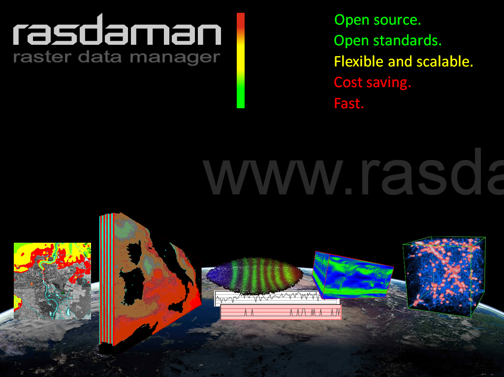

:Συγγραφέας: Peter Baumann , Michael Owonibi
:Έκδοση: osgeo-live4.5
:Άδεια: Creative Commons

.. _rasdaman-overview:

.. image:: ../../images/project_logos/logo-rasdaman.png
  :scale: 100 %
  :alt: project logo
  :align: right
  :target: http://rasdaman.org

********
Rasdaman
********

Πολυδιάστατη Βάση Πινακοποιημένων Δεδομένων
=================================
Το Rasdaman επεκτείνει τις κλασικές σχεσιακές βάσεις δεδομένων ώστε να αποθηκεύουν και να βοηθούν στην ανάκτηση πολυδιάστατων πινακοποιημένων δεδομένων χωρίς περιορισμό σε διαστάσεις, με τη χρήση εντολών παρόμοιων με τη γλώσσα SQL προσαρμοσμένη στα εικονιστικά δεδομένα με βελτιστοποιήσεις στην μεριά του εξυπηρετητή. Τα δεδομένα αποθηκεύονται σε βάση δεδομένων PostgreSQL, με τρόπο που να επιτυγχάνεται εύκολη διασύνδεση της πληροφορίας με άλλες εφαρμογές. Επομένως το Rasdaman παρέχει μια άριστη υπηρεσία εικονιστικών δεδομένων για συστήματα GIS, διαδικτυακή χαρτογραφία, και ανάλυση χώρου.

Η τεχνολογία rasdaman είναι σταθερή, ώριμη, και χρησιμοποιείται σε περιβάλλον παραγωγής για περισσότερο από 10 χρόνια. Για παράδειγμα, Η Γαλλική Εθνική Γεωγραφική Υπηρεσία χρησιμοποιεί το rasdaman σε έναν ορθοφωτοχάρτη 12 Terabyte.

Βασικά Χαρακτηριστικά
-------------

    * Πραγματικά πολυδιάστατη τεχνολογία - από 1-D έως 2-D, 3-D, 4-D, και περισσότερο
    * Πλήρης ολοκλήρωση πληροφοριών των εικονιστικών δεδομένων με άλλα γεωγραφικά δεδομένα
    * Ισχυρή, ευέλικτη γλώσσα ερωτημάτων, που επιτρέπει ταξινόμηση, συνέλιξη, συσχέτιση και πολλές ακόμα χωρικές λειτουργίες
    * Μετάδοση τετραγωνιδίων για κλιμακωτές και βελτιστοποιημένες επιδόσεις σε μέτρια υπολογιστικά συστήματα από πλευράς υλικού
    * Υποστήριξη πολλών χρηστών μέσω διασύνδεσης εξυπηρετητών
    * Χωρικά ευρετήρια για γρήγορη πρόσβαση στα δεδομένα
    * Πολλές εφαρμογές έχουν πρόσβαση σε δεδομένα rasdaman μέσω του οδηγού rasdaman που περιλαμβάνεται στην βιβλιοθήκη Geographic Data Abstraction Library (GDAL)
    * Ο MapServer μπορεί να ρυθμιστεί ώστε να παρέχει πρόσβαση στα δεδομένα rasdaman σαν υπηρεσία WMS (σε δοκιμαστικό στάδιο)

Υλοποιημένα πρότυπα
---------------------

    * OGC WCS 2.0, WCPS 1.0, WPS 1.0

Λεπτομέρειες
-------

**Κεντρική Ιστοσελίδα:** http://rasdaman.org

**Άδεια:** 

* Εφαρμογές πελάτες και petascope: GNU Lesser General Public License (LGPL) έκδοση 3
* Μηχανή Εξυπηρετητή Rasdaman: GNU General Public License (GPL) έκδοση 3

**Έκδοση Λογισμικού:** 8.1

**Υποστηριζόμενες Πλατφόρμες:** Linux, Mac, Solaris

**Προγραμματιστικές Διεπαφές:** RASQL, C++, Java

**Υποστήριξη:**  http://rasdaman.com
