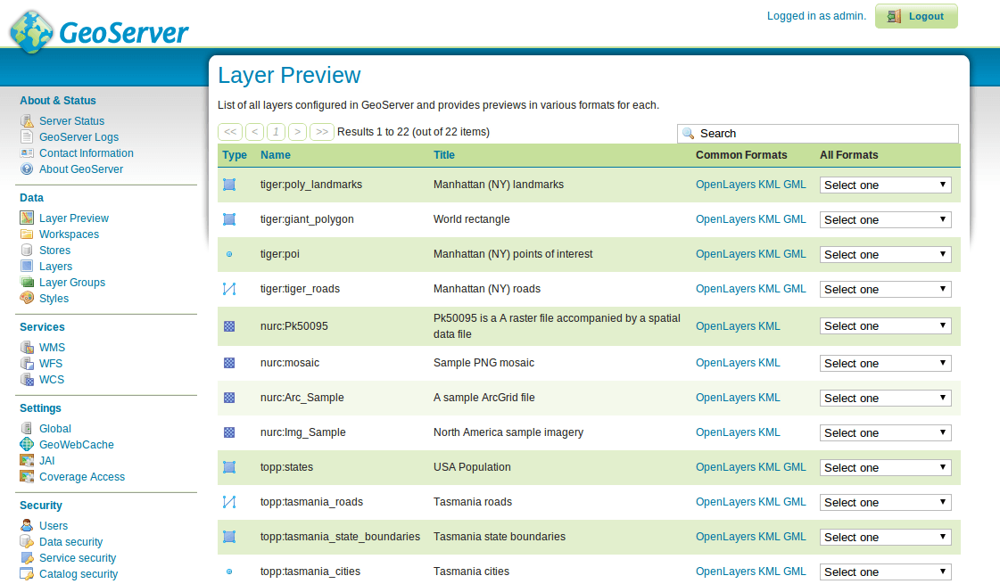

:Author: Ian Turton
:Version: osgeo-live4.0
:License: Creative Commons
:Thanks: geoserver-user list

.. |GS| replace:: GeoServer
.. |PG| replace:: PostGIS
.. |UG| replace:: uDig 
.. |OL| replace:: OpenLayers

.. _geoserver-quickstart:
 
.. image:: ../../images/project_logos/logo-GeoServer.png
  :alt: project logo
  :align: right

***************************************
Εγχειρίδιο Γρήγορης Εκκίνησης GeoServer
***************************************

Ο GeoServer είναι μια εφαρμογή Java. Είναι ένας εξυπηρετητής χαρτών και δεδομένων ώστε αυτά να οπτικοποιούνται σε λογισμικά πελάτες.

Οι συγκεκριμένες οδηγίες περιγράφουν πώς:

  * Προσθέτουμε μια πηγή δεδομένων (διανυσματικών ή εικονιστικών) στον GeoServer
  * Εφαρμόζουμε χρώμα στα χαρακτηριστικά του χάρτη με τη χρήση στύλ
  * Δοκιμάζουμε τα επίπεδα πληροφορίας σε μια δοκιμαστική διαδικτυακή εφαρμογή
  * Μαθαίνουμε σχετικά με τους πελάτες που μπορούν να απεικονίσουν τους χάρτες που δημιουργούνται

Εκκίνηση |GS|
=============

#. Επιλέξτε το εικονίδιο "Start GeoServer".
#. Η εφαρμογή θα ξεκινήσει σε λίγες στιγμές Πηγαίνετε στην κεντρική ιστοσελίδα του GeoServer στο http://localhost:8082/geoserver/web 

.. image:: ../../images/screenshots/800x600/geoserver-login.png
    :width: 90 %
    :align: left


Πρώτες οθόνες
=============

Όταν ξεκινήσετε την σελίδα του GeoServer θα δείτε την παραπάνω οθόνη, το πρώτο πράγμα που χρειάζεται να κάνετε είναι να για εισάγετε τα στοιχεία του χρήστη σας με τη χρήση του ονόματος χρήστη και κωδικού πρόσβασης. Θα δείτε στη συνέχεια την *σελίδα διαχείρησης* 

.. image:: ../../images/screenshots/800x600/geoserver-welcome.png
    :width: 90%
    :align: left

Ο σύνδεσμος **Layer Preview** στο κάνω αριστερό μενού σας επιτρέπει να δείτε μια προεπισκόπηση των επιπέδων των δεδομένων που είναι φορτωμένα στον εξυπηρετητή. 
  


Κυλίστε στο κάτω μέρος της οθόνης και κάντε κλικ στον σύνδεσμο **OpenLayers** στην γραμμή **tiger-ny**, αυτό θα ανοίξει ένα νέο παράθυρο με μερικά δοκιμαστικά δεδομένα μέσα του. 

.. image:: ../../images/screenshots/800x600/geoserver-preview.png
    :width: 90%
    :align: left
    
Μπορείτε να μεγενθύνετε στον χάρτη με τρείς τρόπους:

        * Με κλικ στη μπάρα μεγέθυνσης αριστερά, όσο ψηλότερα κάνετε κλίκ σε αυτή τόσο μεγαλύτερη μεγέθυνση πετυχαίνετε.

        * Με τη χρήση της ρόδας του ποντικιού σας, η κίνηση πρός τα πάνω κάνει μεγέθυνση και η κίνηση προς τα κάτω κάνει σμίκρυνση.

        * Ζωγραφίζοντας ένα πολύγωνο στο χάρτη ενώ ταυτόχρονα κρατάτε πατημένο το κουμπί  :kbd:`shift key` - αυτό θα σας μεγενθύνει στην περιοχή που επιλέξατε με το πολύγωνο (ή όσο κοντά γίνεται με βάση την οθόνη σας).

#. Πειραματιστείτε με αυτή την απεικόνιση σε μερικές άλλες δοκιμαστικές εφαρμογές.  Όταν τελειώσετε με αυτή την εκμάθηση, μπορείτε να συνεχίσετε στο πως θα προσθέσετε νέα δεδομένα.

Φόρτωση δεδομένων
=================

.. note::
    Δεν θα μπορέσετε να εκτελέσετε τα επόμενα βήματα εαν
    εργάζεστε σε σύστημα αρχείων με δυνατότητα μόνο ανάγνωσης (όπως στο live DVD). Θα χρειαστεί
    είτε να εγκαταστήσετε το GeoServer από το DVD στον
    σκληρό σας δίσκο ή να δημιουργήσετε ένα σύστημα βασισμένο σε στίκ USB.

Σε αυτό το παράδειγμα θα χρησιμοποιήσουμε τα δεδομένα :doc:`Natural Earth <../overview/naturalearth_overview>` 
τα οποία περιλαμβάνονται στο DVD (:file:`/usr/local/share/data/natural_earth/`).

Αρχικά χρειάζεται να αντιγράψουμε τα δεδομένα στο φάκελο δεδομένων του GeoServer
(:file:`/usr/lib/geotools-2.0.2/data_dir/data`). Δημιουργήσαμε ένα φάκελο 
με όνομα :file:`naturalearth`. Χρησιμοποιήσαμε ένα παράθυρο τερματικού, αλλά εσείς μπορείτε να επιλέξετε
και μια εφαρμογή διαχείρισης αρχείων αν το προτιμάτε.  ::

        cd /usr/lib/geotools-2.0.2/data_dir/data
        mkdir naturalearth
        cp /usr/local/share/data/natural_earth/* naturalearth
     

Τώρα χρειαζόμαστε να δημιουργήσουμε μια αποθήκη (Store) για τα δεδομένα μας. Από τη σελίδα διαχείρισης |GS| πηγαίνετε στο 
:guilabel:`Stores` και επιλέξτε :guilabel:`Add new Store`. Θα δείτε αυτή την σελίδα:

.. figure:: ../../images/screenshots/800x600/geoserver-newstore.png
    :align: center
    :width: 90%
    
    *Η σελίδα της νέας αποθήκης δεδομένων*

Επιλέξτε το :guilabel:`Directory of spatial files`, και θα δείτε το επόμενο: 

.. figure:: ../../images/screenshots/800x600/geoserver-new-vector.png
    :align: center
    
    *Συμπληρώνοντας την σελίδα νέας αποθήκης δεδομένων*

Πληκτρολογήστε ένα όνομα για την νέα αποθήκη - χρησιμοποιήσαμε το *Natural Earth* και συμπληρώστε την διεύθυνση 
για τα δεδομένα - σε αυτή την περίπτωση :file:`data/naturaleath`. Η διεύθυνση
των δεδομένων πρέπει να είναι σχετική με την θέση του φακέλου δεδομένων του |GS|. Πιέστε :guilabel:`save`.

.. figure:: ../../images/screenshots/800x600/geoserver-naturalearth.png
    :align: center 
    :width: 100%

    *Η αποθήκη δεδομένων Natural Earth*

Πιέστε :guilabel:`publish` δίπλα από το επίπεδο που επιθυμείτε για να ολοκληρώσετε την προσθήκη των δεδομένων. Αυτό θα σας οδηγήσει στην σελίδα των επιπέδων (*Layers*):

.. figure:: ../../images/screenshots/800x600/geoserver-publish.png
    :align: center
    :width: 90%

    *Η σελίδα επιλογής επιπέδων*

Εαν κυλήσετε τη σελίδα θα προσέξετε ότι ο |GS| έχει συμπληρώσει πολλά πεδία για εσάς. Όταν φτάσετε το  :guilabel:`Coordinate Reference System`
θα παρατηρήσετε ότι κάτω από το *Native SRS* έχει την ένδειξη UNKNOWN 
και θα χρειαστεί να συμπληρώσετε το επόμενο πεδίο (*declared SRS*) για να σιγουρευτήτε πως ο |GS|
γνωρίζει που βρίσκονται τα δεδομένα. Για την ώρα εμπιστευθείτε μας και πληκτρολογήστε epsg:4326 στο πεδίο,
ή πηγαίνετε στο `http://prj2epsg.org/search` και συμπληρώστε το κείμενο που βλέπετε 
αν κάνετε κλικ δίπλα στην ένδειξη "UNKNOWN".
Στη συνέχεια πιέστε το :guilabel:`Compute from data` και :guilabel:`Compute from
native bounds` ώστε να συμπληρωθούν αυτόματα τα όρια της έκτασης των δεδομένων. Στο τέλος επιλέξτε :guilabel:`save`
και έχετε δημοσιεύσει το πρώτο σας επίπεδο.

.. note::
    Εαν δείτε το επίπεδο αυτό στην προεπισκόπηση δεν εμφανίζεται πολύ ωραία
    γιατί χρησιμοποιεί το προεπιλεγμένο στύλ. Στη επόμενη παράγραφο
    θα δούμε πως να παράγουμε πιο ωραίο αισθητικό αποτέλεσμα.
    
Δημιουργία στύλ
---------------

Για τη διαμόρφωση στύλ ενός επιπέδου χάρτη στον |GS| χρησιμοποιείται ένα πρότυπο του OGC που ονομάζεται
Styled Layer Descriptors (SLD). Αυτό αναπαρίσταται σε αρχεία XML
τα οποία περιγράφουν τους κανόνες που χρησιμοποιούνται για να εφαρμοστούν συμβολισμοί στα δεδομένα.

Για αρχή δημιουργήθηκε το σύνολο δεδομένων Γης και Ωκεανών. 
Μπορείτε να δημιουργήσετε SLD αρχεία με τη χρήση ενός επεξεργαστή κειμένου, αλλά ορισμένες φορές
ένα γραφικό περιβάλλον είναι καλύτερο. Υπάρχουν πολλές εναλλακτικές γι αυτό. Επιλέξαμε να χρησιμοποιήσουμε το 
|UG| (http://udig.refractions.net/) το οποίο μας επιτρέπει 
να ανοίγουμε τα shapefiles κατευθείαν και να δημιουργούμε απλά στύλ
με τη χρήση γραφικού περιβάλλοντος, αλλά επίσης και με έναν απλό επεξεργαστή κειμένου αν χρειαστεί. 

Χρησιμοποιώντας το |UG| για τη δημιουργία απλών στύλ
````````````````````````````````````````````````````

.. note::
   Για περισσότερες λεπτομέρειες για τη χρήση του |UG| δείτε το :doc:`uDig quickstart <../quickstart/udig_quickstart>`

Ανοίγουμε το |UG| και προσθέτουμε τα shapefiles (με τη χρήση του κουμπιού
add data πάνω αριστερά). Προσθέτουμε τα επίπεδα 10m_land
και 10m_ocean στο παράθυρο του χάρτη. Το |UG| αυτόματα εφαρμόζει ένα απλό στύλ
για να μπορείτε να δείτε τα δεδομένα.

.. figure:: ../../images/screenshots/800x600/geoserver-udig_startup.png
   :align: center
   :width: 90%

   *Βασικό στύλ στο UDig*

Προφανώς δεν θέλουμε να κρατήσουμε πορτοκαλί χρώμα στον ωκεανό. Επομένως στην  :ref:`λίστα επιπέδων <Layer_list_el>` επιλέξτε το κουμπί στύλ (μοιάζει με παλέτα ζωγράφου). 

.. _Layer_list_el:
.. figure:: ../../images/screenshots/800x600/geoserver-layer-chooser.png
   :align: center

   *Το παράθυρο λίστας επιπέδων*


Αυτό θα ανοίξει το :ref:`παράθυρο στύλ <Style_Pane_el>` - και σε αυτό το παράθυρο μπορείτε να επιλέξετε ένα
ωραίο μπλέ για τους ωκεανούς κάνοντας κλίκ στο χρωματιστό κουτί
επιλέγοντας το χρώμα με το κατάλληλο εργαλείο που εμφανίζεται. Επιπλέον
μπορείτε να αυξήσετε την αδιαφάνεια στο 100% για να εμφανίζεται καλύτερα το χρώμα. 

.. _Style_Pane_el:
.. figure:: ../../images/screenshots/800x600/geoserver-style-pane.png
   :align: center

   *Το παράθυρο στύλ*


Με το τέλος της διαδικασίας επιλέξτε ``OK`` και το |UG| εμφανίζει τις αλλαγές. 


.. figure:: ../../images/screenshots/800x600/geoserver-blue-ocean.png
   :align: center
   :width: 90%

   *Μπλέ Ωκεανοί*

Τελικά, μπορείτε να επαναλάβετε τα παραπάνω βήματα για να αλλάξετε το χρώμα για το επίπεδο της ξηράς.
Επιπλέον μπορείτε να ορίσετε δική σας απόχρωση αν τα βασικά χρώματα δεν σας ικανοποιούν από το ``define custom colors``.

.. figure:: ../../images/screenshots/800x600/geoserver-custom-colour.png
   :align: center

   *Ορίζοντας καλύτερο χρώμα για την ξηρά*

Με αυτές τις αλλαγές έχουμε καλύτερο αποτέλεσμα στο χάρτη

.. figure:: ../../images/screenshots/800x600/geoserver-basic-world.png
   :align: center
   :width: 90%

   *Ένας βασικός χάρτης της Γής*

Μεταφέροντας το στύλ στον |GS|
``````````````````````````````

Τώρα χρειάζεται να μεταφέρουμε τα στύλ στον |GS| - στο παράθυρο στύλ
υπάρχει κουμπί εξαγωγής (export) το οποίο μας επιτρέπει να σώσουμε το στύλ σε αρχείο SLD. Σώζουμε και τα 2 στύλ μπορούμε να μεταφερθούμε στον |GS|
στη σελίδα διαχείρισης και επιλέγοντας το κουμπί ``Styles`` (στο τέλος της περιοχής ``Data``). Επιλέγουμε τον σύνδεσμο ``Add New Style``, στο κάτω μέρος αυτής της σελίδας
και υπάρχει ένα πλαίσιο μεταφόρτωσης και ενα κουμπί περιήγησης. Πιέζοντας το κουμπί εντοπίζουμε τα αρχεία SLD που σώσαμε προηγουμένως. Όταν τα εντοπίσουμε, κάνουμε κλικ στο σύνδεσμο μεταφόρτωσης (δίπλα στο κουμπί περιήγησης) και το αρχείο εμφανίζεται τον επεξεργαστή. 

.. figure:: ../../images/screenshots/800x600/geoserver-add-style.png
   :align: center
   :width: 90%

   *Προσθέτοντας ένα στύλ στον GeoServer*


Προσθέτοντας το στύλ στο επίπεδο
--------------------------------

Κάνουμε κλικ στο σύνδεσμο :guilabel:`Layers` στο μενού στα σριστερά του παραθύρου του 
|GS|. Κάνουμε κλίκ στο επίπεδο (π.χ. *10m_land*), και έπειτα επιλέγουμε τη σελίδα
:guilabel:`Publishing` και αλάζουμε το πλαίσιο :guilabel:`Default Style`
στο όνομα του στύλ σε αυτό που μεταφορτώσαμε προηγουμένως.
Στη συνέχεια πηγαίνοντας στη σελίδα προεπισκόπησης ελέγχουμε αν ο χάρτης μας δείχνει ωραίος.

.. TBD check where app-data ends up

There are example style files for all of the example Natural Earth
layers in :file:`/usr/local/share/geoserver`. 

.. TBD (needs more memory)
    Προσθέτοντας μια εικόνα
    ===============

    Στο φάκελο Natural Earth υπάρχει ένας φάκελος με όνομα :file:`HYP_50M_SR_W` το οποίο
    περιλαμβάνει μια εικόνα. Μπορούμε να σερβίρουμε αυτή την εικόνα στον |GS| εφόσον
    πάμε στην σελίδα αποθηκών δεδομένων και επιλέξουμε :guilabel:`New Stores->World
    Image` και πληκτρολογήσουμε
    *file:/home/user/data/natural_earth/HYP_50M_SR_W/HYP_50M_SR_W.tif*
    στο πλαίσιο :guilabel:`URL`.

    .. figure:: ../../images/screenshots/800x600/geoserver-raster.png
        :align: center
        :width: 90%

        *Προσθέτοντας μια εικόνα*

    Κάνοντας κλίκ στο σύνδεσμο :guilabel:`Save` θα μεταφερθούμε στην επιλογή *New Layers
    Chooser* και στη συνέχεια επιλέγουμε publish και :guilabel:`Save` για να ολοκληρώσουμε την προσθήκη
    της εικόνας. Εαν επιστρέψουμε στην σελίδα προεπισκόπησης
    μπορούμε να δούμε την νέα εικόνα. 


Εφαρμογές πελάτες για επίπεδα WMS
=================================

Υπάρχουν πολλές εφαρμογές που μπορούν να εμφανίσουν τα επίπεδα WMS που σερβίρει ο 
|GS|. Αυτή είναι μια μικρή λίστα με μερικά από αυτά 

    * :doc:`uDig <../overview/udig_overview>`

    * :doc:`OpenLayers <../overview/openlayers_overview>`

    * :doc:`Atlas Styler <../overview/atlasstyler_overview>`

    * :doc:`MapBender <../overview/mapbender_overview>`

