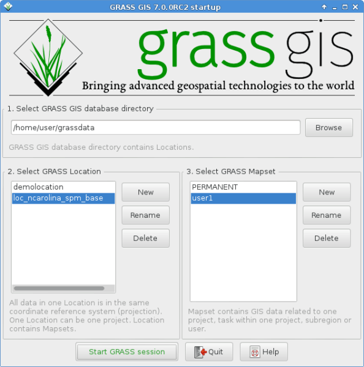

Συγγραφεας: Hamish Bowman
Έκδοση: osgeo-live4.0
 Άδεια: Creative Commons

.. _grass-quickstart:
 
.. image:: ../../images/project_logos/logo-GRASS.png
  :scale: 100 %
  :alt: project logo
  :align: right
  :target: http://grass.osgeo.org

********************
Εγχειρίδιο Γρήγορης Εκκίνησης GRASS GIS
********************

Τρέχοντας το πρόγραμμα
~~~~~~~~~~~~~~~

Για να τρέξετε το GRASS στο Live DVD, κάνετε κλικ στη συντόμευση του GRASS στην επιφάνεια εργασίας.
Από το  "Welcome to GRASS" (παράθυρο καλωσορίσματος) επιλέξτε το αρχείο δεδομένων Spearfish ή το North
Carolina (nc_spm_08) για την τοποθεσία, και "user1" για το αρχείο χάρτη mapset,
και κάντε κλικ στο [Start Grass].

Αυτό θα ξεκινήσει το GRASS με το νέο γραφικό περιβάλλον υλοποιημένο σε wxPython. Κατά την περίοδο της δημιουργίας του OSGeo-Live είχαμε αντιμετωπίσει σχεδόν όλα τα "προβλήματα" και ήμασταν κοντά στο να πούμε την έκδοση (GRASS 6.4.0) τελική. Το παλιό 
Tcl/Tk γραφικό περιβάλλον είναι ακόμα διαθέσιμο. Εάν επιθυμείτε να το χρησιμοποιήσετε, μπορείτε να ξεκινήσετε γράφοντας ``g.gui --ui`` στη γραμμή εντολών.

Εάν είστε σε ένα φορητό υπολογιστή (netbook) με χαμηλή ανάλυση (800x600 ανάλυση)
η οθόνη εκκίνησης μπορεί να είναι λίγο συμπιεσμένη και το κουμπί [Start GRASS]
κρυμμένο πίσω από τα σημεία: location και mapset lists του γραφικού περιβάλλοντος. Εάν αυτό σας συμβαίνει, η λύση είναι να σύρετε την γωνία του παραθύρου για να το κάνετε λίγο μεγαλύτερο. Μπορεί να χρειάζεται να μετακινήσετε το παράθυρο προς το πάνω τμήμα της οθόνης για να κερδίσετε χώρο (κρατήστε πατημένο το πλήκτρο Alt και με δεξί κλικ σύρετε το παράθυρο για να το μετακινήσετε).

Παρουσιάζοντας χάρτες
~~~~~~~~~~~~~~~

.. image:: ../../images/screenshots/800x600/grass-layerman.png
  :scale: 50 %
  :alt: screenshot
  :align: left

Όταν πια έχετε μπεί στο πρόγραμμα, προσθέστε ένα επίπεδο με χάρτη σε μορφή εικόνας, όπως είναι το "`elevation`" από το PERMANENT
mapset. Για να το κάνετε αυτό, πηγαίνετε στο παράθυρο the GIS Layer Manager και κάνετε κλικ στο κουμπί με το a "+"  σε αυτό στο πλαίσιο γραμμής εργαλείων.  Τότε επιλέξτε το όνομα χάρτη που επιθυμείτε από την αναδιπλούμενη λίστα  "*map to be displayed*"  και κάντε κλικ στο [Ok].

Κατά τον ιδιο τρόπο προσθέτετε το διανυσματικό επίπεδο "`roads`" από το PERMANENT
mapset κάνοντας κλικ στο κουμπί της μπάρας εργαλείων με το a "+" και μια πολλαπλή γραμμή
που μοιάζει περισσότερο με ένα "V".

Από τη γραμμή εργαλείων του παραθύρου επισκόπησης χάρτη (Map Display window) κάντε κλικ στο κουμπί eyeball για να δημιουργηθεί η όψη.

Τώρα θα πρέπει να μπορείτε να δείτε τους χάρτες.

Εκτύπωση προφίλ υψομέτρου
~~~~~~~~~~~~~~~

.. image:: ../../images/screenshots/800x600/grass-profile.png
  :scale: 50 %
  :alt: screenshot
  :align: right

Πίσω στο παράθυρο GIS Layer Manager κάντε κλικ στο  `elevation` raster
map name για να το επιλέξετε. Στο παράθυρο επισκόπησης χάρτη (Map Display window), στα δεξιά των κουμπιών μεγέθυνσης στη γραμμή εργαλείων Map Display, βρίσκεται ένα εικονίδιο με ένα γραμμικό γράφημα και μια σκακιέρα σε αυτό. Κάντε κλικ σε αυτό και επιλέξτε **Profile Surface Map**.
Εάν δεν καταγράφεται αυτόματα, τότε επιλέξτε ξανά ένα elevation map σάν επίπεδο χάρτη και πατήστε [Ok]. Το δεύτερο κουμπί προς τα μέσα από αριστερά, επιτρέπει τον καθορισμό της γραμμής προφίλ (profile line). Κάντε κλικ σε αυτό τότε μαρκάρετε μερικά σημεία στην περιοχή Map
Display. Όταν ολοκηρωθεί και αυτό πηγαίνετε πίσω στο παράθυρο Profile και κάντε κλικ στο κουμπί eyeball για να δημιουργήσετε το αρχείο προς εκτύπωση. Κάντε κλικ στο κουμπί I/O πάνω δεξιά για να κλείσετε το παράθυρο profile.

Δημουργήστε μια τυχαία επιφάνεια
~~~~~~~~~~~~~~~~~~~~~~~

Τώρα ας δημιουργήσουμε ένα χάρτη. Επιλέξτε :Μενού:`Raster --> Generate 
surfaces --> Fractal surface` από το μενού (κοντά στο κάτω μέρος);
δώστε στο νέο σας χάρτη ένα όνομα, προσαρμόστε τις επιλογές σας στη σελίδα Options
(τα προεπιλεγμένα είναι μια χαρά); και κάντε κλικ στο [Run]. Τότε μπορείτε να κλείσετε  [Close] το παράθυρο διαλόγου του module *r.surf.fractal*.

.. image:: ../../images/screenshots/800x600/grass-fractal.png
  :scale: 50 %
  :alt: screenshot
  :align: right

Προσαρμογή των χρωμάτων
~~~~~~~~~~~~~

Τώρα προσθέστε το νέο σας επιπεδο εικόνας στη λίστα επιπέδων οπως κάνατε προηγουμένως με τον χάρτη υψομέτρου. Ωστόσο, αυτή τη φορά θα είναι στο "user1"
mapset εργασίας. Μπορείτε αν θέλετε τώρα να ξεκλικάρετε το επίπεδο υψομέτρου από το σχετικό κουτί έτσι ώστε να μην αλληλοεπικαλύπτονται τα δύο μεταξύ τους. Κάντε κλικ στο eyeball για να δείτε το νέο σας χάρτη.
Τα χρώματα μπορεί να μην είναι όπως σας αρέσουν οπότε ας τα αλλάξουμε. Με το ακανόνιστο ψηφιακό μοντέλο εδάφους επιλεγμένο στη λίστα επιπέδων,στο`Raster` μενου, επιλέγετε :Μενού:`Manage colors --> Color Tables`.
Στην καρτέλα "Colors" κάντε κλικ στην αναδιπλούμενη λίστα για την επιλογή "Type of color
table" option, και πάρτε ένα από τη λίστα. "srtm" είναι μια καλή επιλογή. Όταν ολοκληρώσετε, κάντε κλικ στο κουμπί [Run] και κλείστε το παράθυρο διαλόγου  *r.colors* dialog window.

Επειδή έχετε τροποποιήσει τα μεταδεδομένα του χάρτη, θα πρέπει αυτή τη φορά να ξαναφτιάξετε από την αρχή νέα επισκόπηση του χάρτη. Οπότε, κάντε κλικ στο μικρό κουμπί της ανανέωσης, δίπλα στο κουμπί eyeball, προκειμένου να επανασχεδιαστούν τα επίπεδα και τότε θα μπορείτε να δείτε το χάρτη σας με τα νέα του χρώματα.
  
Δημιουργία "σκιασμένου" ανάγλυφου χάρτη
~~~~~~~~~~~~~~~~~~~~~~~~~~

.. image:: ../../images/screenshots/800x600/grass-shadedrelief.png
  :scale: 50 %
  :alt: screenshot
  :align: right

Στη συνέχεια θα δημιουργήσουμε ένα "σκιασμένο" ανάγλυφο χάρτη των επιπέδων υψομέτρου που είδαμε προηγουμένως. Ξεκινήστε καθορίζοντας ότι η υπολογιστική περιοχή έχει φτιαχτεί ώστε να ταιριάζει με το "υψόμετρο" στο PERMANENT mapset του χάρτη σε μορφή εικόνας. Για να το κάνετε αυτό, βεβαιωθείτε ότι έχει φορτωθεί στη λίστα επιπέδων του βασικού Παραθύρου Διαχείρισης Επιπέδων (Layer
Manager window), καντε δεξί κλικ στο όνομά του και επιλέξτε  "Set computation region
from selected map(s)". Στο μενού `Raster` επιλέξτε :Μενού:`Terrain
analysis --> Shaded relief` (Η ανάλυση εδάφους Terrain analysis είναι περιπού στη μέση), και το παράθυρο ελέγχου της ενότητας θα εμφανισθεί. Με το όνομα του χάρτη υψομέτρου επιλεγμένο σαν το στοιχείο εισόδου του χάρτη (input map) κάντε κλικ στο [Run]. Τώρα προσθέστε και το νέο elevation.shade @user1 χάρτη στη λίστα επιπέδων σας,"ξεκλικάρετε" τα άλλα επίπεδα εικόνων  και κάντε κλικ στο "μάτι" για να ξαναδημιουρήσετε μια νέα επισκόπηση του χάρτη. (Εάν βαρεθείτε να κάνετε κλικ στο "μάτι" συνεχώς, τότε μπορείτε να κάνετε "τικ" στο κουτί του "Render" κάτω δεξιά στο παράθυρο παρουσίασης του χάρτη (Map Display window) για να το ρυθμίσετε ώστε να συμβαίνει αυτόματα.

Υδροκρίτες και ρέματα
~~~~~~~~~~~~~~~~~~~~~~

Για άλλη μια φορά επιλέξτε το `elevation` στο PERMANENT χάρτη και στο μενού `Raster` επιλέξτε :Μενού:`Hydrologic modeling --> Watershed analysis`. Αυτό θα ανοίξει την ενότητα ``r.watershed`` . Ρυθμίστε το επίπεδο `elevation` σαν το χάρτη εισόδου σας (input map), στην καρτέλα 'Input Options' βάλτε το sub-basin *threshold* σε 10000 κελιά , και τότε στην καρτέλα  'Output Options' βάλτε  "elev.basins"  για την επιλογή λεκάνης του υδροκρίτη και "elev.streams" για την επιλογή τμημάτων των ρεμάτων ακριβώς κάτω από αυτό. Τότε κάντε κλικ στο [Run].

Πηγαίνετε πίσω στο παράθυρο διαχείρισης επιπέδων (Layer Manager window ) προσθέστε αυτούς τους δύο χάρτες σε μορφή εικόνας στη λίστα επιπέδων και βεβαιωθείτε ότι είναι οι μόνοι δύο που είναι επιλεγμένοι για προβολή στο κουτί αριστερά του ονόματος του επιπέδου. Κάντε δεξί κλικ στο όνομα επιπέδου του χάρτη σε μορφή εικόνας  elev.basins και επιλέξτε "Change opacity level".
Βάλτε το περίπου στο 50% και ξαναδημιουργήστε την νέα επισκόπηση του χάρτη.

.. image:: ../../images/screenshots/800x600/grass-watersheds.png
  :scale: 50 %
  :alt: screenshot
  :align: left

Στο παράθυρο διαχείρισης επιπέδων (Layer Manager window) του GIS, κάντε κλικ στο τρίτο κουμπί εσωτερικά από δεξιά για να προσθέσετε ένα επίπεδο καννάβου. Για μέγεθος καννάβου στο 0:03 για 0 βαθμούς και 3 λεπτά (ο τύπος είναι D:M:S), στην καρτέλα  "Optional" επιλέξτε Draw geographic grid, πατήστε [Run] και ξαναδημιουργήστε την νέα επισκόπηση του χάρτη.

Για να προσθέσετε γραφική κλίμακα πηγαίνετε στο παράθυρο προβολής χάρτη (the Map Display window) και πατήστε το κουμπί "Add
map elements" στα δεξιά από όπου επιλέξατε το "Profile tool" προηγουμένως και επιλέξτε "Add scalebar and north arrow". Διαβάστε τις οδηγίες και κάντε κλικ στο [Ok]. Μια γραφική κλίμακα θα εμφανιστεί τότε πάνω αριστερά. Τραβήξτε τη κάτω αριστερά. Από την ίδια μπάρα εργαλείων του μενού επιλέξτε  "Add legend" και στο παράθυρο οδηγιών (instructions window) κάντε κλικ στο κουμπί "Set Options" για να επιλέξετε το όνομα του χάρτη για να φτιάξετε το υπόμνημα. Αφου επιλέξετε ένα, κάντε κλικ στο [Ok] και ξανά [Ok]. Τραβήξτε το νέο σας υπόμνημα στη δεξιά μεριά του χάρτη.

Τώρα μπορεί να σκέφτεστε ότι τα γράμματα είναι λίγο "γυμνά".
Αυτό φτιάχνεται εύκολα από το Μενού Διαχείρισης επιπέδων  (Layer Manager menu) του GIS Layer Manager. Ανοίξτε :Μενού:`Config  --> 
Preferences` και στην καρτέλα επισκόπησης (Display tab) κάντε κλικ στο κουμπί [Set font] και μετά [Apply] iστο παράθυρο "Preferences". Θα πρέπει να ξαναδημιουργήστε την νέα επισκόπηση του χάρτη για να δέιτε τις αλλαγές, οπότε ξαναπατήστε στο κουμπί "re-render" δίπλα στο κουμπί "μάτι". Τα γράμματα θα είναι τώρα πολύ ομορφότερα.

Ενότητες διανυσματικών δεδομένων 
~~~~~~~~~~~~~~
 
Οι προαναφερθείσες εργασίες κάλυψαν μόνο μερικές ενότητες εικονιστικών δεδομένων. Μην αφήσετε αυτό να σας διαμορφώσει την άποψη ότι το πρόγραμμα GRASS προορίζεται μόνο για χάρτες σε μορφή εικόνας -- η μηχανή παρουσίασης και επεξεργασίας διανυσματικών δεδομένων
και τα πρόσθετά της είναι πλήρη όπως και τα αντίστοιχα των εικονιστικών δεδομένων. Το GRASS
υποστηρίζει ένα πλήρως τοπογραφικό διανυσματικό σύστημα το οποίο επιτρέπει όλα τα είδη των πολύ ισχυρών αναλύσεων.

3D οπτικοποίηση
~~~~~~~~~~~~~~~~

.. image:: ../../images/screenshots/1024x768/grass-nviz.png
  :scale: 30 %
  :alt: screenshot
  :align: right

Ξεκινήστε τη διαδικασία οπτικοποίησης 3D από :Menu:`File --> NVIZ`.
Επιλέξτε ένα χάρτη `elevation` map σαν "υψόμετρο" σε μορφή εικόνας.
Όταν φορτωθεί η επιφάνεια προβολής του 3D, μεγιστοποιήστε το παράθυρο.
Στη συνέχεια επιλέξτε :Menu:`Visualize --> Raster Surfaces` από το πάνω μενού,
θέστε την ανάλυση στο "1", και μετακινήστε το δίσκο θέσης και τη μπάρα ύψους για να πάρετε διαφορετικές όψεις.

Για να βάλετε δορυφορικές εικόνες ή αεροφωτογραφίες πάνω από το ΨηφιακόΜοντέλο Εδάφους (DEM), στο **Raster Surfaces** controls κάντε κλικ στο **Surface Attributes**
αναδιπλούμενο μενού και επιλέξτε "color". Επιλέξτε "New Map" για να πάρετε την εικονα επικάλυψης. Στο Spearfish αρχείο δεδομένων, το "`spot.image`" στο PERMANENT είναι μια καλή επιλογή. Στο North Carolina αρχείο δεδομένων "`lsat7_2002_50`"
στο  PERMANENT είναι μια καλή επιλογή. Τέλος, κάντε κλικ στο "Accept" και μόλις επιστρέψετε στο βασικό παράθυρο κάντε κλικ στο κουμπί "Draw" πάνω αριστερά, ακριβώς κάτω από το μενού.

Κλείσιμο και γραμμή εργαλείων
~~~~~~~~~~~~~~~~~~~~~~~~~~~~~

Μόλις ολοκληρώσετε την εργασία σας εξέλθετε από το GRASS γραφικό περιβάλλον ως εξής :Menu:`File --> Exit`.
Πρίν κλείσετε την GRASS terminal session, δοκιμάστε μια ενότητα του GRASS
γράφοντας "``g.manual --help``" το οποίο σας δίνει μια λίστα με τις επιλογές των ενοτήτων. Η γραμμή εργαλείων του GRASS είναι το σημείο που βρίσκεται η πραγματική δύναμη του GRASS GIS.
Το GRASS έχει σχεδιασθεί για να επιρέπει σε όλες τις εντολές να είναι συνδεδεμένες σε scripts για μεγάλου όγκου επεξεργασίες. Δημοφιλείς γλώσσες γραψίματος είναι οι Bourne Shell και η Python, και επίσης κάποια κόλπα τα οποία κάνουν τον προγραμματισμό ευκολότερο περιλαμβανονται και στις δύο. Με αυτά τα εργαλεία μπορείτε να φτιάξετε μία νέα ενότητα GRASS με μόνο 5 λεπτα εγγραφής κώδικα, πλήρη με ισχυρό
 επεξεργαστή εντολών, γραφικό περιβάλλον, και πρότυπο σελίδας βοήθειας.

Το "``g.manual -i``" θα ανοίξει ένα παράθυρο περιηγητή
με τις σελίδες βοήθειας. Όταν ολοκληρώσετε κλείστε τον περιηγητή και γράψτε "exit" στο τερματικό εντολών του GRASS για να εξέλθετε από το περιβάλλον του GIS.

Περαιτέρω ανάγνωση
===============
* Επισκευτείτε το δικτυακό τόπο του GRASS στο `http://grass.osgeo.org <http://grass.osgeo.org>`_
*  Επισκευτείτε το δικτυακό τόπο βοήθειας GRASS Wiki στο`http://grass.osgeo.org/wiki <http://grass.osgeo.org/wiki>`_
* Περισσότερα εγχειρίδια χρήσης και επισκοπήσεις μπορούν να βρεθούν εδώ <http://grass.osgeo.org/wiki/GRASS_Help#Getting_Started>`_.
* Μια σύνοψη των ενοτήτων του GRASS  <http://grass.osgeo.org/gdp/grassmanuals/grass64_module_list.pdf>`_, περιλαμβάνοντας
  Θέση μενου του γραφικού περιβάλλοντος. (`HTML έκδοση <http://grass.osgeo.org/gdp/grassmanuals/grass64_module_list.html>`_)
* Εάν οι 400 GIS ενότητες που έρχονται μαζί με το GRASS δεν είναι αρκετά για εσάς, δείτε στις πολλές που συνεισφέρονται
  Επιπρόσθετα στο `http://grass.osgeo.org/wiki/AddOns <http://grass.osgeo.org/wiki/AddOns>`_
