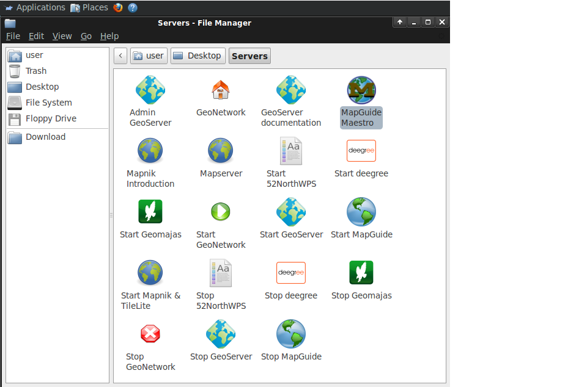
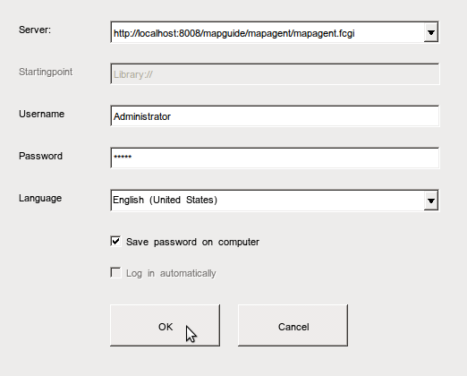
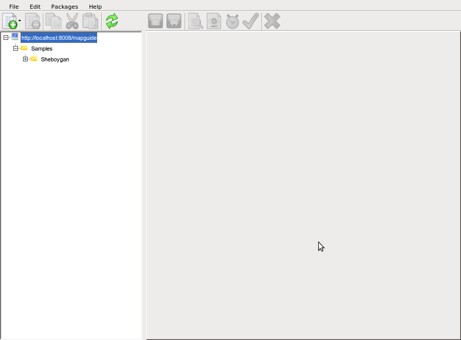
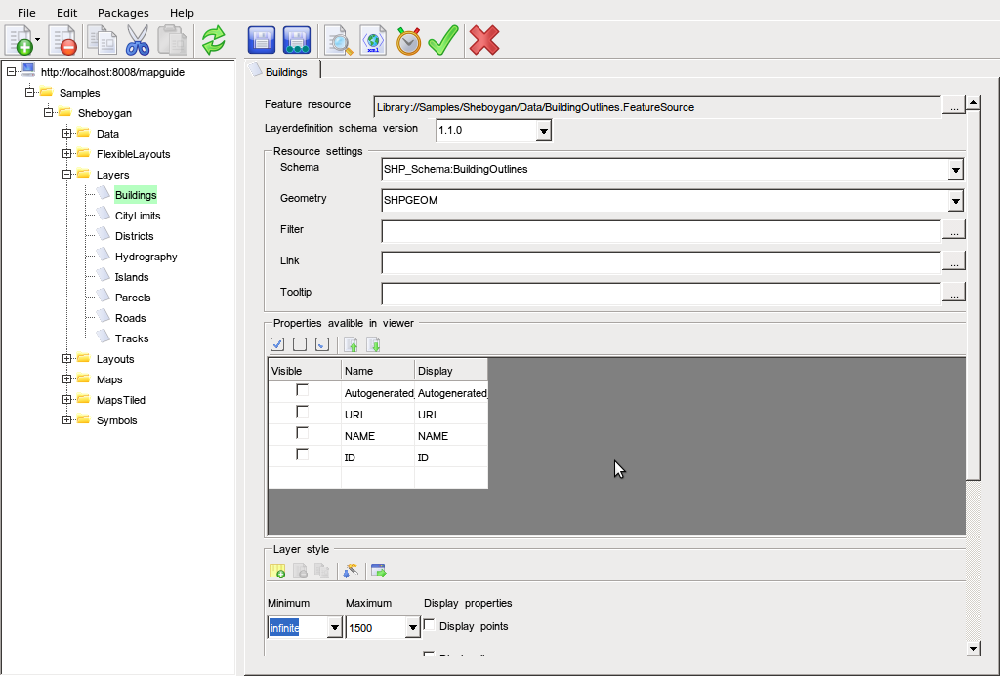
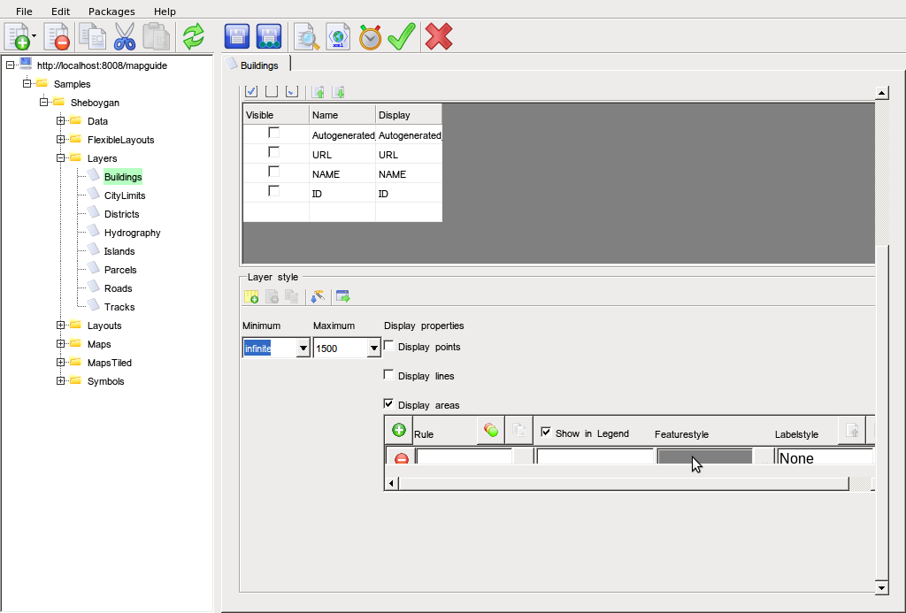
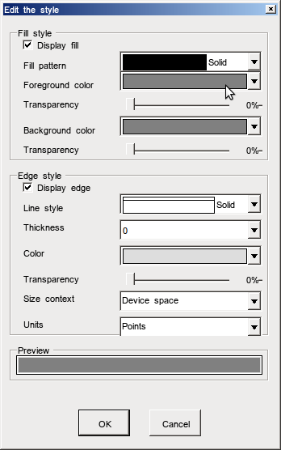
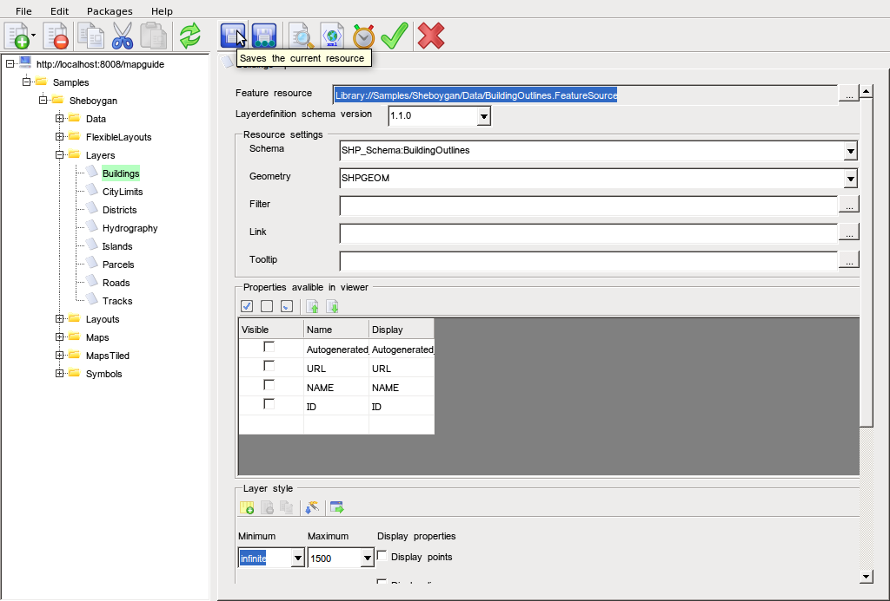
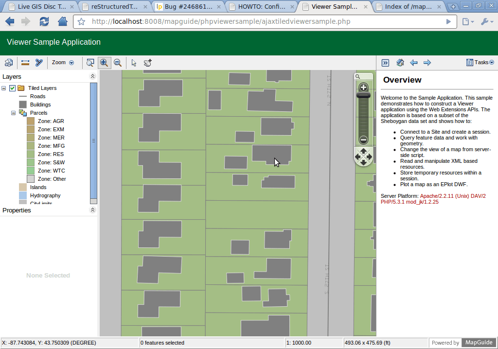
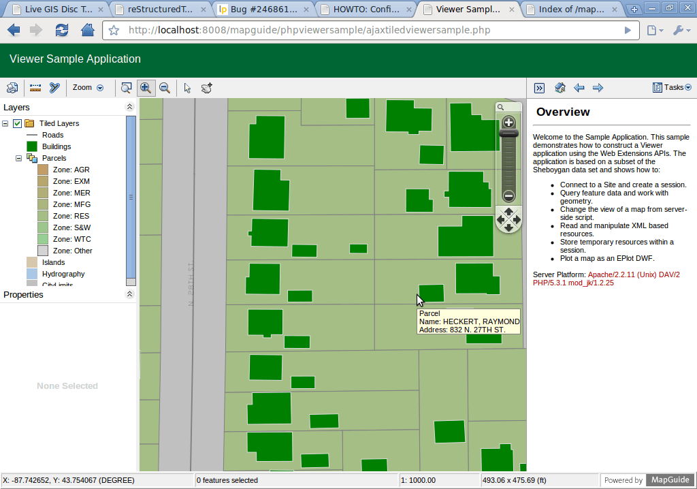

:Author: Huawei Luo
:Author: Trevor Wekel
:Version: osgeo-live4.0
:License: Creative Commons Attribution-ShareAlike 3.0 Unported  (CC BY-SA 3.0)

.. _mapguide-quickstart:

.. image:: ../../images/project_logos/logo-MapGuideOS.png
  :scale: 100 %
  :alt: project logo
  :align: right 

Εγχειρίδιο Γρήγορης Εκκίνησης MapGuide
================================================================================

Ο οδηγός αυτός περιγράφει πώς:

* Να ξεκινήσετε το MapGuide
* Να μορφοποιήσετε τα χωρικά δεδομένα χρησιμοποιώντας το Maestro 
* Επιπλέον σημειώσεις στο 64-bit Ubuntu  

Πώς να ξεκινήσετε το MapGuide
--------------------------------------------------------------------------------

1. Πηγαίνετε στο Desktop->Server και κάνετε κλικ Start MapGuide. Αυτό θα ξεκινήσει και τον εξυπηρετητή MapGuide (server) και το διαδικτυακό εξυπηρετητή MapGuide (Web server)

2. Ανοίγετε τον περιηγητή στη διεύθυνση http://localhost:8008/mapguide/phpviewersample/ajaxtiledviewersample.php για να δείτε τη δοκιμαστική εφαρμογή 

.. image:: ../../images/screenshots/1024x768/mapguide_viewer.png
  :scale: 50 %
  :alt: mapguide desktop icons
  :align: center

MapGuide Maestro
--------------------------------------------------------------------------------

1. Για να ξεκινήσετε το Maestro, πηγαίνετε στο Desktop->Server, κάνετε κλικ MapGuide Maestro, και αυτό ανοίγει το γραφικό περιβάλλον εκκίνησης Maestro, όπως φαίνεται στο ακόλουθο στιγμιότυπο οθόνης. Μπείτε στο σύστημα στο http://localhost:8008/mapguide/mapagent/mapagent.fcgi με το όνομα χρήστη (username) "Administrator" και κωδικό πρόσβασης (password) "admin" 

 
2. Κάνετε κλικ στο Ok για να πάτε στο κεντρικό παράθυρο Maestro, όπως φαίνεται στο ακόλουθο στιγμιότυπο οθόνης.

3. Επεκτείνετε την δενδροειδή λίστα στο αριστερό panel, πηγαίνετε στο Samples->Sheboygan->Layers,κάντε διπλό κλικ στο Buildings και ο επεξεργαστής επιπέδων για το επίπεδο Buildings θα ανοίξει στο δεξί panel, όπως φαίνεται στο ακόλουθο στιγμιότυπο οθόνης:

4. Κυλίστε κάτω το δεξί panel για να φανεί το παράθυρο Layer Style. Στην στήλη Feature style, κάνετε κλικ στο ...cell για να φέρετε τον Επεξεργαστή Στύλ (Style Editor), όπως φαίνεται στο ακόλουθο στιγμιότυπο οθόνης: 

5. Στην αναδιπλούμενη λίστα χρώματος (Foreground Color), επιλέξτε πράσινο (Green) και κάντε κλικ στο Ok για να κλείσετε τον Επεξεργαση Στύλ (Style Editor). Στο κεντρικό παράθυρο Maestro, κάντε κλικ στο εικονίδιο δίσκου για να σώσετε. 

6. Για να μπορέσετε να κάνετε μια επισκόπηση των αλλαγών, ανοίξτε τον περιηγητή στη διεύθυνση http://localhost:8008/mapguide/phpviewersample/ajaxtiledviewersample.php ή κάντε κλικ στο εικονίδιο προεπισκόπησης στη γραμμή εργαλείων από το κεντρικό παράθυρο Maestro, το οποίο θα ανοίξει τον περιηγητή στην παραπάνω διεύθυνση. Στην περιοχή χάρτη του περιηγητή, αν κάνετε μεγέθυνση στο επίπεδο κτηρίων (building level), το χρώμα του κτιρίου είναι τώρα πράσινο. 

