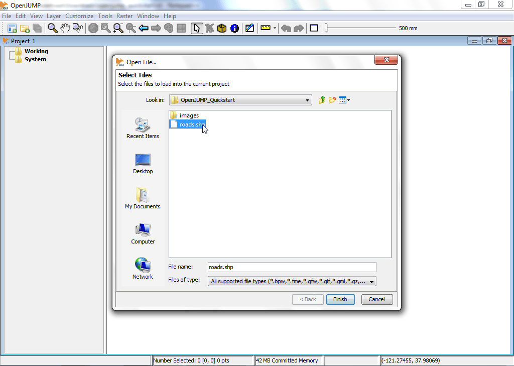
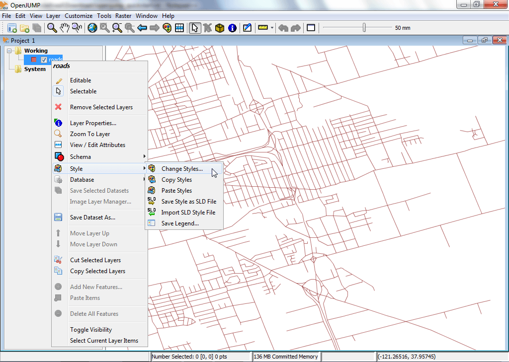
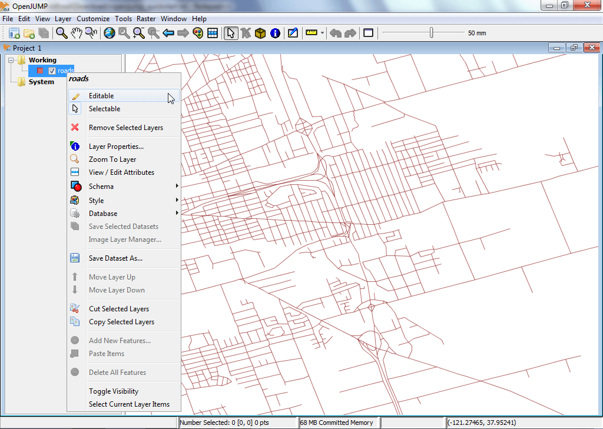
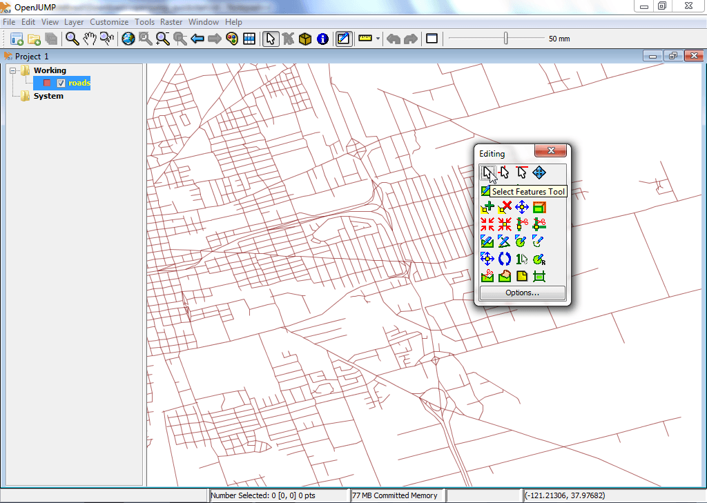

:Author: OSGeo-Live
:Author: Landon Blake
:Author: Stefan Steiniger
:Version: osgeo-live5.5
:License: Creative Commons Attribution-ShareAlike 3.0 Unported  (CC BY-SA 3.0)
:Thanks: OpenJUMP Community

********************************************************************************
Εγχειρίδιο γρήγορης εκκίνησης OpenJUMP
********************************************************************************

Το OpenJUMP είναι ένα πρόγραμμα GIS που επιτρέπει την εύκολη προβολή και επεξεργασία διανυσματικών δεδομένων GIS. Έχει επίσης και περιορισμένη υποστήριξη για την προβολή raster δεδομένων.

Αυτός ο οδηγός περιγράφει πώς:

  * Το OpenJUMP θα φορτώσει ένα ESRI shapefile.
  * Θα ρυθμιστεί η εμφάνιση του επιπέδου από το shapefile για ευκολότερη θέαση.
  * Θα γίνει η επεξεργασία των γεωμετριών των χαρακτηριστικών σε ένα επίπεδο.

Εκκίνηση OpenJUMP
================================================================================

Από το OSGeo Live-DVD: Εκίνηση του OpenJUMP μέσω του συνδέσμου στην επιφάνεια εργασίας ή μέσω του /usr/bin/openjump

Γενικά: Για τα Windows, πλοηγηθείτε στον φάκελο bin του OpenJUMP και κλικάρετε δύο φορές το αρχείο openjump.exe ή το openjump.bat. Για το Linux, εκτελέστε το oj_linux.sh 
από ένα τερματικό. Για το MacOSX, κλικάρετε στο αντίστοιχο σύμβολο του OpenJUMP.

(Παρακαλώ σημειώστε: Απαιτείται η εγκατάσταση της Java για την εκτέλεση του OpenJUMP. 
Μπορείτε να κατεβάσετε την Java για τον υπολογιστή σας από εδώ: 
http://java.com/en/download/index.jsp)

Βασική επισκόπηση της διεπαφής του χρήστη
================================================================================

Η διεπαφή του OpenJUMP έχει τέσσερα (4) βασικά τμήματα όπως τα περισσότερα GIS.
(i) Το πρώτο είναι μια λίστα πάνω πάνω για πρόσβαση στις περισσότερες δυνατότητες. (ii) Το δεύτερο είναι μια κεντρική εργαλειοθήκη η οποία βρίσκεται ακριβώς κάτω από την προηγούμενη λίστα. Τα κουμπιά δίνουν πρόσβαση στις πιο σημαντικές συναρτήσης προβολής και πλοήγησης. (iii) Το τρίτο είναι ένα δενδροδιάγραμμα στα αριστερά που δείχνει τη λίστα των επιπέδων του τρέχοντος σχεδίου . 
(iv) Το τέταρτο είναι η θέαση των επιπέδων. Αυτό στην πραγματικότητα είναι ο χάρτης όπου δίνεται μια γραφική αναπαράσταση των χωρικών δεδομένων του κάθε επιπέδου. Τέλος υπάρχει χαμηλά μια γραμμή πληροφοριών που προβάλει τις πληροφορίες του κέρσορα, εκτελεί την επεξεργασία αναφορών και δείχνει τη χρήση μνήμης
information bar at the bottom displaying mouse pointer coordinates, processing 
reports, and memory usage. Ένα παράθυρο σχεδίου περιέχει μια λίστα με τα επίπεδα και μια προβολή αυτών. Κάθε εκκίνηση του OpenJUMP μπορεί να περιέχει πολλαπλά σχέδια. Σε αυτή τη γρήγορη εκκίνηση, θα δουλεύουμε μόνο με ένα παράθυρο.

.. image:: ../../images/screenshots/1024x768/openjump_ss_01.png
   :scale: 55 

Άνοιγμα ενός ESRI Shapefile
================================================================================

Αυτό το κεφάλαιο του οδηγού, εξηγεί πώς να ανοίξετε ένα shapefile.

Στην πάνω λίστα του OpenJUMP, Επιλέξτε την λίστα [File]. Μετά επιλέξτε την επιλογή [Open File...]. Αυτό θα σας ανοίξει ένα πλαίσιο διαλόγου που σας επιτρέπει να ανοίξετε αρχεία που περιέχουν γεωχωρικά δεδομένα. Στο παράδειγμά μας, θέλετε να να αναζητήσετε ένα ESRI shapefile. Αναζητήστε ένα αρχείο με κατάληξη .shp. Επιλέξτε το αρχείο και επιλέξτε το κουμπί [Finish] στο διάλογο. Μετά από λίγη ώρα , θα μπορείτε να δείτε τα δεδομένα του shapefile στο Layer View. Θα δείτε επίσης ένα νέο επίπεδο που δημιουργήθηκε για τα δεδομένα σας στη Λίστα των επιπέδων (Layer List). To όνομα του επιπέδου θα ταυτίζεται με το όνομα του shapefile.

Μια πιο γρήγορη επιλογή είναι να σύρετε και να αφήσετε απευθείας το shapefile στο Layer view.

Τροποποιώντας αισθητικά ένα Επίπεδο
================================================================================

Αυτό το κεφάλαιο του οδηγού εξηγεί με συντομία πως να επεξεργαστείτε την εμφάνιση ενός επιπέδου.

Στη Layer List, κάντε δεξί κλικ* στο όνομα του επιπέδου. Αυτό θα εμφανίζει έναν αναδυόμενο διάλογο. 
Πηγαίνετε στη λίστα [Style] και επιλέξτε [Change Styles]. Ο διάλογος Change Styles 
έχει πέντε (5) που σας επιτρέπουν να αλλάξετε πώς προβάλλεται το επίπεδο στο Layer View. Αυτό περιλαμβάνει την αλλαγή στο χρώμα του περιγράμματος, το χρώμα γεμίσματος, το πάχος και το είδος της γραμμής, τη διαφάνεια του επιπέδου, την προσθήκη τίτλων και τον καθορισμό σε ποια μέγιστη και ελάγιστη κλίμακα προβάλλεται το επίπεδο.

* Οι χρήστες του MacOSX πατήστε το πλήκτρο :guilabel:`Apple` για να αποκτήσετε πρόσβαση σε αυτή τη λίστα.

   
.. image:: ../../images/screenshots/1024x768/openjump_ss_04.png
   :scale: 55 

Επεξαργασία γεωμετριών σε ένα Επίπεδο
================================================================================

Στη λίστα των επιπέδων, κάντε δεξί κλικ στο όνομα του επιπέδου. Αυτό θα εμφανίζει έναν αναδυόμενο διάλογο. 
Επιλέξτε το κουτί δίπλα στην αναφορά της λίστας Editable με το όνομα "Editable". Αυτό θα ανοίξει μια νέα γραμμή εργαλείων πάνω από το Layer View στα δεξιά. Αυτή η γραμμή εργαλείων έχει ένα σύνολο από κουμπιά που μπορείτε να χρησιμοποιήσετε για να επεξεργαστείτε τη γεωμετρία ενός χαρακτηριστικού.

   

Ας δοκιμάσουμε μια γρήγορη επεξεργασία. Πρώτα θα πρέπει να διαλέξουμε μια γεωμετρια και μετά θα μετακινήσουμε ένα σημείο της γεωμετρίας. Για να συμβεί αυτό, πρώτα επιλέγουμε το κουμπί που δείχνει ένα κέρσορα ποντικιού στην γραμμή εργαλείων editing. Χρησιμοποιήστε το για να κλικάρετε και να επιλέξετε ένα και μόνο χαρακτηριστικό στο Layer View. Θα πρέπει να αλλάξει σε κίτρινο και μικρά κιτρινα τετράγωνα να εμφανιστούν σε κάθε γωνία της γεωμετρίας. 

.. image:: ../../images/screenshots/1024x768/openjump_ss_07.png
   :scale: 55 

Στη συνέχεια, πατήστε στο κουμπί που δείχνει ένα μπλε σταυρό με ένα κίτρινο τετράγωνο στη μέση, το :guilabel:`Move Vertex Tool` 
(Περνώντας το δείχτη του ποντικιού πάνω από τα κουμπιά, σας δίνει μια περιγραφή του κουμπιού). Θα πρέπει τώρα να δείτε το δείκτη του ποντικιού άλλαξε σε ένα μικρό μαύρο κέρσορα όταν το κινείτε πάνω στο Layer View. 

.. image:: ../../images/screenshots/1024x768/openjump_ss_08.png
   :scale: 55 

Δοκιμάστε αυτό να κινήσετε το διάνυσμα της γεωμετρίας που διαλέξατε κλικάρωντας στο διάνυσμα και τραβώντας το (κρατήστε πατημένο το αριστερό κλικ).

.. image:: ../../images/screenshots/1024x768/openjump_ss_09.png
   :scale: 55 
   
Άλλες πηγές εκμάθησης του OpenJUMP
================================================================================

Αυτό είναι μόλις το πρώτο βήμα στο δρόμο να χρησιμοποιήσετε το OpenJUMP. Υπάρχει περισσότερο υλικό το οποίο μπορείτε να μελετήσετε.

Μπορείτε να κατεβάσετε υλικό εκμάθησης για το OpenJUMP here:
http://sourceforge.net/projects/jump-pilot/files/Documentation/

Μπορείτε να διαβάσετε το wiki του OpenJUMP wiki εδώ:
http://sourceforge.net/apps/mediawiki/jump-pilot/index.php?title=Main_Page

Και μπορείτε να λάβετε βοήθεια γρήγορα, στη λίστα ηλεκτρονικού ταχυδρομείου των χρηστών OpenJUMP:
http://groups.google.com/group/openjump-users

