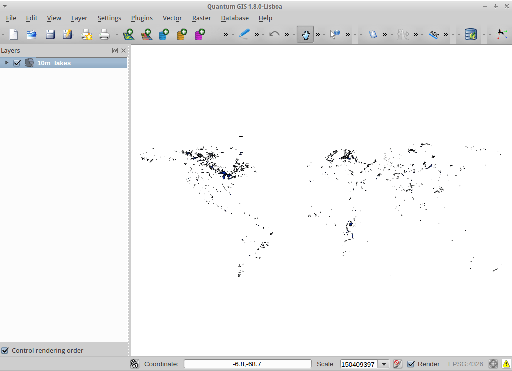
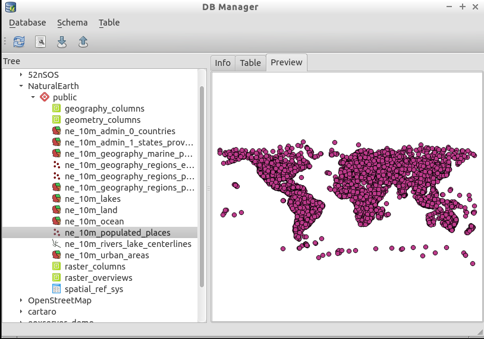

:Author: Barry Rowlingson
:Author: Astrid Emde
:Author: Cameron Shorter
:Version: osgeo-live5.0
:License: Creative Commons Attribution-ShareAlike 3.0 Unported  (CC BY-SA 3.0)

.. image:: ../../images/project_logos/logo-PostGIS.png
  :scale: 30 %
  :alt: project logo
  :align: right
  :target: http://postgis.org/

********************************************************************************
Οδηγός γρήγορης εκκίνησης PostGIS
********************************************************************************

Η PostGIS προσθέτει δυνατότητα για χωρικές πράξεις στην σχεσιακή βάση δεδομένων PostgreSQL. Επεκτείνει
την PostgreSQL ώστε να μπορεί να αποθηκεύει, ερωτά, και να διαχειρίζεται χωρικά δεδομένα. Σε αυτό τον Οδηγό Γρήγορης εκκίνησης θα χρησιμοποιήσουμε
τον όρο 'PostgreSQL' όταν θα αναφερόμαστε σε γενικές συναρτήσεις των βάσεων δεδομένων, και τον όρο 'PostGIS' όταν
θα περιγράφεται η επιπρόσθετη χωρική δυνατότητα που παρέχει η PostGIS.

Αρχιτεκτονική Πελάτη-Διακομιστή
================================================================================

Η PostgreSQL, όπως πολλές βάσεις δεδομένων, λειτουργεί σαν διακομιστής (server) σε ένα πλαίσο πελάτη-διακομιστή (client-server).
O πελάτης κάνει ένα αίτημα στο διακομιστή και λαμβάνει πίσω μια απάντηση. Αυτός είναι ο ίδιος τρόπος που λειτουργεί το διαδίκτυο - ο πλοηγητής σελίδων (browser) είναι ένας πελάτης, ενώ ένας διαδικτυακός διακομιστής στέλνει πίσω τη σελίδα του ιστοτόπου. Με την PostgreSQL τα αιτήματα είναι στη γλώσσα SQL και οι απαντήσεις συνήθως είναι ένας πίνακας με δεδομένα από τη βάση.

Δεν εμποδίζει τίποτα το διακομιστή να είναι στον ίδιο υπολογιστή με τον πελάτη και αυτό επιτρέπει τη χρήση της PostgresQL σε ένα και μόνο μηχάνημα. Ο πελάτης συνδέεται στο διακομιστή μέσω μιας εσωτερικής 'επαναληπτικής' δικτυακής σύνδεσης και δεν είναι ορατός σε άλλους υπολογιστής, εκτός και αν γίνουν οι κατάλληλες ρυθμίσεις.

Δημιουργία μιας Χωρικής Βάσης Δεδομένων
================================================================================

Ένας διακομιστής PostgreSQL σας επιτρέπει να οργανώσετε τα δεδομένα, τοποθετώντας τα σε χωριστές βάσεις δεδομένων. Κάθε βάση λειτουργεί ανεξάρτητα από τις άλλες, με τους δικούς της πίνακες, θεάσεις (views) χρήστες κτλ. Όταν συνδέεστε στην PostgreSQL θα πρέπει να καθορίσετε τη βάση δεδομένων.

Μπορείτε να πάρετε μια λίστα βάσεων δεδομένων από το διακομιστή με την εντολή``psql -l``. Θα πρέπει να δείτε διάφορες βάσεις δεδομένων, που χρησιμοποιούνται από κάποια από τα προγράμματα που υπάρχουν στο σύστημα . Σε αυτό τον Οδηγό, θα δημιουργήσουμε μια νέα.

.. tip:: Η λίστα των βάσεων χρησιμοποιεί ένα τυπικό παρουσιαστή αρχείων κειμένου τύπου UNIX - πατήστε κενό για να πάτε στην επόμενη σελίδα, b για την προηγούμενη, q για να κλείσει και h για βοήθεια.

Η PostgreSQL μας δίνει το εργαλείο για δημιουργία βάσεων δεδομένων ``createdb``. Πρέπει να δημιουργήσουμε μια βάση δεδομένων με τις επεκτάσεις της PostGIS, έτσι χρειάζεται να πούμε στην PostgreSQL ποια πρότυπη βάση να χρησιμοποιήσει. Θα πούμε τη βάση δεδομένων μας``demo``. Η εντολή είναι:

.. review comment: createdb is a utility programm not a unix command

::

   createdb -T template_postgis demo

.. tip:: Μπορείτε συνήθως να λάβετε βοήθεια από τη γραμμή εντολών χρησιμοποιώντας την επιλογή ``--help`` μετά από μία εντολή.

Εάν τώρα τρέξετε ``psql -l`` θα πρέπει να δείτε τη βάση δεδομένων ``demo`` στη λίστα.

Μπορείτε βεβαίως να δημιουργήσετε βάσεις δεδομένων PostGIS databases με χρήση της SQL. Πρώτα θα διαγράψουμε τη βάση δεδομένων που μόλις φτιάξαμε με την εντολή``dropdb``, μετά θα χρησιμοποιήσουμε την εντολή ``psql`` για να χρησιμοποιήσουμε ένα διερμηνέα εντολών SQL :

:: 

  dropdb demo
  psql -d postgres
 
Αυτές οι εντολές συνδέονται στη βάση δεδομένων που λέγεται ``postgres``, που είναι μια βάση δεδομένων του συστήματος την οποία πρέπει να έχουν όλοι οι διακομιστές. Τώρα εισάγετε την ακόλουθη εντολή SQL για να δημιουργήσετε μια νέα βάση:

:: 

 postgres=# CREATE DATABASE demo TEMPLATE=template_postgis;

Τώρα αλλάξτε τη σύνδεσή σας από τη βάση δεδομένων ``postgres`` στη νέα βάση ``demo``. 
Στο μέλλον θα μπορείτε να συνδεθείτε απευθείας με την εντολή ``psql -d demo``, αλλά υπάρχει ένας απλός τρόπος να αλλάζετε βάση μέσα από τη γραμμή εντολών της ``psql``:

::

 postgres=# \c demo

.. tip:: Επιλέξτε το συνδυασμό Ctrl-C εάν η γραμμή εντολών της psql  συνεχίζει να εμφανίζεται αφού πατήσετε return. Θα καθαρίσει ό,τι δεδομένα εισάγατε στη γραμμή και θα ξεκινήσετε από την αρχή. Πιθανότατα περιμένεετε για ένα κλειστό ερωτηματικό, εισαγωγικό ή και κάτι άλλο.

Θα πρέπει να δείτε ένα ενημερωτικό μήνυμα και το πρόθεμα στη γραμμή εντολών θα αλλάξει για να δείξει πως είστε συνδεδεμένος/η στη βάση ``demo``. Για να επιβεβαιώσετε πως όλα έγιναν σωστά, εισάγετε ``\dt`` για να δείτε όλους τους πίνακες της βάσης. Θα πρέπει να δείτε κάτι σαν το ακόλουθο:

::

  demo=# \dt
               List of relations
   Schema |       Name       | Type  | Owner 
  --------+------------------+-------+-------
   public | geometry_columns | table | user
   public | spatial_ref_sys  | table | user
  (2 rows)

Αυτοί οι 2 πίνακας χρησιμοποιούνται από την PostGIS. Ο πίνακας ``spatial_ref_sys`` περιέχει πληροφορίες για υπαρκτά συστήματα αναφοράς και μπορούμε να χρησιμοποιήσουμε SQL για να δούμε εν τάχει τα δεδομένα:

::

  demo=# SELECT srid,auth_name,proj4text FROM spatial_ref_sys LIMIT 10;

   srid | auth_name |          proj4text                                            
  ------+-----------+--------------------------------------
   3819 | EPSG      | +proj=longlat +ellps=bessel +towgs...
   3821 | EPSG      | +proj=longlat +ellps=aust_SA +no_d...
   3824 | EPSG      | +proj=longlat +ellps=GRS80 +towgs8...
   3889 | EPSG      | +proj=longlat +ellps=GRS80 +towgs8...
   3906 | EPSG      | +proj=longlat +ellps=bessel +no_de...
   4001 | EPSG      | +proj=longlat +ellps=airy +no_defs...
   4002 | EPSG      | +proj=longlat +a=6377340.189 +b=63...
   4003 | EPSG      | +proj=longlat +ellps=aust_SA +no_d...
   4004 | EPSG      | +proj=longlat +ellps=bessel +no_de...
   4005 | EPSG      | +proj=longlat +a=6377492.018 +b=63...
  (10 rows)

Αυτό επιβεβαιώνει πως έχουμε μια χωρική βάση. Ο πίνακας ``geometry_columns`` ενημερώνει την PostGIS, ποιοι πίνακες περιέχουν χωρική πληροφορία. Αυτό είναι το επόμενο βήμα.

Δημιουργία ενός Χωρικού Πίνακα με το Δύσκολο Τρόπο
================================================================================

Τώρα που έχουμε μια χωρική βάση, μπορούμε να κάνουμε μερικούς χωρικούς πίνακες.

Πρώτα δημιουργείστε ένα τυπικό πίνακα για να αποθηκεύσετε μερικά δεδομένα πόλεων.
Ο πίνακας έχει 2 πεδία - ένα με ένα αριθμητικό αναγνωριστικό και ένα άλλο για το όνομα της πόλης:

::

  demo=# CREATE TABLE cities ( id int4, name varchar(50) );

Στη συνέχεια προσθέστε μια στήλη που θα περιέχει γεωμετρία, για να αποθηκεύσετε την τοποθεσία των πόλεων .
Από σύμβαση, η στήλη καλείται
``the_geom``. Αυτό λέει στην PostGIS τo είδος της γεωμετρίας του χαρακτηριστικού (σημεία, γραμμές, πολύγωνα κτλ), πόσες διαστάσεις (σε αυτή την περίπτωση δύο) και το σύστημα αναφοράς. Θα χρησιμοποιούμε το σύστημα αναφοράς EPSG:4326 για τις πόλεις μας.

::

  demo=# SELECT AddGeometryColumn ( 'cities', 'the_geom', 4326, 'POINT', 2);

Τώρα, εάν παρατηρήσετε τον πίνακα των πόλεων θα δείτε τη νέα στήλη και θα ενημερωθείτε πως για την ώρα ο πίνακας δεν περιέχει καμία γραμμή-εγγραφή.

::

  demo=# SELECT * from cities;
   id | name | the_geom 
  ----+------+----------
  (0 rows)

Για να προσθέσετε γραμμές στον πίνακα, θα χρησιμοποιήσετε μερικές εντολές SQL. Για να εισάγουμε τη γεωμετρία στη στήλη των γεωμετρικών, χρησιμοποιήστε τη συνάρτητη της PostGIS ``ST_GeomFromText`` για να μετατραπούν από μια μορφοποίηση κειμένου που δίνει τις συντεταγμένες και ένα κωδικό από ένα χωρικό σύστημα αναφοράς:

::

  demo=# INSERT INTO cities (id, the_geom, name) VALUES (1,ST_GeomFromText('POINT(-0.1257 51.508)',4326),'London, England');
  demo=# INSERT INTO cities (id, the_geom, name) VALUES (2,ST_GeomFromText('POINT(-81.233 42.983)',4326),'London, Ontario');
  demo=# INSERT INTO cities (id, the_geom, name) VALUES (3,ST_GeomFromText('POINT(27.91162491 -33.01529)',4326),'East London,SA');

.. tip:: Χρησιμοποιήστε τα βέλει για να ανακαλέσετε και να επεξεργαστείτε γραμμές εντολών.

Όπως μπορείτε να δείτε αυτό γίνεται αυξανόμενα καταπονητικό πολύ γρήγορα. Ευτυχώς υπάρχουν και άλλοι τρόποι για να εισαχθούν δεδομένα σε πίνακες της PostGIS, πολύ πιο γρήγορα. Αλλά τώρα υπάρχουν τρεις πόλεις και μπορούμε να εργαστούμε με αυτές.

Απλές ερωτήσεις
================================================================================

Όλοι οι τυπικοί τελεστές SQL μπορούν να εφαρμοστούν για να επιλέξετε δεδομένα από ένα πίνακα της PostGIS:

::

 demo=# SELECT * FROM cities;
  id |      name       |                      the_geom                      
 ----+-----------------+----------------------------------------------------
   1 | London, England | 0101000020E6100000BBB88D06F016C0BF1B2FDD2406C14940
   2 | London, Ontario | 0101000020E6100000F4FDD478E94E54C0E7FBA9F1D27D4540
   3 | East London,SA  | 0101000020E610000040AB064060E93B4059FAD005F58140C0
 (3 rows)

Αυτό επιστρέψει μια δεξαεξαδική αναπαράσταση των συντεταγμένων χωρίς νόημα για τον άνθρωπο.

Αν θέλετε να ξαναδείτε τις συντεταγμένες σας σε τυποποίηση WKT, μπορείτε να χρησιμοποιήσετε τις συναρτήσεις ST_AsText(the_geom) or ST_AsEwkt(the_geom). Μπορείτε επίσης να χρησιμοποιήσετε τις συναρτήσεις ST_X(the_geom), ST_Y(the_geom) για να πάρετε αριθμητικές τιμές από τις συντεταγμένες:

::

 demo=# SELECT id, ST_AsText(the_geom), ST_AsEwkt(the_geom), ST_X(the_geom), ST_Y(the_geom) FROM cities;
  id |          st_astext           |               st_asewkt                |    st_x     |   st_y    
 ----+------------------------------+----------------------------------------+-------------+-----------
   1 | POINT(-0.1257 51.508)        | SRID=4326;POINT(-0.1257 51.508)        |     -0.1257 |    51.508
   2 | POINT(-81.233 42.983)        | SRID=4326;POINT(-81.233 42.983)        |     -81.233 |    42.983
   3 | POINT(27.91162491 -33.01529) | SRID=4326;POINT(27.91162491 -33.01529) | 27.91162491 | -33.01529
 (3 rows)

Χωρικές ερωτήσεις
================================================================================

Η PostGIS προσθέτει πολλές συναρτήσεις με χωρική λειτουργικότητα στην PostgreSQL. Είδαμε ήδη την ST_GeomFromText που μετατρέπει WKT σε γεωμετρία. οι περισσότερες από αυτές ξεκινούν με το πρόθεμα ST (εννοώντας 'spatial type' - χωρική συνάρτηση) και αναφέρονται στην τεκμηρίωση της PostGIS. Θα χρησιμοποιήσουμε μία για να απαντήσουμε μια πρακτική περώτηση - Πόσο μακριά είναι οι τρεις πόλεις μεταξύ τους, θεωρώντας μια σφαιρική γη; 

::

 demo=# SELECT p1.name,p2.name,ST_Distance_Sphere(p1.the_geom,p2.the_geom) FROM cities AS p1, cities AS p2 WHERE p1.id > p2.id;
       name       |      name       | st_distance_sphere 
 -----------------+-----------------+--------------------
  London, Ontario | London, England |   5875766.85191657
  East London,SA  | London, England |   9789646.96784908
  East London,SA  | London, Ontario |   13892160.9525778
  (3 rows)

Το αποτέλεσμα είναι η απόσταση, σε μέτρα, ανάμεσασ σε κάθε ζευγάρι πόλεων. Παρατηρήστε πώς το 'WHERE' τμήμα μας παρεμποδίζει από το να πάρουμε αποστάσεις μιας πόλης με τον εαυτό της (που θα ήταν μηδέν) ή τις αντίστροφες αποστάσεις (London, England με London, Ontario είναι η ίδια απόσταση με την London, Ontario με London, England). Δοκιμάστε την ίδια ερώτηση χωρίς το 'WHERE' τμήμα της και δείτε τι θα συμβεί.

Μπορούμε επίσης να υπολογίσουμε την απόσταση, χρησιμοποιώντας ένα σφαιροειδές, με τη χρήση μιας διαφορετικής συνάρτησης στην οποία θα δωθούν σαν παράμετροι το όνομα του σφαιροειδούς, το μισό μήκος του μεγάλου άξονα και η αντίστροφη επιπλάτυνση:

::

  demo=# SELECT p1.name,p2.name,ST_Distance_Spheroid(
          p1.the_geom,p2.the_geom, 'SPHEROID["GRS_1980",6378137,298.257222]'
          ) 
         FROM cities AS p1, cities AS p2 WHERE p1.id > p2.id;
        name       |      name       | st_distance_spheroid 
  -----------------+-----------------+----------------------
   London, Ontario | London, England |     5892413.63776489
   East London,SA  | London, England |     9756842.65711931
   East London,SA  | London, Ontario |     13884149.4140698
  (3 rows)

Mapping
================================================================================

Για να παράγουμε ένα χάρτη από δεδομένα της PostGIS, απαιτείται ένας πελάτης που μπορεί να έχει πρόσβαση στα δεδομένα. Τα περισσότερα GIS ανοικτού λογισμικού μπορούν να το κάνουν, για παράδειγμα τα Quantum GIS, gvSIG και uDig. Τώρα θα σας δείξουμε πώς μπορείτε να κάνετε ένα χάρτη από το Quantum GIS.

Ξεκινήστε το Quantum GIS και επιλέξτε ``Add PostGIS layer`` από τη λίστα των επιπέδων. Επειδή δεν έχετε αποκτήσει πρόσβαση στις πληροφορίες της PostGIS από το QGIS παλαιότερα, δεν θα δείτε καμιά παλαιότερη σύνδεση με την PostGIS.

.. image:: ../../images/screenshots/1024x768/postgis_addlayers.png
  :scale: 50 %
  :alt: Προσθήκη επιπέδου PostGIS 
  :align: center

Πατήστε 'new' και εισάγετε τις παραμέτρους της σύνδεσης. Θα χρησιμοποιήσουμε τη βάση δεδομένων Natural Earth που υπάρχει μέσα στο παρών DVD. Δεν χρειάζεται όνομα χρήστη ή κωδικός επειδή η ασφάλεια είναι ρυθμισμένη για να σας επιτρέψει την πρόσβαση. Αποεπιλέξτε την επιλογή για προβολή πινάκων χωρίς γεωμετρία, αν είναι επιλεγμένη - θα κάνει τα πράγματα λίγο πιο εύκολα.

.. image:: ../../images/screenshots/1024x768/postgis_addlayers.png
  :scale: 50 %
  :alt: Connect to Natural Earth
  :align: center

Πατήστε το κουμπί ``Test Connect``,και αν όλα είναι εντάξει, θα πάρετε ένα μήνυμα επιβεβαίωσης. Πατήστε ``OK`` και η σύνδεσή σας θα αποθηκευτεί στη λίστα των συνδέσεων. Τώρα μπορείτε να πατήσετε  ``Connect`` και να λάβετε μια λίστα από πίνακες με χωρική πληροφορία από τη βάση:

.. image:: ../../images/screenshots/1024x768/postgis_listtables.png
  :scale: 50 %
  :alt: Natural Earth Layers
  :align: center

Επιλέξτε τις λίμνες και πατήστε ``Add`` (όχι ``Load`` - αυτή η επιλογή σώζει ερωτήσεις), και θα πρέπει να φορτωθεί στοQGIS:

Θα πρέπει να δείτε ένα χάρτη των λιμνών. Καθώς το QGIS δεν ξέρει πως είναι λίμνες, πιθανότατα δεν θα έχουν το χρώμα μπλε - δείτε την τεκμηρίωση του QGIS για να δείτε πώς θα το αλλάξετε. Εστιάστε στο διάσημο σύνολο λιμνών του Καναδά.

Δημιουργία χωρικού πίνακα με τον εύκολο τρόπο
================================================================================

Τα περισσότερα εργαλεία της OSGeo έχουν συναρτήσεις για την είσοδο χωρικών δεδομένων από αρχεία, όπως shapefiles, σε βάσεις δεδομένων PostGIS. Θα χρησιμοποιήσουμε πάλι το QGIS για να δείξουμε αυτή τη λειτουργία.

Η εισαγωγή shapefiles στο QGIS μέσω ενός εύχρηστου πρόσθετου, του PostGIS Manager. Για να το εγκαταστήσετε, πηγαίνετε στη λίστα Plugins, επιλέξτε ``Manage Plugins`` και μετά βρείτε το ``PostGIS Manager``. Μαρκάρετε το κουτί και πατήστε ΟΚ για την επιλογή σας. Τώρα στη λίστα Plugin θα πρέπει να υπάρχει αναφορά για τον PostGIS Manager η οποία δίνει την επιλογή να ξεκινήσει το πρόσθετο.

Το πρόσθετο θα χρησιμοποιήσει τις προηγούμενες ρυθμίσεις, για να συνδεθεί στη βάση δεδομένων Natural Earth. Αφήστε το πεδίο του κωδικού κενό, εάν ερωτηθείτε. Θα δείτε το κεντρικό παράθυρο του διαχειριστή.

.. image:: ../../images/screenshots/1024x768/postgis_getmanager.png
  :scale: 50 %
  :alt: Πρόσθετο PostGIS Manager
  :align: center

Μπορείτε να χρησιμοποιήσετε τις καρτέλες που βρίσκονται στο δεξί μέρος για να δείτε και να επιβεβαιώσετε τις ιδιότητες του επιπέδου, ακόμα και να πάρετε ένα βασικό χάρτη με δυνατότητες εστίασης και πλοήγησης. Εδώ έχω επιλέξει το επίπεδο των κατοικημένων περιοχών και έχω έστιάσει σε ένα μικρό νησί που ξέρω:

Θα χρησιμοποιήσουμε τώρα τον PostGIS Manager για να εισάγουμε ένα shapefile στη βάση δεδομένων. Θα χρησιμοποιήσουμε τα δεδομένα της Βόρειας Καρολίνας που αφορούν αιφνίδιους θανάτους βρεφών (SIDS - Sudden Infant Death Syndrome), τα οποία περιλαμβάνονται με την προσθήκη ενός πρόσθετου του προγράμματος στατιστικής R.

Από τη λίστα ``Data`` επιλέξτε την επιλογή ``Load data from shapefile``. 
Πατήστε το ``...`` και πλοηγηθείτε ώστε να βρείτε το shapefile ``sids.shp`` στο πακέτο ``maptools``  του R:

.. image:: ../../images/screenshots/1024x768/postgis_browsedata.png
  :scale: 50 %
  :alt: Εύρεση του shapefile
  :align: center

Αφήστε τις άλλες επιλογές ως έχουν και πατήστε ``Load``

.. image:: ../../images/screenshots/1024x768/postgis_importsids.png
  :scale: 50 %
  :alt: Εισαγωγή ενός shapefile
  :align: center

Το shapefile θα πρέπει να εισαχθεί στην PostGIS χωρίς λάθη. Κλείστε τον PostGIS manager και 
επιστρέψτ στο κεντρικό παράθυρο του QGIS .

Τώρα φορτώστε τα δεδομένα SIDS στο χάρτη με την επιλογή 'Add PostGIS Layer'. Με μια ανακατανομή των επιπέδων και λίγο επεξεργασία των χρωμάτων, θα πρέπει να μπορέσετε να παράξετε ένα χωροπληθικό χάρτη του πλήθους των αιφνιδίων θανάτων βρεφών στη Βόρεια Καρολίνα:

.. image:: ../../images/screenshots/1024x768/postgis_sidsmap.png
  :scale: 50 %
  :alt: Χαρτογραφική ανα παράσταση των δεδομένων SIDS
  :align: center

Εκμάθηση του pgAdmin III
================================================================================

Μπορείτε να χρησιμοποιήσετε τον πελάτη ``pgAdmin III`` που παρέχει γραφικά εργαλεία για να γίνονται ερωτήσεις και αλλαγές στην βάση δεδομένων σας μη χωρικά Είναι ο επίσημος πελάτης της PostgreSQL, και επιτρέπει τη χρήση SQL για τη διαχείριση των πινάκων της βάσης.

.. image:: ../../images/screenshots/1024x768/postgis_adminscreen1.png
  :scale: 50 %
  :alt: pgAdmin III
  :align: center

.. image:: ../../images/screenshots/1024x768/postgis_adminscreen2.png
  :scale: 50 %
  :alt: pgAdmin III
  :align: center

Δοκιμές
================================================================================

Εδώ είναι μερικές ακόμα προκλήσεις, που μπορείτε να δοκιμάσετε:

#. Δοκιμάστε μερικές ακόμα χωρικές συναρτήσεις, όπως ``st_buffer(the_geom)``, ``st_transform(the_geom,25831)``, ``x(the_geom)`` - θα βρείτε πλήρη τεκμηρίωση στη σελίδα http://postgis.org/documentation/

#. Εξαγωγή των πινάκων σε shapefiles με το εργαλείο ``pgsql2shp`` από τη γραμμή εντολών.

#. Δοκιμάστε το εργαλείο ``ogr2ogr`` για να εισάγετε και να εξάγετε δεδομένα από τη βάση σας.

Τι ακολουθεί?
================================================================================

Αυτό είναι μόλις το πρώτο βήκα στο δρόμο για να χρησιμοποιήσετε την PostGIS. Υπάρχουν πολλές περισσότερες δυνατότητες που μπορείτε να δοκιμάσετε.

Σελίδα PostGIS 

 http://postgis.org

Τεκμηρίωση της PostGIS

 http://postgis.org/documentation/
