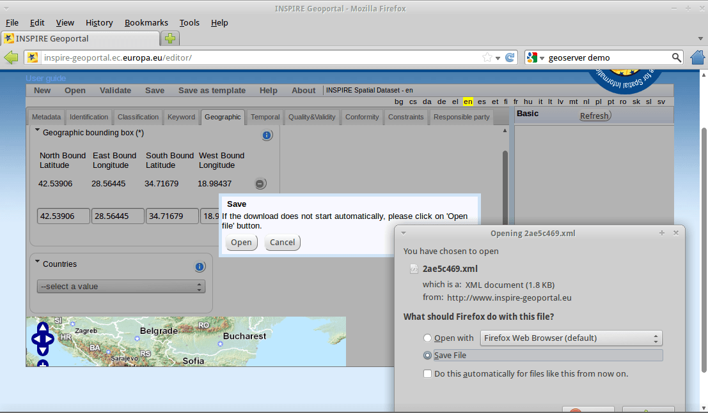

:Author: OSGeo-Live
:Author: Tom Kralidis, Angelos Tzotsos
:Version: osgeo-live5.5
:License: Creative Commons

.. image:: ../../images/project_logos/logo-pycsw.png
  :scale: 80 %
  :alt: project logo
  :align: right
  :target: http://pycsw.org/

********************************************************************************
Γρήγορη Εκκίνηση pycsw
********************************************************************************

Το pycsw είναι μια υλοποίηση εξυπηρετητή του προτύπου OGC CSW σε γλώσσα προγραμματισμού `Python`_.

To pycsw υλοποιεί την οδηγία 10 (πρωτόκολο επικοινωνίας HTTP του προτύπου Catalogue Services for the Web, CSW) της προδιαγραφής υλοποίησης Υπηρεσίας Καταλόγου του OpenGIS, στην έκδοση 2.0.2. Η υλοποίηση ξεκίνησε το 2010 (και ανακοινώθηκε πιο επίσημα το 2011).

Το pycsw επιτρέπει την δημοσίευση και αναζήτηση γεωχωρικών μεταδεδομένων. Υπάρχοντα αποθετήρια γεωχωρικών μεταδεδομένων μπορούν να δημοσιευθούν μέσω του προτύπου OGC:CSW 2.0.2.

Το pycsw είναι Λογισμικό Ανοιχτού Κώδικα, υπό την άδεια MIT, και υποστηρίζει όλες τις κύριες πλατφόρμες (Windows, Linux, Mac OS X).

Το pycsw είναι προεγκατεστημένο στο OSGeo Live. Αυτός ο οδηγός περιγράφει:

* Την βασική εγκατάσταση του pycsw
* Την δοκιμή της εγκατάσταση μέσω της δοκιμαστικής εφαρμογής
* Την παραμετροποίηση του κειμένου Δυνατοτήτων (Capabilities) και απεικόνιση των πληροφοριών σε περιηγητή διαδικτύου
* Την δημιουργία αρχείου μεταδεδομένων ISO 19139 XML (μέσω των εφαρμογών INSPIRE Metadata Editor ή του GIMED)
* Την ενσωμάτωση των νέων αρχείων μεταδεδομένων στην βάση δεδομένων του pycsw
* Την εγκατάσταση του πρόσθετου CSW για το QGIS
* Την αναζήτηση δεδομένων μέσω της υπηρεσίας καταλόγου pycsw μέσα από το QGIS

Εγκατάσταση
===========

Απαιτήσεις συστήματος
---------------------

Το pycsw βασίζεται στις παρακάτω βιβλιοθήκες:

- `lxml`_ (έκδοση >= 2.2.3) για υποστήριξη XML
- `SQLAlchemy`_ (έκδοση >= 0.0.5) για διασύνδεση με βάση δεδομένων
- `Shapely`_ (έκδοση >= 1.2.8) για δυνατότητα χωρικών ερωτημάτων
- `pyproj`_ (έκδοση >= 1.8.9) για μετατροπές συντεταγμένων

Εγκατάσταση από τον πηγαίο κώδικα
---------------------------------

`Κατεβάστε`_ την τελευταία επίσημη έκδοση ή την τελευταία έκδοση μέσω svn:

.. code-block:: bash

  $ svn co https://pycsw.svn.sourceforge.net/svnroot/pycsw pycsw 

Βεβαιωθείτε ότι το CGI είναι ενεργοποιημένο στο φάκελο της εγκατάστασης. Για παράδειγμα στον Apache, εαν έχετε εγκαταστήσει το pycsw στο φάκελο ``/srv/www/htdocs/pycsw`` (όπου το URL θα είναι ``http://host/pycsw/csw.py``), προσθέστε το παρακάτω στο αρχείο ρυθμίσεων ``httpd.conf``:

.. code-block:: none

  <Location /pycsw/>
   Options FollowSymLinks +ExecCGI
   Allow from all
   AddHandler cgi-script .py
  </Location>

Εγκατάσταση σε Ubuntu/Xubuntu/Kubuntu
-------------------------------------

Για να εγκαταστήσετε το pycsw σε μια διανομή βασισμένη στο Ubuntu, μπορείτε να χρησιμοποιήσετε το script εγκατάστασης του OSGeoLive που βρίσκεται στο ``pycsw/etc/dist``:

.. code-block:: bash

  $ cd pycsw/etc/dist
  $ sudo ./install_pycsw.sh

Ο κώδικας θα εγκαταστήσει τις απαραίτητες βιβλιοθήκες (Apache, lxml, sqlalchemy, shapely, pyproj) και στη συνέχεια το pycsw στο φάκελο ``/var/www``.

Εγκατάσταση στο openSUSE
------------------------

Για να εγκαταστήσετε το πακέτο του pycsw στο openSUSE 12.1, μπορείτε να εκτελέσετε τις παρακάτω εντολές σαν χρήστης ``root``:

.. code-block:: bash

  $ zypper -ar http://download.opensuse.org/repositories/Application:/Geo/openSUSE_12.1/ GEO
  $ zypper -ar http://download.opensuse.org/repositories/devel:/languages:/python/openSUSE_12.1/ python
  $ zypper refresh
  $ zypper install pycsw

Για προηγούμενες εκδόσεις του openSUSE αλλάξτε την έκδοση από ``12.1`` σε ``11.4``. Για μελλοντικές εκδόσεις χρησιμοποιήστε το openSUSE ``Factory``. Η κυλιόμενη διανομή ``Tumbleweed`` επίσης υποστηρίζεται.
Το pycsw περιλαμβάνεται στο επίσημο αποθετήριο Application::Geo στο OpenSUSE Build Service.

Δοκιμαστική Εφαρμογή
====================

Για να εκτελέσετε την δοκιμαστική εφαρμογή, επιλέξτε από το μενού WebServices το εικονίδιο pycsw ή εναλλακτικά ανοίξτε ένα παράθυρο Firefox και πληκτρολογήστε http://localhost/pycsw/tester/index.html στη μπάρα διευθύνσεων.

.. image:: ../../images/screenshots/1024x768/pycsw_tester_startup.png
  :scale: 75 %

Με την επιλογή από την αριστερή λίστα, μπορείτε να επιλέξετε έτοιμα ερωτήματα POST, με την μορφή XML, τα οποία μπορούν να σταλούν στο pycsw: 

.. image:: ../../images/screenshots/1024x768/pycsw_tester_selection.png
  :scale: 75 %

Για παράδειγμα επιλέγοντας "apiso/DescribeRecord", και πατώντας το κουμπί "Send", μια περιγραφή εγγραφής ISO Application Profile παρουσιάζεται στο δεξί παράθυρο:

.. image:: ../../images/screenshots/1024x768/pycsw_tester_describe_apiso_record.png
  :scale: 75 %

Επιλέγοντας "GetCapabilities-SOAP" και πιέζοντας το κουμπί "Send", ένα ερώτημα SOAP αποστέλεται στον εξυπηρετητή για να δημοσιοποιήσει τις δυνατότητες της διαδικτυακής υπηρεσίας:

.. image:: ../../images/screenshots/1024x768/pycsw_tester_soap_capabillities.png
  :scale: 75 %

Επιπλέον μπορείτε να αναζητήσετε εγγραφές δεδομένων, με χωρικό ερώτημα προς τον εξυπηρετητή, με την επιλογή "GetRecords-filter-bbox" και αφού επεξεργαστείτε τις συντεταγμένες στο XML ερώτημα:

.. image:: ../../images/screenshots/1024x768/pycsw_tester_getrecords_bbox_filter.png
  :scale: 75 %

Μπορείτε να δοκιμάσετε όλες τα πιθανά ερωτήματα μέσω αυτής της δοκιμαστικής εφαρμογής. Ένας πιο αποτελεσματικός και γραφικός τρόπος για να κάνετε τέτοια ερωτήματα περιγράφεται παρακάτω σε αυτόν τον οδηγό.

Capabilities Document and Configuration
=======================================

Το έγγραφο δυνατοτήτων της υπηρεσίας μπορούν να βρεθούν στο: http://localhost/pycsw/csw.py?service=CSW&version=2.0.2&request=GetCapabilities.

.. image:: ../../images/screenshots/1024x768/pycsw_getcapabilities_response.png
  :scale: 75 %

Για να επεξεργαστείτε τα μεταδεδομένα της υπηρεσίας που περιλαμβάνονται στο κείμενο δυνατοτήτων, μπορείτε να αλλάξετε τα περιεχόμενα του αρχείου ``/var/www/pycsw/default.cfg`` κάτω από την ετικέτα ``[metadata:main]``.
Εαν θέλετε να ενεργοποιήσετε την υποστήριξη INSPIRE Discovery Service, τα μεταδεδομένα κάτω από την ετικέτα ``[metadata:inspire]`` πρέπει να συμπληρωθούν και η ιδιότητα ``enabled`` πρέπει να τεθεί σε τιμή ``true``.

Για την πλήρη λειτουργικότητα, παρακαλώ συμβουλευθείτε το `εγχειρίδιο`_ στην ιστοσελίδα του pycsw.

Δημιουργία Μεταδεδομένων
========================

Με χρήση του λογισμικού European Open Source Metadata Editor (EUOSME)
---------------------------------------------------------------------

Αρχεία μεταδεδομένων για χωρικά δεδομένα ή για σύνολα χωρικών δεδομένων μπορούν να δημιουργηθούν μέσω της επίσημης ελεύθερης υλοποίησης επεξεργαστή μεταδεδομένων του INSPIRE, την εφαρμογή European Open Source Metadata Editor (EUOSME). Η εφαρμογή αυτή είναι διαθέσιμη στο ``http://inspire-geoportal.ec.europa.eu/editor/``. Ο πηγαίος κώδικας βρίσκεται στο ``https://joinup.ec.europa.eu/svn/euosme/trunk``

.. image:: ../../images/screenshots/1024x768/pycsw_euosme_homepage.png
  :scale: 75 %

Μπορείτε να συμπληρώσετε τα απαραίτητα πεδία μεταδεδομένων μέσω της εφαρμογής, προσθέτωντας πληροφορίες όπως το όνομα του ιδιοκτήτη των δεδομένων, λέξεις κλειδιά, ιστοσελίδα των δεδομένων στο διαδίκτυο, την γεωγραφική θέση κλπ. 

.. image:: ../../images/screenshots/1024x768/pycsw_euosme_metadata_input.png
  :scale: 75 % 

.. image:: ../../images/screenshots/1024x768/pycsw_euosme_metadata_bbox.png
  :scale: 75 %

Μετά την συμπλήρωση των μεταδεδομένων, πραγματοποιείται πιστοποίηση των μεταδεδομένων μέσα από το κουμπί (validation) στην αρχή της σελίδας, ώστε να εκτελεστούν οι απαραίτητοι έλεγχοι σε σχέση με τη οδηγία INSPIRE. 

Μετά απο επιτυχημένη πιστοποίηση των μεταδεδομένων, το αρχείο XML μπορεί να αποθηκευτεί στον τοπικό δίσκο και να παρουσιαστεί μέσω ενός επεξεργαστή κειμένου ή ενός φυλλομετρητή.

.. image:: ../../images/screenshots/1024x768/pycsw_euosme_xml.png
  :scale: 75 %

Με χρήση του λογισμικού GIMED
-----------------------------

Το `GIMED`_ είναι ένα Ελευθερο Λογισμικό για την δημιουργία και επεξεργασία αρχείων μεταδεδομένων XML τα οποία είναι συμβατά με την οδηγία INSPIRE.
Για να εγκαταστήσετε την εφαρμογή, χρησιμοποιείστε τις παρακάτω εντολές από το τερματικό:

.. code-block:: bash

  $ wget http://downloads.sourceforge.net/project/gimed/GIMED_v1.3.0.tar.gz
  $ tar zxvf GIMED_v1.3.0.tar.gz
  $ mono ./GIMED_v1.3.0/bin/GIMED.exe

Μπορείτε να ακολουθήσετε τον ίδιο τρόπο εργασίας με το EUOSME για να δημιουργήσετε μεταδεδομένα, χωρίς να είναι απαραίτητη η σύνδεση στο διαδίκτυο.

.. image:: ../../images/screenshots/1024x768/pycsw_gimed.png
  :scale: 75 %

Αποθήκευση Μεταδεδομένων
========================

Ρυθμίσεις βάσης μεταδεδομένων
-----------------------------

Το pycsw υποστηρίζει τις παρακάτω βάσεις δεδομένων:

- SQLite3
- PostgreSQL
- MySQL

Στο OSGeo Live, μια απλή βάση SQLite έχει υλοποιηθεί. Η βάση μπορεί να βρεθεί στο  ``/var/www/pycsw/data/cite``

Για την δημιουργία μιας νέας βάσης, η διαδικασία είναι:

.. code-block:: bash

  $ cd /path/to/pycsw
  $ export PYTHONPATH=`pwd`
  $ python ./sbin/setup_db.py sqlite:////path/to/records.db

Εισαγωγή Μεταδεδομένων
----------------------

.. code-block:: bash

  $ cd /path/to/pycsw
  $ export PYTHONPATH=`pwd`
  $ python ./sbin/load_records.py /path/to/records sqlite:////path/to/records.db

Αυτή η διαδικασία θα εισάγει όλα τα αρχεία ``*.xml`` από τον φάκελο ``/path/to/records`` στην βάση δεδομένων ``records.db`` και θα ρυθμίσει την υπηρεσία να διαφημίσει τους τίτλους των πεδίων των μεταδεδομένων όπως περιγράφεται στον Πίνακα 53 του προτύπου OGC:CSW.

.. image:: ../../images/screenshots/1024x768/pycsw_import_metadata.png
  :scale: 75 %

Εγκατάσταση εφαρμογής QGIS CSW
==============================

Ο μηχανισμός ερωτημάτων και αποκρίσεων HTTP δεν είναι φιλικός προς τους τελικούς χρήστες μιας υπηρεσίας καταλόγου σαν το pycsw.
Για αυτό το λόγο υπάρχουν πολλές εφαρμογές πελάτες CSW στην μορφή διαδικτυακών εφαρμογών όπως το  `INSPIRE Geoportal <http://inspire-geoportal.ec.europa.eu/discovery/discovery/>`_ ή το :doc:`GeoNetwork <../overview/geonetwork_overview>`.
Εδώ χρησιμοποιείται το πρόσθετο :doc:`QGIS <../overview/qgis_overview>` `OGC Catalogue Service Client <https://sourceforge.net/apps/trac/qgiscommunitypl/wiki/qgcsw>`_ .

Για εγκατάσταση του προσθέτου:

.. code-block:: bash

  $ cd ~
  $ cd .qgis/python/plugins
  $ svn co https://qgiscommunitypl.svn.sourceforge.net/svnroot/qgiscommunitypl/python/plugins/qgcsw/trunk qgcsw

Αναζήτηση Δεδομένων
===================

Εφαρμογή QGIS CSW
-----------------

Εκκινήστε το QGIS από το φάκελο της επιφάνειας εργασίας "Desktop GIS" και επιλέξτε την εντολή "Manage Plugins"

.. image:: ../../images/screenshots/1024x768/pycsw_qgis_plugin.png
  :scale: 75 %

Ενεργοποιήστε το πρόσθετο CSW από τη λίστα

.. image:: ../../images/screenshots/1024x768/pycsw_qgis_plugin_enable.png
  :scale: 75 %

Επιλέξτε το κουμπί CSW από το μενού εργαλείων και εκκινήστε το πρόσθετο CSW

.. image:: ../../images/screenshots/1024x768/pycsw_qgis_csw_plugin_open.png
  :scale: 75 %

Εισάγετε τον εξυπηρετητή pycsw επιλέγοντας το κουμπί "New" και πληκτρολογώντας  ``http://localhost/pycsw/csw.py``

.. image:: ../../images/screenshots/1024x768/pycsw_qgis_csw_plugin_add_server.png
  :scale: 75 %

Μπορείτε να εισάγετε κάποιους προεπιλεγμένους εξυπηρετητές από το κουμπί "Add default servers" και να δείτε τις δυνατότητες των εξυπηρετητών από το κουμπί "Server info"

.. image:: ../../images/screenshots/1024x768/pycsw_qgis_csw_plugin_server_info.png
  :scale: 75 %

Πραγματοποιήστε αναζήτηση μέσω καταλόγου, είτε πληκτρολογώντας λέξεις κλειδιά, είτε με μια γεωγραφική περιοχή

.. image:: ../../images/screenshots/1024x768/pycsw_qgis_csw_plugin_search.png
  :scale: 75 %

Δοκιμαστική Εφαρμογή
--------------------

Αναζήτηση δεδομένων μπορεί να γίνει επίσης από την δοκιμαστική εφαρμογή επιλέγοντας τα κατάλληλα ερωτήματα και εισάγωντας τις απαραίτητες παραμέτρους πχ. με τη χρήση του ερωτήματος "any text" με το αλφαριθμητικό "imagery" οδηγεί στην ανεύρεση των δεδομένων που δημιουργήθηκε προηγουμένως μέσω του  EUOSME

.. image:: ../../images/screenshots/1024x768/pycsw_tester_discovery.png
  :scale: 75 %

Για πλήρη ανάλυση των δυνατοτήτων του pycsw μπορείτε να συμβουλευθείτε την επίσημη σελίδα: http://pycsw.org/documentation.html

.. _`Python`: http://www.python.org/
.. _`OpenGIS Catalogue Service Implementation Specification`: http://www.opengeospatial.org/standards/cat
.. _`2011`: http://www.kralidis.ca/blog/2011/02/04/help-wanted-baking-a-csw-server-in-python/
.. _`Open Source`: http://www.opensource.org/
.. _`εγχειρίδιο`: http://pycsw.org/documentation.html
.. _`Κατεβάστε`: http://pycsw.org/download.html
.. _`lxml`: http://lxml.de/
.. _`SQLAlchemy`: http://www.sqlalchemy.org/
.. _`Shapely`: http://trac.gispython.org/lab/wiki/Shapely
.. _`pyproj`: http://code.google.com/p/pyproj/
.. _`GIMED`: http://sourceforge.net/projects/gimed/

