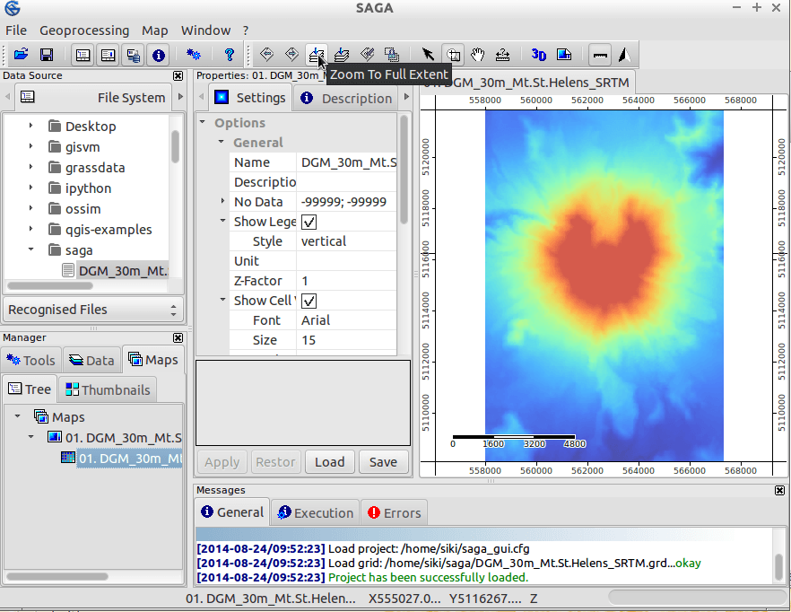
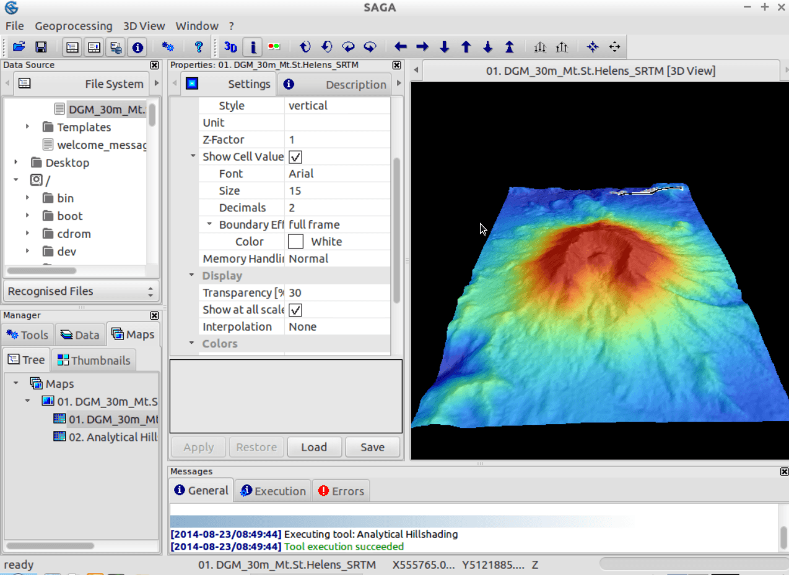

:Author: Johan Van de Wauw
:Version: osgeo-live4.0
:License: Creative Commons

.. image:: ../../images/project_logos/logo-saga.png
  :scale: 100 %
  :alt: project logo
  :align: right
  :target: http://www.saga-gis.org

**************************************
Εγχειρίδιο Γρήγορης Εκκίνησης SAGA GIS 
**************************************

Εκτέλεση
========

Για να εκτελέσετε το SAGA GIS σε αυτό το  Live DVD, επιλέξτε με κλίκ το σύνδεσμο SAGA στην επιφάνεια εργασίας.

Όταν ανοίξετε το SAGA για πρώτη φορά, παρουσιάζονται 3 υπο-παράθυρα: το "Workspace, το "object properties" και το "messages Window". Οι πληροφορίες στο παράθυρο "object properties" θα μεταβάλλονται, συναρτήσει των επιλογών σας στο παράθυρο εργασίας.

  .. image:: ../../images/screenshots/1024x768/saga_guioverview.png
     :scale: 80

Άνοιγμα Δεδομένων
=================

Ανοίξτε το γραφικό περιβάλλον εργασίας του SAGA και φορτώστε το grid `/home/user/saga/DGM_30m_Mt.St.Helens_SRTM.grd` με χρήση του μενού **File|Grid|Load Grid** . Θα λάβετε ένα μήνυμα στην καρτέλα General σχετικά με την επιτυχία ή όχι της ενέργειας. Θα πρέπει να δείτε κάτι σαν το ακόλουθο: `Load Grid: DGM_30m_Mt.St.Helens_SRTM.grd...okay`. 
Αφού φορτώσετε τo σύνολο δεδομένων, θα εμφανιστεί στην καρτέλα Data  του υποπαραθύρου Workspace. 
Επίσης, θα βρίσκεται κάτω από τα Grids και το σύστημα αναφοράς στο οποίο ανήκει. 

Σε αυτή την περίπτωση, οι πληροφορίες του συστήματος αναφοράς για τον κάναβο, θα είναι: **30;312x 458y; 557970x 5108130y**. Ο πρώτος αριθμός είναι το μέγεθος της ψηφίδας (30 μέτρα), οι επόμενοι δύο αριθμοί δείχνουν τον αριθμό των κελιών στις διευθύνσεις χ και y αντίστοιχα και οι τελευταίοι δύο αριθμοί είναι η προέλευση του grid. SAGA's grid 
Τα συστήματα αναφέρονται στην κάτω αριστερά γωνία Αυτές και μερικές ακόμα χρήσιμες πληροφορίες που αφορούν το σύνολο δεδομένων θα εμφανιστούν εάν επιλέξετε την καρτέλα Description του παραθύρου Properties. Όταν κλικάρετε στην καρτέλα, θα δείτε όχι μόνο περισότερο λεπτομερείς πληροφορίες για το σύστημα αναφοράς του κανάβου, αλλά και τον τύπο των δεδομένων του grid (εδώ ο τύπος είναι FLOAT), το εύρος των τιμών, κάποια στατιστικά μεγέθη και το μέγεθος στη μνήμη.

Προβολή Δεδομένων
=================

Για να προβάλετε τo σύνολο των δεδομένων σε ένα χάρτη, απλώς κάντε διπλο κλίκ πάνω στα δεδομένα στην καρτέλα Data του παραθύρου Workspace. Ένα νέο παράθυρο Map θα ανοίξει το οποίο θα περιέχει το σύνολο δεδομένων που επιλέξατε. Η επιφάνεια σχεδίασης είναι πλαισιωμένη: Πάνω και αριστερά προβάλλονται οι x και y συντεταγμένες στο σύστημα αναφοράς των δεδομένων. Κάτω και δεξιά βλέπετε κανόνες (χάρακες) σε μονάδες του χάρτη. Κινήστε το δείχτη του ποντικιού πάνω από το χάρτη και παρατηρήστε τις x-, y- και z- συντεταγμένες να προβάλλονται στην κάτω μπάρα της διεπιφάνειας  του SAGA. Οι z-συντεταγμένες που προβάλλονται αφορούν τις τιμές του συνόλου δεδομένων (έχετε υπόψη σας πως οι τιμές που προβάλλονται είναι πάντα αυτές των δεδομένων που έχουν επιλεγεί  στην καρτέλα Data ή Maps).

Τώρα χρησιμοποιείστε τα εργαλεία πλοήγησης zoom και pan. Το εργαλείο zoom είναι προεπιλεγμένο. Ένα αριστερό κλικ του ποντικιού πάνω στο χάρτη εστιάζει, ενώ ένα δεξί κλικ απομακρύνει από την περιοχή. Κρατώντας πατημένο το αριστερό πλήκτρο του ποντικιού, μετακινόντας το στην αντίθετη γωνία και απελευθερώντας το αριστερό πλήκτρο του ποντικιού (που ήταν δεσμευμένο τόσην ώρα) σας επιτρέπει να εστιάσετε σε μια συγκεκριμένη περιοχή ενδιαφέροντος. Εάν εστιάσετε πάρα πολύ, θα δείτε πως προβάλλονται οι τιμές των κελιών Για να κινηθείτε πάνω στο χάρτη, επιλέξτε το εργαλείο Pan και στη συνέχεια κλικάρετε και τραβήξτε με το ποντίκι. Παρατηρήστε τα υπόλοιπα εργαλεία στη γραμμή εργαλείων: σας επιτρέπουν να εστιάσετε πχ σε όλο το εύρος της περιοχής.

.. Παρατήρηση: Το Saga εστιάζει πολύ γρήγορα, έτσι αν χαθείτε καθώς παρατηρείτε τα δεδομένα σας, επιλέξτε το κουμπί 'Zoom to Full Extent' στη γραμμή εργαλείων

Δημιουργία χάρτη σκίασης αναγλύφου
~~~~~~~~~~~~~~~~~~~~~~~~~~~~~~~~~~

Ας ενισχύσουμε την προβολή του χάρτη με τον υπολογισμό ενός χάρτη σκίασης αναγλύφου. Αλλάξτε στην καρτέλα Modules του παραθύρου workspace και επιλέξτε το "+" αριστερά από τη βιβλιοθήκη **Terrain Analysis - Lightning, Visibility**: Εμφανίζεται η λίστα με τα προγράμματα αυτής της βιβλιοθήκης Τώρα επιλέξτε το πρόγραμμα Analytical Hillshading και μετά επιλέξτε το Settings tab από το Properties window. Θα εμφανιστούν οι παράμετροι του προγράμματος (επίσης παρατηρήστε και στην καρτέλα Desctiption, στην οποία περιέχονται περισσότερες πληροφορίες για το πρόγραμμα και τις παραμέτρους του). Κάντε αριστερο κλικ στη δεξιά στήλη των παραμέτρων του συστήματος του κανάβου (όπου εμφανίζεται η επιλογή [not set]) και επιλέξτε το σύστημα αναφοράς κανάβου του συνόλου δεδομένων Mt. St. Helens. Στη συνέχεια επιλέξτε με κλίκ στη δεξιά στήλη της παραμέτρου υψομέτρου (Elevation) και επιλέξτε το σύνολο δεδομένων. Κάντε αριστερό κλικ στις επιλογές για τη μέθοδο σκίασης (Shading Method) και επιλέξτε Standard. Τώρα πιέστε με τη σειρά, τα κουμπιά Apply και Execute. Πρόκειται να υπολογιστεί ένα νέο σύνολο δεδομένων που θα περιέχει τη σκίαση αναγλύφου.

Παρατηρώντας στην καρτέλα Data του παραθύρου Workspace θα βρείτε το σύνολο δεδομένων που μόλις δημιουργήθηκε. Κάντε διπλό κλικ στο σύνολο δεδομένων 'Analytical Hillshading' και επιλέξτε "New" στο παράθυρο διαλόγου που εμφανίζεται. Με αυτό τον τρόπο θα εμφανιστεί το σύνολο δεδομένων σε νέο χάρτη. Αφού παρατηρήστε το σύνολο δεδομένων, κλείστε το χάρτη επιλέγοντας Close από το μενού Window.

Τώρα κάντε διπλό κλικ στα δεδομένα σκίασης αναγλύφου ξανά, αλλά επιλέξτε το χάρτη που περιέχει το σύνολο δεδομένων υψομέτρου στο παράθυρο διαλόγου που εμφανίζεται (Add layer to selected map). Αυτό θα τοποθετήσει τη σκίαση αναγλύφουν πάνω από το σύνολο δεδομένων υψομέτρου.

Αλλάξτε στην καρτέλα Maps του παραθύρου Workspace. Θα δείτε την αναφορά του χάρτη σας και το σύνολο δεδομένων που τον συνθέτει. Η σειρά σχεδίασης είναι από πάνω προς τα κάτω. Τώρα κάντε δεξί λικ στο σύνολο δεδομένων 'Analytical Hillshading' και επιλέξτε Move to Bottom από το μενού επιλογών που παρουσιάζεται. Αυτό θα αλλάξει τη σειρά σχεδίασης, τοποθετώντας τη σκίαση αναγλύφου κάτω από το σύνολο δεδομένων υψομέτρου (τα οποία πλέον εμφανίζονται πάλι πάνω στο χάρτη). Τώρα επιλέξτε το σύνολο δεδομένων υψομέτρου (κάνοντας αριστερό κλικ) και παρατηρήστε στην καρτέλα Settings του παραθύρου Properties. Βρείτε τον τις ρυθμίσεις προβολείς των παραμέτρων (Display section) και κάντε κλικ στη δεξιά στήλη της επιλογής Transparency. Τώρα πιέστε με τη σειρά, τα κουμπιά Apply και Execute. Εισάγετε την τιμή 30 και πιέστε το κουμπί Apply. Tώρα θα δείτε τις τιμές του υψομέτρου να σκιάζονται από το ανάγλυφο.

Δοκιμάστε ελεύθερα άλλες ρυθμίσεις διαφάνειας ή ακόμη δοκιμάστε και άλλες μεθόδου σκίασης από το πρόγραμμα "Analytical Hillshading" (στην περίπτωση που δεν μεταβάλετε την παράμετρο για το σύνολο δεδομένων εξόδου -output dataset parameter- οι αλλαγές θα εγγραφούν στο grid που έχει ήδη δημιουργηθεί, και έτσι θα δείτε τις αλλαγές στο χάρτη αμέσως).

.. image:: ../../images/screenshots/1024x768/saga_withhillshade.png
    :scale: 80

3D Οπτικοποίηση
~~~~~~~~~~~~~~~
Σε επόμενο βήμα πιθανότατα να θέλετε να οπτικοποιήσετε το χάρτη σας σε τρεις διαστάσεις (3D Visualization). Σιγουρευτείτε πως το παράθυρο Map είναι επιλεγμένο και πατήστε το κουμπί Show 3D-View στη γραμμή εργαλείων. Στον αναδυόμενο διάλογο, επιλέξτε το σύστημα αναφοράς του κανάβου που περιέχει το σύνολο δεδομένων σας και επιλέξτε  τα δεδομένα Mt. St. Helens ως παραμέτρους του υψομέτρου (Elevation parameter). Όταν πατήσετε το κουμπί Okay, θα εμφανιστεί η τρισδιάστατη αναπαράσταση του χάρτη σας. Κρατώντας πατημένο το αριστερό πλήκτρο του ποντικιού, μετακινόντας το στην αντίθετη γωνία και απελευθερώντας το αριστερό πλήκτρο του ποντικιού (που ήταν δεσμευμένο τόσην ώρα) σας επιτρέπει να εστιάσετε σε μια συγκεκριμένη περιοχή ενδιαφέροντος. Κρατήστε το αριστερό κουμπί του ποντικιού πατημένο και κουνήστε το ποντίκι για να περιστρέψετε το χάρτη και να αλλάξετε την κλίση του. Χρησιμοποιήστε το δεξί κουμπί του ποντικιού για να εστιάσετε και να απομακρυνθείτε από μια περιοχή ενδιαφέροντος και να μετακινήσετε το χάρτη. Επίσης παρατηρήστε λίγο στη γραμμή εργαλείων 3D View: Τα κουμπιά της αντιγράγουν τις λειτουργίες του ποντικιού και παράλληλα προσφέρουν περισσότερη λειτουργικότητα. Για να κλείσετε την τρισδιάστατη οπτικοποίηση (3D View) επιλέξτε την επιλογή Close από το μενού Window.

Δημιουργία ισοϋψών καμπυλών
===========================
Ως μια μικρή εισαγωγή στις δυνατότητες διανυσματικής επεξεργασίας του SAGA, θα δημιουργήσουμε τώρα ισοϋψείς καμπύλες από το ψηφιακό μοντέλο εδάφους. Αυτό μπορεί να γίνει χρησιμοποιώντας
το **Shapes - Grid | Contour Lines From Grid** εάν ανοόξετε την καρτέλα modules στο worskpace, ή ισοδύναμα μπορείτε να ανοίξετε το πρόγραμμα χρησιμοποιώντας το μενού: **Modules|Shapes|Shapes from Grid**. Επιλέξτε το σύστημα αναφοράς κανάβου και τον κάναβο 
(Αυτό θα πρέπει να είναι το υψόμετρο). Μπορείτε να αφήσετε τις επιλογές ως έχουν, αλλά πιθανότατα είναι προτιμότερο να επιλέξετε μια ισοδιάσταση των 50m, αντί των προεπιλεγμένων 10m. 
Μερικά δευτερόλεπτα αργότερα ο χάρτης ισοϋψών καμπυλών έχει δημιουργηθεί και θα πρέπει να τον βρείτε κάτω από την καρτέλα data στο workspace. Δοκιμάστε να ανοίξετε το χάρτη ισοϋψών καμπυλών σε νέο χάρτη. Όλες οι ισοϋψείς καμπύλες, έχουν το ίδιο χρώμα, το οποίο δεν είναι και τόσο εκλυστικό. Αν επιλέξετε το σύνολο δεδομένων σας (στο workspace, καρτέλα data)και ελέγξετε τα Settings στο παράθυρο Object Properties,θα βρείτε ένα τομέα: Display: color classification. Μπορείτε να αλλάξετε την ταξινόμηση από 'Unique symbol' σε graduated color. Τότε, θα πρέπει επίσης να αλλάξετε το χαρακτηριστικό το οποίο χρησιμοποιείται για αυτό το graduated color στο υψόμετρο. Πιέστε apply, και θα σας παρουσιαστούν έγχρωμες ισοϋψείς καμπύλες.

Ελέξτε το ιστορικό σας
~~~~~~~~~~~~~~~~~~~~~~
Εάν επιλέξετε ένα σύνολο δεδομένων (πχ τις ισοϋψείς γραμμές) στην καρτέλα workspace, μπορείτε να αλλάξετε την καρτέλα object properties στο  'history' για να δείτε ποιο πρόγραμμα και ποιες ρυθμίσεις επελέγησαν ώστε να δημιουργηθεί το σύνολο δεδομένων. Αυτή η πληροφορία επίσης κρατάται όταν σώζεται τα αρχεία σας (σε μορφή αρχείου .hshp και .hgrd).

.. image:: ../../images/screenshots/1024x768/saga_contour_history.png
    :scale: 80

Αποθήκευση δεδομένων
====================
To save the work you have created you should open the data tab in the workspace, and right click on the file you want to save. Το SAGA θα σώσει αρχεία κανάβου στη δική του τυποποίηση αρχείου (\*.sgrd) και shapefiles στην τυποποιημένη μορφή αρχείου της ESRI (\*.shp). Παρέχεται επίσης η δυνατότητα αποθήκευσης όλης της μελέτης, επιλέγοντας **File|Project|Save Project**. Αυτό θα σώσει όλα τα map views και τις ρυθμίσεις των δεδομένων (data settings) ενώ θα προσφέρει αποθήκευση των αρχείων δεδομένων.

Είσοδος/Έξαγωγή δεδομένων
=========================
If you want to import or export data different modules are present. Το πιο χρήσιμο σε αυτό το πρόγραμμα: Import/Export GDAL/OGR, που μπορεί να βρεθεί στο μενού **modules|file|GDAL/OGR**. Χρηριμοποιώντας αυτό το πρόγραμμα μπορούν να εισαχθούν πολλές μορφές ψηφιακών εικόνων (raster formats) συμπεριλαμβανομένου του geotiff. Το ίδιο πρόγραμμα μπορεί να χρησιμοποιηθεί για εξαγωγή δεδομένων σε αυτές τις τυποποιήσεις.

.. tip:: η τυποποίηση κανάβου του SAGA GIS υποστηρίζεται από την GDAL από την έκδοση 1.7.0. Αρχεία κανάβου αποθηκευμένα από το SAGA μπορούν να ανοιχτούν από πολλά προγράμματα που χρησιμοποιούν GDAL. Παρόλα αυτά, θα πρέπει να ανοίξετε αρχεία της μορφής '\*.sdat' και όχι της μορφής '\*.sgrd'.

Σε αυτό το παράδειγμα θα χρησιμοποιήσουμε τα ψηφιακά δεδομένα υψομέτρου (SRTM) από την περιοχή στα περίχωρα της Βαρκελώνης εάν μπορείτε/επιθυμείτε να τα κατεβάσετε από το διαδίκτυο.

Το αρχείο δεδομένων που θέλουμε να χρησιμοποιήσουμε είναι το `SRTM_u03_n041e002.tif` και μπορεί να βρεθεί στη διαδρομή `/home/user/data/raster` . Μπορείτε να το εισάγετε, χρησιμοποιώντας το πρόγραμμα Import/Export GDAL/OGR, το οποίο μπορεί να βρεθεί επίσης στο μενού **modules|file|GDAL/OGR**. 

Αφού εισάγετε το σύνολο δεδομένων και το ανοίξετε σε νέο παράθυρο, πιθανότατα θα απογοητευτείτε: το χρώμα του είναι μόνο γκρι! Ας δούμε τι πιθανώς μπορεί να το προκάλεσε: μερικά εικονοστοιχεία κοντά στην ακτή, φένεται να έχουν πολύ μικρές τιμές (-32768) (μπορείτε να ελέγξετε την τιμή ενός εικονοστοιχείου, επιλέγοντας το Z: value στη γραμμή εργαλείων status καθώς κινείτε το ποντίκι σας πάνω από τον κάναβο).

Αυτά τα εικονοστοιχεία στην πραγματικότητα δεν έχουν δεδομένα, έτσι θα πρέπει να μεταβάλλουμε τις ρυθμίσεις nodata:στο παράθυρο object properties (αφού επιλέξετε το σύνολο δεδομένων στο παράθυρο workspace), ρυθμίστε τη μέγιστη τιμή no data σε -32768 και εφαρμόστε την. 
Αφού γίνει αυτό, μπορούμε να ρυθμίσουμε από την αρχή την κλίμακα χρώματος για να ταιριάζει στο εύρος των δεδομένων. Μια εύκολη μέθοδος είναι κάνοντας δεξί κλικ στον κάναβο στο workspace και στη συνέχεια επιλέγετε 'Classification|Set Range to minimum maximum'.

Τώρα είστε έτοιμοι για να επαναλάβετε τα πρώτα βήματα δημιουργίας ενός χάρτη σκίασης αναγλύφου, ή να εξερευνήσετε μερικές από τις υπόλοιπες δυνατότητες του SAGA!

Περισσότερες πληροφορίες
========================
Αυτό το live dvd περιέχει τον οδηγό χρήστη του SAGA:
 * `SAGA userguide <../../saga/SAGA2_UserGuide_Cimmery_20070401.pdf/>`_
Περισσότερες αναφορές μπορούν να βρεθούν στην ιστοσελίδα του SAGA:
 * http://www.saga-gis.org
και ειδικότερα στο αρχείο τεκμηρίωσης:
 * http://www.saga-gis.org/en/about/references.html 
 * http://sourceforge.net/projects/saga-gis/files/SAGA%20-%20Documentation/ 
