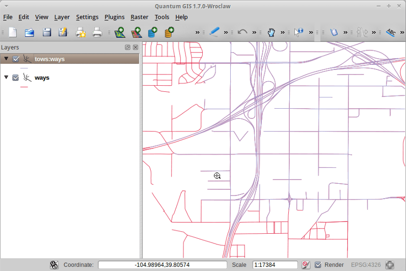

:Author: OSGeo-Live
:Author: Pirmin Kalberer
:Version: osgeo-live5.5
:License: Creative Commons Attribution-ShareAlike 3.0 Unported  (CC BY-SA 3.0)

.. _tinyows-quickstart-el:
 
.. image:: ../../images/project_logos/logo-TinyOWS.png
  :scale: 100 %
  :alt: project logo
  :align: right
  :target: http://www.tinyows.org/

********************************************************************************
Εγχειρίδιο Γρήγορης Εκκίνησης TinyOWS
********************************************************************************

Το TinyOWS είναι ένα λογισμικό υψηλών επιδόσεων που υλοποιεί την διαδικτυακή υπηρεσία Transactional Web Feature Service (WFS-T) σε ένα ελαφρύ και εύκολα διαχειρίσημο περιβάλλον, με τη χρήση τεχνολογιών όπως CGI ή FastCGI και σε βάση δεδομένων :doc:`PostGIS <../overview/postgis_overview>` για αποθήκευση των χωρικών δεδομένων.

Αυτός ο οδηγός περιγράφει πως:

  * να παρουσιάσετε ένα επίπεδο WFS στο λογισμικό QGIS
  * να επεξεργαστείτε ένα επίπεδο WFS στο QGIS μεσω της τεχνολογίας WFS-T

Παρουσίαση δεδομένων επιπέδου WFS στο λογισμικό QGIS
================================================================================

#. Κάντε κλίκ στο μενού :menuselection:`Desktop --> Desktop GIS --> Quantum GIS`.

#. Κάντε κλίκ στο :menuselection:`Layer --> Add PostGIS Layer...`.

   * Εδώ εμφανίζεται το αρχικό επίπεδο της PostGIS

#. Επιλέξτε :guilabel:`New`.

#. Πληκτρολογήστε  **pgrouting** σαν όνομα σύνδεσης (Connection name) και Database

#. Πιέστε :guilabel:`OK`.

#. Πιέστε :guilabel:`Connect`.

#. Επιλέξτε **ways** στην λίστα πινάκων

#. Επιλέξτε :guilabel:`Add`.

#. Κάντε μεγέθυνση

#. Επιλέξτε από το μενού :menuselection:`Plugins -> Manage Plugins -> WFS Plugin -> OK`

   * Ενεργοποιούμε το πρόσθετο για επίπεδα WFS.

#. Κάντε κλίκ στο μενού :menuselection:`Layer --> Add WFS Layer...`.

   * Τώρα προσθέτουμε ένα επίπεδο WFS βασισμένο στον ίδιο πίνακα

#. Επιλέξτε :guilabel:`New`.

#. Συμπληρώστε  **tinyows** σαν όνομα και **http://localhost/cgi-bin/tinyows** σαν URL

#. Επιλέξτε :guilabel:`OK`.

#. Πιέστε :guilabel:`Connect`.

#. Επιλέξτε **ows:ways** στη λίστα επιπέδων

#. Ενεργοποιήστε :guilabel:`Only request features overlapping the current view extent`.

#. Πιέστε :guilabel:`OK`.

   * Το επίπεδο WFS τώρα εμφανίζεται:

Επεξεργασία δεδομένων μέσω WFS-T
================================================================================

#. Πιέστε :menuselection:`Layer --> Toggle Editing`.

#. Πιέστε :menuselection:`Edit --> Node Tool`.

#. Μετακινήστε εναν κόμβο σε άλλη θέση

#. Πιέστε :menuselection:`Layer --> Save edits`.

#. Κρύψτε το επίπεδο απενεργοποιώντας **tows:ways** στη λίστα επιπέδων

   * Μπορείτε να δείτε τις επεξεργασίες με άλλο χρώμα μέσω της απευθείας σύνδεσης με την PostGIS.

Τι ακολουθεί;
================================================================================

Για να μάθετε περισσότερα σχετικά με το TinyOWS, ένα καλό σημείο έναρξης είναι το εγχειρίδιο χρήσης στην κεντρική ιστοσελίδα `TinyOWS`_.

.. _`TinyOWS`: http://tinyows.org/trac/wiki/UserDocumentation

