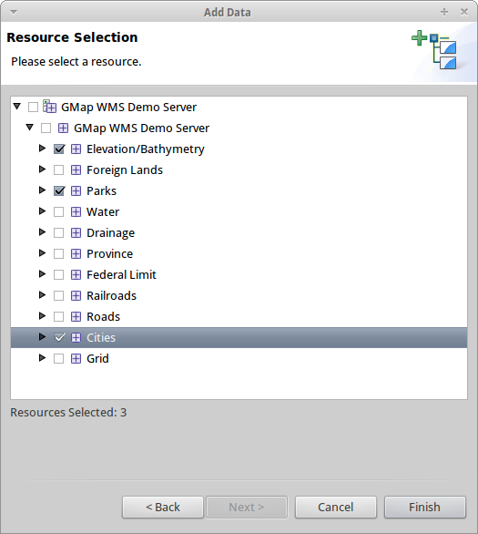
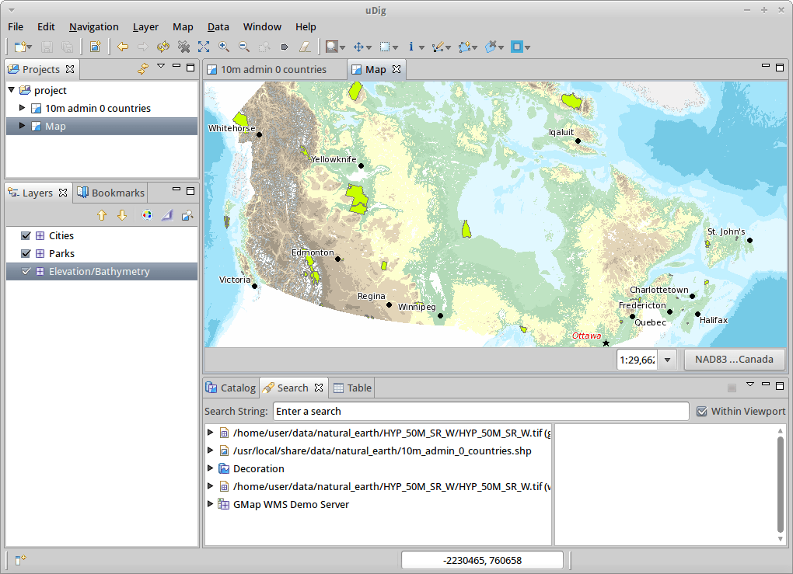

:Συγγραφέας: OSGeo Live
:Συγγραφέας: Jody Garnett
:Συγγραφέας: Micheal Bedward
:Έκδοση: osgeo-live4.0
:Άδεια: Creative Commons
:Ευχαριστείες: geotools-user list

.. _udig-quickstart:
 
.. image:: ../../images/project_logos/logo-uDig.png
  :scale: 60 %
  :alt: project logo
  :align: right

***************
Εγχειρίδιο Γρήγορης Εκκίνησης uDig 
***************

Το uDig (User Friendly Internet Desktop GIS), είναι ένα λογισμικό GIS για
επεξεργασία και θέαση χωρικών δεδομένων.

Οι συγκεκριμένες οδηγίες περιγράφουν πώς:

  * Φορτώνουμε επίπεδα χαρτών από αρχεία shapefile και υπηρεσίες Web Map Service (WMS)
  * Χρησιμοποιούμε βασικά εργαλεία χαρτογραφίας
  * Εφαρμόζουμε στύλ σε χάρτες δίνοντάς τους χρώμα

Εκκίνηση uDig
==========

.. TBD: Προσθήκη γραφικών μενού στο εγχειρίδιο

#. Επιλέξτε :menuselection:`Geospatial --> Desktop GIS --> uDig` από το μενού των εφαρμογών
#. Η εφαρμογή χρειάζεται λίγο χρόνο για να ξεκινήσει

Εαν αντιμετωπίσετε δυσκολίες, ή αν εκτελείτε ήδη το uDig, παρακαλούμε ανατρέξτε στην σελίδα αναφοράς Running uDig.

Εικόνα καλωσορίσματος
============

#. Όταν ξεκινάτε το uDig για πρώτη φορά, η εικόνα καλωσορίσματος καταλαμβάνει ολόκληρη την οθόνη. Η οθόνη αυτή
   έχει συνδέσεις με βοηθήματα, έγγραφα και την ιστοσελίδα του έργου.

#. Κάντε κλίκ στο βέλος που έχει τίτλο Workbench στο πάνω δεξί άκρο της οθόνης, για να φανερωθούν τα περιεχόμενα της επιφάνειας εργασίας του uDig.
  
  .. image:: ../../images/screenshots/800x600/udig_welcome.png

Μπορείτε να επιστρέψετε στην αρχική οθόνη όποια στιγμή επιλέξετε από το μενού :menuselection:`Help --> Welcome`.

Επιφάνεια Εργασίας
=========

Το παράθυρο της επιφάνειας εργασίας προσφέρει πολλούς επεξεργαστές (ο καθένας δείχνει έναν χάρτη) και υποστηρίζει Όψεις (προσφέροντας πληροφορίες για τον εκάστoτε ενεργό χάρτη).

  .. image:: ../../images/screenshots/800x600/udig_workbench.png

Παραπάνω φαίνεται μια τυπική συνεδρία uDig με τον επεξεργαστή χάρτη, την όψη εργασιών (Projects view), τα θεματικά επίπεδα (Layers view) και τον κατάλογο (Catalog
view). Αυτές οι όψεις περιγράφονται στη συνέχεια όπου και αναφέρουμε την λειτουργία τους.

Αρχεία
=====

Ξεκινώντας θα φορτώσουμε μερικά από τα δοκιμαστικά δεδομένα που περιλαμβάνονται στο DVD.

#. Επιλέξτε :menuselection:`Layer --> Add` από το μενού για να ανοίξετε τον βοηθό **Add Data**

#. Επιλέξτε **Files** από τη λίστα των πηγών δεδομένων

#. Επιλέξτε :guilabel:`Next` για να ανοίξει το παράθυρο επιλογής αρχείου

#. Το OSGeo Live DVD περιλαμβάνει δοκιμαστικά δεδομένα στο:
   
   * :file:`~/data` (a short cut to :file:`/usr/local/share/data`)
   * :file:`/usr/local/share/udig/udig/udig-data/`

#. Επιλέξτε το παρακάτω αρχείο από τον φάκελο δεδομένων του udig:
   
   * :file:`countries.shp`
   
#. Επιλέξτε :guilabel:`Open`
   
   * Ένας νέος επεξεργαστής χάρτη θα ανοίξει με βάση τα περιεχόμενα του αρχείου shapefile. Το βασικό όνομα και
     το σύστημα προβολής του χάρτη επιλέχθηκε με βάση τα περιεχόμενα του shapefile.
   
   * Στο παράθυρο  **Καταλόγου** έχει προστεθεί μια εγγραφή για το  :file:`countries.shp`. Αυτό 
     το παράθυρο χρησιμοποιείται για να καταγράψει το ιστορικό δεδομένων του χρήστη στο uDig.
   
   * Το παράθυρο **Επιπέδων (Layers)** δείχνει ενα μοναδικό επίπεδο που φαίνεται στον χάρτη. Αυτό το παράθυρο χρησιμοποιείται για να αλλάξει 
     τη σειρά και εμφάνιση των επιπέδων πληροφορίας του χάρτη.
   
   * Η όψη **Εργασιών (Projects)** έχει ενημερωθεί δείχνοντας ότι ο χάρτης σας είναι αποθηκευμένος στο projects > countries.
     Μπορούμε να έχουμε πολλές εργασίες (projects) ανοιχτές ταυτόχρονα και κάθε εργασία πολλούς χάρτες.

#. Ανοίγουμε τον φάκελο δεδομένων στην επιφάνεια εργασίας

#. Σέρνουμε το αρχείο :file:`clouds.jpg` στον επεξεργαστή χάρτη (Map Editor), και ένα νέο επίπεδο προστίθεται στο χάρτη.\

#. Μπορούμε να δούμε τη σειρά με την οποία εμφανίζονται τα επίπεδα στη όψη επιπέδων. Αυτή τη στιγμή το αρχείο clouds.jpg εμφανίζεται
   πάνω από το επίπεδο των χωρών.

#. Επιλέγουμε το επίπεδο clouds.jpg στον κατάλογο και στο σέρνουμε στο τέλος της λίστας
  
  .. image:: ../../images/screenshots/800x600/udig_QuickstartCountriesMap.jpg

.. note::
   Ένα από τα πρώτα ερωτήματα που συναντάμε όταν το uDig είναι υποψήφιο για χρήση από κάποιον οργανισμό είναι πόση μνήμη
   χρησιμοποιεί η εφαρμογή. Σε αντίθεση με άλλες εφαρμογές GIS το uDig μπορεί να χρησιμοποιήσει συγκεκριμένη ποσότητα μνήμης. Το 
   παραπάνω shapefile δεν φορτώνεται στη μνήμη, έχουμε πολιτική να κρατάμε τα δεδομένα στο δίσκο και να εμφανίζουμε δεδομένα 
   όπως αυτό το shapefile στην οθόνη όταν αυτό χρειάζεται.

.. tip:: Μπορείτε επίσης να σύρετε αρχεία shapefile απευθείας στην εφαρμογή uDig!

Χάρτης
=========

Μπορείτε να ελέγξετε σε ποιό μέρος του κόσμου δείχνει ο επεξεργαστής χάρτη με τη χρήση των εργαλείων πλοήγησης στη μπάρα εργαλείων στο πάνω μέρος της οθόνης.

#. Το |ZOOM| εργαλείο μεγέθυνσης (Zoom tool) είναι διαθέσιμο σαν προεπιλογή
   
   .. |ZOOM| image:: ../../images/screenshots/800x600/udig_zoom_mode.gif
   
   * Χρησιμοποιούμε το εργαλείο μεγέθυνσης σχεδιάζοντας ένα παραλληλόγραμμο στο χάρτη με τη χρήση του αριστερού πλήκτρου του ποντικιού γύρω από την περιοχή που μας ενδιαφέρει
     να δούμε.
   * Για να απομακρυνθούμε σχεδιάζουμε παραλληλόγραμμο με το δεξί κουμπί του ποντικιού. Τα όρια του χάρτη θα τοποθετηθούν
     στο παραλληλόγραμμο που σχεδιάζουμε.

#. Το |PAN| εργαλείο μετάθεσης (Pan) μπορεί να χρησιμοποιηθεί για να μετακινηθούμε γύρω στο χάρτη μας χωρίς να αλλάξουμε την κλίμακα εμφάνισης.
  
   .. |PAN| image:: ../../images/screenshots/800x600/udig_pan_mode.gif

#. Επιπλέον υπάρχουν διάφορα διαθέσιμα κουμπιά που μπορούν να χρησιμοποιηθούν ανα πάσα στιγμή:
 
   * |SHOWALL| Εμφάνιση όλων (Show All), μπορεί να επαναφέρει το χάρτη σε πλήρη έκταση οποιαδήποτε στιγμή
   
     .. |SHOWALL| image:: ../../images/screenshots/800x600/udig_zoom_extent_co.gif

   * |ZOOM_IN| Μεγέθυνση (Zoom In) και |ZOOM_OUT| σμίκρυνση (Zoom Out) μπορούν να χρησιμοποιηθούν για να αλλάξουν την κλίμακα κατά ένα προκαθορισμένο ποσό.

     .. |ZOOM_IN| image:: ../../images/screenshots/800x600/udig_zoom_in_co.gif
     .. |ZOOM_OUT| image:: ../../images/screenshots/800x600/udig_zoom_out_co.gif

   * Μπορούμε να χρησιμοποιήσουμε τα Navigation Back |BNAV| και Forward |FNAV| από το μενού εντολών για να επισκεφθούμε 
     σημεία που είχαμε δει προηγουμένως.

  	 .. |BNAV| image:: ../../images/screenshots/800x600/udig_backward_nav.gif
     .. |FNAV| image:: ../../images/screenshots/800x600/udig_forward_nav.gif

.. tip:: Τα περισσότερα εργαλεία επιτρέπουν τη μετάθεση κρατώντας το κεντρικό πλήκτρο του ποντικιού και τον ελέγχο της κλίμακας με 
   τη ροδέλα του ποντικιού.

Web Map Server
==============

.. sidebar:: Offline

   Εαν δεν υπάρχει σύνδεση στο διαδίκτυο, εκτελέστε **Start GeoServer** για ένα τοπικό WMS. Το script
   θα ανοίξει μια σελίδα με ένα σύνδεσμο "wms capabilities" το οποίο μπορούμε να σύρουμε στον άδειο μας χάρτη.
   
Ένας από τους λόγους να χρησιμοποιούμε την εφαρμογή uDig είναι να έχουμε πρόσβαση σε όλα τα δωρεάν και ελεύθερα χωρικά δεδομένα που είναι διαθέσιμα στο διαδίκτυο. Αυτό το κεφάλαιο καλύπτει τη χρήση του προτύπου WMS το οποίο καθιστά διαθέσιμα
επίπεδα πληροφορίας που μπορούμε να προσθέσουμε στους χάρτες μας.

.. tip:: Μπορούμε να συνδεθούμε σε εξυπηρετητές WMS με τη χρήση του βοηθού εισαγωγής δεδομένων (Add Data Wizard)
  με λειτουργία συρσίματος.

#. Επιλέξτε :menuselection:`File --> New --> New Map` από το μενού εντολών

#. Εναλλάξτε την όψη **Web**, κάνοντας κλίκ στη σελίδα δίπλα από τον **Κατάλογο** για να ενεργοποιηθεί η όψη *Web*.
   
  .. image:: ../../images/screenshots/800x600/udig_WebViewClick.png
    :scale: 70 %

#. Κάντε κλίκ στο σύνδεσμο *WMS:dm solutions*

#. Από την σελίδα πηγών δεδομένων επιλέγουμε τα παρακάτω επίπεδα:

   * Υψομετρία/Βαθυμετρία (Elevation/Bathymetry)
   * Πάρκα (Parks)
   * Πόλεις (Cities)
   

#. Επιλέξτε :guilabel:`Finish` για να προσθέσετε αυτά τα επίπεδα στο χάρτη
   

  
#. Χρησιμοποιήστε το |ZOOM| εργαλείο μεγέθυνσης για να μετακινηθείτε πιο κοντά σε ένα από τα πάρκα

#. Αλλάξτε το ποντίκι στο |INFO| εργαλείο πληροφοριών (Info Tool) και κάντε κλίκ σε ένα πάρκο για να μάθετε περισσότερα για αυτό
   
.. |INFO| image:: ../../images/screenshots/800x600/udig_info_mode.gif

Tip: Μπορείτε να εναλλάξετε τα προηγούμενα εργαλεία (zoom και info) με την χρήση των πλήκτρων Z και I στο πληκτρολόγιο.

Στύλ
=====

#. Επιλέξτε το project > countries, μπορείτε να κάνετε διπλό κλίκ για να ανοίξετε το χάρτη, ή δεξί κλίκ και επιλογή Open Map

#. Επιλέξτε το επίπεδο των χωρών στην όψη επιπέδων

#. Ανοίξτε τον επεξεργαστή στύλ (Style Editor) με δεξί κλίκ στο επίπεδο των χωρών και την επιλογή Change Style

#. Θα κάνουμε ορισμένες αλλαγές στο πως εμφανίζονται οι χώρες
   
   * Γραμμή (Line): Κάντε κλίκ στο Color και αλλατε την τιμή σε BLACK
   
   * Γέμισμα (Fill): απενεργοποιήστε το πλαίσιο για να απενεργοποιηθεί το γέμισμα με χρώμα
   
   * Λεζάντα (Label): ενεργοποιήστε το πλαίσιο, και επιλέξτε CNTRY_NAME από τη λίστα των περιγραφικών χαρακτηριστικών
   
   .. image:: ../../images/screenshots/800x600/udig_StyleEditor.png
      :scale: 70 %

#. Πιέστε :guilabel:`Apply` για να δείτε πως φαίνονται οι αλλαγές στο χάρτη. Η όψη επιπέδων επίσης θα αλλάξει
   για να αντιστοιχεί στο νέο στύλ

#. Όταν είστε ευχαριστημένοι με το αποτέλεσμα μπορείτε να επιλέξετε :guilabel:`Close` για να κλείσει το παράθυρο

#. Ορισμένα αρχεία περιλαμβάνουν ρυθμίσεις στύλ, επιλέξτε :menuselection:`Layer --> Add` από το μενού εντολών

#. Επιλέξτε **Files** από τη λίστα πηγών δεδομένων και στη συνέχεια επιλέξτε :guilabel:`Next`

#. Χρησιμοποιώντας το παράθυρο επιλογής αρχείων ανοίξτε το **timezone.shp** και πιέστε :guilabel:`Open`

#. Είναι δύσκολο να διακρίνουμε τι συμβαίνει με το επίπεδο clouds.jpg που παρέχει τόσες λεπτομέρειες.
   Επιλέξτε :menuselection:`Map --> Mylar` από το μενού εντολών για να επικεντρωθείτε στο επιλεγμένο επίπεδο

#. Χρησιμοποιώντας την όψη  *επιπέδων (Layer)* επιλέξτε ζώνη ώρας, χώρες και το clouds.jpg με τη σειρά για να παρατηρήσετε το αποτέλεσμα
  
.. image:: ../../images/screenshots/800x600/udig_MapMylar.jpg

#. Μπορείτε να απενεργοποιήσετε αυτό το εφέ ανα πάσα στιγμή επιλέγοντας :menuselection:`Map --> Mylar` από το μενού εντολών

Πράγματα για δοκιμή
=============

Μπορείτε να δοκιμάσετε τα παρακάτω:

#. Δοκιμάστε να δείτε τα δικά σας επίπεδα GIS, ή δοκιμάστε να εισάγετε ένα επίπεδο δεδομένων από μια υπηρεσία Web Feature Service (WFS).
#. Δοκιμάστε να αλλάξετε το στύλ σε ένα επίπεδο WFS.

Τί αναμένεται στη συνέχεια?
==========

Αυτό είναι το πρώτο βήμα στο δρόμο για τη χρήση του uDig. Υπάρχει πολύ καλό υλικό ακόμα να ανακαλύψετε στις οδηγίες εκμάθησης του λογισμικού.

* Οδηγίες εκμάθησης 1

  Δοκιμάστε τη χρήση βάσης δεδομένων PostGIS, εξάγοντας δεδομένα από μια υπηρεσία WFS και εξερευνήστε
  τη χρήση θεμάτων (Themes) με την ανεπτυγμένη τεχνολογία σύνθεσης χρωμάτων.

  :file:`/usr/data/udig/udig-docs/uDigWalkthrough 1.pdf`

* Οδηγίες εκμάθησης 2 - Μάθετε πως να δημιουργείτε shapefiles και να χρησιμοποιείτε τα εργαλεία επεξεργασίας (Edit tools) για να αλλάζετε
  τα δεδομένα. Καλύπτει οδηγίες για εγκατάσταση του GeoServer και επεξεργασίας με χρήση υπηρεσιών WFS
  Εξυπηρετητής.

  Διαθέσιμο στο http://udig.refractions.net/

