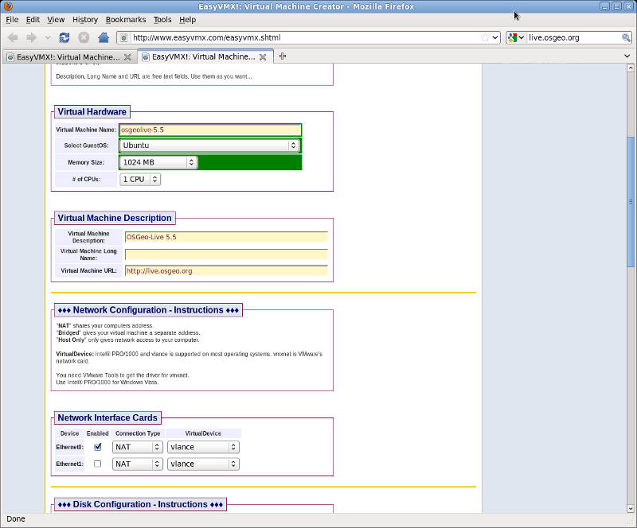
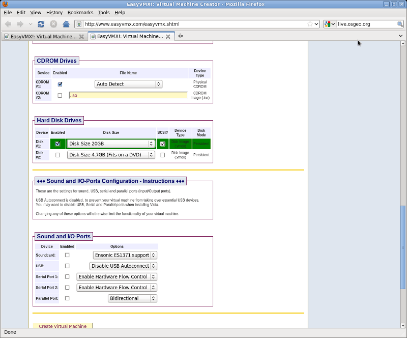
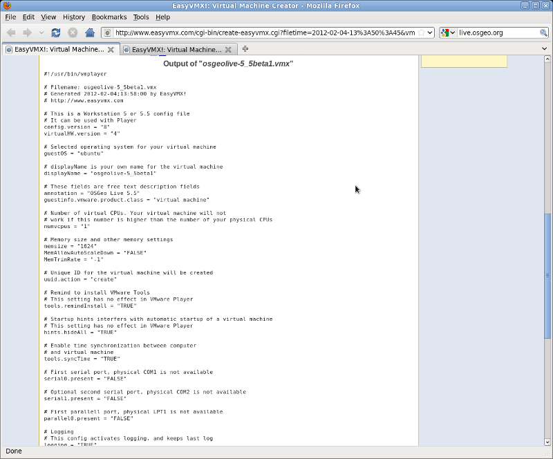
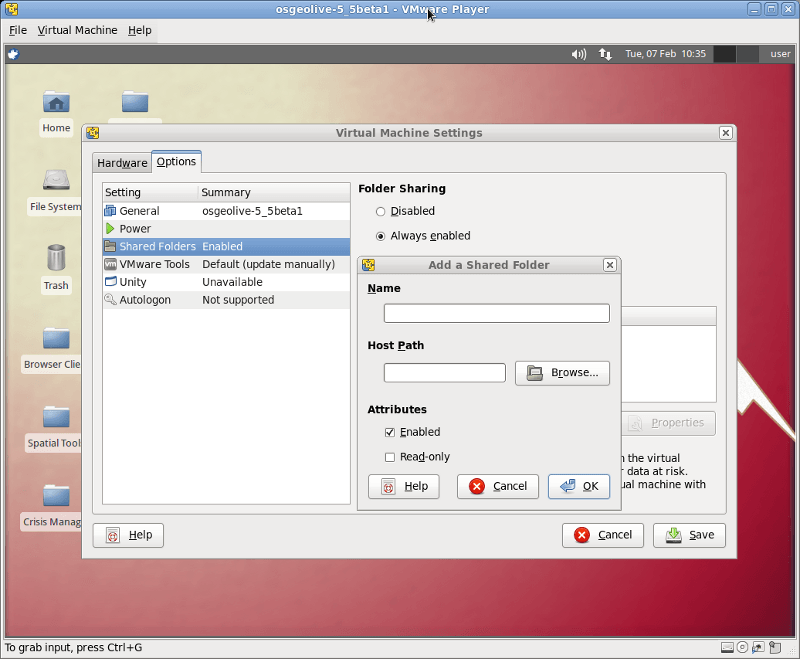

:Author: OSGeo-Live
:Author: Micha Silver
:Version: osgeo-live5.5
:License: Creative Commons Attribution-ShareAlike 3.0 Unported  (CC BY-SA 3.0)

********************************************************************************
Εγχειρίδιο Γρήγορης Εκκίνησης OSGeo-Live για το VMWare Player
********************************************************************************
Η διανομή OSGeo-Live μπορεί να εγκατασταθεί και να λειρουργήσει μέσα σαν φιλοξενούμενη (guest) εικονική μηχανή σε έναν διακομιστή (host). Ο υπολογιστής στον ρόλο του διακομιστή μπορεί να φέρει λειτουργικό σύστημα Windows ή Linux. Ο διακομιστής πρέπει να έχει εγκατεστιμένο λογισμικό (όπως το  VMWare Player) για να τρέξει την εικονική μηχανή. Ακολουθούν οδηγίες για την εγκατάσταση του OSGeo-Live σαν Εικονική Μηχανή. 

================================================================================
Γιατί να εκτελέσουμε το OSGeo-Live σε Εικονική Μηχανή;
================================================================================
Η εκτέλεση του OSGeoLive σε Εικονική Μηχανή βελτιώνει την εμπειρία του χρήστη επιτρέποντας του να αποθηκεύσει την δουλειά του και να προσθέσει επιπρόσθετα λογισμικά. Επιπρόσθετα η εικονική μηχανή ανταποκρίνεται καλύτερα σε σχέση με την εκτέλεση από το DVD. Η Εικονική Μηχανή OSGeo δημιουργεί ένα πλήρες και φυσικό υπολογιστικό περιβάλλον εργασίας. Σε αντίθεση με το DVD, τα δεδομένα και τα αρχεία αποθηκεύονται, οι ρυθμίσεις παραμένουν σταθερές, σαν να έχετε ένα δεύτερο υπολογιστή μέσα στον κεντρικό φυσικό υπολογιστή σας. Η πλατφόρμα αυτή επεκτείνει τη λειτουργικότητα του OSGeo-Live πέρα από τις ανάγκες της παρουσίασης, και φτάνει στις ανάγκες πραγματικής εργασίας σε περιβάλλον GIS. 

================================================================================
Απαιτήσεις
================================================================================

Υλικό
----------------
Ο φυσικός υπολογιστής σας (διακομιστής) θα πρέπει να διαθέτει τουλάχιστο 2GB μνήμης RAM. Θα πρέπει να παραχωρήσετε 1GB στην εικονική μηχανή και να αφήσετε 1GB για τον κεντρικό υπολογιστή. Η περισσότερη μνήμη είναι πάντα ευπρόσδεκτη και ανάλογα με τις απαιτήσεις της εργασίας σας μπορείτε να ρυθμίζετε την παραχώρηση της μνήμης και αργότερα. 
Σχετικά με τον διαθέσιμο χώρο στον σκληρό δίσκο, θα χρειαστείτε τουλάχιστο 25GB ελεύθερα. Εαν δημιουργήσετε έναν ακόμα μεγαλύτερο εικονικό δίσκο θα έχετε ακόμα περισσότερους πόρους για την εργασία σας. Επιπλέον ο επεξεργαστής στον υπολογιστή σας πρέπει να υποστηρίζει Εικονικές Μηχανές. Οι περισσότεροι υπολογιστές της τελευταίας πενταετίας έχουν επεξεργαστή που υποστηρίζει τεχνολογία  VT (Virtualization Technology).

Λογισμικό
----------------
Μεταφορτώστε την Εικονική Μηχανή του OSGeo-Live. Θα χρειαστείτε να αποσυμπιέσετε το αρχείο με το λογισμικό 7-zip. Επιπλέον θα πρέπει να διαθέτετε το λογισμικό VMWare Player για να εκτελέσετε την εικονική μηχανή. Θυμιθείτε ότι το λογισμικό VMWare Player, παρόλο που προσφέρεται δωρεάν, δεν είναι ελεύθερο λογισμικό σε αντίθεση με το Virtual Box για το οποίο μπορείτε να βρείτε οδηγίες σε άλλο κεφάλαιο. Για να κατεβάσετε το λογισμικό VMWare Player πρέπει να εγγραφείτε στην ιστοσελίδα VMWare, και να αποδεχθείτε την άδεια χρήσης του λογισμικού.:

`Η εικονική μηχανή OSGeo <http://download.osgeo.org/livedvd/release/5.5/osgeo-live-vm-5.5.7z>`_

`Η σελίδα μεταφόρτωσης του λογισμικού 7 zip <http://www.7-zip.org/download.html>`_

`Η σελίδα του VMWare Player: <https://www.vmware.com/tryvmware/?p=player&lp=1>`_

Αποσυμπιέστε το αρχείο osgeo-live-vm με την εντολή 

::

        7z e osgeo-live-vm-5.5.7z

ή μέσω του γραφικού προγράμματος 7-zip. Επιπλεέον εγκαταστείστε το λογισμικό VMWare Player.

================================================================================
Ρύθμιση της μηχανής
================================================================================
Για να εκτελέσετε την εικονική μηχανή OSGeo, πρέπει πρώτα να δημιουργηθεί ένα αρχείο ρυθμίσεων τύπου **vmx**. Ο γρήγορος τρόπος είναι να περιηγηθείτε στην παρακάτω διεύθυνση: 

`EasyVMX: <http://www.easyvmx.com/easyvmx.shtml>`_

Κάντε κλίκ στο κουμπί easyvmx και εισάγετε τις παρακάτω παραμέτρους:
        - Virtual Machine Name: osgeolive-6.0 (επιλέξτε ίδιο όνομα με το αρχείο vmdk)
        - Select GuestOS: Ubuntu
        - Memory Size: 1024 MB (τουλάχιστο)
        - Virtual Machine Description: OSGeo-Live 6.0
        - Network Interface Card: (αφήστε το προεπιλεγμένο)
        - Hardisk Drives: Disk#1 Disk Size 20GB (τουλάχιστο) και επιλέξτε SCSI
        - Sound and IO: μην επιλέξετε τίποτα

Κάντε κλίκ στο κουμπί "Create Experimental Virtual Machine" στο κάτω μέρος της σελίδας. Η σελίδα θα δημιουργήσει ένα αρχείο **vmx** με τις ρυθμίσεις. Τοποθετήστε αυτό το αρχείο στο φάκελο του υπολογιστή σας που περιλαμβάνει το αρχείο vmdk της εικονικής μηχανής OSGeo. Στην επόμενη οθόνη, αντιγράψτε όλες τις γραμμές από το ``#!/usr/bin/vmplayer`` σε ``# END OF EasyVMX! CONFIG`` και κάντε επικόληση σε ένα αρχείο με όνομα osgeolive-6.0.vmx. 

Το όνομα του αρχείου (χωρίς την επέκταση vmx) θα πρέπει να ταιριάζει στο όνομα του αρχείου vmdk. Επιπλέον ελέγξτε την γραμμή του αρχείου vmx που αναφέρεται σε ``scsi0:0.fileName =``. Θα πρέπει να είναι σε καε περίπτωση σύμφωνο με το όνομα του αρχείου vmdk που κατέβηκε από το διαδίκτυο.
Αποθηκεύστε το νέο αρχείο vmx στο ίδιο φάκελο με το αρχείο vmdk της OSGeo.

Ξεκινήστε το λογισμικό VMWare Player και κάντε κλίκ στο κουμπί **Open a Virtual Machine**. Βρείτε το φάκελο στον οποίο είναι αποθηκευμένα τα αρχεία vmdk και το νέο αρχείο vmx. Επιλέξτε το αρχείο vmx και η νέα εικονική μηχανή θα προστεθεί στη λίστα του λογισμικού VMWare Player. Κάντε κλίκ στο κουμπί **Play Virtual Machine** και η μηχανή θα ξεκινήσει.

.. image:: ../../images/screenshots/800x600/vmware_open.png
        :scale: 90
.. image:: ../../images/screenshots/800x600/vmware_play.png
        :scale: 90

================================================================================
Εφόσον η μηχανή έχει ξεκινήσει
================================================================================
Το πρώτο βήμα που πρέπει να γίνει είναι η εγκατάσταση του λογισμικού VMWare-tools. Με την εγκατάστασή του μπορεί να βελτιωθεί η ανάλυση της ανάλυσης της οθόνης και να ρυθμιστούν κοινοί φάκελοι μεταξυ της μηχανής OSGeo-Live και του διακομιστή. Εκτελέστε την παρακάτω εντολή από το τερματικό για να εγκαταστήσετε το VMWare tools:
 
::

        sudo apt-get install open-vm-dkms open-vm-toolbox

Στο παράθυρο της εικονικής μηχανής επιλέξτε από το μενού :menuselection:`Virtual Machine --> Virtual Machine Settings`, μετακινηθείτε στην καρτέλα Options, και κάντε κλίκ στην επιλογή Shared Folders. Από αυτή τη στιγμή υπάρχει η δυνατότητα με το κουμπί "+" να μοιραστείτε ένα φάκελο από τον εξωτερικό υπολογιστή σας μέσα στο σύστημα OSGeo Live. Εαν θέλετε να μοιραστείτε το φάκελο `C:\\Users\\your_name\\Downloads`. Κάντε κλίκ στο κουμπί της περιήγησης για να εντοπίσετε το φάκελο , δώστε του ένα όνομα πχ "Downloads", και κάντε κλίκ στο "Save".

Στη συνέχεια εκτελέστε δυο ακόμα εντολές στο τερματικό για να προσαρτήσετε τον φάκελο στο σύστημά σας:
::

        sudo mkdir /mnt/Downloads
        sudo mount -t vmhgfs .host:/Downloads /mnt/Downloads

Καλή συνέχεια...
