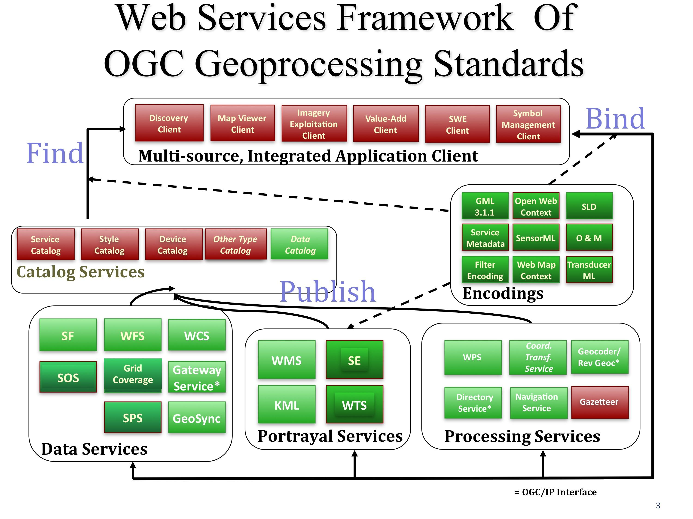

.. GeoSpatial Standards documentation master file, created by
   sphinx-quickstart on Mon Jul 19 08:52:52 2010.
   You can adapt this file completely to your liking, but it should at least
   contain the root `toctree` directive.

Πρότυπα Open GeoSpatial Consortium
====================================

Εισαγωγή
------------
Το Open Geospatial Consortium (OGC) ιδρύθηκε το 1994 με στόχο να κάνει τη γεωγραφική πληροφορία ένα βασικό στοιχείο της παγκόσμιας υποδομής πληροφοριών. Τα μέλη του OGC – πάροχοι και χρήστες της τεχνολογίας -- αναπτύσουν μέσα από συνεργασία ανοιχτά πρότυπα διεπαφής και κωδικοποίησης , καθώς επίσης και βέλτιστες τεχνικές, που επιτρέπουν στους προγραμματιστές να δημιουργούν πληροφοριακά συστήματα τα οποία μπορούν εύκολα να ανταλλάσουν χωρική πληροφορία και να αλληλεπιδρούν με άλλα πληροφοριακά συστήματα. Οι απαιτήσεις κυμαίνονται από σύνθετο προγραμματισμό και έλεγχο δορυφόρων παρακολούθησης της Γής, μέχρι την απεικόνιση απλών χαρτών στο διαδίκτυο και κωδικοποίηση της πληροφορίας θέσης σε λίγα bytes πληροφορίας για σύνθεση μηνυμάτων και μαρκάρισμα πληροφορίας θέσης (geo-tagging). Μια γρήγορη ματιά στην λίστα των ομάδων εργασίας του OGC (http://www.opengeospatial.org/projects/groups/wg) φανερώνει το μεγάλο εύρος της παρούσας δραστηριότητας του OGC.

Η βασική γραμμή προτύπων του OGC και το μοντέλο αναφοράς του OGC
----------------------------------------

Η βασική γραμμή προτύπων του OGC περιλαμβάνει τα πρότυπα του OGC (http://www.opengeospatial.org/standards) σχετικά με διεπαφές, κωδικοποίηση, προφίλ, σχήματα εφαρμογών, και κείμενα τεχνικών προδιαγραφών για βελτιστοποίηση εργασιών. Το μοντέλο αναφοράς του OGC (ORM) (http://www.opengeospatial.org/standards/orm) περιγράφει αυτά τα πρότυπα και τη σχέση τους με τα αντίστοιχα πρότυπα ISO. Το μοντέλο αναφοράς ORM παρέχει μια σύνοψη των προτύπων του OGC και είναι μια πολύτιμη πηγή για ορισμό αρχιτεκτονικών συγκεκριμένων εφαρμογών.

Κατά την ανάπτυξη εφαρμογών με διαδικτές υπηρεσίες με τη χρήση των προτύπων OGC (και κατά την εκμάθηση των σχέσεων μεταξύ των προτύπων) βοηθά η σκέψη της δημοσίευσης, αναζήτησης και διασύνδεσης σαν βασικές λειτουργίες που πρέπει να εκτελούντα σε ένα περιβάλλον με διαδικτυακές υπηρεσίες.

* Δημοσίευση: Οι πάροχοι πόρων δηαφημίζουν τους πόρους τους.
* Αναζήτηση: Οι τελικοί χρήστες και οι εφαρμογές τους μπορούν να ανακαλύψουν τους πόρους κατά την διάρκεια της εκτέλεσης των εφαρμογών.
* Διασνδεση: Οι τελικοί χρήστες και οι εφαρμογές τους μπορούν να έχουν πρόσβαση και να εκτελέσουν λειτουργίες σε πόρους κατά τη διάρκεια της εκτελεσης των εφαρμογών.

Τα περισσότερα πρότυπα OGC αναπτύχθηκαν τα τελευταία χρόνια μέσα στο περιβάλλον των διαδικτυακών υπηρεσιών, και αυτά τα πρότυπα συνολικά αναφέρονται και ως Διαδικτυακές Υπηρεσίες OGC (OGC Web Services - OWS). Το σχήμα παρέχει μια γενική εικόνα της αρχιτεκτονικής για τις Διαδικτυακές Υπηρεσίες OGC. Αυτό το σχήμα αναγνωρίζει τις γενικές κατηγορίες των υπηρεσιών οι οποίες συμμετέχουν σε διάφορες επεξεργασίες και δραστηριότητες τοποθεσίας.

Τα ακρόνυμα στο σχήμα ορίζονται παρακάτω. Ορισμένα από αυτά τα πρότυπα OGC και ακόμα περισσότερα είναι δημοσιευμένα ως “Κείμενα υπο Διαβούλευση”, “Απαιτήσεις” και “Κείμενα Αναφοράς”. (Σημειώστε ότι κάποια από τα κείμενα αυτά είναι υποψήφια πρότυπα και δεν είναι ακόμα διαθέσιμα προς όλους παρά μόνο στα μέλη του OGC.) 

* :doc:`wms_overview`
* :doc:`wfs_overview`
* :doc:`wcs_overview`
* :doc:`wps_overview`
* :doc:`csw_overview`
* :doc:`sos_overview`
* Sensor Model Language (SensorML)
* Sensor Planning Service (SPS)
* Web Terrain Service (WTS)
* Grid Coverage Service
* Coordinate Transformation Service
* Web Coverage Processing Service (WCPS)
* Web Map Tile Service (WMTS)
* :doc:`gml_overview`
* :doc:`kml_overview`
* :doc:`sensorml_overview`
* :doc:`sld_overview`
* :doc:`fe_overview`
* Simple Features (SF)
* Sensor Web Enablement (SWE)
* XML for Image and Map Annotation (XIMA)
* CityGML
* GeosciML
* GML in JPEG 2000
* Observations and Measurements (O&M)
* Symbology Encoding
* Transducer Markup Language (TML)

.. Χρήσιμοι σύνδεσμοι για τα πρότυπα
  * :doc:`wms_overview` (http://www.opengeospatial.org/standards/wms)
  * :doc:`wfs_overview` (http://www.opengeospatial.org/standards/wfs)
  * :doc:`wcs_overview` (http://www.opengeospatial.org/standards/wcs)
  * :doc:`wps_overview` (http://www.opengeospatial.org/standards/wps)
  * :doc:`csw_overview` (http://www.opengeospatial.org/standards/specifications/catalog)
  * :doc:`sos_overview` (http://www.opengeospatial.org/standards/sos)
  * Sensor Model Language (SensorML) (http://www.opengeospatial.org/standards/sensorml) 
  * Sensor Planning Service (SPS) (http://www.opengeospatial.org/standards/sps)
  * Web Terrain Service (WTS) (http://portal.opengeospatial.org/files/?artifact_id=1072)
  * Grid Coverage Service (http://www.opengeospatial.org/standards/gc)
  * Coordinate Transformation Service (http://www.opengeospatial.org/standards/ct)
  * Web Coverage Processing Service (WCPS) (http://www.opengeospatial.org/standards/wcps)
  * Web Map Tile Service (WMTS) (http://www.opengeospatial.org/standards/wmts)
  * :doc:`gml_overview` (http://www.opengeospatial.org/standards/gml) 
  * :doc:`kml_overview` (http://www.opengeospatial.org/standards/kml)
  * :doc:`sensorml_overview` (http://www.opengeospatial.org/standards/sensorml)
  * Styled Layer Descriptor (SLD) (http://www.opengeospatial.org/standards/sfc) 
  * Filter Encoding (http://www.opengeospatial.org/standards/filter)
  * Simple Features (SF) (http://www.opengeospatial.org/standards/sfa) 
  * Sensor Web Enablement (SWE) (http://www.opengeospatial.org/ogc/markets-technologies/swe)
  * XML for Image and Map Annotation (XIMA) (http://portal.opengeospatial.org/files/?artifact_id=1020) 
  * CityGML (http://www.opengeospatial.org/standards/citygml)
  * GeosciML (http://www.geosciml.org/)
  * GML in JPEG 2000 (http://www.opengeospatial.org/standards/gmljp2)
  * Observations and Measurements (O&M) (http://www.opengeospatial.org/standards/om)
  * Symbology Encoding (http://www.opengeospatial.org/standards/symbol)
  * Transducer Markup Language (TML) (http://www.opengeospatial.org/standards/tml)

Δείτε ακόμα:
---------

* Περιεκτική λίστα των προτύπων OGC: http://www.opengeospatial.org/standards/
* Εγχειρίδια OGC που παρουσιάστηκαν στο συνέδρειο IGARSS 2010: http://www.ogcnetwork.net/node/1481 
* Εκπαιδευτικές σελίδες από το OGC (http://www.ogcnetwork.net/learn).
