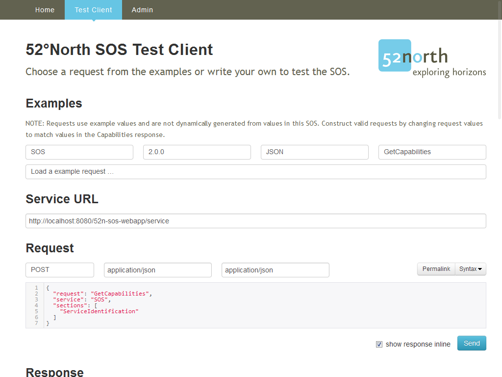


:Author: Eike Hinderk Jürrens (e.h.juerrens@52north.org), Daniel Nüst (d.nuest@52north.org), Simon Jirka (s.jirka@52north.org)
:Reviewer: Cameron Shorter, LISAsoft
:Reviewer: Frank Gasdorf
:Version: osgeo-live8.0
:License: Creative Commons Attribution 3.0 Unported (CC BY 3.0)

.. image:: ../../images/project_logos/logo_52North_160.png
  :alt: project logo
  :align: right
  :target: http://52north.org/sos

52°North SOS
===============================================================================

Web Service
~~~~~~~~~~~~~~~~~~~~~~~~~~~~~~~~~~~~~~~~~~~~~~~~~~~~~~~~~~~~~~~~~~~~~~~~~~~~~~~

The 52°North :doc:`Sensor Observation Service (SOS) <../standards/sos_overview>` 
supports the interoperable provision of live and archived sensor observation 
data. A sensor could be a water level meter in a stream, a weather station, or 
an air quality monitoring station.
 

Features
-------------------------------------------------------------------------------

* Implements the SOS 1.0.0 and 2.0.0 standards.

* A browser based client provides means for administration and provides test
  queries for all supported operations.

SOS Operations
^^^^^^^^^^^^^^^^^^^^^^^^^^^^^^^^^^^^^^^^^^^^^^^^^^^^^^^^^^^^^^^^^^^^^^^^^^^^^^^^

**Queries**:

* GetCapabilities: for requesting a self-description of the service.
* DescribeSensor: for requesting information about the sensor.
* GetFeatureOfInterest / GetFeatureOfInterestTime (1.0): for requesting features (e.g. sensor/measurement locations).
* GetObservationById / GetObservation (1.0): for requesting observations.
* GetResult: for requesting sensor data.
* GetResultTemplate (from 2.0): for requesting a template of the result structure that 
  will be returned by a GetResult request.
* GetDataAvailability (from 2.0): for requesting the data availability for certain 
  configurations.

**Transactions**:

* InsertSensor (from 2.0) / RegisterSensor (1.0): for inserting metadata of new sensors.
* InsertObservation, for inserting new observations.
* UpdateSensorDescription (from 2.0): for updating the description of a sensor.
* DeleteSensor (from 2.0): for deleting a sensor/procedure and all related offerings 
  and observations.
* DeleteObservation (from 2.0): for deleting an observation.
* InsertResultTemplate (from 2.0): for inserting a result template.
* InsertResult (from 2.0): for inserting results.

Within these operations the following filter operators are possible where 
applicable:

* Spatial filter: BBOX, using a bounding box.
* Temporal filter: During, with time period.
* Temporal filter: TEquals, with time instant.

Details
--------------------------------------------------------------------------------

**Website:** http://52north.org/sos

**Licence:** GNU General Public License (GPL) version 2

**Software Version:** SOS |version-52nSOS|

**Supported Platforms:** Windows, Linux, Mac

**API Interfaces:** Java

**Commercial Support:** http://52north.org/

**Community Support:** http://sensorweb.forum.52north.org/

**Community Website:** http://52north.org/communities/sensorweb/

**Other 52°North projects:** :doc:`WPS <./52nWPS_overview>`

Quickstart
--------------------------------------------------------------------------------

* :doc:`Quickstart documentation <../quickstart/52nSOS_quickstart>`

