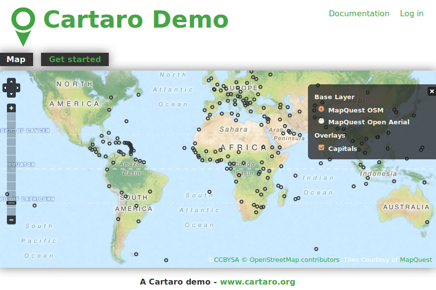

:Author: Friedjoff Trautwein (http://www.geops.de)
:Author: Patric Hafner (http://www.geops.de))
:Reviewer: no one yet
:Version: osgeo-live6.5draft
:License: Creative Commons Attribution 3.0 Unported (CC BY 3.0)

.. image:: ../../images/project_logos/logo-cartaro.png
  :scale: 100%
  :alt: project logo
  :align: right
  :target: http://cartaro.org

Cartaro
================================================================================

Geospatial CMS
~~~~~~~~~~~~~~~~~~~~~~~~~~~~~~~~~~~~~~~~~~~~~~~~~~~~~~~~~~~~~~~~~~~~~~~~~~~~~~~~
Cartaro is the web mapping platform that brings the power of the best open source geospatial components into a content management system. With Cartaro you are able to set-up and run your own geo-enabled and OGC standards-compliant website with not more than a few clicks. The geospatial components used in Cartaro are :doc:`PostGIS <../overview/postgis_overview>`, :doc:`GeoServer <../overview/geoserver_overview>`, GeoWebCache and :doc:`OpenLayers <../overview/openlayers_overview>`. All those are managed from within the powerful CMS `Drupal <http://drupal.org>`_.

Cartaro is for organisations and individuals that need to run a light-weight spatial data infrastructure (SDI) without the need for extensive configurations and much individual programming.

Cartaro is also for all websites that focus on CMS features while also having to handle geospatial data.

Core Features
--------------------------------------------------------------------------------

Most functions needed for a SDI come right out of the box through the close integration of Drupal with PostGIS and GeoServer. The main features of Cartaro are:

* Spatial data storage with true geometry data types
* Creation of data types from within the Drupal GUI
* Integrated online editing of geospatial data
* Data publishing with integrated maps
* Configuration of map layouts and behaviors
* Symbol styling
* Data publishing through OGC standards-compliant web services (OWS) like WMS and WFS
* High performance map output through GeoWebCache
* Transparent privilege handling and security for all spatial data
* Content publication workflow and revision moderation
* Basic metadata collection through access to GeoServer-GUI
* Full extensibility through thousands of Drupal modules or individual programming

Implemented Standards
--------------------------------------------------------------------------------

Support of numerous Open Geospatial Consortium  (OGC) standards:

  * :doc:`../standards/wms_overview`
  * :doc:`../standards/wfs_overview`
  * :doc:`../standards/wcs_overview`
  * :doc:`../standards/fe_overview`
  * :doc:`../standards/sld_overview` 
  * :doc:`../standards/gml_overview`

Details
--------------------------------------------------------------------------------

**Website:** http://cartaro.org/

**Licence:** GNU General Public License (GPL) version 2

**Software Version:** 1.0-beta4

**Supported Platforms:** Windows, Linux, Mac

**API Interfaces:** JavaScript, PHP

**Support:** http://www.geops.de

Quickstart
--------------------------------------------------------------------------------
    
* :doc:`Quickstart documentation <../quickstart/cartaro_quickstart>`
