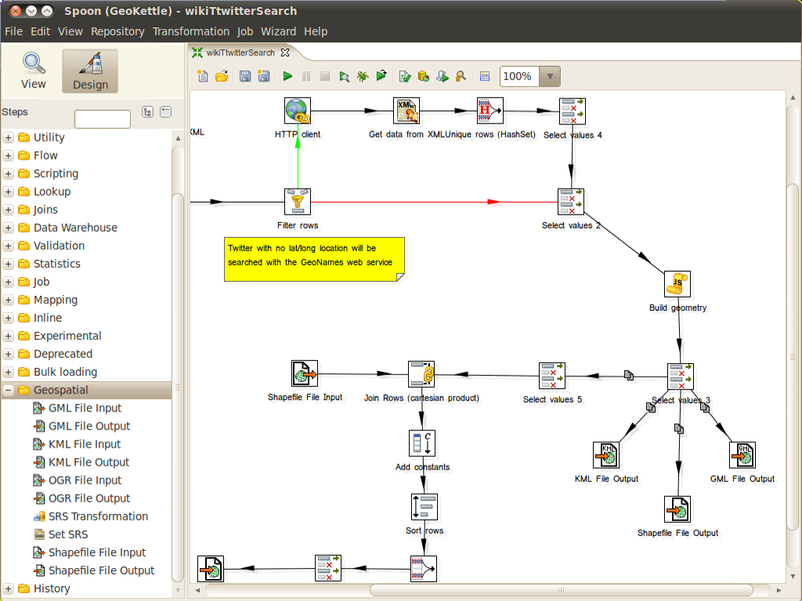

:Author: Thierry Badard 
:Reviewer: Cameron Shorter, LISAsoft
:Version: osgeo-live5.5draft
:License: Creative Commons Attribution 3.0 Unported (CC BY 3.0)

GeoKettle
================================================================================

Extract Transform Load (ETL)
~~~~~~~~~~~~~~~~~~~~~~~~~~~~~~~~~~~~~~~~~~~~~~~~~~~~~~~~~~~~~~~~~~~~~~~~~~~~~~~~

GeoKettle is a "spatially-enabled" version of `Pentaho Data Integration <http://kettle.pentaho.com>`_ (also known as Kettle). It is a powerful, metadata-driven spatial ETL (Extract, Transform and Load) tool dedicated to the integration of different data sources for building and updating geospatial databases, data warehouses and web services.

GeoKettle enables the Extraction of data from data sources, the Transformation of data in order to correct errors, clean data, change data structure, make data compliant with standards, and Loading of transformed data into a target DataBase Management System (DBMS), GIS file, or geospatial web service. GeoKettle is particularly useful for automating complex and repetitive data processing without producing specific code, converting between data formats, migrating data between databases, feeding data into databases, etc.

In the geospatial domain, Geokettle compares to FME, a proprietary spatial ETL tool. GeoKettle is stable, fast, standards compliant, with hundreds of functions and read/write support for many file formats, services and DBMS. GeoKettle is used by diverse organisations from around the world, including governmental agencies, banks, insurance and geospatial system integrators.

Core Features
--------------------------------------------------------------------------------

* Extract data from: 

  * 35+ database types: MySQL, PostgreSQL/PostGIS, Oracle, ...
  * XML files
  * XLS files
  * Xbase files (dBase, Foxpro, etc)
  * File systems information
  * Generated data
  * MS Access files
  * LDAP
  * SOLAP (Spatial OLAP) system: GeoMondrian
  * Geospatial data formats: Shapefile, GML 3.1.1, KML 2.2, all OGR supported formats
  * OGC Web services: Web Feature Service (WFS), Sensor Observation Service (SOS), Catalogue Web Service (CSW)

* Transformation of data:

  * Engine based data transfer (no code generator) 
  * Looking up data in databases, files or memory
  * Calculating
  * Scripting: Javascript, SQL, RegExp
  * Splitting
  * Mapping
  * Selecting
  * Partitioning
  * Filtering
  * Merging
  * Joining
  * Duplicating
  * Clustering (MPP)
  * Pivotting
  * Geospatial data analysis: buffer, centroid, distance, intersection, union, ...
  * Advanced geoprocessing: clipping, delaunay, simplify/smooth geometry, split features, ...
  * Spatial aggregation
  * Cartographic preview

* Load data into a target format:

  * Database loads: MySQL, PostgreSQL/PostGIS, Oracle, ...
  * Data warehouse population
  * Geospatial data formats: Shapefile, GML 3.1.1, KML 2.2, all OGR supported formats
  * OGC Web services: Catalogue Web Service (CSW), ...
  * Partitioned loading
  * Bulk loading
  * Parallel loading
  * Clustering

* Environment:
  
  * Full GUI named "Spoon" to edit every transformation options
  * Command line tools: execute jobs and transformations
  * Web server: remote execution and clustering perfect in cloud
    computing environment for very large datasets processing
  * Programming API for Java
  * Plugin eco-system

Implemented Standards
--------------------------------------------------------------------------------

* OGC standards compliant (SFS, CSW, SOS)

Details
--------------------------------------------------------------------------------

**Website:** http://www.geokettle.org/

**Licence:** GNU Lesser General Public License (LGPL) version 2.1

**Software Version:** 2.0

**Supported Platforms:** Windows, Linux, Mac, Solaris

**API Interfaces:** Java, Javascript

**Support:** http://www.spatialytics.org & http://www.spatialytics.com

Quickstart
--------------------------------------------------------------------------------
    
* :doc:`Quickstart documentation <../quickstart/geokettle_quickstart>`
