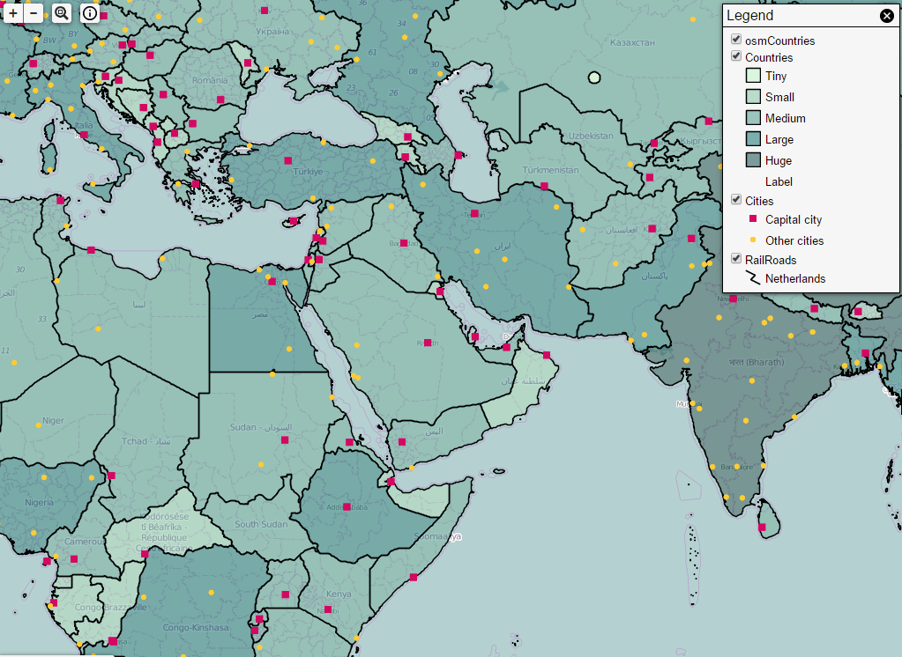

:Author: Pieter De Graef
:Version: osgeo-live4.0
:License: Creative Commons

.. _geomajas-overview:

.. image:: ../../images/project_logos/logo-geomajas.png
  :width: 100px
  :height: 100px
  :alt: project logo
  :align: right
  :target: http://www.geomajas.org

.. image:: ../../images/logos/OSGeo_incubation.png
  :scale: 100
  :alt: OSGeo Incubation Project
  :align: right
  :target: http://www.osgeo.org

Geomajas
========

Browser GIS Client
~~~~~~~~~~~~~~~~~~

Geomajas is an extensible web mapping framework which seamlessly integrates powerful server side algorithms into the web browser.

The focus of Geomajas is to provide a platform for **server-side integration** of geospatial data (be it through GeoTools or Hibernate), allowing multiple users to control and manage the data from within their own browsers. In essence, Geomajas provides a set of powerful building blocks, from which the most advanced GIS application can easily be built.

What makes Geomajas unique is its strong server side focus. The processing, styling, filtering, caching, etc. of geospatial data always happens within a secured context. All this makes Geomajas applications incredibly scalable and performing, keeping the client a **real thin client**.

Core Features
-------------

* Integrated client-server architecture
* Geometry and attribute editing
* Custom attribute definitions
* Advanced querying capabilities (CQL)
* Out-of-the-box security
* Extensible plug-in mechanism
* Multiple front-end technologies
* Cross browser support, without the need for browser plug-ins

Implemented Standards
---------------------

* OGC Web Map Service (WMS) 1.1.0, 1.1.1
* OGC Web Feature Service (WFS) 1.0.0, 1.1.0

Details
-------

**Website:** http://www.geomajas.org/

**Licence:** AGPL

**Software Version:** 1.6

**Supported Platforms:** Windows, Linux, Mac

**API Interfaces:** Java

**Support:** http://www.osgeo.org/node/725?SET=1&MUL_TECH[]=00089

Quickstart
----------

* `Quickstart documentation <../quickstart/geomajas_quickstart.html>`_

