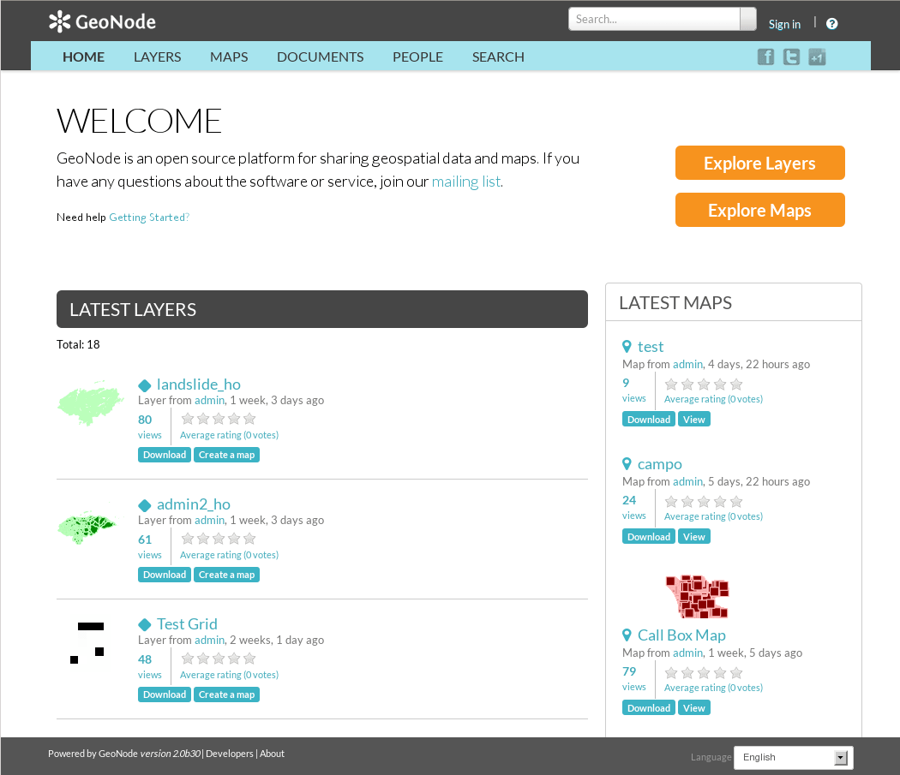

:Author: Barbara Angerer, Angelos Tzotsos
:Reviewer: Cameron Shorter, LISAsoft
:Version: osgeo-live9.5
:License: Creative Commons Attribution 3.0 Unported (CC BY 3.0)

.. image:: ../../images/project_logos/logo-geonode.png
  :alt: project logo
  :align: right
  :target: http://geonode.org

GeoNode
================================================================================

Geospatial Content Management System
~~~~~~~~~~~~~~~~~~~~~~~~~~~~~~~~~~~~~~~~~~~~~~~~~~~~~~~~~~~~~~~~~~~~~~~~~~~~~~~~

`GeoNode <http://geonode.org>`_ is a Content Management System for geospatial data which provides creation, sharing, and collaborative use of geospatial data. Datasets can be uploaded in various formats, maps can be edited, styled and aggregated through browser based tools, maps and metadata can be published and searched, and reviews, ratings and comments can be captured from users.

GeoNode is built upon: GeoServer, GeoExplorer, pycsw, Django, and GeoExt.

Core Features
--------------------------------------------------------------------------------

* Spatial Data Discovery

  * Powerful spatial search engine
  * Federated OGC services
  * Metadata catalogue

* Import and Manage Geospatial Data

  * Publish raster, vector, and tabular data
  * Manage metadata and associated documents
  * Securely or publicly share data
  * Versioned geospatial data editor

* Interactive Mapping

  * GeoExplorer GIS client
  * Graphical style editor
  * Create multi-layer interactive maps
  * Share and embed maps in web pages
  * Print maps as PDF

* Collaboration

  * Review, rate, and comment on data
  * Groups of users
  * Activity streams
  * Announcements and notifications

* ... and more!

Implemented Standards
--------------------------------------------------------------------------------

  * :doc:`../standards/wms_overview`
  * :doc:`../standards/csw_overview`
  * :doc:`../standards/wfs_overview`
  * :doc:`../standards/wcs_overview`
  * :doc:`../standards/fe_overview`
  * :doc:`../standards/sld_overview` 
  * :doc:`../standards/gml_overview`

Details
--------------------------------------------------------------------------------

**Website:** http://geonode.org/

**Licence:** GNU General Public License (GPL) version 2.0

**Software Version:** |version-geonode|

**Supported Platforms:** Windows, Linux, Mac

**API Interfaces:** Python (Django)

**Support:** http://opengeo.org/technology/geonode/

Quickstart
--------------------------------------------------------------------------------

* :doc:`Quickstart documentation <../quickstart/geonode_quickstart>`
