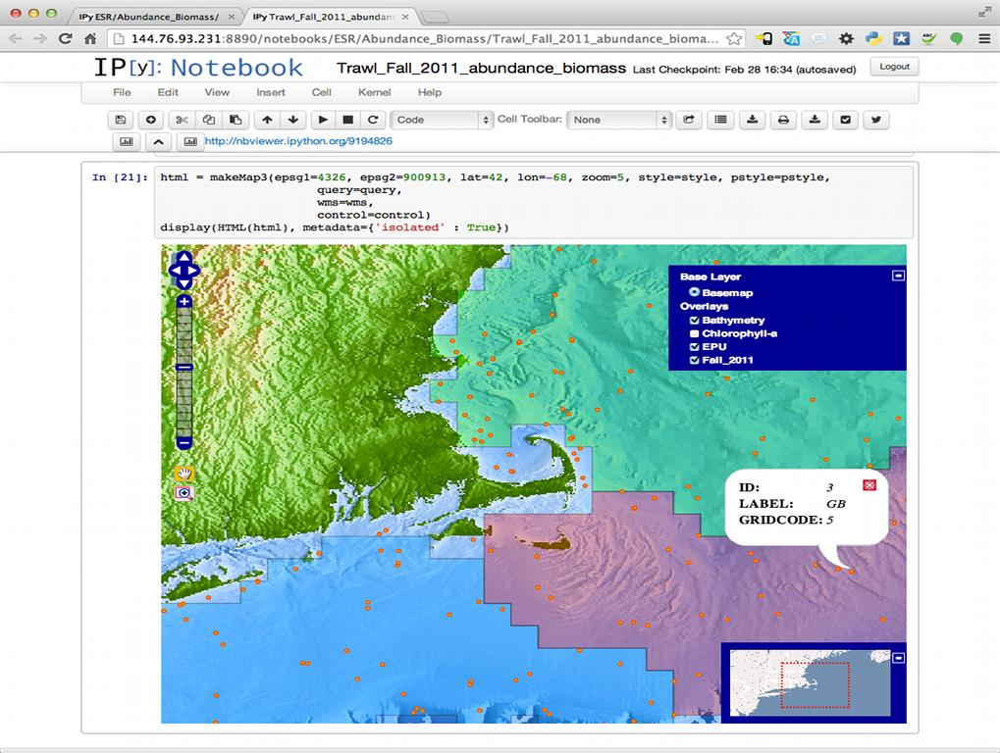

:Author: OSGeo-Live
:Reviewer: Massimo Di Stefano, Center for Coastal and Ocean Mapping - UNH
:Version: osgeo-live7.9
:License: Creative Commons Attribution 3.0 Unported (CC BY 3.0)

.. image:: ../../images/project_logos/logo-ipython.png
  :scale: 100 %
  :alt: project logo
  :align: right
  :target: http://ipython.org/

IPython
================================================================================

IPython provides a rich architecture for interactive computing with:

* Powerful interactive shells (terminal and Qt-based).
* A browser-based notebook with support for code, text, mathematical expressions, inline plots and other rich media.
* Support for interactive data visualization and use of GUI toolkits.
* Flexible, embeddable interpreters to load into your own projects.
* Easy to use, high performance tools for parallel computing.

.. image:: ../../images/screenshots/800x600/ipython-notebook1.png
  :scale: 100 %
  :alt: IPython Notebook screenshot
  :align: right
  :target: http://ipython.org/
  
While the focus of the project is Python, the IPython architecture is designed in a language-agnostic way to facilitate interactive computing in any language. An interactive kernel speaks to clients such as the terminal or web notebook via a well-specified protocol, and all features of a kernel are available to all clients. We ship the official IPython kernel, but kernels for other languages are being currently developed, with prototypes in Ruby and JavaScript already existing. Additionally, the IPython kernel supports multi-language integration, letting you for example mix Python code with Cython, R, Octave, and scripting in Bash, Perl or Ruby.

To get started with the IPython Notebook, see our official example collection. Our notebook gallery is an excellent way to see the many things you can do with IPython while learning about a variety of topics, from basic programming to advanced statistics or quantum mechanics.

To learn more about IPython, you can watch our videos and screencasts, download our talks and presentations, or read our extensive documentation. IPython is open source (BSD license), and is used by a range of other projects; add your project to that list if it uses IPython as a library, and please don’t forget to cite the project.

IPython supports Python 2.6 to 2.7 and 3.2 or newer. Our older 0.10 series supports Python 2.5, and can be used with Python 2.4.

Core Features
--------------------------------------------------------------------------------

The IPython Notebook is a web-based interactive computational environment where you can combine code execution, text, mathematics, plots and rich media into a single document:

These notebooks are normal files that can be shared with colleagues, converted to other formats such as HTML or PDF, etc. You can share any publicly available notebook by using the IPython Notebook Viewer service which will render it as a static web page. This makes it easy to give your colleagues a document they can read immediately without having to install anything.

To learn more about using the IPython Notebook, you can visit our example collection, and you can read the documentation for all the details on how to use and configure the system. The Notebook Gallery showcases many interesting notebooks covering a variety of topics, from basic programming to advanced scientific computing.

Details
--------------------------------------------------------------------------------

**Website_:** 

.. _Website: http://ipython.org/

**Licence:** BSD license

**Software Version:** 1.2.1

**Supported Platforms:** Linux, Mac, Windows

**API Interfaces:** Python

COMMUNITY
--------------------------------------------------------------------------------
**Help-Chat-Room_** 
.. _Help-Chat-Room: http://www.hipchat.com/ghSp7E1uY

**Stack-Overflow_** 
.. _Stack-Overflow: http://stackoverflow.com/questions/tagged/ipython

**Mailing-list_** 
.. _Mailing-list: http://projects.scipy.org/mailman/listinfo/ipython-dev

**Wiki_** 
.. _Wiki: https://github.com/ipython/ipython/wiki

**Reddit_**
.. _Reddit: http://www.reddit.com/r/IPython

**File_a_bug_** 
.. _File_a_bug: https://github.com/ipython/ipython/issues

Quickstart
--------------------------------------------------------------------------------

* :doc:`Quickstart documentation <../quickstart/ipython_quickstart>`
