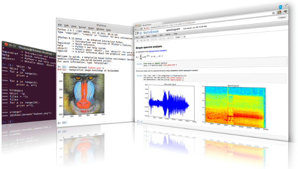

:Author: OSGeo-Live
:Reviewer: Massimo Di Stefano, Brian M Hamlin
:Version: osgeo-live8.5
:License: Creative Commons Attribution 3.0 Unported (CC BY 3.0)

.. image:: ../../images/project_logos/logo-ipython.png
  :alt: project logo
  :align: center
  :target: http://ipython.org/

IPython
================================================================================

IPython provides a rich architecture for interactive computing in the python language:

* Powerful interactive shells (terminal and Qt-based).
* A browser-based notebook with support for code, text, mathematical expressions, inline plots and rich media.
* Support for interactive data visualization and use of GUI toolkits.
* Flexible, embeddable interpreters to load into your own projects.
* Straightforward tools for parallel computing.

  

IPython Notebook
--------------------------------------------------------------------------------

The IPython Notebook is a web-based interactive computational environment combining code execution, text, mathematics, plots, maps and rich media into a single document. The python environment supplied on the OSGeo Live
includes: SciPy Matplotlib plus IRIS Cartopy, and others, for mapping; mapnik, gdal2tiles for map tile generaton;
data tools gdal, Geopandas, pyshp, Fiona, netCDF4, PostgreSQL psycopg2, R rpy2; the complete standard Python libraries,
and more.

On disk, Notebooks are normal files that can be shared with colleagues, and converted to other formats such as HTML or PDF. You can share any publicly available notebook by using the IPython Notebook Viewer service to render a read-only 
web page which retains inline diagrams, maps and other output. This service makes it easy to give colleagues a document they can read immediately without having to install anything.

To learn more about using the IPython Notebook, visit the example collection, and you can read the documentation for all the details on how to use and configure the system. The Notebook Gallery showcases many interesting notebooks covering a variety of topics, from basic programming to advanced scientific computing.

Geospatial Data Analysis and IPython
--------------------------------------------------------------------------------
.. _Data_and_Visualization_Integration_Via_Web-based_Resources: http://tw.rpi.edu/media/2013/09/25/a48/The_Perfect_Storm_1991.html

.. _slideshow: http://orion.tw.rpi.edu/~epifanio/AGU-2013/AGU-2013-H52E02-MDS.slides.html

.. _geo-notebook: https://github.com/OSGeo/IPython_notebooks

Details
--------------------------------------------------------------------------------

IPython Website_ 

.. _Website: http://ipython.org/

**Licence:** BSD license

**Software Version:** 2.3

**Supported Platforms:** Linux, Mac, Windows

**API Interfaces:** Python

COMMUNITY
--------------------------------------------------------------------------------

.. _Stack-Overflow: http://stackoverflow.com/questions/tagged/ipython

Stack-Overflow_ 

.. _Mailing-list: http://projects.scipy.org/mailman/listinfo/ipython-user

Mailing-list_

.. _Wiki: https://github.com/ipython/ipython/wiki

Wiki_

.. _Reddit: http://www.reddit.com/r/IPython

Reddit_

.. _File_a_bug: https://github.com/ipython/ipython/issues

File_a_bug_

Online Resources Include:
--------------------------------------------------------------------------------

* `notebook gallery <https://github.com/ipython/ipython/wiki/A-gallery-of-interesting-IPython-Notebooks>`

* `videos and screencasts <http://ipython.org/videos.html#videos>`

* `talks and presentations <http://ipython.org/presentation.html>`

* `extensive documentation <http://ipython.org/documentation.html>`

* `machine protocol <http://ipython.org/ipython-doc/stable/development/messaging.html>`

* `projects using IPython <https://github.com/ipython/ipython/wiki/Projects-using-IPython>`

Quickstart
--------------------------------------------------------------------------------

* :doc:`Quickstart documentation <../quickstart/ipython_quickstart>`
