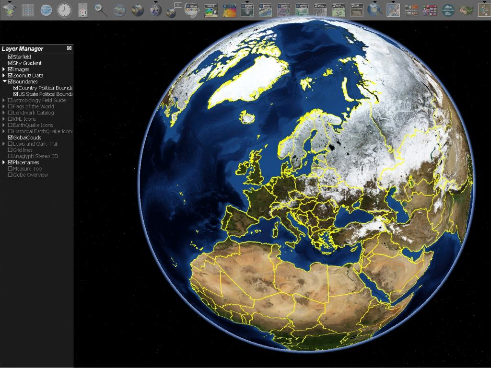

:Author: Gabriele Prestifilippo
:Reviewer: Cameron Shorter, LISAsoft
:Version: osgeo-live9.5
:License: Creative Commons Attribution 3.0 Unported (CC BY 3.0)

Java World Wind
================================================================================
Desktop Virtual Globe
~~~~~~~~~~~~~~~~~~~~~~~~~~~~~~~~~~~~~~~~~~~~~~~~~~~~~~~~~~~~~~~~~~~~~~~~~~~~~~~~

Java World Wind is a virtual globe containing a rich set of features for displaying and interacting with geographic data and representing a wide range of geometric objects thanks to  an Application Programming Interface (API).

Thanks to the usage of elevation model (DEM) is possible to see topographic features, for example, the Grand Canyon or Mount Everest in three dimensions.

Organizations across the world use World Wind to monitor weather patterns, visualize cities and terrain, track the movement of planes, vehicles and ships, analyze geospatial data, and educate people about the earth.

Core Features
--------------------------------------------------------------------------------

* High-performance 3 dimensional Virtual globe API and Software Development Kit (SDK)
* Adds 3 dimensional geographic visualization to any application
* Runs on Windows, Mac OS X, Linux, iOS and Android
* Runs in web pages in Java applets
* Accesses a huge collection of high-resolution imagery and terrain from NASA servers
* Displays high-resolution imagery, terrain and geographic information from any open-standard public or private source
* Large collection of geometric and geographic shapes
* Simple to extend and modify
* Uses Java and OpenGL

Graphics Capabilities:

* Point, Path, Polygon, Curtain
* Volumes: Extruded Polygon, Ellipsoid, Sphere, Cylinder, Cone, Pyramid, Box, Airspaces (see below)
* Terrain conforming shapes: Path, Polygons, Ellipse, Circle, Quadrilateral, Rectangle, Square, Text, Image, Icon
* Airspaces: Box, Cake, Capped Cylinder (full and partial), Curtain, Orbit, PolyArc, Polygon, Route, Sphere, Track
* Annotation: Text, Text Balloon, HTML5 web-browser Balloon, Image, Icons, all with geo-located and screen versions
* Placenames, Political boundaries
* 2.5D “Flat Globe” with terrain
* Transparency
* Picking, Selection
* Navigation and Viewing: Orbit View, First Person, Stereo, application-defined
* Multiple World Wind windows
* Interactive shape editors
* 2525C Tactical Symbols and Tactical Graphics

Data Formats:

* Imagery: JPG, PNG, GeoTIFF, JPEG2000 and many others
* Government formats: NITF, MrSID, RPF (CADRG, CIB, etc.), DTED and many others
* GIS formats: Shapefile, KML, VPF, GML, GeoJSON, GeoRSS, GPX, NMEA and many others
* Coordinate Systems: Lat/Lon, UTM, MGRS.
* Datums: WGS84, NAD27 and many others

Analysis Capabilities:

*  Measurement,  geometric and terrain following
* Line of site with high-resolution terrain and shapes
* Terrain intersection
* Shape interactions

Implemented Standards
--------------------------------------------------------------------------------

* GML 2.0, 1
* KML 2.3, 2.2
* WFS 2.0, 1.0
* WMS 1.1, 1.3
* WMTS 1.0
* OWS 1.0

Details
--------------------------------------------------------------------------------

**Website:** http://goworldwind.org/

**Licence:** NASA Open Source Agreement Version 1.3

**Software Version:** World Wind Java SDK 2.0

**Supported Platforms:** Windows, Linux, Mac, Android, iOS

**Forum:** http://forum.worldwindcentral.com/

Quickstart
--------------------------------------------------------------------------------
    
:doc: `Quickstart documentation <../quickstart/javaworldwind_quickstart>`_
